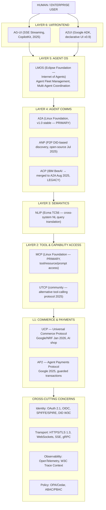
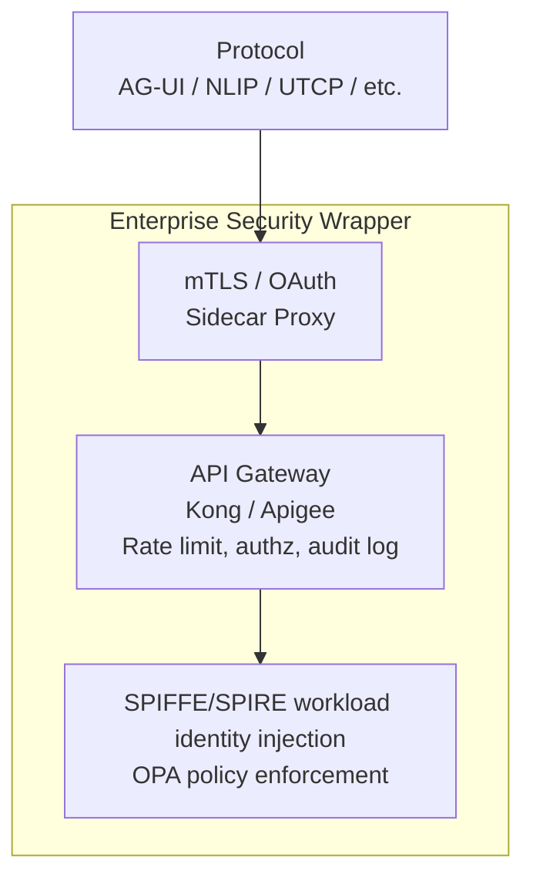
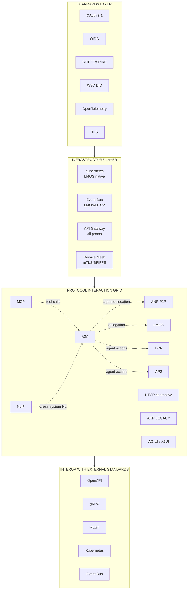
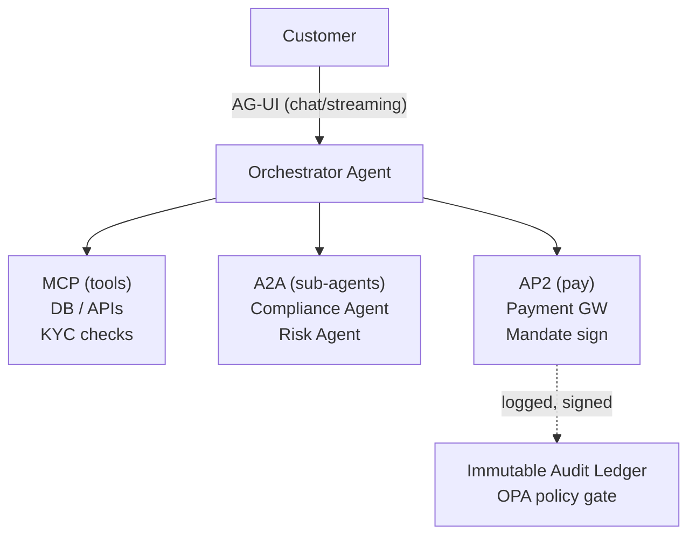
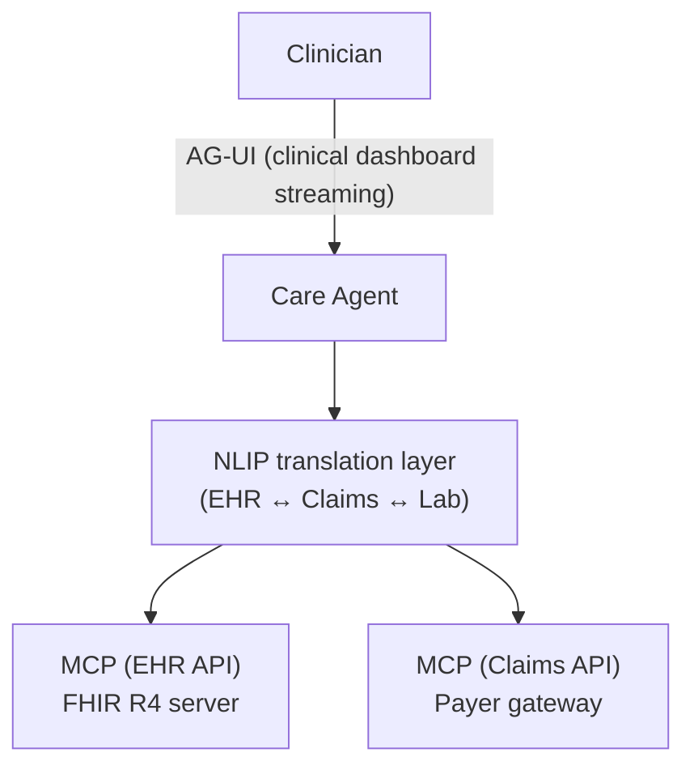
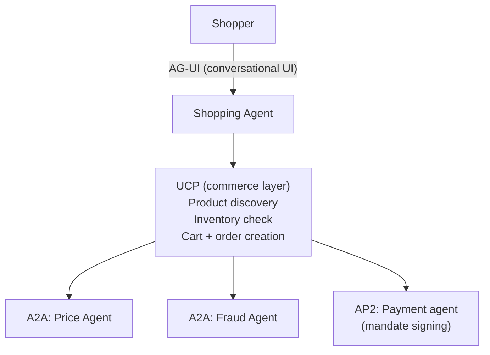
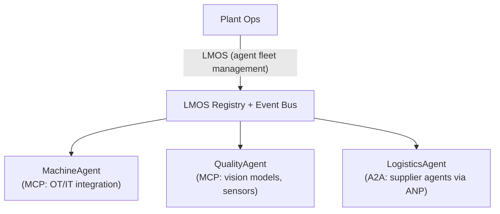
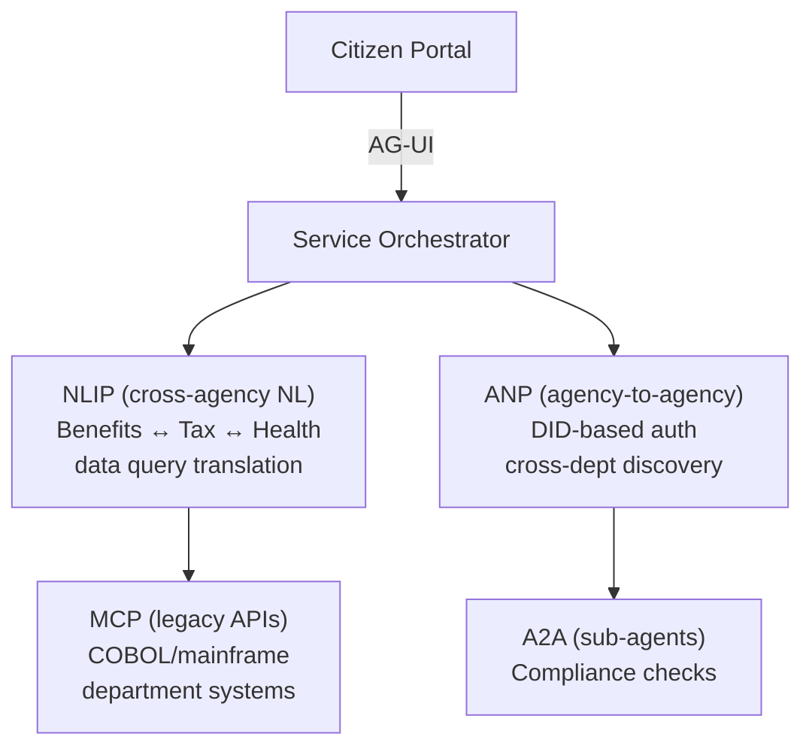
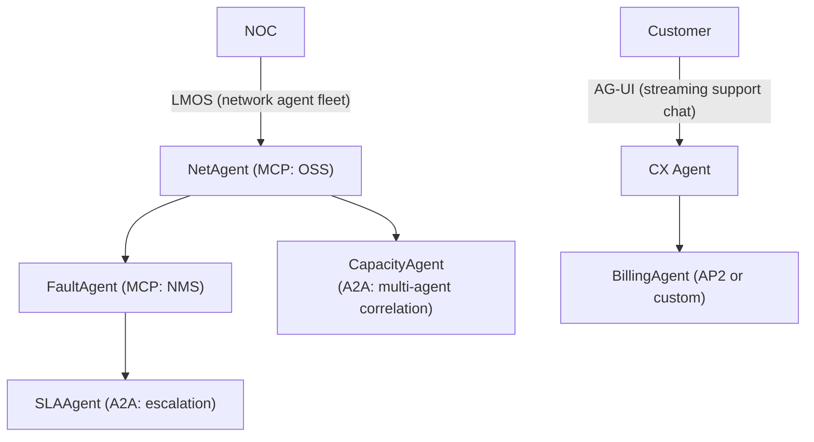

# Emerging AI Agent Protocols Beyond MCP &amp; A2A

## Enterprise Architecture, Standards, Security, and Adoption (2026)

**July 2026 Edition** | Enterprise Architecture Research Division

&gt; This report covers nine protocols that sit alongside—and interoperate with—the two foundational enterprise protocols (MCP and A2A). Read the [MCP Deep Research 2026](pathname:///archon/protocols/13-mcp-deep-research-2026) and the [A2A Enterprise Security &amp; Governance Guide](pathname:///archon/trust/02-a2a-security-governance) as companion documents.

---

## Section 1: Executive Summary &amp; Protocol Landscape

## 1.1 Executive Summary

The enterprise AI stack is no longer a two-protocol world. By mid-2026, the MCP + A2A pair that formed the initial "agentic web" baseline has been joined by at least nine additional protocols, each addressing a gap that MCP and A2A were never designed to fill: user-facing interaction streaming, agent-to-agent payments, decentralized peer-to-peer discovery, natural language interoperability at the enterprise boundary, and operating-system-level orchestration for fleets of agents.

**What is happening.** Between July 2024 and July 2026, the agent protocol space experienced a Cambrian explosion. Protocols emerged from three distinct sources: vendor consortia (Google leading UCP, AP2, A2UI, and A2A; IBM originating ACP before donating it to Linux Foundation), open-source communities (ANP, AG-UI, UTCP), and standards bodies (NLIP from Ecma International; LMOS from Eclipse Foundation). The result is a layered stack—tool access, agent communication, user interaction, payments, commerce, identity, and orchestration—with competing options at several layers.

&gt; **⚠️ Naming collision — two protocols are called "ACP".** Throughout this series, **ACP** means IBM BeeAI's **Agent Communication Protocol** (agent-to-agent messaging, merged into A2A in August 2025 and now retired). It is *not* the **Agentic Commerce Protocol** — the OpenAI + Stripe open standard (announced September 2025, beta) that powers ChatGPT Instant Checkout and connects buyers, AI agents, and merchants. The Agentic Commerce Protocol competes directly with Google's UCP at the commerce layer and is live with Etsy, Walmart, and over a million Shopify merchants; see the UCP deep dive (Section 2C) for the comparison. When you encounter "ACP" in vendor material from 2026 onward, it almost always means the commerce protocol.

**Why it matters.** Enterprise architects who lock in on a single protocol layer today without understanding the full landscape will face costly renegotiation within 18 months. Specifically:

1. **Protocol consolidation is still in progress.** ACP has already been merged into A2A (August 2025). UTCP may follow a similar absorption path. Choosing a protocol that will be deprecated is a three-to-five-year remediation burden.
2. **Security models are not uniform.** Five of the nine protocols have immature or absent enterprise authentication models as of Q2 2026. Treating them as equivalent to MCP's OAuth 2.1 hardened model is a Zero Trust failure.
3. **Governance structure predicts longevity.** Protocols under neutral foundations (Linux Foundation, Eclipse Foundation, Ecma) have demonstrably better longevity trajectories than single-vendor or community-only protocols.

**Three key decisions enterprise architects face now.**

| Decision | Stakes | Recommended Position |
|---|---|---|
| **1. Adopt AG-UI or A2UI for agent frontends?** | Frontend streaming architecture lock-in; AG-UI is CopilotKit-governed, A2UI is Google-led (Apache 2.0) | Pilot AG-UI for non-Google stacks now; evaluate A2UI convergence by Q4 2026 |
| **2. Use ANP for P2P agent discovery or wait for A2A to cover it?** | Decentralized agent mesh vs. centralized registry; ANP's DID model is not yet enterprise-hardened | Assess only; do not deploy in production until ANP 1.0 and DID W3C profile stabilize |
| **3. Standardize on AP2 for agent payments or build custom?** | Payment liability, audit, and compliance exposure | Adopt AP2 if already in Google's ecosystem; use x402 as the lighter alternative for non-Google stacks |

**How to read this guide.** This document covers Sections 1, 4, 5, and 6 of the full report. Section 1 (this section) provides the landscape view. Section 4 delivers comparative matrices across all dimensions. Section 5 projects forward to 2031. Section 6 provides actionable decision frameworks and checklists.

---

## 1.2 Protocol Evolution Timeline (2024–2026)

The enterprise AI protocol ecosystem has undergone rapid expansion and consolidation across 30 months. What began as a single point—MCP for tool access—has evolved into a multi-layered stack spanning identity, communication, orchestration, payments, and commerce. The evolution follows distinct phases, each marked by protocol emergenc, standardization efforts, or consolidation.

**Q4 2024 — Foundation Layer:** MCP v1.0 announced by Anthropic, establishing a standard interface for AI agents to access external tools, resources, and prompts. This represented the first widely-adopted protocol and formed the baseline for all subsequent developments.

**Q1-Q2 2025 — Explosion Phase:** A rapid proliferation of protocols occurred across multiple layers. Google released A2A v0.1 for agent-to-agent communication and A2UI v0.9 for declarative user interfaces. CopilotKit launched AG-UI v0.1 specifically for SSE-based streaming of agent outputs to frontend applications. The open-source community published ANP (Agent Network Protocol) with cryptographic DID-based peer-to-peer discovery. Ecma TC56 initiated formal standardization of NLIP for natural language queries across systems. Google and NRF began shaping UCP for AI commerce. Google announced AP2 for agent-initiated payments with cryptographic guardrails.

**Q3 2025 — Consolidation & Governance Phase:** IBM donated its Agent Communication Protocol (ACP) to the Linux Foundation AAIF, signaling a transition from proprietary to foundation-governed protocols. Eclipse Foundation launched LMOS (LM Operating System) as a multi-agent orchestration layer. The community proposed UTCP as a lighter alternative to MCP. Critically, ACP formally merged into A2A in August 2025, eliminating the first instance of protocol redundancy. ANP published its complete P2P discovery mechanism based on W3C Decentralized Identifiers.

**Q1-Q2 2026 — Maturity & Standardization Phase:** A2A v1.0 achieved stability in April 2026 with broad enterprise adoption (150+ organizations). MCP hardened its authentication model with OAuth 2.1 support. NLIP suite (ECMA-430–434 + TR/113) was published by Ecma TC56 in December 2025, becoming the first neutral-body-standardized protocol in the emerging layer.

**Q3 2026 — Production Readiness:** MCP Stateless Release Candidate published in July 2026, expected to reach general availability by end of month. Most protocols moved from experimental to production-ready status.

**Layer-by-layer milestones:**

- **Tool Access:** MCP (RC Jul 26)
- **Agent Comms:** A2A (v1.0 Apr 26), ACP (deprecated/merged Aug 25), ANP (GA Jul 25)
- **UI/Frontend:** AG-UI (v0.1 Q2 25), A2UI (v0.9 ADK Q2 25)
- **Commerce:** UCP (draft Q3 25, GA Jan 26)
- **Payments:** AP2 (GA Q2 25)
- **NL Interop:** NLIP (Ecma TC56 Q2 25, published Dec 25)
- **Orchestration:** LMOS (Eclipse Q3 25)
- **Tool Calling:** UTCP (community Q3 25)

**Key inflection points:**

- **August 2025** — ACP merges into A2A, reducing fragmentation at the agent-to-agent layer
- **January 2026** — UCP reaches GA with Google + NRF backing, legitimizing AI shopping as a protocol concern
- **April 2026** — A2A v1.0 stable; 150+ organizations adopt it, triggering broad platform GA
- **July 2026** — MCP stateless Release Candidate; final publication expected July 28, 2026

---

## 1.3 Full-Stack Protocol Architecture Diagram

The following diagram shows all 11 protocols (MCP + A2A + 9 emerging) and their positions in the enterprise agent stack.

---

## 1.4 How to Read This Guide

This guide is organized for progressive depth:

- **Section 1 (this section)** — Start here. Landscape view, timeline, full-stack diagram, and three key decisions.
- **Section 4** — Go here if you are comparing protocols for a specific requirement. All comparison matrices are here.
- **Section 5** — Go here for 3-5 year forward-looking analysis, vendor power dynamics, and Technology Radar placement.
- **Section 6** — Go here to make a decision today. Decision trees, checklists, and anti-pattern catalog.

**Companion documents:**

- [MCP Deep Research 2026](pathname:///archon/protocols/13-mcp-deep-research-2026) — detailed MCP implementation guide
- [A2A Enterprise Security &amp; Governance Guide](pathname:///archon/trust/02-a2a-security-governance)
- [Agent Communication, Identity &amp; Gateway](pathname:///archon/trust/03-agent-communication-identity-gateway)
- [Auth &amp; Identity Standards Reference](pathname:///archon/protocols/01-auth-standards-reference)

:::info Protocol Scope Boundary
MCP and A2A are excluded from the comparative matrices in this report — they have dedicated deep-dive documents. They appear in architecture diagrams and decision trees as reference anchors only.
:::

---

## Section 4: Comparative Analysis

## 4.1 Feature Comparison Matrix

The following matrix rates all nine protocols across 17 enterprise dimensions. Ratings: ✅ Strong / ⚠️ Partial / ❌ Absent / 🔄 Evolving.

| Dimension | ACP | ANP | AG-UI | A2UI | UCP | AP2 | NLIP | LMOS | UTCP |
|---|---|---|---|---|---|---|---|---|---|
| **Primary Purpose** | Agent–agent comms (legacy) | P2P agent discovery | UI streaming frontend | Declarative UI (ADK) | AI commerce | Agent payments | NL interop | Agent OS/fleet | Tool calling |
| **Scope** | Narrow: agent messaging | Network: discovery + routing | Narrow: UI event stream | Narrow: UI rendering | Vertical: retail/shopping | Vertical: payments | Cross-system: NL queries | Platform: orchestration | Narrow: tool calling |
| **Communication Model** | REST + event stream | P2P/DID push-pull | SSE push | Declarative JSON | REST + webhook | REST + signed envelope | NL query/response | Event bus + registry | JSON-RPC 2.0 |
| **Security** | ⚠️ Basic | ⚠️ DID-based, incomplete | ⚠️ Minimal | ⚠️ ADK-scoped | ⚠️ OAuth draft | ✅ Cryptographic mandate | ⚠️ Minimal | ⚠️ Partial | ❌ Absent |
| **Authentication** | OAuth 2.0 partial | DID challenge-response | None specified | ADK token passthrough | OAuth 2.0 draft | OAuth 2.1 + mandate signing | None specified | OIDC integration | None |
| **Authorization** | ❌ Not defined | ⚠️ DID claims | ❌ Not defined | ⚠️ ADK scopes | ⚠️ Merchant approval | ✅ Scoped payment mandates | ❌ Not defined | ⚠️ Role-based | ❌ Not defined |
| **Discovery** | ❌ None | ✅ DID-based P2P | ❌ Not applicable | ❌ ADK-internal | ⚠️ Merchant registry | ⚠️ Payment endpoint registry | ❌ Not applicable | ✅ Agent registry | ❌ Not applicable |
| **Streaming** | ⚠️ Event stream | ❌ No | ✅ Core capability (SSE) | ✅ Partial | ❌ No | ❌ No | ❌ No | ⚠️ Event bus | ❌ No |
| **Scalability** | ⚠️ Unknown | ⚠️ P2P limits | ✅ SSE scales well | ⚠️ ADK-bound | ✅ Stateless REST | ✅ Stateless REST | ⚠️ Query-bound | ✅ Designed for scale | ⚠️ Local process |
| **Governance** | Linux Foundation (pre-merge) | Open-source community | CopilotKit | Google (ADK) | Google + NRF | Google | Ecma TC56 | Eclipse Foundation | Community |
| **Enterprise Readiness** | ❌ Deprecated | ⚠️ Low | ⚠️ Low-medium | ⚠️ Low-medium | ⚠️ Medium | ✅ Medium-high | ⚠️ Low-medium | ⚠️ Medium | ❌ Very low |
| **Cloud Portability** | ✅ Yes (pre-merge) | ✅ Yes (P2P) | ✅ Yes | ⚠️ Client-neutral spec, ADK-first tooling | ⚠️ Partial | ⚠️ Google-centric | ✅ Yes | ✅ Eclipse/any | ✅ Yes |
| **Vendor Neutrality** | ✅ Linux Foundation | ✅ Community | ⚠️ CopilotKit-led | ⚠️ Google-led, open contrib | ⚠️ Google-led | ❌ Google-led | ✅ Ecma | ✅ Eclipse | ✅ Community |
| **Open-Source Maturity** | 🔄 Merged/archived | ⚠️ Early | ⚠️ Early | ⚠️ Early (Apache 2.0) | ⚠️ Early | ⚠️ Partial | ⚠️ Spec-only | ✅ Growing | ⚠️ Early |
| **Standards Maturity** | ❌ Retired | ❌ Draft | ❌ Community spec | ⚠️ Open spec (Google-led) | ⚠️ Google/NRF draft | ⚠️ Google draft | ✅ Published (ECMA-430–434) | ⚠️ Eclipse draft | ❌ Community spec |
| **Ecosystem Strength** | 🔄 Absorbed by A2A | ❌ Nascent | ⚠️ Growing | ⚠️ ADK users only | ⚠️ Retail focus | ⚠️ Google partners | ⚠️ Nascent | ⚠️ Growing | ❌ Minimal |
| **Adoption Trajectory** | ↘ Declining (deprecated) | → Stable/slow | ↗ Growing | → Flat (ADK-bound) | ↗ Growing (retail) | ↗ Growing (Google) | → Slow | ↗ Steady | → Stagnant |

---

## 4.2 Security Comparison Matrix

:::warning Zero Trust Alert
Only AP2 and MCP (not listed here) have security models that approach Zero Trust readiness. All other protocols in this matrix require enterprise-side security wrappers before production deployment.
:::

| Security Dimension | ACP | ANP | AG-UI | A2UI | UCP | AP2 | NLIP | LMOS | UTCP |
|---|---|---|---|---|---|---|---|---|---|
| **Auth Mechanism** | OAuth 2.0 (partial) | DID challenge-response | None | ADK token passthrough | OAuth 2.0 draft | OAuth 2.1 + mandate sig | None | OIDC (pluggable) | None |
| **Authorization Model** | Not defined | DID attribute claims | Not defined | ADK scope | Merchant approval flow | Scoped payment mandates | Not defined | RBAC (partial) | Not defined |
| **Identity Standard** | None | W3C DID v1.0 | None | Google Identity | None | OAuth 2.1 | None | OIDC | None |
| **Encryption** | TLS (assumed) | TLS + DID envelope | TLS (assumed) | TLS (ADK) | TLS | TLS + payload signing | TLS (assumed) | TLS | TLS (assumed) |
| **Message Signing** | ❌ No | ⚠️ DID signature | ❌ No | ❌ No | ❌ No | ✅ Mandate signing (required) | ❌ No | ❌ No | ❌ No |
| **Zero Trust Readiness** | ❌ Not ready | ⚠️ Partial (DID only) | ❌ Not ready | ❌ Not ready | ❌ Not ready | ✅ Partial (payment scope) | ❌ Not ready | ⚠️ Partial | ❌ Not ready |
| **Supply Chain Risk** | 🔴 High (deprecated, orphaned code) | 🟡 Medium (community) | 🟡 Medium (community) | 🟡 Medium (Google ADK) | 🟡 Medium | 🟢 Low-medium (Google) | 🟡 Medium (Ecma) | 🟢 Low (Eclipse) | 🔴 High (community, no governance) |
| **Compliance Readiness** | ❌ None | ❌ None | ❌ None | ❌ None | ⚠️ PCI-adjacent (shopping) | ⚠️ PCI-adjacent (payments) | ❌ None | ⚠️ GDPR considerations | ❌ None |

**Enterprise security posture summary:**

From least to most secure: UTCP (none) — AG-UI (none) — NLIP (none) — A2UI (ADK) — ACP (deprecated) — ANP (DID) — LMOS (OIDC) — UCP (draft) — AP2 (mandate)

**Recommended enterprise security wrapper pattern for all protocols without native auth:**

---

## 4.3 Governance Comparison Matrix

| Governance Dimension | ACP | ANP | AG-UI | A2UI | UCP | AP2 | NLIP | LMOS | UTCP |
|---|---|---|---|---|---|---|---|---|---|
| **Standards Body** | Linux Foundation (pre-merge) | None (community) | None (CopilotKit-led) | Google (ADK) | Google + NRF | Google | Ecma International (TC56) | Eclipse Foundation | None (community) |
| **Governance Model** | Open governance (archived) | Community PR | CopilotKit-maintained, community PR | Google product team | Google + NRF joint | Google product team | TC56 working group | Eclipse project governance | Community PR |
| **Open-Source License** | Apache 2.0 | Apache 2.0 | MIT | Apache 2.0 | Apache 2.0 (partial) | Apache 2.0 (partial) | Ecma RF (royalty-free) | Eclipse Public License 2.0 | MIT |
| **Registry** | None (archived) | DID-based (self-sovereign) | None | ADK registry | Google Merchant Center | Google Pay ecosystem | None | LMOS Agent Registry | None |
| **Version Cadence** | N/A (deprecated) | Irregular | Irregular | ADK release cycle | Quarterly (Google-driven) | Quarterly (Google-driven) | Ecma annual | Eclipse quarterly | Irregular |
| **Enterprise SLA** | None | None | None | Google ADK SLA | Google Cloud SLA (partial) | Google Cloud SLA | None | Eclipse SLA (partial) | None |
| **Long-Term Risk** | 🔴 Eliminated (merged) | 🟡 Fragmentation risk | 🟡 Community abandonment | 🟡 Google-lock risk | 🟡 Google-lock risk | 🟡 Google-lock risk | 🟢 Low (neutral body) | 🟢 Low (neutral body) | 🔴 Abandonment risk |

**Governance Strength Ranking:**

From strongest to weakest governance:
1. **Ecma (NLIP)** [neutral] - Standards-body with IP clarity
2. **Eclipse (LMOS)** [neutral] - Open governance with release rigor
3. **Linux Foundation** [ACP-legacy] - Archived governance
4. **Community-only** (ANP, AG-UI, UTCP) - No formal process, no IP protection

:::tip Governance Selection Rule
For any protocol intended to carry production traffic beyond a 12-month horizon, require at minimum: (a) a neutral foundation governing the spec, (b) an open-source reference implementation under Apache 2.0 or EPL 2.0, and (c) a published version cadence. Only NLIP and LMOS meet all three criteria among the nine protocols.
:::

---

## 4.4 Enterprise Maturity Model

Five-level maturity: **Experimental** → **Emerging** → **Growing** → **Established** → **Dominant**

| Protocol | Maturity Level | Rationale |
|---|---|---|
| **ACP** | ❌ Retired | Merged into A2A (Aug 2025). Spec archived. No new adoption justified. |
| **ANP** | 🟡 Experimental | DID-based P2P is architecturally sound but lacks enterprise auth hardening, stable registry, and real-world scale evidence. |
| **AG-UI** | 🟡 Experimental → Emerging | Active community uptake for SSE-based agent frontends. No formal spec body; security model is absent. Growing but fragile. |
| **A2UI** | 🟡 Experimental | Apache 2.0 open project (Google-led, with CopilotKit contributions); v0.9 is pre-stable. Spec is client-neutral by design, but tooling is ADK-first and portability outside Google's ecosystem is limited in practice as of mid-2026. |
| **UCP** | 🟠 Emerging | Google + NRF backing gives it legitimacy in retail. GA since January 2026. Limited to commerce vertical; not general-purpose. |
| **AP2** | 🟠 Emerging → Growing | Strongest security model of the nine (mandate signing). 60+ partners. Google-centric but with clear enterprise utility in agent payment workflows. |
| **NLIP** | 🟠 Emerging | Published by Ecma TC56 as the ECMA-430–434 standards suite (+ TR/113) in December 2025 — the strongest formal-standards signal of the nine. Platform adoption is still nascent; watch for major-platform implementations through 2026. |
| **LMOS** | 🟠 Emerging | Eclipse Foundation governance and the "Internet of Agents" vision are compelling. Growing contributor base. Still needs production case studies. |
| **UTCP** | 🔴 Experimental (stagnant) | Community spec without governance or security model. Outcompeted by MCP in tool calling. No adoption signal that justifies investment. |

**MATURITY RADAR — JULY 2026**

| Maturity Level | Protocols |
|---|---|
| DOMINANT | (none yet) |
| ESTABLISHED | (none yet) |
| GROWING | AP2 (trending toward established) |
| EMERGING | LMOS, UCP, AP2, NLIP |
| EXPERIMENTAL | ANP, AG-UI, A2UI, UTCP |
| RETIRED | ACP |

---

## 4.5 Interoperability Diagram

---

## 4.6 Industry-Specific Reference Architectures

### Financial Services (Banking, Insurance, Capital Markets)

**Relevant protocols:** AP2, UCP, ANP, A2A, MCP

**Why:** Financial services require cryptographic auditability for all agent-initiated transactions, strict separation of duty in payment authorization, and regulatory compliance (PCI DSS, SOX, DORA in EU). AP2's mandate-signing model is the closest fit for agent payment authorization. ANP's DID model may serve KYC-adjacent identity verification once hardened.

**Protocol decisions for Financial Services:**
- AP2 for any agent-initiated payment or fund movement — mandatory
- A2A for agent delegation (compliance, risk, fraud sub-agents)
- MCP for tool access (databases, APIs, regulatory data feeds)
- AG-UI for customer-facing chat with streaming output
- ANP: assess only; not ready for KYC/AML in production
- Recommended protocols: AP2 (payments), A2A (agents), MCP (tools)
- Avoid: ACP (deprecated), UTCP (no security), ANP (not hardened)

---

### Healthcare (Hospitals, Payers, Life Sciences)

**Relevant protocols:** NLIP, MCP, A2A, AG-UI

**Why:** HIPAA imposes strict data minimization requirements. Natural language queries crossing system boundaries (EHR to claims, or EHR to research databases) are the core use case for NLIP. No protocol in this stack is HIPAA-certified out of the box — BAAs must be established at the infrastructure layer regardless.

PHI containment: NLIP queries must be anonymized before crossing system boundaries. AG-UI connections require TLS + session auth.

- Recommended: NLIP (cross-system NL), MCP (clinical tool access)
- Avoid: AP2/UCP (no healthcare vertical support), UTCP (no security)

---

### Retail & E-Commerce

**Relevant protocols:** UCP, AG-UI, A2A, MCP

**Why:** UCP was designed specifically for AI-driven shopping. The GA release in January 2026 with Google + NRF backing makes it the only purpose-built protocol for AI commerce. AG-UI handles the conversational shopping frontend. A2A delegates to pricing, inventory, and fulfillment agents.

> **Competing stack:** the OpenAI + Stripe **Agentic Commerce Protocol** (not covered in the nine-protocol scope of this series) is the primary alternative to UCP + AP2 for this vertical — it is live in ChatGPT Instant Checkout with Etsy, Walmart, and Shopify merchants. Retailers should evaluate both stacks; the channel decision (ChatGPT traffic vs. Google/agent-mesh traffic) currently dictates the protocol decision.

Recommended: UCP (shopping), AG-UI (frontend), AP2 (checkout)

---

### Manufacturing & Supply Chain

**Relevant protocols:** LMOS, ANP, A2A, MCP

**Why:** Manufacturing requires orchestrating large fleets of heterogeneous agents (machine monitoring, quality, logistics, procurement) across organizational boundaries. LMOS's "Internet of Agents" orchestration model is the best fit for intra-plant agent fleets. ANP's P2P discovery serves cross-organizational agent discovery without a central registry.

Cross-org: Supplier agents discovered via ANP DID. Fleet management: LMOS registry + event bus. Tool integration: MCP (SCADA, MES, ERP APIs).

- Recommended: LMOS (fleet), ANP (cross-org discovery), MCP (tools)
- Avoid: AP2/UCP (wrong vertical), UTCP (no security)

---

### Government & Public Sector

**Relevant protocols:** ANP, NLIP, A2A, MCP

**Why:** Government requires vendor neutrality, decentralized control, and natural language interoperability across legacy system boundaries (mainframes, COBOL-backed databases, department-specific data models). ANP's DID model maps well to government identity requirements (citizen DIDs, agency DIDs). NLIP addresses the cross-agency data silo problem.

- Recommended: ANP (decentralized auth), NLIP (interop), MCP (tools)
- Note: All protocols require sovereign hosting; no SaaS for PHI/PII

---

### Telecommunications

**Relevant protocols:** LMOS, AG-UI, A2A, MCP

**Why:** Telecom operates massive, distributed, heterogeneous infrastructure. Agent fleets managing network elements (BSS/OSS), customer experience, and network optimization map well to LMOS. AG-UI serves the customer-facing conversational layer for support and self-service.

- Recommended: LMOS (fleet ops), AG-UI (customer), A2A (escalation)
- Note: Network element protocols (NETCONF/YANG) accessed via MCP

---

## Navigation

**Next part:** [Convergence & Merger Scenarios (Part 2) — 5-Year Outlook, Vendor Dynamics & Technology Radar](pathname:///archon/protocols/parts/21-emerging-protocols-overview-part2.md)
