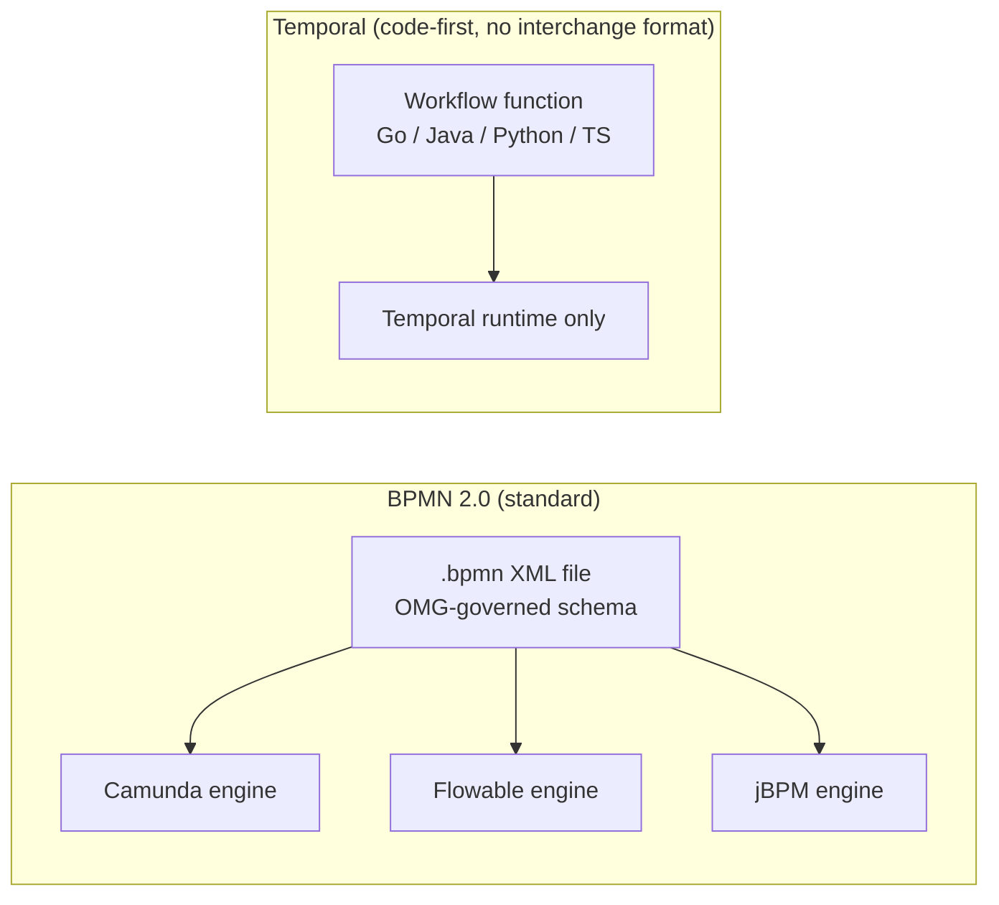

Most workflow-orchestration comparisons (including the deep dives elsewhere in this wiki) evaluate Temporal and Camunda as products — runtime behavior, SDKs, AI integration patterns. This page asks a narrower, protocol-level question instead: which of these approaches gives you a **portable, standardized workflow definition** you aren't locked into one vendor's runtime for, and when does that portability actually matter?

## The Two Approaches

**BPMN 2.0** (Business Process Model and Notation) is an OMG-governed XML interchange standard. A `.bpmn` file is a vendor-neutral graph of tasks, gateways, and events that any BPMN-conformant engine (Camunda, Flowable, jBPM, and others) can import and execute. The standardization is the point: the same process definition is portable across engines and reviewable by non-engineers via its visual notation.

**Temporal** (and code-first orchestration frameworks like it) has no equivalent interchange format. A workflow is a function written in a general-purpose language (Go, Java, Python, TypeScript) using the Temporal SDK. There is no standards body, no XML schema, and no cross-vendor portability — the workflow *is* code, and it runs on Temporal's execution model specifically.

## Comparison

| Dimension | BPMN 2.0 | Temporal (code-first) |
|---|---|---|
| Governance | OMG standard, versioned specification | Single-vendor SDK, no standards body |
| Portability | Cross-engine (any BPMN-conformant runtime) | Locked to the Temporal runtime |
| Definition format | Declarative XML + visual notation | Imperative code in a general-purpose language |
| Reviewable by non-engineers | Yes — the notation is the point | No — requires reading code |
| Expressiveness for complex logic | Constrained by the notation's vocabulary | Full power of the host language |
| Versioning a running instance | Engine-specific migration tooling | Explicit workflow-versioning APIs in-SDK |
| Typical fit | Regulated, auditable business processes; cross-org process exchange | Engineering-owned durable execution, including agentic orchestration |

## Where This Matters for Agentic Systems

Portability is a real requirement, not an academic one, in exactly one common enterprise scenario: a process definition that must be handed between organizations, audited by compliance teams who don't read code, or ported between engines during a vendor migration. If none of those apply — which is most agentic-orchestration use cases inside a single engineering org — the code-first approach's full language expressiveness usually wins, which is why Temporal and similar frameworks dominate the agentic-orchestration space covered elsewhere in this wiki.

The practical decision rule: reach for BPMN when the process definition itself is the deliverable (compliance sign-off, cross-vendor exchange); reach for a code-first orchestrator when the *execution* is the deliverable and the definition never needs to leave your engineering org.

## Related

- [Temporal Deep Dive](../agentic-systems/orchestration/04-temporal-deep-dive.md) — product-level architecture, patterns, and AI integration for Temporal specifically.
- [Camunda Deep Dive](../agentic-systems/orchestration/05-camunda-deep-dive.md) — product-level BPMN engine architecture and AI integration, including its own head-to-head comparison with Temporal at the runtime-behavior level.
- [Workflow vs Agent Architecture](../agentic-systems/orchestration/03-workflow-vs-agent-architecture.md) — the broader determinism/adaptivity question this protocol-level choice sits inside.
- [Protocols Hub](index.md) — the full protocol landscape this workflow-protocol treatment belongs to.
