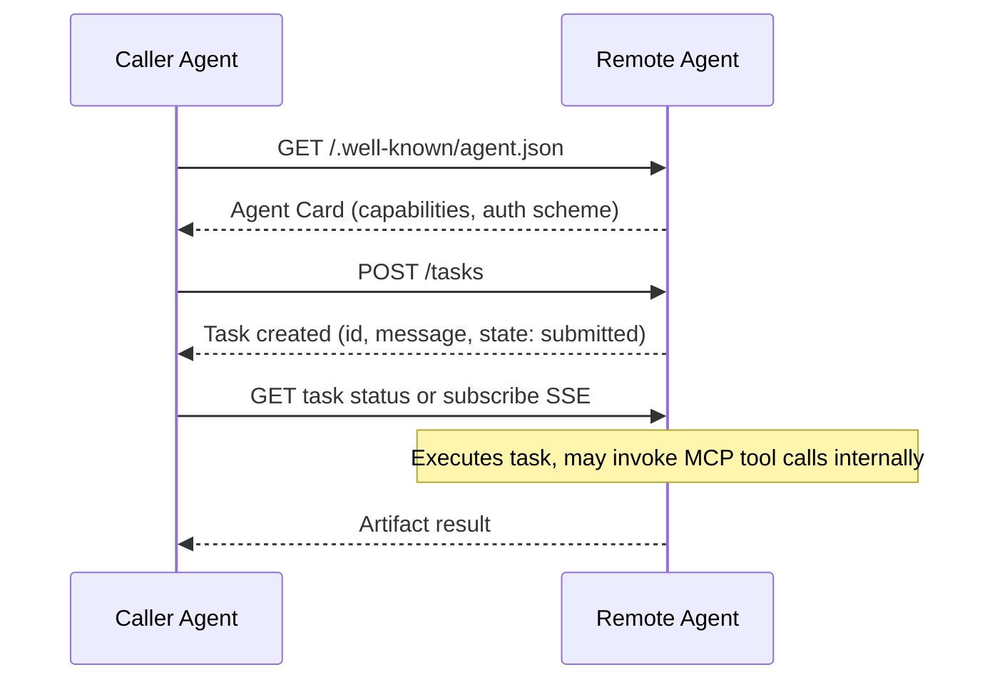
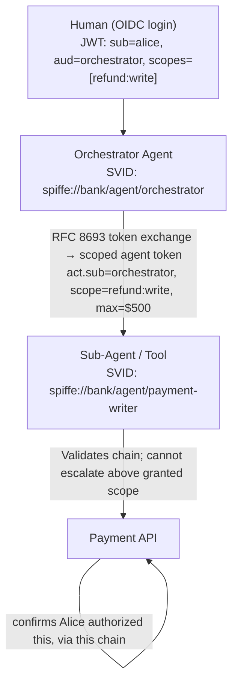

import SectionProgress from '@site/src/components/SectionProgress';

Agents that can't reach tools, data, or each other stay isolated pilots. This
hub covers the interoperability layer — MCP, A2A, and the identity/auth model
wrapped around them — that lets agentic systems compose instead of
re-integrating from scratch every time.

<SectionProgress domain="protocols" />

## Scope

- Model Context Protocol (MCP) hub and changelog
- Agent2Agent (A2A) protocol
- Emerging agent interoperability standards
- Agent identity and authentication
- Connectors

## Protocol Landscape (July 2026)

| Protocol | Layer | Status | Governance | Key Fact |
| --- | --- | --- | --- | --- |
| **MCP** | Agent ↔ Tool | Stateless RC (Jul 2026) | Linux Foundation AAIF | 10,000+ servers; 110M SDK downloads/mo |
| **A2A** | Agent ↔ Agent | v1.0 stable (Apr 2026) | Linux Foundation | 150+ orgs; GA in Copilot Studio, Bedrock, Foundry |
| **OAuth 2.1** | Identity layer | RFC stable | IETF | Foundation for all agent auth |
| **SPIFFE/SPIRE** | Workload identity | CNCF graduated | CNCF | Short-lived X.509 SVIDs; no static secrets |
| **AG-UI** | Agent ↔ UI | GA | CopilotKit / Linux Foundation | SSE-based real-time agent UI streaming |
| **ANP** | Agent ↔ Agent (P2P) | IETF draft | IETF / DIF | DID-based decentralized peer-to-peer agent mesh |
| **AP2** | Agent → Payment | GA | Google-led | Cryptographic payment mandates; 60+ partners |
| **ACP** | Agent ↔ Agent (legacy) | Merged into A2A (Aug 2025) | Linux Foundation | IBM BeeAI origin; REST-first; migration path documented |
| **NLIP** | Language interop | Ecma draft | Ecma TC56 | Natural language negotiation across AI vendors |
| **UCP** | B2A Commerce | Draft | Community | Agentic vendor discovery and commerce flows |

## Which Protocol Do I Need?

| I need to… | Protocol |
| --- | --- |
| Connect an agent to an API, database, or file system | [MCP](13-mcp-deep-research-2026.md) |
| Delegate a task to another agent (same or different vendor) | A2A |
| Authenticate an agent acting on behalf of a human | [OAuth 2.1 / 3LO](01-auth-standards-reference.md) |
| Authenticate service-to-service with no user present | SPIFFE/SPIRE |
| Pass authorization through a multi-agent delegation chain | [RFC 8693 Token Exchange (OBO)](05-identity-obo-sessions.md) |
| Stream real-time events from an agent to a UI | [AG-UI](19-emerging-protocols-agui-utcp.md) (SSE) |
| Enable an agent to submit a payment | [AP2](22-emerging-protocols-ucp-ap2-nlip-lmos.md) / x402 |
| Build a decentralized peer-to-peer agent mesh | [ANP](18-emerging-protocols-acp-anp.md) (DID-based) |

## A2A — Agent-to-Agent Protocol

The open standard for agent collaboration across vendor boundaries — enabling task delegation, capability discovery, and multi-agent orchestration.

> **Governance:** Linux Foundation (Agent2Agent Project, since June 2025) · **Status:** v1.0 stable (April 2026) · **Adoption:** 150+ organizations; GA in Microsoft Copilot Studio, Microsoft Foundry, Amazon Bedrock AgentCore

MCP connects agents to tools. A2A connects agents to other agents. When an agent needs to delegate work to a peer — possibly from a different vendor — A2A handles the full lifecycle: **Discovery** (caller fetches `/.well-known/agent.json`, the Agent Card, to learn the remote agent's capabilities, accepted task types, and auth requirements), **Task Submission** (caller creates a Task with a structured message; the remote agent executes asynchronously), **Status Tracking** (caller polls or subscribes via SSE to track lifecycle state: `submitted → working → completed | failed | cancelled`), **Result Delivery** (completed tasks return Artifacts — structured outputs with MIME types and metadata), and **Clarification** (remote agents can stream Messages back during execution to request input or provide interim updates without marking the task complete).

**Core primitives:**

| Primitive | Description |
| --- | --- |
| **Agent Card** | JSON document at `/.well-known/agent.json` — declares identity, capabilities, supported task schemas, and auth requirements |
| **Task** | Unit of work: contains the input message, a unique ID, and a lifecycle state machine |
| **Artifact** | Structured task output — file, JSON payload, or text — with MIME type and provenance metadata |
| **Message** | Streaming communication channel for clarifications, progress updates, and interim results |

A2A declares auth requirements in the Agent Card and uses OAuth 2.1 for token-based access: authentication via OAuth 2.1 (scheme and scopes declared in the Agent Card), authorization via per-task scoped delegation tokens (least-privilege per invocation), Agent Card integrity via cryptographic signature + revocation endpoint (v1.x Signed Agent Cards), bounded delegation depth (agents cannot silently re-delegate beyond authorized depth), internal workload identity via SPIFFE/SPIRE X.509 SVIDs + mTLS (no static secrets), and a centralized audit trail where every task carries `traceparent` for distributed tracing.

**A2A vs MCP:** use MCP when an agent calls an API, database, file system, or tool, or consumes a new data source (new Resource); use A2A when an agent delegates a task to another agent, discovers what a peer agent can do (via Agent Card), or exposes its own capabilities to other agents (implement an A2A server). A payment mandate submission uses AP2, an A2A extension.

IBM's ACP (Agent Communication Protocol) was merged into A2A in August 2025, consolidating the REST-first agentic communication track under the Linux Foundation — see [Protocol Evolution History](23-existing-protocol-evolution-agentic-ai.md) for the full consolidation timeline and ACP migration guidance.

## Auth & Identity Overview

A human logs in once and holds a session. An agent may spawn dozens of sub-agents, each making thousands of tool calls across multiple systems over hours. Authentication must answer three questions that static API keys cannot: **Who is this agent?** (not "which application's API key"), **Who authorized it?** (trace back to the human who initiated the task), and **What is it permitted to do in this specific call?** (least-privilege, not blanket access).

**Key patterns**, each with a dedicated deep-dive in this domain: **Three-Legged OAuth (3LO)** for agents acting on behalf of a human user (user authenticates and grants consent → auth server issues an authorization code to the agent → agent exchanges the code for access + refresh tokens; the refresh token must live in a secrets manager, never in the agent's context window); **On-Behalf-Of (OBO)** for service-to-service calls where the user isn't present (see [Identity, OBO & Sessions](05-identity-obo-sessions.md)); **SPIFFE/SPIRE workload identity** for service-to-service calls with no user involved (short-lived X.509 SVIDs, hourly rotation, mTLS everywhere, no static secrets); and **MCP OAuth 2.1** (2026 spec) — the 2026-07-28 stateless spec RC mandates OAuth 2.1 (not 2.0, implicit flow removed), PKCE for all authorization code flows, RFC 9207 issuer validation (prevents token-redirect attacks), and RFC 8707 resource indicators (tokens scoped to specific MCP server URIs).

**Entra Agent ID (Microsoft, 2026):** Microsoft Entra now supports Agent ID — agents as first-class identity objects in Azure AD, each with its own service principal and explicit permissions; administrators review, approve, and revoke agent identities in the same console as human identities; Copilot Studio and Microsoft Foundry agents are auto-registered; supports workload identity federation for non-Microsoft agents.

## Governance Bodies

| Body | Protocols Governed | Notes |
| --- | --- | --- |
| Linux Foundation AAIF | MCP, A2A, ACP (merged) | Primary governance for enterprise agent interoperability |
| IETF | OAuth 2.1, SPIFFE/SPIRE, ANP (track) | RFCs for auth standards and workload identity |
| CNCF | SPIFFE/SPIRE | Graduated project; Kubernetes-native workload identity |
| Ecma TC56 | NLIP | Natural language interoperability standard |
| Eclipse Foundation | LMOS | Open-source agent orchestration framework |
| Google (open) | AP2, A2UI | Payment mandates and declarative UI protocol |

## Related

- [Agentic Systems Hub](../agentic-systems/index.md) — the systems these protocols wire together.
- [Trust Hub](../trust/index.md) — the identity and authorization model layered on top.
