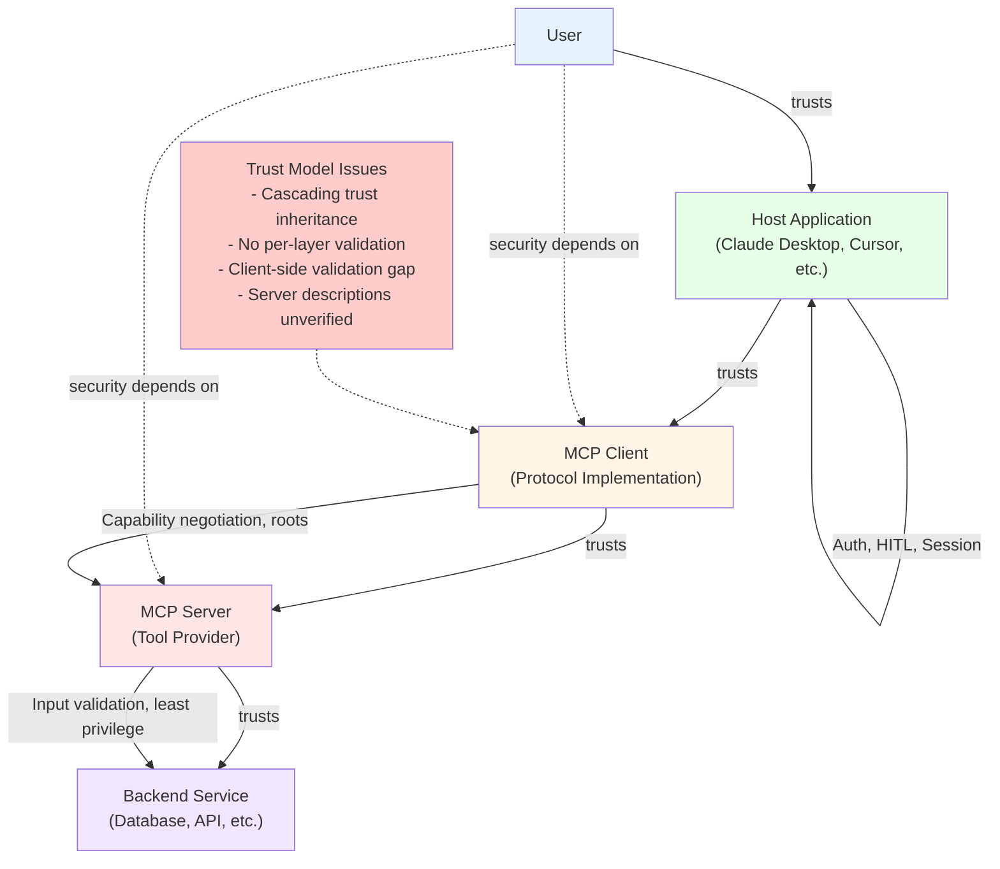

# MCP Deep Research Report: Architecture, Security, Capabilities & Ecosystem (2026)

**Part 2 of 2** — RAI gaps, governance, ecosystem ecosystem survey, best practices, and critical assessment.  
[← Back to Part 1](pathname:///archon/protocols/13-mcp-deep-research-2026.md)

---

## 7. RAI, Evaluation, Audit & Guardrails

### 7.1 The RAI Gap

MCP was designed as a connectivity protocol. Responsible AI concerns — fairness, bias, transparency, human oversight, harm prevention — are entirely out of scope for the core spec. The CoSAI white paper explicitly notes that ethics, fairness, explainability, bias detection, safety, and content safety are "beyond the scope of the project." This is appropriate for CoSAI's security mandate, but means the RAI layer is being built entirely by the application and gateway ecosystem without coordination.

### 7.2 Human-in-the-Loop: The SHOULD Problem

The MCP spec says there SHOULD always be a human in the loop for tool invocations. "SHOULD" in RFC terminology means "recommended but not required." In practice, most hosts implement fully automatic tool execution for efficiency. The gap between the spec's recommendation and production implementations is the largest single RAI failure in the current ecosystem.

For agentic workflows requiring human approval on sensitive operations (financial transactions, privileged data access, irreversible actions), clients and hosts must implement this at the application layer — the protocol won't enforce it.

### 7.3 Audit Trail Requirements

Enterprises need end-to-end visibility into what a client requested and what a server did, in a form they can feed into existing logging and compliance pipelines. This is explicitly listed on MCP's own roadmap as an area needing work. Current implementations vary:

- Some gateways (Portkey, MintMCP, TrueFoundry) provide tool call logs and dashboards
- The core protocol carries no audit primitives
- There is no standard format for MCP audit events that could be consumed by SIEM systems (Splunk, Elastic, etc.)

**Cryptographic gap (Attested Intelligence analysis, 2026):** CoSAI recommends end-to-end request traceability and SPIFFE/SPIRE workload identities. But no standard mechanism exists to produce *cryptographic proof* that recommended mitigations were continuously enforced during operation. Recommending controls is not the same as proving they were active at every agent decision — a critical distinction for regulated industries.

### 7.4 Evaluation Frameworks

How do you know your MCP server is behaving correctly? Existing approaches:

- **MCPTox benchmark:** Tests LLM agents against MCP security prompt injection using real servers — useful for red-teaming
- **AutoMalTool (He et al., 2025):** Automated framework for generating malicious MCP tools for penetration testing
- **MCP-ITP (Li et al., 2026):** Automated framework for generating implicit tool poisoning attacks
- **Cisco MCP Scanner:** Open-source tool for analyzing and validating MCP connections in enterprise environments
- **Snyk's mcp-scan:** Covers MCP servers and agent skills

What doesn't exist yet: a standardized evaluation harness for correctness (does the server do what it claims?), behavioral consistency (does it behave the same under adversarial input?), and fairness (does it treat demographically different inputs equally?).

### 7.5 Guardrail Implementation Patterns

**At the gateway layer:** Most enterprise MCP gateways implement:

- PII detection and scrubbing before data reaches the LLM
- Content filtering (NSFW, harmful content)
- Rate limiting per tool and per user
- Allowlists/denylists for tool call patterns
- Human approval flows for designated high-risk tools

**At the server layer:** Largely unimplemented. MCP servers are typically thin wrappers over existing APIs — they rely on the calling agent to enforce guardrails, which is the wrong trust model.

**At the client/host layer:** Some clients (Claude Desktop, GitHub Copilot) show tool descriptions before invocation. Few show structured output schemas or flag changes in tool definitions.

---

## 8. MCP Client, Host & Server Responsibilities

### Responsibility Mapping

**Host** (e.g., Claude Desktop, Cursor, VS Code): The outermost application. Responsible for:

- User authentication and session management
- Presenting tool invocations and results to users
- Enforcing human-in-the-loop requirements
- Managing which MCP servers the user is connected to
- UI for elicitation responses

**Client** (embedded in the host): The protocol implementation layer. Responsible for:

- Capability negotiation during initialization
- Routing requests to the appropriate server
- Enforcing roots (file access boundaries)
- Implementing sampling response handling
- Exposing elicitation UI affordances

**Server**: The tool/data provider. Responsible for:

- Accurate, non-malicious tool descriptions
- Proper input validation before executing operations
- Least-privilege operation (only accessing what the tool needs)
- Respecting roots declared by the client
- Implementing Task lifecycle for async operations

### The Trust Boundary Problem

The MCP security model assumes tool descriptions are trustworthy. There is no mechanism for the client or host to verify this assumption. The entire trust model is:

- User trusts the host (reasonable)
- Host trusts the client (same codebase, reasonable)
- Client trusts the server (not always reasonable, especially for third-party servers)
- Server trusts tool descriptions (catastrophically wrong for malicious servers)

What's needed: a defense-in-depth model where each layer validates rather than inherits trust. No MCP client currently achieves this fully.

### Client-Side Validation Gap

Research evaluating 7 MCP clients found that 5 out of 7 do not implement static validation of server-provided metadata. The MCP specification does not require this validation, leaving a systematically exploitable gap across most current clients.

### MCP Responsibility Layers & Trust Flow

---

## 9. Proxy Gateways: Who's Building What

The gateway/proxy layer has become the de facto place where the MCP ecosystem implements all the enterprise features the protocol doesn't provide. Key players as of early 2026:

### Portkey (startup, India/US)

- MCP Gateway with integration to existing IdPs — users authenticate via Portkey, credentials never leave the gateway
- Partnered with Lasso Security for real-time guardrails and threat detection at the protocol level
- SaaS, private cloud, VPC, or self-hosted
- Combined LLM gateway + MCP gateway in one platform

### TrueFoundry

- Full AI infrastructure platform with integrated MCP gateway
- Recognized in the 2025 Gartner Market Guide for AI Gateways
- Guards/approval flows for destructive tools; PII-scrubbing; rate limiting; caching
- Uses `mcp-proxy` to wrap STDIO servers as HTTP services

### IBM ContextForge (open source)

- Federation architecture: multiple gateway instances auto-discover each other and share tool registries
- Wraps MCP, A2A, and REST/gRPC APIs under a unified endpoint
- Beta — production readiness should be verified before adoption

### Kong AI Gateway 3.12+

- Added MCP Proxy plugin, OAuth 2.1 support, MCP-specific Prometheus metrics in October 2025
- Best for organizations already using Kong for API gateway consolidation
- General-purpose platform; not MCP-native

### Cloudflare Workers + MCP Server Portals

- Presents all registered MCP servers behind a single URL
- Single-URL aggregation; integrates with Zero Trust
- Best for teams already on the Cloudflare stack

### Metorial (YC-backed, open source)

- Hibernation technology: servers start in under a second and stop when idle → pay per request not per connection
- Purpose-built for SaaS companies offering MCP-powered products to their own customers

### MintMCP (startup, backed by Andrej Karpathy, Jeff Dean, Scott Belsky)

- One-click deployment of STDIO servers with OAuth protection and SOC 2 Type II compliance
- LLM Proxy monitors every tool call, bash command, and file operation from Cursor and Claude Code
- Commercial; enterprise pricing

### agentgateway (open source)

- Multi-layered content filtering: regex, OpenAI moderation, AWS Bedrock Guardrails, Google Model Armor, custom webhooks
- Auth: JWT, API keys, OAuth; RBAC via CEL policy engine; rate limiting; TLS; OpenTelemetry
- Kubernetes-native with Gateway API support

### Bifrost (Maxim AI)

- Go-based, sub-3ms gateway latency
- Best-in-class raw performance; good for latency-sensitive workloads

### What Gateways Still Can't Solve

Gateways intercept and inspect messages at the transport layer. They cannot:

- Understand the *intent* of a tool call from the model's perspective (without their own LLM evaluation)
- Detect rug pull attacks that haven't yet changed behavior (the change happens server-side)
- Prevent a compromised server from returning poisoned output after the gateway inspects the request
- Enforce human-in-the-loop at the semantic level

The gateway solves the "what was called" question. The "whether the call was appropriate" question still requires LLM-level evaluation.

---

## 10. Auth: OAuth 2.1, Latency & Alternate Designs

### OAuth 2.1 in MCP

Added to the spec in June 2025. Key requirements:

- MCP servers can declare themselves as OAuth resource servers
- Clients must implement Resource Indicators (RFC 8707) — this prevents token replay across different resources
- PKCE (Proof Key for Code Exchange) is required — no implicit flows

### The Enterprise Auth Reality Gap

OAuth 2.1 is the right standard. The enterprise deployment gap is:

- Many internal services use API keys, not OAuth
- OAuth flows introduce browser redirects — problematic for headless agent deployments
- Per-user OAuth means each user must complete an auth flow for each server — multiplied across dozens of servers, this is untenable
- SSO integration requires mapping enterprise identity (SAML, OIDC from Okta/Azure AD) to MCP server OAuth — each integration is currently custom

The MCP roadmap explicitly lists "enterprise-managed auth: paved paths away from static client secrets and toward SSO-integrated flows (Cross-App Access)" as an area needing directional proposals.

### Latency Impact of Auth

OAuth token validation adds latency to every request. In a typical flow:

- JWT validation (fast, local): ~1ms
- Token introspection endpoint call (slow, network): 10-50ms
- SSO token exchange: 50-200ms

For agentic workflows making dozens of tool calls per user interaction, auth latency compounds. Mitigation patterns:

1. **Token caching at the gateway:** The gateway validates once and caches the result for the token's TTL. Saves per-request introspection round trips.
2. **Short-lived pre-shared tokens per session:** Issued at session start, valid for the session duration, validated locally at the server.
3. **mTLS (mutual TLS):** For server-to-server communication within a trust boundary, mTLS eliminates per-request token exchange while providing cryptographic identity. Higher setup cost, lower operational latency.
4. **SPIFFE/SPIRE workload identity:** Cryptographic identity for workloads in containerized environments. Recommended by CoSAI for agent identity; eliminates static credentials entirely.

### URL Mode Elicitation as Auth Alternative

For MCP server-to-third-party-API auth, URL Mode Elicitation (November 2025) is a clean solution: the server sends the user a URL for an out-of-band OAuth flow in their browser. The credential never transits through the MCP client. This works for interactive workflows but cannot be used for fully automated headless agents.

---

## 11. The Ecosystem: Apps & Platforms Built on MCP

### Developer Tools (original use case, mature)

- **Claude Desktop, Claude Code:** Anthropic's own clients; the reference implementations
- **Cursor:** Widely used AI IDE with MCP support; elicitation still a pending feature request
- **GitHub Copilot in VS Code:** Supports elicitation as of mid-2025
- **Cline:** Open-source agent; sampling/elicitation support requested but not yet implemented
- **Continue:** Open-source coding assistant with MCP support

### Enterprise Integrations (growing)

- Salesforce, Asana, GitHub, Notion, Slack, Google Drive, Gmail — all have MCP servers
- SAP, ServiceNow, Workday — enterprise ERP/HCM integration servers emerging
- Database MCP servers: PostgreSQL, MongoDB, Snowflake, BigQuery

### Agent Frameworks (MCP as tool layer)

- LangChain, LlamaIndex, AutoGen, CrewAI, Mastra — all support MCP as the tool invocation layer
- Google's Agent Development Kit and Amazon's Strands Agents framework both adopted MCP

### Agentic Platforms Using MCP

- **Manus AI:** Uses MCP internally for tool composition in autonomous agent workflows
- **Spring AI (VMware/Broadcom):** McpClientSession with session persistence enabled
- **AWS Bedrock:** MCP support via Amazon Q and Bedrock Agents

### MCP Registry (preview launched September 8, 2025)

- Open catalog and API for discovering MCP servers
- Supports public and private sub-registries
- Any MCP client can consume registry content via native API or third-party aggregators
- Typosquatting risk: growing as the registry grows, verification mechanisms still nascent

### MCPTox Benchmark (security tooling)

- Standardized test suite for evaluating MCP security posture
- 45 real-world MCP servers, 353 authentic tools
- Growing into the de facto security evaluation standard

---

## 12. What Is Solved, What Is Being Solved, What Is Unsolved

### Solved (as of April 2026)

- Core protocol stability: Tools, Resources, Prompts — well-specified and widely implemented
- STDIO transport: mature, reliable for local tools
- Streamable HTTP: production-grade, deployed at scale with appropriate infrastructure
- OAuth 2.1 base: specified and available in most major SDKs
- Structured tool output: available and recommended
- MCP Registry: operational for discovery
- Governance: Linux Foundation, Working Groups, SEP process in place
- URL mode elicitation: clean credential flow without client-side credential handling
- Async Tasks (spec level): specified in 2025-11-25 as experimental, promoted to stable in the 2026-07-28 release candidate
- Basic gateway/proxy patterns: robust commercial and open-source options exist

### Being Solved (in active development)

- Stateless operation at scale: session-in-data-model approach specified in the 2026-07-28 release candidate (final spec July 28, 2026); SDK rollout in progress
- SDK standardization of stateless behavior: spec now settled, SDK implementations still inconsistent across languages
- Enterprise SSO integration: "Cross-App Access" on the roadmap
- Configuration portability (server configuration portable across clients): roadmap item
- Audit trail standardization: identified as gap, proposals not yet finalized
- Gateway behavior specification: what happens at intermediaries (auth propagation, session semantics)
- Capability discovery without connection: `.well-known` endpoint specified in the 2026-07-28 release candidate
- Task client implementations: most clients don't poll yet

### Unsolved / Structurally Hard

- **Prompt injection:** No reliable mitigation exists. OWASP ranks it #1; it remains #1 two and a half years after the LLM security community first articulated it. MCP makes it structurally worse because it creates channels for untrusted external content to enter the context.
- **Rug pull detection:** No standardized mechanism for tool description change notifications or version pinning
- **Cryptographic proof of enforcement:** CoSAI identifies controls; no standard for proving controls were active per-invocation
- **Roots enforcement:** Client-declared, server-enforced — a server that doesn't respect roots has no technical barrier to ignoring them
- **LLM-layer trust:** Safety alignment (RLHF, Constitutional AI, etc.) is not designed to detect malicious actions via legitimate tool calls. Claude 3.7 Sonnet's &lt;3% refusal rate against tool poisoning attacks demonstrates this
- **Multi-agent trust chains:** When Agent A instructs Agent B, B has no cryptographic basis to verify A's authorization context. CoSAI recommends agent-to-agent mTLS; the ecosystem doesn't implement it
- **Parallel tool call side effects:** No spec-level semantics for conflict resolution when concurrent tools write to shared state
- **RAI standardization:** Fairness, bias, transparency, harm prevention are entirely outside the protocol; the ecosystem has no coordination point for these concerns

---

## 13. Best Practices & Alternate Design Patterns

### For Server Authors

1. **Least privilege by design:** Each server should request only the permissions its tools actually require. A web search server should have no database access.
2. **Explicit output schemas:** Declare `outputSchema` for all tools. Forces disciplined API design and enables downstream validation.
3. **No credential storage in tool descriptions:** Tool metadata is visible to the LLM. Never embed API keys, connection strings, or sensitive config in descriptions.
4. **Pin dependencies:** Supply chain attacks on MCP servers mirror PyPI attacks. Pin tool library versions; use lockfiles.
5. **Implement structured input validation:** Don't pass raw tool arguments directly to shell commands, SQL queries, or file paths without sanitization.
6. **Use URL mode elicitation for credential collection:** Never ask for credentials through the MCP elicitation form — always redirect to a proper OAuth/browser flow.
7. **Document trust model clearly:** Declare what data your server accesses, what operations it performs, and what external services it calls. Users can't consent to what they can't see.

### For Client/Host Authors

1. **Pin tool description hashes:** Detect and alert on any change to tool metadata after initial approval.
2. **Show AI-visible content to users:** The split between user-visible and AI-visible tool descriptions is an attack surface. Show users the full description the model sees.
3. **Implement meaningful human-in-the-loop:** Treat the spec's "SHOULD" as "MUST" for irreversible operations. Financial transactions, data deletion, and privileged access should require per-invocation approval.
4. **Validate tool output against declared schemas:** Don't pass tool output directly to the LLM or downstream systems without validation.
5. **Implement task polling:** Prepare for the stateless future by implementing the async Task polling model now.
6. **Scope sampling requests:** Don't allow servers unlimited sampling capability. Implement budgets and rate limits.

### For Infrastructure/Platform Teams

1. **Deploy a gateway in front of all MCP traffic:** Don't expose MCP servers directly to the network. A gateway provides auth, rate limiting, audit logging, and content inspection in one place.
2. **Use SPIFFE/SPIRE for workload identity:** Eliminate static credentials for service-to-service MCP communication.
3. **Implement mTLS for agent-to-agent communication:** Prevents lateral movement via compromised agents.
4. **Feed MCP audit logs into your SIEM:** Even before standardization, capture gateway logs in structured format compatible with Splunk/Elastic/etc.
5. **Run MCP servers in containers with minimal privileges:** Docker/Kubernetes isolation is necessary but not sufficient — combine with seccomp profiles and network policies.
6. **Test with MCPTox:** Include adversarial MCP testing in your security pipeline.

### Alternate Architecture Patterns

**Pattern 1: MCP-over-A2A for multi-agent systems**
Use the Agent2Agent (A2A) protocol (originated at Google, donated to the Linux Foundation in June 2025 as the Agent2Agent Project) for agent orchestration and MCP only for tool access at leaf agents. This separates concerns and allows A2A's stronger identity model to govern inter-agent trust.

**Pattern 2: Capability-proxy architecture**
Rather than giving agents direct MCP server connections, route all MCP traffic through a capability proxy that enforces RBAC at the tool level. Each agent role has a policy declaring which tools it may call. The proxy enforces this regardless of what the agent requests.

**Pattern 3: Read-only MCP + write-through workflow**
For RAG and information retrieval use cases, configure MCP servers in read-only mode. Any write operations require an out-of-band approval workflow (email, Slack, or dedicated approval UI) before execution. Reduces the blast radius of prompt injection.

**Pattern 4: Air-gapped MCP for sensitive data**
For highly sensitive data environments, run MCP servers on isolated networks with no external egress. Data retrieval is fine; the server cannot exfiltrate data even if compromised. Network policy enforced at the infrastructure layer, not application layer.

---

## 14. Critical Assessment: What the Field Gets Wrong

### The Gateway Is Not a Security Solution

The ecosystem has converged on "put a gateway in front of MCP" as the security answer. Gateways are valuable for auth, rate limiting, and logging. They are not sufficient for security. A gateway inspects the *what* of a tool call; it cannot understand the *why* from the model's perspective without running its own LLM evaluation — which most gateways don't do in real time. Tool poisoning happens before the gateway sees anything because the attack is in the server's tool description, which was sent during initialization.

### The "Human in the Loop" Is Mostly Fiction in Production

Every architecture diagram for MCP includes a "human-in-the-loop" box. In most production deployments, this is either a single click at server installation or fully automated. The spec's SHOULD language, combined with competitive pressure to minimize friction, means human oversight is primarily a design fiction. This is the most significant responsible AI gap in the current ecosystem.

### The Registry Scales the Attack Surface

The MCP Registry is architecturally correct — discovery is better than hand-configuration. But a public registry ecosystem of 10,000+ servers, with no code review, no behavioral verification, and typosquatting-vulnerable naming, is also a large surface for supply chain attacks. The community is applying PyPI's lesson (trust on install → problems emerge later) without yet having PyPI's response (Sigstore, Trusted Publishers, automated malware scanning). This needs to be built *before* the registry reaches mass adoption, not after.

### SDK Fragmentation Is a Hidden Risk

The ecosystem has dozens of MCP SDKs across languages. These SDKs vary in spec compliance, update latency, and feature completeness. The Java SDK 0.17.1 crash bug from elicitation capability fields is a symptom of a systemic problem: SDK authors can't keep up with spec velocity. The tiering system announced in the November 2025 update is a correct governance response, but until it's operational, users face an ecosystem where "MCP compatible" can mean anything from "implements the 2024 core spec" to "fully implements 2025-11-25 including tasks."

### Auth Latency Is Not Adequately Addressed

The roadmap mentions enterprise SSO as a gap. What's not acknowledged loudly enough is the latency cost of any non-cached auth in high-frequency agentic workflows. A workflow making 50 tool calls — each requiring an auth round-trip — adds seconds of latency. The field is treating auth as an identity problem; it is also a performance problem that will drive teams to insecure shortcuts (long-lived tokens, per-session pre-auth with wide scopes) unless good patterns are established early.

### The Sampling Consent Model Is Broken By Design

Sampling lets MCP servers request LLM completions through the client. The spec says the human should review and approve these requests. In practice, the user cannot meaningfully evaluate a sampling request — they'd need to understand the server's internal reasoning to know if the request is appropriate. This is a structural consent problem: consent is formally present but epistemically impossible to give meaningfully. The field needs to think harder about what meaningful consent for sampling actually looks like.

### MCP Is Not a Workflow Engine — But Teams Are Using It Like One

Teams are building multi-step, stateful agentic workflows on top of what is, fundamentally, a stateless RPC protocol with session management bolted on. The result is fragile, hard to debug, and breaks under network partitions and server restarts. The right mental model: MCP is the *tool access layer*. Orchestration, state management, error recovery, and workflow logic belong in a layer above it (LangGraph, AutoGen, CrewAI, etc.). Teams that conflate these layers build systems that are hard to maintain and harder to secure.

---

## Appendix: Key Papers & Resources

- CoSAI MCP Security White Paper (January 2026) — OASIS Open / cosai-oasis GitHub
- MCP Transport Future Roadmap — blog.modelcontextprotocol.io (December 2025)
- MCP November 2025 Anniversary Spec Release — blog.modelcontextprotocol.io
- MCP Official Roadmap — modelcontextprotocol.io/development/roadmap
- Simon Willison: MCP and Prompt Injection (April 2025) — simonwillison.net
- Invariant Labs: Tool Poisoning Attacks (April 2025) — invariantlabs.ai
- Elastic Security Labs: MCP Tools Attack Vectors (September 2025)
- Microsoft Developer: Protecting Against Indirect Injection in MCP (April 2025)
- MCPTox Benchmark — arxiv.org/html/2603.22489
- AWS Samples: Serverless MCP Servers — aws-samples/sample-serverless-mcp-servers
- IBM ContextForge — github.com/IBM/mcp-context-forge
- agentgateway — github.com/agentgateway/agentgateway

---

[← Back to Part 1](pathname:///archon/protocols/13-mcp-deep-research-2026.md)
