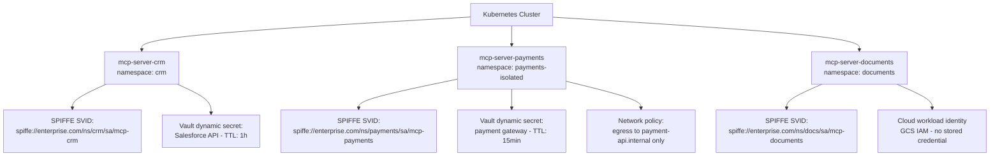
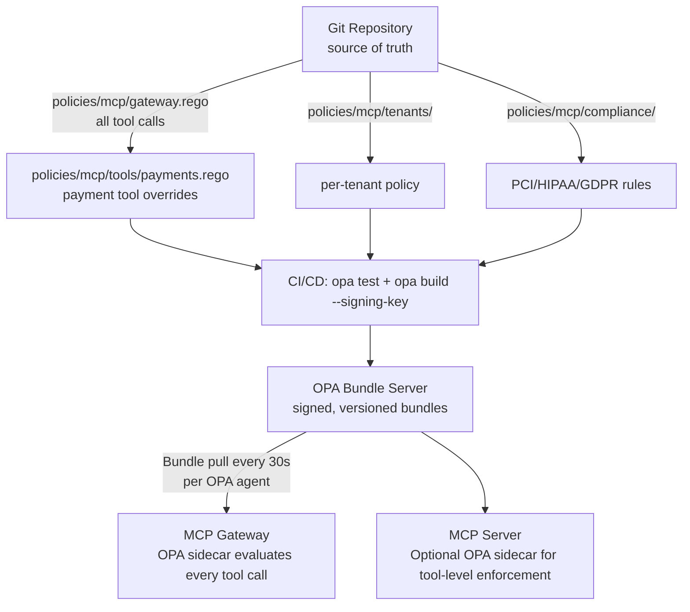
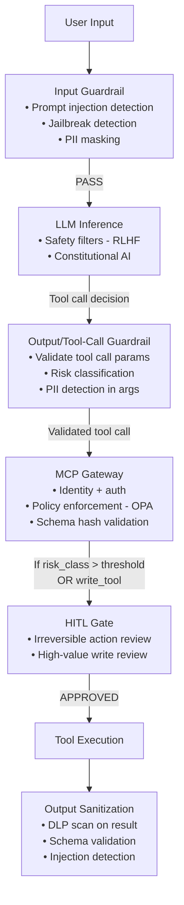
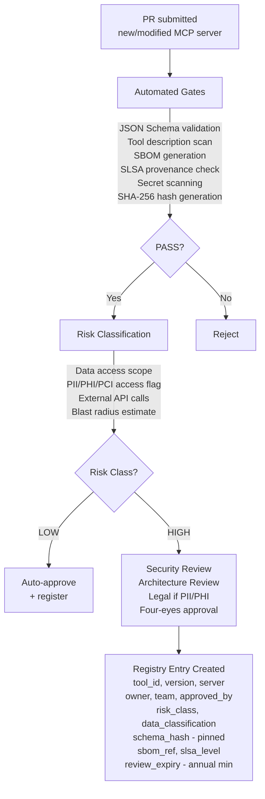

# Enterprise MCP Security, Authorization, Governance & Operations (2026)

**Part 2 of 3** — Authorization models, secrets management, policy engines, guardrails, HTTP headers, versioning, and governance workflows.  
[← Back to Part 1](pathname:///archon/protocols/14-mcp-enterprise-security-governance-operations-2026.md) | [Continue with Part 3 →](pathname:///archon/protocols/parts/14-mcp-enterprise-security-governance-operations-2026-part3.md)

---

## 4. Authorization Models

### 4.1 Model Comparison for Tool Authorization

| Model | Strengths for MCP | Weaknesses | Best For |
|-------|------------------|------------|----------|
| **RBAC** | Simple; easy audit; low overhead | Cannot express dynamic context | Team-based tool access; low cardinality roles |
| **ABAC** | Dynamic context (time, risk, location) | Complex attribute management | Time/geography/risk-sensitive tools |
| **PBAC** | Expressive business rules; regulatory compliance | High policy authoring overhead | Finance/healthcare compliance rules |
| **ReBAC (OpenFGA)** | Hierarchical permissions; delegation chains | Higher latency (graph traversal) | Multi-tenant; user→team→agent→tool hierarchies |
| **OPA (Rego)** | General-purpose; K8s-native; rich ecosystem | Rego learning curve | Gateway enforcement across all MCP traffic |
| **Cedar** | Formally verifiable; strongly typed | AWS-centric tooling | High-assurance environments; provable policy correctness |
| **AWS Verified Permissions** | Managed Cedar; IAM integration | AWS lock-in | AWS-native MCP deployments |

### 4.2 Three-Level Tool Authorization

Every MCP deployment must enforce authorization at all three levels:

```
Level 1 — Server (coarse-grained):
  Can this agent identity reach this MCP server at all?
  Enforced by: gateway mTLS + identity validation

Level 2 — Tool (medium-grained):
  Can this agent invoke this specific tool?
  Enforced by: OPA policy on Mcp-Name header (no body parse required)

Level 3 — Resource (fine-grained):
  Can this agent invoke this tool on this specific resource/data?
  Enforced by: tool-level authorization within the MCP server
```

### 4.3 OPA Policy Example (Tool Authorization)

```rego
package mcp.authz

default allow = false

allow {
    # Workload identity verified (SPIFFE SVID in mTLS)
    input.agent.spiffe_id != ""

    # Tool is within agent's declared scope
    input.tool.name in data.agent_registry[input.agent.id].allowed_tools

    # Tool risk class within session's approved risk ceiling
    data.tool_registry[input.tool.name].risk_class <= input.session.max_risk_class

    # Originating user session is active (compound identity check)
    input.user.session_expires_ns > time.now_ns()

    # Tool not blocked for this tenant
    not data.tenant_blocklist[input.tenant][input.tool.name]

    # Schema hash matches approved version (rug pull prevention)
    input.tool.schema_hash == data.tool_registry[input.tool.name].approved_hash
}

# Deny escalation: write tools require HITL flag in session
deny_write_without_hitl {
    data.tool_registry[input.tool.name].write_access == true
    not input.session.hitl_approved
}
```

### 4.4 Contextual Authorization Attributes

| Attribute | Example Policy |
|-----------|---------------|
| Time of day | Block financial write tools outside 08:00–18:00 business hours |
| Risk score | High-risk tool requires user re-authentication in last 5 minutes |
| Data classification | PII-accessing tools trigger mandatory DLP audit log |
| Geographic context | Regulatory tools blocked when data subject is EU but processing is outside EU |
| Behavioral anomaly score | Score &gt; threshold → demote to read-only + alert |
| Prior session actions | Repeated authorization failures → rate limit + incident creation |

### 4.5 Delegated Authorization in Agent Chains

When Agent A → Agent B → MCP Tool, the tool must validate the full delegation chain:

```
Policy: "a downstream tool may only be invoked if every principal in
         the act chain has the required permission for that tool"

Token structure (RFC 8693 nested actors):
{
  "sub": "user:alice",          // originating user
  "act": {
    "sub": "agent:orchestrator",  // Agent A
    "act": {
      "sub": "agent:crm"          // Agent B (immediate caller)
    }
  },
  "scope": "tool:search_customers:invoke",
  "exp": 1720691400
}

Validation at MCP server:
  alice: session active? scope granted? tenant authorized?
  agent:orchestrator: registered? risk class acceptable?
  agent:crm: registered? tool in allowed_tools? schema hash current?
```

---

## 5. Tool Authentication & Secrets Management

### 5.1 Tool Identity Architecture

Every MCP server in production must have a workload identity. High-risk tools within a server should have separate service accounts to limit blast radius.



### 5.2 Secrets Management Reference

| Secret Type | Recommended Approach | Anti-Pattern to Avoid |
|-------------|---------------------|----------------------|
| External API keys | Vault dynamic secrets engine (short TTL, auto-rotate) | Hardcoded in `mcp.json` or environment variable |
| Database credentials | Vault database secrets engine (per-connection rotate) | Static password in connection string |
| Cloud provider credentials | Cloud workload identity (no stored credential at all) | Long-lived access keys in environment |
| TLS certificates | cert-manager + SPIRE (automatic rotation) | Self-signed, manually managed, long-lived |
| Signing / encryption keys | Vault Transit engine (key never leaves Vault) | Private key on filesystem or in code |

### 5.3 Credential Rotation Policy

| Credential Type | Maximum TTL | Rotation Mechanism |
|-----------------|------------|-------------------|
| SPIFFE SVID | 1 hour | Automatic (SPIRE) |
| Vault dynamic secrets | Per-task (≤15 min for payments) | Automatic (Vault lease) |
| Cloud workload identity tokens | 1 hour | Automatic (cloud provider) |
| API keys (static, unavoidable legacy) | 90 days max | Scheduled + on any suspected compromise |
| TLS certificates | 90 days | Automatic (cert-manager/ACME) |

---

## 6. On-Behalf-Of and Token Exchange

&gt; For detailed OBO architecture and identity propagation diagrams, see [Identity, MCP &lt;&amp; A2A Security Blueprint §2.3](../../ai-security-governance/security/02-Identity-MCP-A2A-Security-Blueprint.md) and [A2A Enterprise Security Guide §3](../../enterprise-architecture/ai-architecture/a2a-enterprise-security-governance-guide.md). This section covers MCP-specific application of OBO at the tool boundary.

### 6.1 Why OBO Matters at the Tool Boundary

When a tool is invoked as part of a multi-agent workflow, three things must be true simultaneously:

1. The tool knows **which agent** is calling (for resource authorization)
2. The tool knows **on whose behalf** (for user-level authorization and audit)
3. The token cannot grant the tool **more than the user authorized** (scope attenuation)

RFC 8693 token exchange satisfies all three, and must be used for any human-initiated tool invocation in a regulated environment.

### 6.2 Token Exchange at Tool Invocation

```
POST /token HTTP/1.1
Content-Type: application/x-www-form-urlencoded

grant_type=urn:ietf:params:oauth:grant-type:token-exchange
&subject_token=<user_access_token>
&subject_token_type=urn:ietf:params:oauth:token-type:access_token
&actor_token=<agent_spiffe_svid_as_jwt>
&actor_token_type=urn:ietf:params:oauth:token-type:jwt
&scope=tool:search_customers:invoke
&resource=https://mcp-crm.enterprise.internal

# Result token structure:
{
  "sub": "user:alice@enterprise.com",
  "act": { "sub": "spiffe://enterprise.com/ns/crm/sa/crm-agent" },
  "scope": "tool:search_customers:invoke",
  "aud": "https://mcp-crm.enterprise.internal",
  "exp": <now + 300>  // 5 minutes max
}
```

### 6.3 Common OBO Mistakes at the Tool Boundary

| Mistake | Consequence | Fix |
|---------|-------------|-----|
| Using agent's own identity (not OBO) | Audit shows agent, not user; skips user-level authorization | Always exchange for user-context token |
| Full impersonation (assumes user's full identity) | Audit cannot distinguish user action from agent action | Use `act` claim pattern — always carry agent identity alongside `sub` |
| Exchanging for broad scope | Violates least privilege; enables confused deputy | Exchange for tool-specific scope only: `tool:name:invoke` |
| Not validating actor chain at MCP server | Compromised intermediate agent bypasses user-level checks | MCP servers must validate both `sub` and full `act` chain |
| Caching OBO tokens across tool calls | Replaying a token for a different tool | Scope binds token to specific tool; server validates `scope` on every call |

---

## 7. Pre-Runtime vs Runtime vs Continuous Authorization

### 7.1 Authorization Timing

| Tier | When | What It Enforces | Latency |
|------|------|-----------------|---------|
| **Pre-runtime** | Before any traffic flows | Tool approved; agent provisioned; policy compiled; schema registered | Minutes (governance workflow) |
| **Runtime** | At each tool invocation | Identity valid; policy allows; scope correct; schema hash current | 1–50 ms |
| **Continuous** | Throughout session | User session still active; behavioral anomaly below threshold; no new policy blocks | Async (does not add per-call latency) |

### 7.2 Pre-Runtime Controls

| Gate | Mechanism | Blocks What |
|------|-----------|------------|
| Tool approval workflow | Governance registry + human review | Unapproved tools from reaching production |
| Schema pinning | Hash registration in registry | Rug pull and schema drift |
| Agent provisioning | SPIRE enrollment + IAM policy | Unauthorized agents from authenticating |
| Policy compilation | OPA bundle build + distribution | Policy drift between environments |
| SBOM review | Dependency scan + SLSA verification | Supply chain compromise |

### 7.3 Runtime Controls

```
Per-call evaluation sequence (target: <20ms total):

  1. mTLS handshake + SVID validation            ~1ms
  2. JWT signature + iss + exp + jti             ~1ms
  3. OPA policy evaluation (local cache)         ~3ms
  4. Contextual attribute fetch (session state)  ~5ms
  5. Schema hash verification (in-memory)        ~0ms
  6. HITL gate check (if tool requires)          <1ms (cached approval)
  Total (happy path):                           ~10ms
```

### 7.4 Continuous Authorization

- **Token re-validation** at each tool call — a valid token from 10 minutes ago is re-checked against current session state
- **Behavioral anomaly scoring** — rising anomaly score can demote permissions mid-session without interrupting the user
- **User session liveness** — if the originating user's session expires, all derived agent tokens are invalidated immediately via OPA bundle update
- **Real-time policy propagation** — OPA bundle refresh (every 30s) means new policy blocks take effect without restarting anything

**Do not rely solely on pre-runtime controls.** They cannot account for: user session revocation, behavioral anomaly mid-session, data classification of the specific resource being accessed at runtime, or real-time threat intelligence.

---

## 8. Policy Engines

### 8.1 Selection Matrix

| Factor | OPA | Cedar | OpenFGA | AWS Verified Permissions |
|--------|-----|-------|---------|--------------------------|
| **Language** | Rego (flexible, dynamic) | Cedar (typed, provable) | ReBAC tuple model | Cedar (hosted) |
| **Formal verification** | No | Yes | No | Yes |
| **Cloud-agnostic** | Yes | Yes | Yes | AWS only |
| **Relationship model** | Limited | Limited | Native strength | Limited |
| **Local latency** | 1–5ms | &lt;1ms | 5–20ms (graph) | Network-dependent |
| **Managed option** | Styra DAS | AWS VP | Auth0 FGA / Okta FGA | Yes |
| **K8s native** | Yes (Gatekeeper) | No | No | No |
| **Best for MCP** | General gateway enforcement; complex multi-attribute | High-assurance; AWS-native | Multi-tenant delegation hierarchies | AWS-native managed |

### 8.2 Policy Architecture



### 8.3 Policy Lifecycle

| Stage | Activity | Tooling |
|-------|----------|---------|
| Author | Write Rego/Cedar in version-controlled repo | VS Code OPA extension; Styra DAS IDE |
| Test | Unit tests against synthetic inputs; compliance rule tests | `opa test`; ConfTest |
| Review | PR review; security review for compliance policies | Git PR workflow; Styra DAS review |
| Build | Compile to signed bundle; generate policy docs | `opa build --signing-key`; bundle signing |
| Deploy | Push to bundle server; gateways auto-pull | CI/CD; Styra bundle push |
| Monitor | Decision log analysis; coverage tracking | OPA decision log → SIEM |
| Rollback | Re-publish previous bundle version | Bundle server rollback; Git tag revert |

---

## 9. Guardrails Architecture

### 9.1 Guardrail Placement



### 9.2 Fail-Open vs Fail-Close

| Control | Write Tool | Read Tool | Enterprise Recommendation |
|---------|-----------|-----------|--------------------------|
| Policy engine unavailable | Fail-close | Fail-open with alert | Never allow write without policy; alert immediately |
| Guardrail unavailable | Fail-close | Configurable | Fail-close for regulated environments; alert |
| Registry unavailable | Serve cache; block new deployments | Serve cache | 1h cache TTL; no new deployments during outage |
| Identity provider unavailable | Cached creds (1h) + alert | Cached creds (1h) + alert | Short window for degraded mode; escalate immediately |

### 9.3 AI Firewall Products (2026)

| Product | Vendor | Primary Capability |
|---------|--------|-------------------|
| Prompt Shields | Azure AI Content Safety | Prompt injection + jailbreak detection |
| Llama Guard 3 | Meta (open-source) | Safety classification for inputs and outputs |
| Guardrails AI | Guardrails AI | Output validation against schemas; PII; toxicity |
| LLM Guard | ProtectAI | Full pipeline: injection, PII, toxicity, secrets |
| Lakera Guard | Lakera | Real-time prompt injection; PII; multi-language |

---

## 10. Payload Best Practices

### 10.1 Size Limits

| Payload | Recommended Limit | Rationale |
|---------|------------------|-----------|
| Single tool call request | 64 KB | Prevents context exhaustion; fits in gateway buffer |
| Tool response | 1 MB | Protects against runaway context growth; use streaming for larger |
| Tool results portion of LLM context | ≤25% of model context window | Reserve capacity for reasoning, system prompt, history |
| Streaming chunk | 8 KB per SSE chunk | Optimal for SSE delivery |

### 10.2 Pagination for Large Results

```python
@server.call_tool()
async def query_large_dataset(arguments: dict) -> list[TextContent]:
    page = arguments.get("page", 0)
    page_size = min(arguments.get("page_size", 100), 500)  # hard cap

    results, total = await db.query_paginated(
        arguments["query"],
        offset=page * page_size,
        limit=page_size
    )
    return [TextContent(type="text", text=json.dumps({
        "results": results,
        "total": total,
        "page": page,
        "has_more": (page + 1) * page_size < total,
        "next_page": page + 1 if (page + 1) * page_size < total else None
    }))]
```

### 10.3 Schema Validation (Mandatory)

```python
from jsonschema import validate, ValidationError

PAYMENT_SCHEMA = {
    "type": "object",
    "properties": {
        "amount":     {"type": "number", "minimum": 0.01, "maximum": 1_000_000},
        "currency":   {"type": "string", "enum": ["USD", "EUR", "GBP"]},
        "account_id": {"type": "string", "pattern": "^[A-Z0-9]{8,16}$"}
    },
    "required": ["amount", "currency", "account_id"],
    "additionalProperties": False  # CRITICAL: reject unknown fields
}

@server.call_tool()
async def process_payment(arguments: dict) -> list[TextContent]:
    try:
        validate(arguments, PAYMENT_SCHEMA)
    except ValidationError as e:
        return [TextContent(type="text", text=f"Invalid: {e.message}", isError=True)]
    # Only reaches here if validation passes
    ...
```

### 10.4 Replay Protection

| Mechanism | Implementation |
|-----------|----------------|
| **Idempotency key** | Client generates UUID per operation; server deduplicates in 24h window |
| **Nonce** | Short random value in signed request; server tracks used nonces with TTL |
| **Timestamp bound** | Reject requests with timestamp &gt;5 minutes from server time |
| **JWT `jti` claim** | Unique JWT ID; server maintains used-JTI cache matching token expiry TTL |

### 10.5 Message Integrity for High-Risk Tools

```
POST /mcp HTTP/1.1
Mcp-Method: tools/call
Mcp-Name: process_payment
X-Payload-Signature: eyJ...  ← JWS with detached payload (HMAC or RS256)
X-Idempotency-Key: 7f3d4a2b-1c2d-...
X-Request-ID: req_abc123
```

For financial and healthcare tools, require the client to sign the request body; the MCP server verifies before processing.

---

## 11. HTTP Header Best Practices

### 11.1 Reverse Proxy Header Size Limits

| Platform | Default Max Header Size | Increase Setting |
|----------|------------------------|-----------------|
| NGINX | 8 KB | `large_client_header_buffers 4 16k` |
| Envoy | 60 KB | `max_request_headers_kb` |
| AWS ALB | 16 KB | Hard limit; cannot increase |
| Azure Application Gateway | 32 KB | Header size policy |
| GCP Cloud Load Balancing | 8 KB per header, 128 KB total | Per-header limit enforced |
| Kubernetes Nginx Ingress | 8 KB | `proxy-buffer-size: "16k"` annotation |
| Kong Gateway | 8 KB default | Via Nginx tuning |

**JWT size guidance:** JWTs in Authorization headers commonly reach 2–6 KB. Use opaque reference tokens in the header and resolve to full claims at the policy engine or sidecar. Never embed the full conversation history, tool list, or large attribute sets in a JWT.

### 11.2 Required Headers (MCP 2026-07-28)

| Header | Required | Purpose |
|--------|----------|---------|
| `Mcp-Method` | Yes (Streamable HTTP) | Gateway routing without body parsing |
| `Mcp-Name` | Yes (Streamable HTTP) | Tool name for routing and rate limiting |
| `Authorization` | Yes | Bearer token |
| `traceparent` | Strongly recommended | W3C Trace Context — end-to-end tracing |
| `tracestate` | Optional | Vendor-specific trace state |
| `X-Request-ID` | Recommended | Log correlation across services |
| `X-Idempotency-Key` | Required for write tools | Replay prevention |
| `Content-Type` | Yes | `application/json` |

### 11.3 Security Headers (Gateway-Injected)

```
# All MCP responses — injected by gateway
Strict-Transport-Security: max-age=31536000; includeSubDomains; preload
X-Content-Type-Options: nosniff
Cache-Control: no-store                  # Never cache MCP responses
X-Frame-Options: DENY                    # For MCP App UIs
Content-Security-Policy: default-src 'none'  # MCP Apps (iframe isolation)
```

### 11.4 Distributed Tracing Header Pattern

```
# All MCP hops must propagate W3C Trace Context
traceparent: 00-{trace-id:32hex}-{parent-id:16hex}-{flags}
tracestate: enterprise=agent_id:crm-agent,session:abc123,risk:medium

# User → Agent: start trace
# Agent → Gateway: propagate
# Gateway → MCP Server: propagate
# MCP Server → downstream APIs: propagate
# All hops: append to tracestate
```

### 11.5 Header Forwarding Policy

| Header | Forward to MCP Server? | Reason |
|--------|----------------------|--------|
| `Authorization` (original) | No — strip and replace with scoped token | Gateway issues minimal-scope token |
| `traceparent` / `tracestate` | Yes | Tracing continuity |
| `X-Request-ID` | Yes | Log correlation |
| `X-Forwarded-For` | Strip in high-security; preserve for audit otherwise | Attacker can spoof; strip at gateway |
| Internal infra headers (`X-Internal-*`) | Never | SSRF / header injection risk |

---

## 12. Anti-Pattern Catalog

| Anti-Pattern | Risk | Remediation |
|--------------|------|-------------|
| **Passing entire conversation to every tool** | Context window exhaustion; PII leakage to every tool; cost waste | Pass only the minimum context fields needed for the specific tool call |
| **Oversized JWT in Authorization header** | Exceeds ALB/gateway header limits (16 KB AWS ALB hard cap) | Opaque reference tokens in header; resolve claims server-side |
| **No input schema validation** | Injection attacks; unexpected behavior; schema drift undetected | Declare `inputSchema`; validate before processing; `additionalProperties: false` |
| **Trusting tool output as ground truth** | Tool output poisoning; indirect prompt injection | Treat all tool output as untrusted data; sanitize before including in context |
| **Root or admin credentials for MCP servers** | Maximum blast radius on any compromise | Dedicated least-privilege credentials per server; dynamic secrets |
| **No authorization at tool boundary** | Privilege escalation; excessive data access | Tool-level RBAC/ABAC; tool-specific scope in access tokens |
| **Dynamic prompt construction from user input** | Prompt injection; instruction-override via tool parameters | Parameterized tool schemas; never interpolate raw user input into instructions |
| **Markup in tool descriptions** | Tool poisoning via hidden `&lt;IMPORTANT&gt;` blocks | Ban HTML/XML markup in descriptions; static analysis in governance workflow |
| **No rate limiting** | Runaway agent loops; cost exhaustion; downstream DoS | Rate limits at gateway: per-agent, per-tool, per-user, global |
| **Shared API keys across multiple MCP servers** | One compromise exposes all integrations | Dedicated credential per MCP server; narrow OAuth scopes |
| **No audit logging** | No incident forensics; compliance failure; no anomaly baseline | Immutable audit log per tool call with sanitized params, result status, timestamp |
| **No policy engine** | Policy hardcoded per-server; inconsistent enforcement; drift | Centralized OPA/Cedar; gateway-enforced; servers consume policy, never define it |
| **Direct database access from tools** | SQL injection; full database exposure on any call | ORM/parameterized queries only; column-level access controls; read replicas for read tools |
| **Tool description as executable instruction** | Prompt concatenation injects hidden commands | Treat descriptions as documentation only; never execute content from tool descriptions |
| **Sampling without HITL** | Server triggers arbitrary LLM calls at user's cost without user awareness | Require explicit HITL checkpoint before sampling; log all sampling calls to audit |
| **No schema pinning** | Silent rug pull after approval; undetected tool drift | Hash pin at approval; block invocation on mismatch; alert immediately |

---

## 13. Versioning Strategy

### 13.1 Versioning Scope

| Artifact | Change Classification | Action Required |
|----------|----------------------|----------------|
| MCP Protocol | Major (2026-07-28 removes `initialize`) | Gateway handles both versions during transition window |
| MCP Server | Semantic versioning (major.minor.patch) | Breaking change = major bump + parallel run window |
| Tool schema | Per-tool semantic version | Any change → re-approval + hash re-pin |
| API backend | Independent version | Server integration tested before MCP server update |
| OPA policy bundle | Bundle version + Git SHA | Rollback to previous bundle on policy error |
| Prompt templates | Semantic version | Output format change = minor or major depending on impact |

### 13.2 Breaking vs Non-Breaking Changes

| Change Type | Breaking | Required Action |
|-------------|---------|----------------|
| Add optional parameter | No | Deploy without client update |
| Add new tool to server | No | Registry update + deployment |
| Remove optional parameter | Yes | Major version + 90-day deprecation window |
| Change parameter type | Yes | Major version + parallel operation |
| Change tool name | Yes | Alias for old name + 90-day migration |
| Add required parameter | Yes | Major version |
| Change response structure | Yes | OutputSchema version + validation gates |
| Change auth requirement | Yes | Support both methods during migration |

### 13.3 Protocol Version Compatibility

| MCP Client | MCP Server | Result |
|------------|------------|--------|
| 2025-11-25 | 2025-11-25 | Full compatibility |
| 2026-07-28 | 2025-11-25 | Server negotiates down; lose Tasks/MCP Apps |
| 2025-11-25 | 2026-07-28 | Server negotiates down; lose new features |
| 2026-07-28 | 2026-07-28 | Full compatibility |

**Gateway requirement:** Handle version negotiation transparently. Never allow a client/server version mismatch to produce a 500 or crash — require graceful degradation proof in the server approval checklist.

### 13.4 Rolling Upgrade Pattern

```
1. Deploy new server version (canary: 5%)
2. Validate: tool schema backward-compatible; no auth changes; error rate nominal
3. Ramp to 50% with monitoring (error rate, latency, schema validation failures)
4. Full cutover at 100%
5. Old version maintained for 30-day rollback window
6. Registry entry updated; old version marked deprecated
7. Client migration notification sent via registry webhook
```

---

## 14. Governance Operating Model

### 14.1 Tool Approval Workflow



### 14.2 Tool Registry Schema (Abbreviated)

```yaml
tool_id: "com.enterprise.crm.search_customers"
version: "1.2.0"
server: "mcp-crm-v2"
status: "approved"  # approved | deprecated | suspended | under_review

ownership:
  team: "crm-platform"
  owner: "alice@enterprise.com"
  approved_by: ["security@enterprise.com", "arch@enterprise.com"]
  review_expiry: "2026-12-31"

security:
  risk_class: "medium"
  data_classification: "internal"
  pii_access: false
  phi_access: false
  write_access: false
  external_api: false
  schema_hash: "sha256:7f3d4a2b..."
  sbom_ref: "s3://sbom-store/crm/1.2.0.cdx.json"

permissions:
  allowed_roles: ["developer", "analyst", "agent:crm-*"]
  max_invocations_per_hour: 1000
```

### 14.3 Governance Lifecycle

| Stage | Trigger | Actions |
|-------|---------|---------|
| **Discovery** | Tool submitted | Automated scanning; schema registration |
| **Review** | Risk classification complete | Security + architecture review per risk class |
| **Approval** | Review complete | Registry entry created; hash pinned; deployment authorized |
| **Active** | Deployed | Continuous monitoring; monthly usage review; annual re-review |
| **Deprecated** | Replacement available | Status change; client notifications; 90-day migration window |
| **Sunset** | 90-day window elapsed | Blocked at gateway; archived in registry |
| **Incident** | Security event detected | Immediate suspension; incident response; re-review before reinstatement |

---

[← Back to Part 1](pathname:///archon/protocols/14-mcp-enterprise-security-governance-operations-2026.md) | [Continue with Part 3 →](pathname:///archon/protocols/parts/14-mcp-enterprise-security-governance-operations-2026-part3.md)
