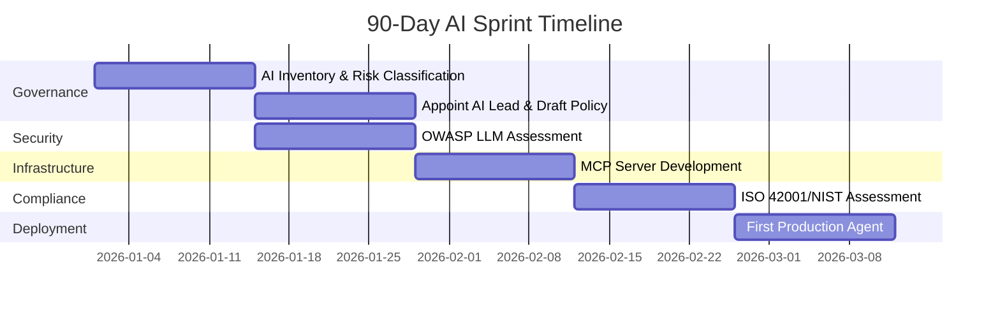

## Part C: Service Industry Adoption Playbooks

*Tailored AI journey maps for 10 service sectors — what to adopt, when, and how*

The playbooks below are structured around three horizons: **Now (2026)**, **Soon (2027–2028)**, and **Future (2029–2030)**. Each sector has different starting points, regulatory constraints, and value opportunities.

---

### C1 — Financial Services & Banking

*Highest AI maturity · Strongest ROI signals · Heaviest regulation · Most complex agent use cases*

Financial services commands **19.6% of the global AI market** — the largest single-sector share. Lloyds Banking Group's deployment of Microsoft Copilot achieved 93% daily usage among 30,000 licensed users. Investec is saving bankers up to 200 hours per year with AI sales tools. The AI-in-Finance market will reach **$190.33B by 2030** at 30.6% CAGR.

#### Priority Action Areas

1. **MCP Integration — NOW**
   Build MCP servers for: core banking systems, CRM, trading platforms, risk databases, regulatory reporting systems. Every internal system needs an MCP-compliant interface within 6 months.

2. **Multi-Agent Compliance Workflows**
   Deploy A2A-coordinated agent networks for: AML/fraud detection (one agent flags, another investigates, third escalates), regulatory reporting (BASEL IV automation), and KYC document processing.

3. **EU AI Act High-Risk Classification**
   Classify ALL AI used in credit decisions, employment, and customer-facing advice as HIGH RISK. Begin conformity assessment NOW — the December 2027 Annex III deadline is binding (and Art. 50 transparency already applies from August 2026). Document every model.

4. **ISO/IEC 42001 Certification**
   Financial regulators (FCA, SEC, FINRA, ECB) are expected to require or reference ISO 42001. Begin AIMS implementation immediately. 12-month timeline means starting Q2 2026.

5. **UCP + AP2 for B2A Commerce**
   Prepare procurement and vendor management for B2A: AI agents selecting vendors, negotiating contracts, procuring services. Build approval workflow governance using AP2 mandate architecture.

6. **Explainability for Credit AI**
   All AI used in credit or underwriting decisions must be explainable under GDPR Article 22 and EU AI Act. Deploy SHAP/LIME explainability tools integrated into model monitoring stack.

#### Key Tools to Adopt

| Category | Tools | Purpose |
|---|---|---|
| Agent Framework | LangGraph + Microsoft Semantic Kernel | Complex stateful financial workflows; Azure/M365 integration |
| Model Platform | Azure OpenAI / AWS Bedrock / Vertex AI | Enterprise-grade LLM access with data residency controls |
| Compliance AI | Norm AI, Wolters Kluwer OneSumX | Regulatory intelligence, automated compliance monitoring |
| Fraud AI | FICO Falcon, Feedzai, Featurespace | Real-time transaction fraud detection with ML + LLM reasoning |
| Risk / Explainability | IBM OpenScale / Arize AI | Model monitoring, fairness testing, regulatory explainability |
| Document AI | Harvey AI, Kira Systems | Contract analysis, term sheets, regulatory documentation |
| Observability | LangSmith + Arize | Agent trace monitoring, cost tracking, hallucination detection |

---

### C2 — Healthcare & Life Sciences Services

*36.8% AI adoption CAGR · 1% fully mature · Highest regulatory complexity · Massive ROI potential*

#### Priority Action Areas

1. **Clinical Documentation — MCP First**
   Build MCP servers for: EHR systems (Epic, Cerner, Oracle Health), PACS imaging systems, lab result databases. This single integration unlocks 80% of healthcare AI value immediately.

2. **HIPAA-Compliant Agent Architecture**
   All MCP servers and A2A agent communications must encrypt PHI in transit and at rest. Implement zero-trust architecture. Use HITRUST AI Framework for certification roadmap.

3. **EU AI Act Medical Device Compliance**
   AI used in diagnostic support, treatment recommendations, or patient triage is HIGH RISK under EU AI Act AND may require CE marking as a medical device. Dual compliance pathway required.

4. **Clinical Workflow Agents — Low Risk First**
   Start with administrative AI: appointment scheduling, billing code validation, insurance pre-authorisation. These have clear ROI and lower regulatory risk than clinical decision AI.

5. **OWASP LLM Top 10 Healthcare Assessment**
   Medical AI hallucinations and incorrect outputs are patient safety issues, not just business risks. Conduct full OWASP LLM security assessment before any patient-facing AI deployment.

6. **Human-in-the-Loop Architecture — Mandatory**
   For ALL clinical decision support AI: design human review checkpoints into every workflow. Document the human oversight protocol. Required by EU AI Act AND medical device regulations.

---

### C3 — Legal & Professional Services

*Fastest growing sector · 50–80% document review time reduction · Liability requires human oversight*

#### Priority Action Areas

1. **Document AI as Foundation**
   Deploy AI document review (Harvey AI, Casetext, Thomson Reuters CoCounsel) as your first AI workload. Clear ROI: 50–80% time reduction on document review. Low regulatory risk. Fast to implement.

2. **MCP Integration with Legal Databases**
   Build MCP servers for: Westlaw/LexisNexis, document management (iManage, NetDocuments), court filing systems, contract repositories. Enables AI-powered legal research at scale.

3. **AI Liability Protocol**
   Establish firm policy: AI assists, lawyer decides and signs off. For regulated advice (legal opinions, tax positions), documented human review is legally required AND protects against EU AI Liability Directive exposure.

4. **EU AI Act — Employment AI as High Risk**
   AI used in hiring decisions, performance evaluation, or promotion at your firm is HIGH RISK. Conformity assessment required by August 2026. Implement bias testing and human oversight.

5. **Client-Facing AI with Transparency**
   If offering AI-assisted services, disclose AI involvement to clients per EU AI Act transparency requirements. Update engagement letters to reflect AI use in matter management.

6. **Value-Based Pricing Transition**
   AI-enabled efficiency forces a pricing model shift. Subscription, fixed-fee, and outcome-based billing replace hourly billing for AI-automatable work. Begin piloting alternative fee arrangements.

---

### C4 — Retail & E-Commerce

*47% agentic AI adoption (NVIDIA 2026) · UCP/AP2 critical · Personalisation at scale*

#### Priority Action Areas

1. **UCP-Ready Commerce Architecture**
   Google's Universal Commerce Protocol (co-developed with Shopify, Walmart, Target, Wayfair) will define how AI agents shop for consumers. Ensure your commerce platform exposes UCP-compliant endpoints NOW.

2. **AI Personalisation Engine**
   Deploy multi-agent recommendation systems: browsing agent (captures intent) → inventory agent (checks real-time stock) → pricing agent (dynamic pricing) → content agent (personalised merchandising copy).

3. **Conversational Commerce Agents**
   Replace linear checkout flows with conversational AI agents that understand context ("something for a summer wedding under €100") and handle complex queries, returns, and post-purchase support.

4. **Inventory & Demand Forecasting**
   Use AI agent networks coordinating sales data, weather, social trends, and supplier lead times for demand forecasting. A2A connects your forecasting agent to supplier agents automatically.

5. **AP2 for B2B Procurement**
   Your own procurement processes (restocking, supplier negotiation) are candidates for AP2-governed AI agents. Define spending mandates, configure approval workflows, and pilot autonomous restocking.

6. **EU AI Act — Chatbot Transparency**
   Chatbot and virtual assistant interactions must disclose AI nature to customers per EU AI Act transparency obligations (enforceable August 2026). Update all customer-facing AI disclosures immediately.

---

### C5 — Hospitality & Travel

*High-volume guest interactions · Revenue management AI · Experience personalisation at scale*

#### Priority Action Areas

1. **Guest Service AI Agents**
   Deploy 24/7 AI concierge agents for: pre-arrival communication, check-in/out assistance, in-stay service requests, local recommendations, complaint resolution. A2A coordinates between front desk, housekeeping, and F&B agents.

2. **Revenue Management AI**
   Multi-agent revenue optimisation: pricing agent (dynamic room rates) + inventory agent (channel management) + demand forecasting agent + competitor monitoring agent — all coordinated via A2A.

3. **Travel Booking Agent Readiness**
   Travellers will increasingly use AI agents to book. Ensure your booking APIs are accessible via MCP servers so AI agents (Google, Apple, OpenAI Travel) can discover, compare, and book your properties.

4. **Hyper-Personalisation Engine**
   Integrate guest history, preferences, dietary requirements, past feedback, and loyalty status into a unified context that AI agents access via MCP to personalise every interaction automatically.

5. **UCP Adoption for Partner Commerce**
   AI agents will book restaurants, tours, transfers, and experiences on guests' behalf. Register with UCP-compliant booking platforms to be discoverable by AI commerce agents.

6. **Staff Augmentation, Not Replacement**
   Frame AI as freeing staff from admin/logistics for genuine human hospitality moments. Invest savings in service design and staff training for complex human interactions AI cannot replicate.

---

### C6 — Telecommunications

*Highest agentic AI adoption at 48% · Network AI · Customer experience transformation*

#### Priority Action Areas

1. **Network Operations AI**
   AI agents for network monitoring, fault detection, root cause analysis, and automated remediation. A2A coordinates between network monitoring agent, ticketing agent, field dispatch agent, and customer notification agent.

2. **AI Customer Care Agents**
   Multi-agent customer care: initial query agent → technical diagnostic agent → billing query agent → escalation agent with human handoff. Use AG-UI for real-time agent interaction visibility in agent desktop.

3. **Predictive Maintenance via MCP**
   Build MCP servers for: network management systems, tower monitoring systems, field service management. AI agents predict equipment failures 7–14 days before impact, automatically scheduling maintenance.

4. **5G Network Slicing AI**
   AI-managed 5G network slicing: agents dynamically allocate network resources based on real-time demand, SLA requirements, and revenue optimisation. This is Level 4 autonomous network management.

5. **Fraud Detection Agent Networks**
   Multi-agent fraud detection: call pattern analysis agent + SIM swap detection agent + roaming fraud agent + financial reconciliation agent — all coordinated via A2A with real-time blocking capability.

6. **EU AI Act Network AI Classification**
   AI systems managing critical communications infrastructure may be HIGH RISK under EU AI Act. Review network automation AI against Article 6/Annex III criteria and prepare conformity assessments.

---

### C7 — Insurance

*Claims automation · Underwriting AI · Fraud detection · EU AI Act high-risk exposure*

#### Priority Action Areas

1. **Claims Processing AI — Priority 1**
   End-to-end claims agent network: intake agent (processes FNOL) → damage assessment agent (interprets photos/documents via multimodal AI) → fraud scoring agent → payment authorisation agent (AP2-governed).

2. **AI Underwriting with Explainability**
   AI underwriting risk assessment must be explainable under GDPR and EU AI Act. All underwriting AI decisions must document: inputs used, factors weighted, human review performed. Deploy explainability tools.

3. **EU AI Act — Life & Health Insurance is HIGH RISK**
   AI used in life/health insurance decisions (coverage, pricing) is HIGH RISK under EU AI Act. Full conformity assessment, documentation, and CE marking may be required. Begin assessment immediately.

4. **Telematics & IoT Agent Integration**
   Connect IoT data (driving telematics, smart home sensors, health wearables) to AI agents via MCP. AI agents update risk profiles in real time and trigger proactive customer engagement.

5. **Fraud Detection Multi-Agent System**
   Specialised fraud agents: claims fraud agent + application fraud agent + identity fraud agent + recoveries coordination agent — coordinated via A2A with shared fraud intelligence context.

6. **Parametric Insurance AI**
   AI agents that automatically trigger parametric payouts based on verified external events (weather data, IoT sensors, market indices) without claims adjusters — MCP connects agents to data sources.

---

### C8 — Consulting & Business Services

*71% GenAI adoption · Knowledge delivery at scale · New AI-native service models emerging*

#### Priority Action Areas

1. **AI Research Engine**
   Build firm-wide MCP-connected knowledge agent: ingests all reports, engagement data, thought leadership, and client intelligence. Provides consultants with AI-powered research acceleration and pattern identification.

2. **Proposal & Deliverable AI**
   AI agents for proposal generation (personalised from client context via MCP), presentation drafting (sector-specific insights), and report writing (analysis + visualisation). Start with internal use; expand to client-visible.

3. **Client-Facing AI Products**
   Transform consulting deliverables into AI products: strategy analysis tools, market intelligence agents, operational benchmarking agents that clients access as SaaS — new revenue streams at 10× lower delivery cost.

4. **ISO 42001 as Client Credential**
   Professional services clients will increasingly require ISO 42001 certification from AI-using partners. Early certification creates a competitive moat. Begin implementation Q2 2026.

5. **Pricing Model Transformation**
   AI-driven efficiency must be reflected in pricing. Shift from time-and-materials to: value-based fees, subscription retainers, outcome-linked pricing. AI savings + human insight = value-based premium.

6. **AI Talent Strategy**
   Hire: AI Strategists, Prompt Engineers, Agent Orchestration Architects, AI Ethics Leads. Retrain: senior consultants as AI-augmented advisors.

---

### C9 — Education Services

*$150B+ AI EdTech market · Personalised learning at scale · Governance and equity challenges*

#### Priority Action Areas

1. **Adaptive Learning Platform Integration**
   Deploy MCP servers connecting to: LMS (Canvas, Moodle, Blackboard), student information systems, assessment platforms. AI tutoring agents access real-time student progress to personalise instruction.

2. **AI Tutoring Agent Deployment**
   Implement 24/7 AI tutoring for high-volume, repeatable needs (maths, language learning, coding). Use multi-agent system: subject tutor agent + learning style adaptation agent + parent notification agent.

3. **Administrative AI First**
   Immediate wins with lower risk: enrolment processing, scheduling optimisation, financial aid processing, student enquiry handling. Clear ROI and no academic governance approval required.

4. **EU AI Act — Education AI is HIGH RISK**
   AI used to assess educational outcomes, academic performance, or access to educational programmes is explicitly HIGH RISK under EU AI Act Annex III. Begin conformity assessment immediately.

5. **Academic Integrity Policy**
   Establish clear policies on AI use in assignments, assessment, and research. Implement AI detection tools (with human review — false positives are a significant risk). Redesign assessments for AI-native learning.

6. **Digital Equity Framework**
   Ensure AI educational tools are accessible to students with disabilities, non-native speakers, and those with limited device access. AI equity is a governance requirement AND a mission imperative.

---

### C10 — Government & Public Sector

*AI sovereignty priority · Citizen services AI · High-risk AI everywhere · Procurement requirements*

#### Priority Action Areas

1. **AI Sovereignty Architecture**
   Government AI must use sovereign or private cloud deployments for sensitive data. Build MCP servers for: citizen databases, tax systems, benefits platforms — with strict data residency and audit logging.

2. **NIST AI RMF as Mandatory Baseline**
   US federal agencies and contractors: NIST AI RMF is effectively mandatory. EU public bodies: EU AI Act compliance is mandatory. All government AI deployments require complete documentation and risk assessments.

3. **Citizen Service AI Agents**
   AI agents for: benefits eligibility assessment (with mandatory human review for decisions), enquiry handling (24/7 chatbot with full EU AI Act transparency disclosure), document processing, appointment scheduling.

4. **ALL Government AI is HIGH RISK**
   AI used in benefits administration, criminal justice, immigration, tax assessment, or public services is HIGH RISK under EU AI Act. This includes simple chatbots that influence citizen access to services.

5. **IEEE 2857-2024 for AI Procurement**
   US federal AI procurement now references IEEE 2857-2024 performance benchmarking. Include performance benchmarking requirements in all AI procurement specifications. Require vendors to demonstrate compliance.

6. **Democratic Accountability Frameworks**
   Establish parliamentary/legislative oversight mechanisms for government AI deployments. Public sector AI must be explainable to citizens and elected representatives — not just technically capable.

---

## Part D: Executive Action Plan

*Concrete steps any service organisation can take starting today — regardless of current AI maturity*

---

### D1 — The 90-Day Sprint

Regardless of industry, size, or current AI maturity, the following 90-day programme is the minimum viable response to the AI inflection point of 2026. Every day of delay increases the gap with AI-forward competitors.

| Week | Action | Owner | Output |
|---|---|---|---|
| Week 1–2 | Complete AI Inventory: document every AI system in production, development, and vendor contracts. Classify each by EU AI Act risk tier. | CTO + Legal | AI registry with risk classifications |
| Week 3–4 | OWASP LLM Top 10 assessment of all customer-facing and high-impact AI systems. Prioritise prompt injection and excessive agency risks. | CISO + Engineering | Security risk register + remediation plan |
| Week 5–6 | Appoint AI Governance Lead (dedicated role or committee chair). Draft initial AI Policy covering: acceptable use, human oversight requirements, data governance for AI. | CEO + Board | AI policy v1.0; governance structure |
| Week 7–8 | Begin MCP integration for top 3 internal systems that agents most need to access (CRM, core business platform, knowledge base). Assign engineering team. | CTO + Engineering | 3 MCP servers in development |
| Week 9–10 | Start ISO 42001 gap analysis OR NIST AI RMF assessment. Choose primary framework based on geography and client requirements. Engage qualified assessor. | Compliance + CTO | Gap analysis report; remediation roadmap |
| Week 11–12 | Identify and deploy first production AI agent in a LOW-RISK, HIGH-VALUE workflow: document generation, internal search, scheduling automation, or draft generation. | Product + Engineering | First agent in production; ROI measurement established |

---

### D2 — The AI Maturity Scorecard

Use this scorecard to assess your organisation's current position. Score each dimension 0–100%:
- **0%** Not started · **25%** Planning · **50%** In progress · **75%** Implemented · **100%** Optimised and measured

| Dimension | Weight | Your Score |
|---|---|---|
| AI Strategy — Board-level AI vision, documented strategy, executive ownership | 10% | |
| Data Infrastructure — Clean, structured, accessible data ready for AI consumption | 15% | |
| MCP Integration — Core business systems accessible to AI agents via MCP | 15% | |
| AI Governance — ISO 42001 / NIST AI RMF in place; AI policy documented | 15% | |
| EU AI Act Compliance — Risk classification done; high-risk assessment underway | 15% | |
| Agent Deployment — Production AI agents in at least one business workflow | 10% | |
| Security Posture — OWASP LLM Top 10 assessed; MITRE ATLAS threat model done | 10% | |
| AI Literacy — 50%+ of staff trained in AI collaboration and responsible use | 5% | |
| Measurement — Concrete KPIs for AI business outcomes tracked regularly | 5% | |
| Vendor Management — AI vendor contracts include transparency, audit, and IP clauses | 5% | |

**Interpreting your score:**
- **Below 400/1000** — HIGH URGENCY: engage external AI strategy support immediately
- **400–700** — MODERATE: accelerate your roadmap
- **700+** — LEADING: focus on differentiation and scaling

---

### D3 — Common Failure Patterns & How to Avoid Them

**Agentwashing**
Labelling chatbot assistants as "AI agents". Gartner's warning is specific: over 40% of agent projects will fail by 2027. True agents plan, use tools, adapt, and execute multi-step workflows. If your "agent" just generates text in response to a prompt, it's an assistant.

**Bottom-Up AI Without Strategy**
PwC identifies this as the #1 cause of AI failure. Grassroots AI experimentation produces impressive demos but rarely transforms business outcomes. Senior leadership must pick high-value workflows, fund them properly, and measure business KPIs.

**Data Infrastructure Ignored**
68% of AI initiatives fail due to poor data quality and governance (NVIDIA). AI doesn't fix messy processes — it amplifies them. Clean, structured, accessible data must precede agent deployment, not follow it.

**Governance as Afterthought**
Deploying agents without governance, audit trails, and human oversight is a regulatory time bomb under EU AI Act. Build governance IN, not ON. Every agent needs: who deployed it, what it can do, what it cannot do, and how to override it.

**Measuring the Wrong Things**
Don't measure AI adoption (how many licences purchased) — measure AI outcomes (hours saved per person, error rate reduction, revenue attributed to AI). PwC: "Technology delivers 20% of value. Redesigning work delivers 80%."

**Ignoring Protocol Lock-In**
Building AI integrations on proprietary APIs before implementing MCP creates technical debt. MCP adoption now means you can switch underlying models without rebuilding every integration. Proprietary custom connectors are today's technical debt.

---

### D4 — Building Your AI Adoption Team

| Role | Responsibilities | Background | Priority |
|---|---|---|---|
| Chief AI Officer / AI Lead | Enterprise AI strategy, governance, board reporting, regulatory compliance oversight | Senior leader with AI literacy and business transformation experience | **CRITICAL** — hire Q1 2026 |
| AI Governance Manager | ISO 42001 / NIST RMF implementation, EU AI Act compliance, audit coordination, AI registry maintenance | Compliance or risk background with AI upskilling | **HIGH** — hire Q2 2026 |
| AI Infrastructure Engineer | MCP server development, agent orchestration platform, LLMOps tooling, observability | Senior software engineer with LangChain/LangGraph experience | **HIGH** — hire Q1 2026 |
| Prompt Engineer / AI Designer | Prompt library management, agent design, workflow automation design, AI UX | Product designer or technical writer with AI tooling experience | MEDIUM — hire Q2 2026 |
| AI Security Specialist | OWASP LLM assessments, MITRE ATLAS threat modelling, MCP/A2A security review, red-teaming AI | Security engineer with AI/ML security exposure | **HIGH** — hire Q2 2026 |
| AI Fluency Champions | Internal AI adoption champions across business units, AI training facilitation, use case identification | High-performing individual contributors in each department | **HIGH** — identify internally Q1 2026 |
| Data Governance Lead | Data quality for AI, data lineage tracking, consent management for AI training, GDPR AI compliance | Data engineer or data analyst with governance experience | **CRITICAL** — hire Q1 2026 or elevate existing |

---

**Previous:** [Part A & B — Protocol Stack & Compliance Frameworks](pathname:///archon/protocols/16-ai-protocols-standards-service-industry-guide-2026.md)
