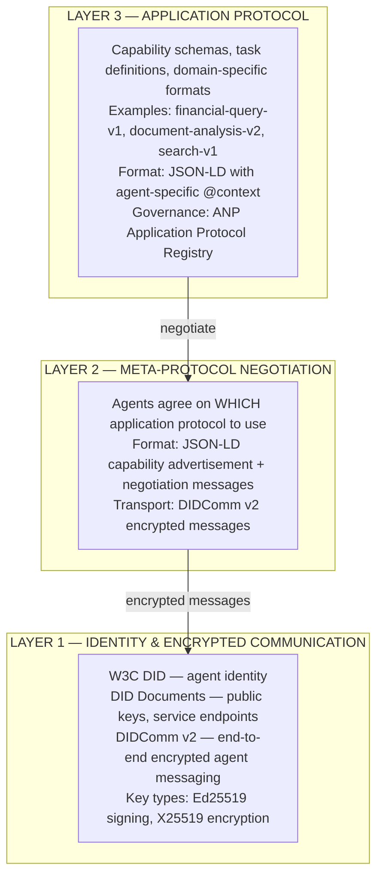
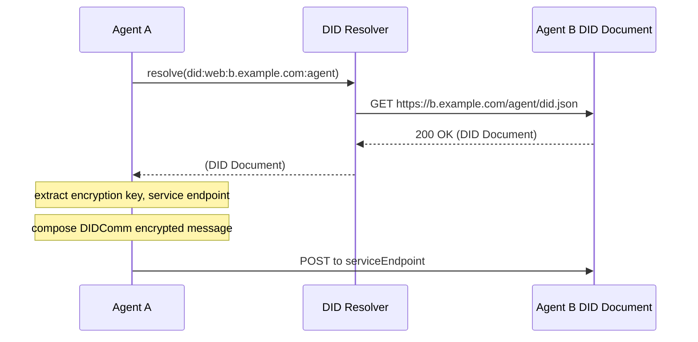
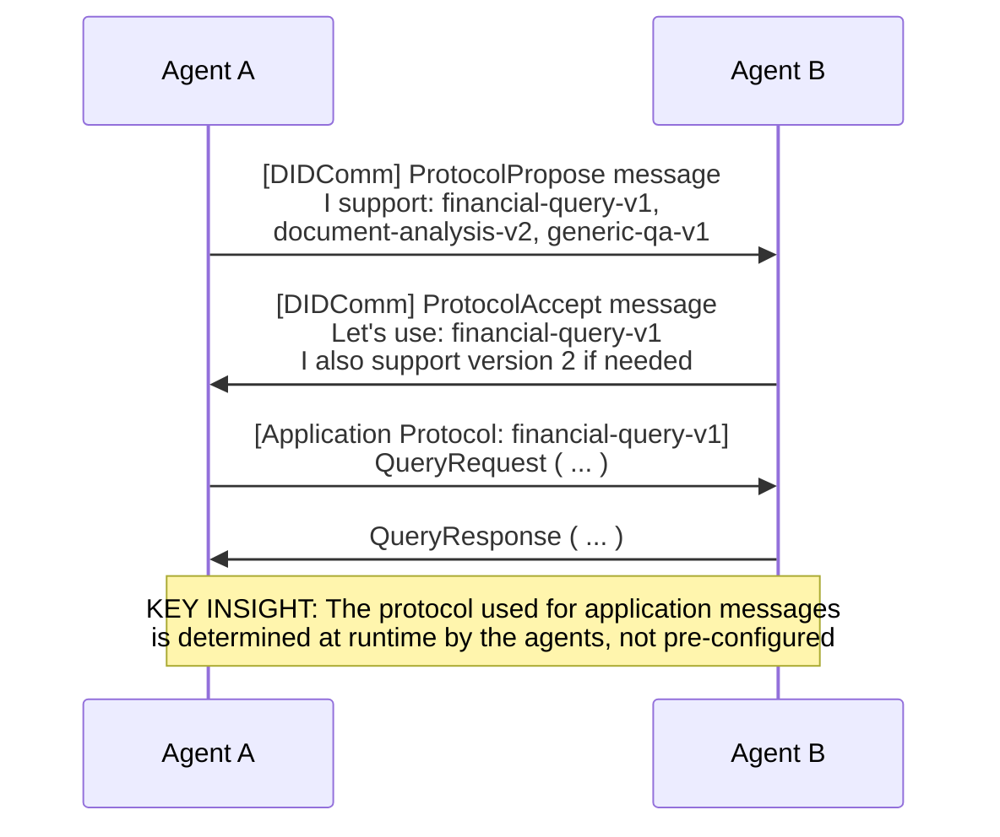
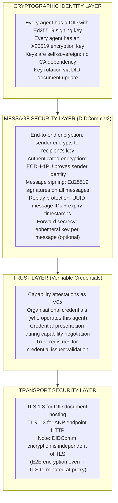
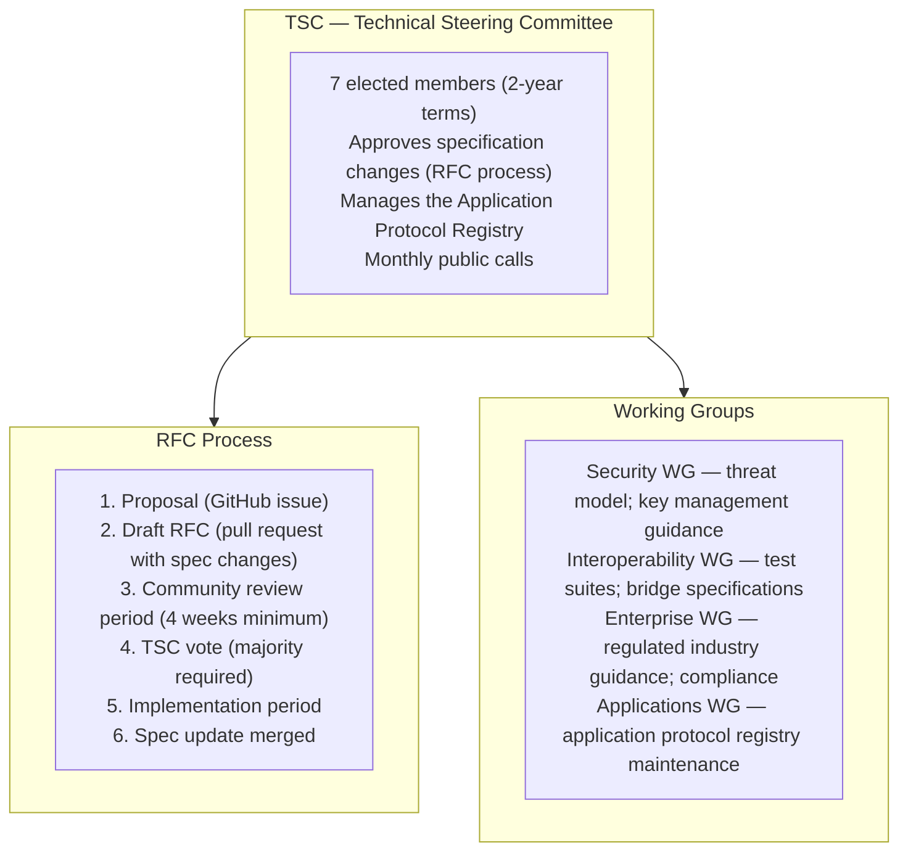
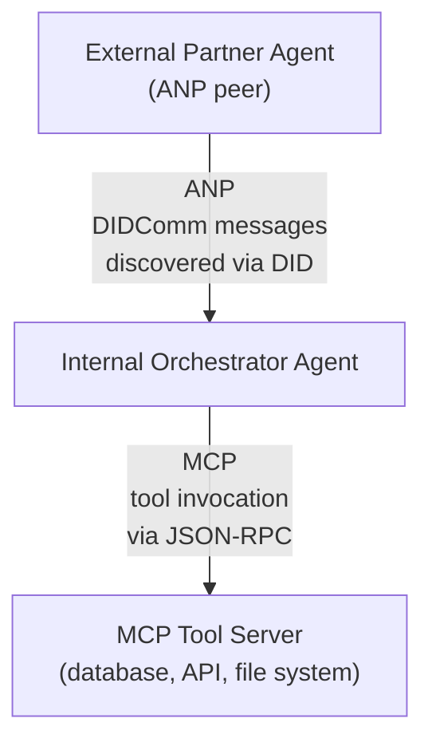
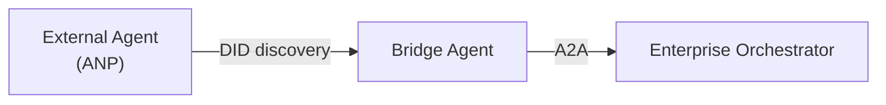
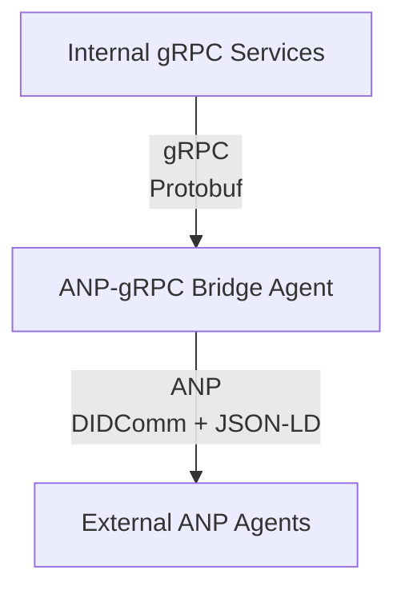

# ANP Protocol Architecture &amp; Governance — Part 2

## PROTOCOL 2: ANP — Agent Network Protocol

## 1. Origin &amp; Evolution

### 1.1 Founding and Motivation

The **Agent Network Protocol (ANP)** was open-sourced in **July 2025** by a community of AI and distributed systems engineers, with initial contributions from researchers with backgrounds in W3C Decentralised Identifier (DID) standards, peer-to-peer networking, and enterprise agent deployments. The founding GitHub organisation is `agent-network-protocol` (`github.com/agent-network-protocol/agentnetworkprotocol`).

The founding motivation was explicit and ambitious: ANP's authors argued that both MCP and A2A shared a fundamental architectural assumption &mdash; **central registries and known endpoints** &mdash; that would not scale to a world of billions of autonomous agents operating across organisational, national, and jurisdictional boundaries.

The ANP whitepaper (July 2025) opens with:

&gt; *"The internet succeeded because no single organisation controlled endpoint discovery. DNS was distributed. IP routing was federated. HTTP was stateless and universal. The Agentic Web will fail if we repeat the enterprise middleware mistake of centralised agent registries. ANP is our attempt to build the DNS and HTTP of agent networks: decentralised, interoperable, and trust-minimised."*

### 1.2 Relationship to Existing Work

ANP built explicitly on:

- **W3C Decentralised Identifiers (DID) v1.0** &mdash; the identity foundation, finalised as a W3C Recommendation in July 2022
- **W3C Verifiable Credentials (VC) Data Model** &mdash; for capability attestations
- **JSON-LD 1.1** &mdash; for semantic interoperability of agent metadata
- **did:web** &mdash; the DID method used for enterprise-accessible agent identity (no blockchain required)
- **did:peer** &mdash; for peer-to-peer agent identity without public infrastructure
- **DIDComm Messaging v2** &mdash; the encrypted messaging layer built on DID key material

ANP is **not** a fork or derivative of MCP or A2A. It operates at a different layer and with different architectural assumptions. The ANP authors explicitly positioned it as a complement, not a replacement:

&gt; *"ANP answers the question MCP and A2A do not: how do agents find each other and establish trust when neither party has prior knowledge of the other's existence?"*

### 1.3 Governance Model

As of July 2026, ANP is governed as an open-source community project:

- **Repository**: `github.com/agent-network-protocol/agentnetworkprotocol`
- **Licence**: Apache 2.0
- **Governance**: Technical Steering Committee (TSC) elected from contributors; RFC process for specification changes
- **Standards body involvement**: Active engagement with W3C DID Working Group and DIF (Decentralised Identity Foundation); IETF liaison in progress
- **Specification format**: Markdown in GitHub; plans for formal W3C Community Group Note
- **Community**: ~3,200 GitHub stars (July 2026); active Discord; monthly TSC calls open to public

ANP has **not** been donated to the Linux Foundation AAIF as of July 2026. The TSC has discussed AAIF incubation but has not reached consensus &mdash; a subset of contributors prefer independence from the AAIF's hyperscaler membership structure.

### 1.4 Roadmap (July 2026)

| Milestone | Status | Target |
|---|---|---|
| Core specification v0.1 | Complete | July 2025 |
| DID-based agent identity | Complete | August 2025 |
| Meta-protocol negotiation | Complete | October 2025 |
| Application protocol registry | In progress | Q3 2026 |
| Reference implementation (Python) | Complete | September 2025 |
| Reference implementation (TypeScript) | Complete | November 2025 |
| Reference implementation (Go) | In progress | Q3 2026 |
| Enterprise deployment guide | In progress | Q3 2026 |
| IETF RFC submission | Planned | 2027 |
| W3C Community Group Note | Planned | 2027 |

### 1.5 Relationship to MCP and A2A

| Protocol | Relationship to ANP |
|---|---|
| MCP | Complementary &mdash; ANP handles discovery and identity establishment; MCP handles tool invocation after connection |
| A2A | Partially overlapping &mdash; A2A handles enterprise agent coordination with known parties; ANP handles discovery of unknown agents |
| DIDComm v2 | ANP's encrypted messaging layer; ANP adds agent-specific semantics on top |
| W3C DID | ANP's identity foundation &mdash; ANP is DID-native |

## 2. Problem Space

### 2.1 The Core Problem: Discovery Without Central Brokers

ANP addresses what its authors call the **"agent discovery cold start problem"**: how does Agent A find Agent B when:

- A and B have never interacted before
- There is no shared registry both parties trust
- A and B may be operated by different organisations in different jurisdictions
- The interaction may involve sensitive data that must not be routed through a third-party broker
- A needs to verify B's claimed capabilities and identity before sharing any data

This is fundamentally different from the problem A2A solves. A2A assumes that both agents already know each other's endpoints (or use a shared enterprise registry). ANP assumes **complete mutual ignorance** as the starting state.

### 2.2 Why Existing Protocols Were Insufficient

| Protocol | Discovery Gap |
|---|---|
| MCP | No agent-to-agent discovery; server endpoints are hardcoded by administrators |
| A2A | Agent Cards are published at known URLs; discovery requires knowing the URL or using a centralised registry |
| OAuth/OIDC | Handles user identity, not agent identity; requires pre-registered clients |
| DNS-SD / mDNS | LAN-scope only; not applicable to internet-scale agent networks |
| OpenAPI directory | Centralised (API hubs, developer portals); organisational scope |
| UDDI (legacy) | Centralised; enterprise-scope; deprecated |

None of these addressed the internet-scale, mutual-anonymous-trust scenario ANP targeted.

### 2.3 Target Users and Systems

ANP's design targets:

1. **AI marketplaces and agent ecosystems** where agents from different vendors need to discover and contract with each other without pre-registration
2. **Cross-border enterprise AI** where organisations want peer-to-peer agent connectivity without routing traffic through a shared intermediary
3. **Regulated industries** where data sovereignty concerns prevent using shared agent registries (financial services, healthcare, government)
4. **Decentralised AI applications** including agent-based DAOs, autonomous supply chain agents, and open-science research networks
5. **Future "Internet of Agents"** scenarios where AI agents act as first-class internet participants

### 2.4 Interaction Patterns

ANP supports three primary interaction patterns:

| Pattern | Description | When to Use |
|---|---|---|
| **Discovery + Negotiate** | Agent A resolves Agent B's DID, retrieves its DID document, negotiates communication protocol | First contact between unknown agents |
| **Direct Messaging** | Encrypted DIDComm message between agents with established DID-based trust | Ongoing interaction after discovery |
| **Capability Query** | Agent A queries Agent B's capability registry endpoint for specific skill availability | Before delegating a task; pre-task routing |

### 2.5 Enterprise Use Cases

| Use Case | ANP Fit | Notes |
|---|---|---|
| Cross-org agent federation (two enterprises) | High | Each org operates its own ANP-capable agents; no shared broker needed |
| AI agent marketplace (multi-vendor) | High | Agents discover each other via DID; no marketplace operator in the data path |
| Regulated cross-border data exchange | High | DID-based identity + DIDComm encryption meets data sovereignty requirements |
| Internal enterprise agent discovery | Medium | Simpler than ANP; but ANP scales if enterprise grows into federation |
| Consumer-facing agent services | Medium | did:web works but adds operational complexity vs. OAuth-based identity |
| Edge/IoT agent networks | Medium | did:peer enables local-network agent identity without internet dependency |

### 2.6 Limitations

ANP's architectural ambition creates real limitations for enterprise adoption as of July 2026:

1. **Implementation complexity**: DID infrastructure, DID document hosting, key rotation, and DIDComm encryption are non-trivial operational responsibilities compared to OAuth-based protocols
2. **Key management burden**: DID key rotation and recovery require well-defined operational procedures that most enterprise teams have not yet developed for agent identities
3. **Performance overhead**: DID resolution adds latency (network call to resolve DID document); DIDComm encryption adds CPU overhead
4. **Ecosystem immaturity**: Production-grade libraries for DIDComm v2 are available in Python, TypeScript, and Rust but lack the enterprise tooling polish of OAuth 2.0 stacks
5. **Regulatory clarity**: Regulators in financial services and healthcare have not yet issued guidance on DID-based agent identity for regulated transactions
6. **Interoperability testing**: No formal ANP interoperability test suite exists as of July 2026

## 3. Protocol Architecture

### 3.1 The Three-Layer Architecture

ANP's defining architectural feature is its **explicit three-layer stack**. Each layer is independent and substitutable:



### 3.2 Layer 1: Identity and Encrypted Communication

#### DID-Based Agent Identity

Every ANP-participating agent has a Decentralised Identifier:

```
# Example agent DID using did:web method
did:web:agents.acme.com:financial-analyst

# This DID resolves to:
GET https://agents.acme.com/financial-analyst/did.json

# DID Document returned:
{
  "@context": [
    "https://www.w3.org/ns/did/v1",
    "https://w3id.org/security/suites/ed25519-2020/v1",
    "https://w3id.org/security/suites/x25519-2020/v1"
  ],
  "id": "did:web:agents.acme.com:financial-analyst",
  "verificationMethod": [
    {
      "id": "did:web:agents.acme.com:financial-analyst#signing-key-2025",
      "type": "Ed25519VerificationKey2020",
      "controller": "did:web:agents.acme.com:financial-analyst",
      "publicKeyMultibase": "z6MkhaXgBZDvotDkL5257faiztiGiC2QtKLGpbnnEGta2doK"
    },
    {
      "id": "did:web:agents.acme.com:financial-analyst#encryption-key-2025",
      "type": "X25519KeyAgreementKey2020",
      "controller": "did:web:agents.acme.com:financial-analyst",
      "publicKeyMultibase": "z6LSbysY2xFMRpGMhb7tFTLMpeuPRaqaWM1yECx2AtzE3KCc"
    }
  ],
  "authentication": [
    "did:web:agents.acme.com:financial-analyst#signing-key-2025"
  ],
  "keyAgreement": [
    "did:web:agents.acme.com:financial-analyst#encryption-key-2025"
  ],
  "service": [
    {
      "id": "did:web:agents.acme.com:financial-analyst#anp-endpoint",
      "type": "ANPService",
      "serviceEndpoint": "https://agents.acme.com/financial-analyst/anp"
    },
    {
      "id": "did:web:agents.acme.com:financial-analyst#capabilities",
      "type": "ANPCapabilityRegistry",
      "serviceEndpoint": "https://agents.acme.com/financial-analyst/capabilities"
    }
  ]
}
```

#### DID Resolution Flow



#### DIDComm v2 Message Format

ANP uses **DIDComm Messaging v2** for all Layer 1 communication:

```json
{
  "id": "1234567890",
  "typ": "application/didcomm-plain+json",
  "type": "https://agent-network-protocol.github.io/anp/1.0/meta-protocol/negotiate",
  "from": "did:web:agents.acme.com:financial-analyst",
  "to": ["did:web:agents.partner.com:research-agent"],
  "created_time": 1720694400,
  "expires_time": 1720694700,
  "body": {
    "protocol_proposals": [
      "https://agent-network-protocol.github.io/protocols/financial-query/v1",
      "https://agent-network-protocol.github.io/protocols/generic-qa/v2"
    ]
  }
}
```

This message is then encrypted using ECDH-1PU (authenticated encryption) with Agent B's X25519 public key from its DID document, producing a JWE (JSON Web Encryption) envelope.

### 3.3 Layer 2: Meta-Protocol Negotiation

Layer 2 solves a subtle but critical problem: when two agents meet for the first time, they need to agree on **how** they will communicate &mdash; not just that they will. The meta-protocol negotiation layer handles this:



#### Negotiation Message Schema

```json
// ProtocolPropose
{
  "type": "https://anp.github.io/1.0/meta-protocol/propose",
  "body": {
    "protocols": [
      {
        "id": "https://anp.github.io/protocols/financial-query/v1",
        "required_capabilities": ["equity_analysis", "financial_data_access"],
        "priority": 1
      },
      {
        "id": "https://anp.github.io/protocols/generic-qa/v2",
        "required_capabilities": [],
        "priority": 2
      }
    ],
    "session_config": {
      "max_duration_seconds": 3600,
      "encryption": "required",
      "signing": "required"
    }
  }
}

// ProtocolAccept
{
  "type": "https://anp.github.io/1.0/meta-protocol/accept",
  "body": {
    "accepted_protocol": "https://anp.github.io/protocols/financial-query/v1",
    "session_id": "sess-7f3a9c2d",
    "negotiated_config": {
      "encryption": "ECDH-1PU+A256KW/A256CBC-HS512",
      "signing": "Ed25519"
    }
  }
}
```

### 3.4 Layer 3: Application Protocols

Layer 3 is where actual agent tasks happen. ANP defines an **Application Protocol Registry** &mdash; a community-maintained catalogue of domain-specific protocols that can be negotiated via Layer 2:

```
ANP Application Protocol Examples:
-----------------------------------

anp://protocols/financial-query/v1
  - Schema: JSON-LD with finance ontology
  - Operations: equity_analysis, bond_pricing, risk_assessment
  - Auth requirements: level-2 (requires verifiable credential)

anp://protocols/document-analysis/v2
  - Schema: JSON-LD with document ontology
  - Operations: summarise, classify, extract_entities, translate
  - Auth requirements: level-1 (DID authentication sufficient)

anp://protocols/generic-qa/v2
  - Schema: minimal text exchange
  - Operations: ask, respond, clarify
  - Auth requirements: level-1

anp://protocols/code-execution/v1
  - Schema: JSON-LD with code execution ontology
  - Operations: execute, review, explain
  - Auth requirements: level-3 (requires organisational credential)
```

### 3.5 Complete ANP Interaction Flow

```mermaid
sequenceDiagram
    participant AgentA as Initiating Agent A
    participant DID as DID Infrastructure
    participant AgentB as Target Agent B
    
    AgentA->>DID: 1. Resolve B's DID
    DID-->>AgentA: 2. DID Document (keys+endpoints)
    
    Note over AgentA: 3. Encrypt ProtocolPropose<br/>using B's X25519 key
    
    AgentA->>AgentB: 4. POST to B's ANP endpoint<br/>(DIDComm encrypted)
    Note over AgentB: 5. B decrypts msg<br/>using own key<br/>6. B evaluates<br/>proposed protos
    
    AgentB-->>AgentA: 7. ProtocolAccept<br/>(DIDComm encrypted)
    
    AgentA->>AgentB: 8. Application protocol messages<br/>(financial-query-v1)<br/>All messages: DIDComm encrypted &amp; signed
    AgentB-->>AgentA: (response)
    
    Note over AgentA,AgentB: 9. Session close or persist<br/>for subsequent interactions
```

### 3.6 Session Model

ANP supports both **stateless** (per-message) and **stateful** (session-based) interactions:

| Mode | When to Use | Implementation |
|---|---|---|
| Stateless | Single-exchange interactions; no shared state needed | No session ID; each DIDComm message is self-contained |
| Session-based | Multi-turn interactions; tool-use loops; long-running tasks | Session ID established in ProtocolAccept; referenced in all subsequent messages |

Session state was intentionally not defined at the protocol layer &mdash; stored by the application layer. This kept the ANP core protocol simple and stateless at the wire level.

### 3.7 Discovery Mechanisms

ANP supported two complementary discovery patterns:

#### DID-Based Discovery (Primary)

If Agent A knows Agent B's DID (shared out-of-band via email, business card, directory, marketplace listing), it can initiate contact directly. No central registry needed.

#### Web-Based Agent Directory (Secondary)

ANP-compatible agents could list themselves in web-accessible directories using the `AgentNetworkDirectory` service type in their DID document:

```json
// In Agent B's DID document
{
  "service": [
    {
      "id": "did:web:b.example.com:agent#directory-listing",
      "type": "AgentNetworkDirectory",
      "serviceEndpoint": "https://directory.anp-agents.org/listings/b-example-agent"
    }
  ]
}
```

Community-operated directories (opt-in) enabled keyword search and capability filtering without the directory being in the data or trust path.

### 3.8 Capability Registration

Agent B's capability registry endpoint returned a JSON-LD document:

```json
{
  "@context": [
    "https://www.w3.org/ns/did/v1",
    "https://anp.github.io/contexts/capability/v1"
  ],
  "id": "did:web:agents.acme.com:financial-analyst#capabilities",
  "capabilities": [
    {
      "id": "cap:equity-analysis",
      "protocol": "https://anp.github.io/protocols/financial-query/v1",
      "operations": ["equity_analysis", "earnings_summary"],
      "required_credential_types": ["FinancialServicesOperatorCredential"],
      "pricing": {
        "currency": "USD",
        "per_call": 0.05
      },
      "sla": {
        "p95_latency_ms": 5000,
        "availability": 0.999
      }
    }
  ]
}
```

### 3.9 Transport and Serialisation

| Dimension | Specification |
|---|---|
| Transport (Layer 1) | HTTPS (TLS 1.3 minimum for DID document hosting and ANP endpoint) |
| Envelope format | DIDComm v2 (JWE for encrypted messages, JWS for signed-only messages) |
| Application format | JSON-LD 1.1 |
| Encryption | ECDH-1PU+A256KW (authenticated encryption) or ECDH-ES+A256KW (anonymous encryption) |
| Signing | EdDSA (Ed25519) |
| DID resolution | Universal Resolver or did:web HTTP resolution |
| Key types | Ed25519 (authentication/signing), X25519 (key agreement/encryption) |
| Message IDs | UUID v4 (globally unique; replay protection) |

---

## 4. Security Architecture

### 4.1 Security Model Overview

ANP's security model is fundamentally different from ACP and A2A. Rather than bolt authentication onto an existing HTTP API, ANP builds identity and encryption into the protocol itself at Layer 1. This is both its security strength and its operational complexity.



### 4.2 Authentication

ANP provides **mutual cryptographic authentication** at the protocol layer:

| Mechanism | How It Works |
|---|---|
| **DID Authentication** | Agent A proves control of its DID by signing a challenge with its Ed25519 private key; Agent B verifies against A's public key in A's DID document |
| **ECDH-1PU Authenticated Encryption** | Encryption uses both the sender's private key and the recipient's public key; recipient can verify sender identity on decryption |
| **DID Document Integrity** | did:web documents served over TLS; HTTPS certificate binds domain to organisation; optional additional integrity hash in DID document |

This provides strong mutual authentication without any pre-shared secrets or central CA involvement.

### 4.3 Authorization and Verifiable Credentials

ANP's authorization model was based on **Verifiable Credentials (VCs)**:

```json
// Example: Verifiable Credential issued to Agent A by an organisation
{
  "@context": [
    "https://www.w3.org/2018/credentials/v1",
    "https://anp.github.io/contexts/agent-credential/v1"
  ],
  "type": ["VerifiableCredential", "FinancialServicesOperatorCredential"],
  "issuer": "did:web:regulators.acme.com:issuer",
  "issuanceDate": "2026-01-15T00:00:00Z",
  "expirationDate": "2026-12-31T23:59:59Z",
  "credentialSubject": {
    "id": "did:web:agents.acme.com:financial-analyst",
    "organisation": "ACME Financial Services Ltd",
    "authorised_operations": ["equity_analysis", "bond_pricing"],
    "regulatory_registrations": ["FCA-12345", "SEC-67890"]
  },
  "proof": {
    "type": "Ed25519Signature2020",
    "created": "2026-01-15T00:00:00Z",
    "verificationMethod": "did:web:regulators.acme.com:issuer#key-1",
    "proofPurpose": "assertionMethod",
    "proofValue": "..."
  }
}
```

Agent B would require presentation of this VC (as a Verifiable Presentation) before accepting financial query requests from Agent A.

### 4.4 Encryption Architecture

```
MESSAGE ENCRYPTION FLOW (DIDComm v2 ECDH-1PU):

1. Agent A retrieves Agent B's X25519 public key from B's DID document
2. Agent A generates an ephemeral X25519 key pair for this message
3. Agent A performs ECDH-1PU:
   - Key agreement: (A's ephemeral private) + (B's X25519 public) + (A's X25519 private)
   - Produces symmetric key K
4. Message encrypted with AES-256-GCM using K
5. JWE envelope:
   {
     "protected": "&lt;base64url(header)&gt;",
     "recipients": [{ "encrypted_key": "&lt;base64url(wrapped_key)&gt;" }],
     "iv": "&lt;base64url(nonce)&gt;",
     "ciphertext": "&lt;base64url(encrypted_payload)&gt;",
     "tag": "&lt;base64url(auth_tag)&gt;"
   }
6. Agent B decrypts using its X25519 private key
   - Verifies sender identity from A's DID key material in ECDH-1PU derivation
```

This provides **authenticated encryption**: B knows the message came from A (or someone with A's private key), without requiring a separate signature.

For non-repudiation, an additional Ed25519 signature over the message can be added &mdash; this is separate from ECDH-1PU authentication.

### 4.5 Replay Protection

ANP built replay protection into the DIDComm v2 layer:

- Every message has a UUID `id` field (globally unique)
- Every message has `created_time` and optional `expires_time` (Unix timestamps)
- Receiving agents maintain a **message ID deduplication store** (recommended: Redis with TTL matching `expires_time`)
- Messages received after `expires_time` are rejected

```
Replay protection check at Agent B:

1. Extract message.id (UUID)
2. Check dedup store: if message.id present → reject (replay)
3. Check message.expires_time: if past → reject (expired)
4. If new and valid: store message.id with TTL = expires_time - now
5. Process message
```

### 4.6 Integrity and Confidentiality

| Property | Mechanism | Strength |
|---|---|---|
| Confidentiality | ECDH-1PU AES-256-GCM (DIDComm) + TLS 1.3 (transport) | Very High &mdash; dual-layer |
| Integrity | AES-GCM authentication tag + Ed25519 signature | Very High |
| Authenticity | ECDH-1PU (sender key in derivation) | High |
| Non-repudiation | Ed25519 signature (optional; separate from ECDH-1PU) | High when enabled |
| Forward secrecy | Ephemeral key per message (optional in DIDComm) | High when enabled |
| Replay protection | UUID + expiry (DIDComm) | High |

### 4.7 Trust Establishment

ANP supports a trust spectrum from minimal to high-assurance:

```
TRUST LEVEL SPECTRUM:

Level 0 — Unauthenticated (no DID verification)
  Use case: Public information exchange; read-only queries
  Risk: Low trust; no sender identity guarantee

Level 1 — DID Authentication
  Use case: Basic agent-to-agent interaction
  Requirement: Verified DID control (ECDH-1PU authentication)
  Guarantee: Sender controls the DID's private key

Level 2 — DID + Organisational VC
  Use case: Enterprise-grade interactions
  Requirement: Level 1 + Verifiable Credential from trusted issuer
  Guarantee: Agent is operated by a known, attested organisation

Level 3 — DID + Regulatory VC + Real-time Status Check
  Use case: Regulated industry transactions
  Requirement: Level 2 + credential status check (OCSP-equivalent for VCs)
  Guarantee: Credential not revoked; current regulatory standing confirmed
```

### 4.8 Key Management

Key management is the most operationally demanding aspect of ANP deployment:

| Concern | Requirement | Recommendation |
|---|---|---|
| Key generation | Strong random; hardware security module for production | AWS CloudHSM, Azure HSM, Thales |
| Key storage | Private keys never in application memory long-term | Secrets manager (Vault, AWS Secrets Manager) |
| Key rotation | DID document update required on rotation | Automated rotation pipeline; old key retained briefly for decryption of in-flight messages |
| Key recovery | Loss of private key = loss of DID control | M-of-N key shares (Shamir Secret Sharing); recovery DID document |
| Key revocation | DID document update removes key; VCs require separate revocation | StatusList2021 (W3C) for VC revocation |
| Compromise response | Rotate DID keys immediately; notify connected agents | Automated incident playbook |

### 4.9 Threat Model

| Threat | ANP Exposure | Mitigation |
|---|---|---|
| Agent impersonation | Low &mdash; DID cryptographic authentication | Verify DID resolution over TLS; use DNSSEC for did:web |
| Message interception | Low &mdash; DIDComm E2E encryption | Defense-in-depth with TLS also |
| Replay attacks | Low &mdash; UUID + expiry | Deduplication store required (operational) |
| DID document tampering | Medium &mdash; depends on hosting integrity | HTTPS + DNSSEC + optional content hash in DID doc |
| Malicious capability advertisement | Medium &mdash; no protocol-level capability signing | Require VC attestations for sensitive capabilities |
| Key exfiltration | High impact if occurs &mdash; controls mitigate | HSM storage; rotation; access logging |
| DID resolution manipulation | Medium &mdash; DNS hijacking for did:web | DNSSEC; certificate transparency; did:peer for offline scenarios |
| Prompt injection via ANP messages | High &mdash; applies to all agent protocols | Input validation; sandbox tool execution |
| Credential forgery | Low (if VC signatures verified) | Verify VC issuer against trusted registry |
| Denial of service on DID endpoint | Medium | CDN for DID document hosting; rate limiting on ANP endpoint |
| Supply chain attack on ANP libraries | Medium | SBOM; dependency pinning; Sigstore verification |
| Quantum computing (future) | Post-quantum: Ed25519 and X25519 not quantum-safe | Monitor NIST PQC standards; plan migration path |

:::warning Critical ANP Security Requirement
Recipient agents MUST verify DID documents over DNSSEC-validated HTTPS for `did:web`. A DID document served over plain HTTP or from a host without certificate transparency logging must be treated as untrusted. The cryptographic strength of ANP's identity layer depends entirely on the integrity of DID document hosting.
:::

### 4.10 Zero Trust Compatibility

ANP is architecturally aligned with Zero Trust principles:

| Zero Trust Principle | ANP Alignment |
|---|---|
| Never trust, always verify | Every message requires cryptographic sender verification via DID |
| Least privilege | VC-based capability restrictions; per-operation authorisation |
| Assume breach | DIDComm E2E encryption: network compromise does not expose message content |
| Verify explicitly | Identity verification on every message, not just connection establishment |
| Use strong authentication | Ed25519 + ECDH-1PU; no passwords or static API keys |

### 4.11 Known Vulnerabilities and Anti-Patterns

:::warning ANP Security Anti-Patterns
1. **Skipping VC verification for "trusted" peers** &mdash; Even known agents should present VCs for operations requiring elevated trust; familiarity is not authorisation
2. **did:web without DNSSEC** &mdash; DNS hijacking can substitute a malicious DID document; DNSSEC is required in production
3. **Not rotating DID keys** &mdash; Static keys accumulate exposure risk; establish key rotation schedules (recommended: annually for long-lived agents)
4. **Accepting any VC issuer** &mdash; Specify a trusted issuer list in your trust registry; reject VCs from unknown issuers
5. **No message ID deduplication store** &mdash; Without replay protection enforcement, replayed messages can cause duplicate operations
6. **Logging decrypted message content** &mdash; DIDComm provides E2E encryption; logging the decrypted payload undermines this protection
7. **Using did:key for production agents** &mdash; did:key embeds the key in the DID itself; no rotation possible; use did:web or did:peer for production
:::

---

## 5. Governance

### 5.1 Protocol Governance

ANP's governance model as of July 2026 is community-driven with formal structure:



### 5.2 Version Governance

| Version | Status | Notes |
|---|---|---|
| 0.1 | Stable | Initial release; core identity + meta-protocol |
| 0.2 | Draft | Application protocol registry; VC integration improvements |
| 1.0 | Planned | Target: 2027; IETF RFC submission planned |
| Post-1.0 | Planned | 12-month stability guarantee per TSC policy |

**Breaking change policy**: Breaking changes require a major version increment and 6-month deprecation window with compatibility shim.

### 5.3 Application Protocol Registry Governance

The Application Protocol Registry is a community-curated catalogue of Layer 3 protocols:

| Stage | Description | Requirements |
|---|---|---|
| Proposal | Community member proposes a new application protocol | GitHub issue with schema draft |
| Review | 30-day review period; security review required | Security WG + Applications WG sign-off |
| Experimental | Listed as experimental; implementers can adopt at risk | Schema published at canonical URL |
| Stable | Interoperability tested; backwards compatibility commitment | Interop test suite + 2 independent implementations |
| Deprecated | Replaced by newer version; 12-month notice | TSC vote; migration guide required |

### 5.4 Identity Governance

Since ANP uses DIDs as the identity layer, identity governance for enterprise deployments involves:

| Concern | Enterprise Policy Recommendation |
|---|---|
| DID method selection | Use `did:web` for organisational agents; `did:peer` for ephemeral/edge agents |
| DID document hosting | Organisation-controlled infrastructure (not third-party) |
| Key custodianship | HSM-backed; dual-control for production agent keys |
| VC issuer governance | Maintain an internal VC issuer for agent credentials; governance review for new credential types |
| Trust registry | Maintain a signed list of trusted external VC issuers; review quarterly |
| Agent lifecycle | Deactivate DID document when agent is decommissioned; notify known peer agents |

### 5.5 Compliance Considerations

| Regulation | ANP Consideration |
|---|---|
| GDPR / CCPA | ANP messages may carry personal data; DIDComm encryption supports data minimisation; DID documents are public &mdash; ensure no PII in DID document |
| EU AI Act | Agent identity via DID supports auditability requirement; VC-based capability tracking supports transparency |
| Financial regulations | VC-based proof of regulatory registration; audit log of all ANP transactions required |
| HIPAA | DIDComm E2E encryption exceeds HIPAA encryption requirements for data in transit |
| SOC 2 | ANP's cryptographic audit trail supports SOC 2 logging requirements |
| FedRAMP | DID key management must meet FIPS 140-2 requirements; Ed25519 is FIPS-approved when using FIPS-validated modules |

---

## 6. Enterprise Readiness

### 6.1 Production Readiness Assessment (July 2026)

| Dimension | Rating | Notes |
|---|---|---|
| Protocol stability | Medium &mdash; v0.1 stable | Core spec stable; application protocol registry in flux |
| Reference implementations | Medium | Python, TypeScript complete; Go in progress |
| SDK maturity | Low-Medium | Libraries available; not yet enterprise-grade hardened |
| Tooling | Low | Limited observability tooling; no dedicated monitoring solutions |
| Vendor support | Low | No hyperscaler-native support; community-only as of July 2026 |
| Documentation | Medium | Core spec well-documented; operational guidance thin |
| Security tooling | Low | No dedicated ANP security scanners; manual review required |
| Community | Growing | ~3,200 stars; active; smaller than A2A/MCP communities |
| Enterprise adoption | Early | Proof-of-concept deployments; few known production deployments |

:::tip ANP Adoption Guidance for Enterprise (July 2026)
ANP is **not yet production-ready for mission-critical enterprise deployments** as of July 2026. The protocol specification is sound and the cryptographic foundations are strong, but the operational tooling, vendor support, and enterprise ecosystem have not matured. Recommended adoption posture:

- **Now**: Proof-of-concept evaluation; developer familiarisation; architecture planning for federated use cases
- **H2 2026**: Pilot deployments in non-critical cross-org scenarios; contribute to interoperability test suites
- **2027**: Re-evaluate for production use once v1.0 ships, IETF RFC is in progress, and enterprise tooling has matured
:::

### 6.2 Scalability

ANP's scalability profile is distinct from ACP/A2A:

| Component | Scalability Approach |
|---|---|
| DID document hosting | CDN-cacheable (static JSON); effectively unlimited scale |
| DID resolution | Can be cached; universal resolver can be self-hosted; high availability |
| ANP message processing | Stateless at protocol layer; application layer holds state; horizontal scaling |
| VC verification | Online status checks (StatusList2021) can be cached; bounded latency |
| DIDComm encryption | CPU-bound but parallelisable; hardware acceleration (AES-NI) available |

**Latency impact**: DID resolution adds 50–200ms for first contact (cache miss). Subsequent interactions with cached DID documents add &lt; 5ms. DIDComm encryption/decryption adds ~2–10ms CPU overhead per message.

### 6.3 High Availability and Disaster Recovery

| Component | HA Approach | DR Approach |
|---|---|---|
| DID document hosting | Multi-region CDN | Geographic redundancy; automated failover |
| ANP agent endpoint | Load balanced; health checks | Active-active multi-region; or active-passive with DNS failover |
| Agent private keys | Replicated in HSM cluster | Cross-region HSM replication; or key shards in separate regions |
| Message ID dedup store | Redis Cluster | Redis Sentinel or cross-region replication |

:::warning Key Material in DR Scenarios
Disaster recovery for ANP agents requires careful handling of private key material. Key shards should be stored in geographically distributed HSMs with appropriate access controls. Never replicate unencrypted private keys to DR sites via general-purpose storage systems.
:::

### 6.4 Air-Gapped and Hybrid Deployment

ANP can operate in air-gapped environments with modifications:

| Scenario | Approach | Limitation |
|---|---|---|
| Fully air-gapped | Use `did:peer` (no external DID resolution) + local VC issuer | Cannot federate with external agents |
| Hybrid (internal + external) | `did:web` for external-facing agents; `did:peer` for internal | DID document hosting must be reachable from internet for external federation |
| Private cloud | Self-hosted universal resolver; internal DID registry | Operational overhead of maintaining resolver infrastructure |

### 6.5 Regulated Industry Suitability

| Industry | Suitability | Key Gaps |
|---|---|---|
| Financial services | Medium (emerging) | Regulatory recognition of DID-based identity; FCA/SEC guidance pending |
| Healthcare | Medium (emerging) | HIPAA-compliant encryption met; PHI-in-DID-message audit requirements need validation |
| Government | Low-Medium | FedRAMP certification path unclear; DID ecosystem not yet GSA-recognised |
| Legal | Medium | Chain-of-custody via DIDComm audit log; privileged data classification needs legal review |
| Retail/e-commerce | Medium-High | Lower regulatory burden; ANP well-suited for cross-org agent commerce |

### 6.6 Multi-Region Considerations

ANP's DID-based identity model introduces multi-region complexities not present in certificate-based systems:

1. **DID document replication**: did:web DID documents are hosted at a specific domain; CDN caching is the primary HA mechanism
2. **Key consistency**: Private keys and HSMs must be regionally co-located with agent processes for latency; cross-region replication of HSM access is complex
3. **Message dedup store**: Cross-region replication of the message ID store is required to prevent replay attacks on geographically distributed deployments

---

## 7. Interoperability

### 7.1 ANP ↔ MCP

ANP and MCP address fundamentally different problems but can compose in a layered architecture:



In this pattern, ANP handles the cross-organisational discovery and trust establishment; MCP handles the tool invocation within the trusted internal boundary. They do not directly interoperate but compose cleanly at the orchestrator layer.

### 7.2 ANP ↔ A2A

ANP and A2A are **architecturally complementary**:

| Dimension | ANP | A2A |
|---|---|---|
| Discovery | DID-based, decentralised | Agent Cards, semi-centralised |
| Trust establishment | Cryptographic (DID keys) | OAuth-based |
| Task model | Defined at application protocol layer | Formal Task state machine |
| Best for | Unknown parties, cross-org federation | Known parties, enterprise coordination |

**Bridging pattern**: An ANP-capable agent can expose an A2A interface at its service endpoint. External partners discover it via ANP/DID; enterprise orchestrators interact with it via A2A. The bridge is implemented at the agent's ingress layer.



### 7.3 ANP ↔ OAuth / OIDC

ANP's DID-based identity does not replace OAuth/OIDC but can interoperate via W3C DID-based JWT:

- **DID as OAuth subject**: The agent's DID can be used as the `sub` claim in OAuth JWTs, linking DID identity to OAuth authorisation flows
- **VC-as-OAuth-scope**: Verifiable Credentials can be presented to an OAuth authorisation server to obtain scoped access tokens for downstream APIs
- **DIF Presentation Exchange**: Standard format for requesting VC presentations; can be integrated into OAuth authorisation code flows

### 7.4 ANP ↔ SPIFFE / SPIRE

For workload identity within a Kubernetes cluster, SPIFFE SVIDs (X.509 certificates) and ANP DIDs serve overlapping but distinct purposes:

| Dimension | SPIFFE/SPIRE | ANP/DID |
|---|---|---|
| Scope | Intra-cluster workload identity | Cross-org agent identity |
| Trust root | SPIRE server (per cluster) | Self-sovereign (DID) |
| Rotation | Automatic (short-lived SVIDs) | Manual (DID document update) |
| Discovery | SPIFFE bundle federation | DID resolution |
| Best for | Microservice mTLS within cluster | Agent-to-agent across organisations |

**Integration pattern**: Use SPIFFE for intra-cluster mTLS + ANP DID for cross-cluster/cross-org agent identity. At the boundary, a gateway maps SPIFFE identity to DID identity for outbound ANP messages.

### 7.5 ANP ↔ OpenAPI

ANP's Layer 3 application protocols are defined in JSON-LD, not OpenAPI. However, an interoperability layer is possible:

- ANP application protocols can be documented with OpenAPI 3.x schemas as a supplementary artefact
- API gateways can translate OpenAPI REST calls to ANP DIDComm messages for mixed-mode deployments
- No official OpenAPI-to-ANP bridge exists as of July 2026; this is a gap

### 7.6 ANP ↔ gRPC / Protocol Buffers

ANP uses JSON-LD at the application layer. There is no native gRPC/Protobuf support. Integration requires a translation layer:



### 7.7 ANP ↔ Kubernetes

ANP agents deployed on Kubernetes require:

- **DID document hosting**: External-facing service (or GitHub Pages for `did:web`); or Ingress for in-cluster hosting
- **Key storage**: Kubernetes Secrets + sealed secrets, or external secrets operator pointing to Vault/HSM
- **Message dedup store**: Redis deployment (StatefulSet) or external managed Redis
- **No custom CRDs required**: ANP does not define Kubernetes-specific resources
- **Network policies**: Allow egress to external DID resolution endpoints (universal resolver); allow ingress to ANP service endpoint

### 7.8 ANP ↔ Event Buses (Kafka, AWS EventBridge)

ANP was designed for synchronous request-response and session-based messaging, not pub-sub event streaming. Integration patterns:

- **ANP as producer**: Agent receives ANP message → publishes event to Kafka topic for downstream processing
- **ANP as consumer**: Event bus triggers → local agent receives → agent initiates ANP interaction with external peer
- **Not a natural fit**: Pub-sub broadcast patterns are not well-served by ANP's peer-to-peer model; retain event buses for internal event-driven patterns, use ANP only for agent-to-agent interaction

### 7.9 ANP ↔ Service Mesh

ANP's E2E DIDComm encryption operates **below** the service mesh layer &mdash; making the relationship unique:

```
Standard service mesh mTLS:
  Agent A <--mTLS (sidecar)--> Agent B
  (TLS terminated at sidecar; payload visible to sidecar)

ANP + service mesh:
  Agent A <--DIDComm E2E--> Agent B
            (via mTLS tunnel)
  (TLS terminated at sidecar BUT DIDComm still encrypted end-to-end)
  (sidecar sees ciphertext only — cannot inspect payload)
```

This is a **significant architectural property**: ANP provides confidentiality even against sidecar-level network inspection tools. This is valuable for regulated data scenarios but means traditional service mesh observability (payload inspection for tracing, security scanning) does not work on ANP messages without explicit decryption points.

---

## Section Summary: ACP and ANP Compared

| Dimension | ACP | ANP |
|---|---|---|
| Status (July 2026) | Merged into A2A (Aug 2025); archived | Active; v0.1 stable |
| Origin | IBM BeeAI | Open source community |
| Governance | AAIF (via A2A merger) | Independent TSC; Apache 2.0 |
| Communication model | Client-server (HTTP) | Peer-to-peer (DIDComm) |
| Discovery | /agents endpoint (server-enumerated) | DID resolution (decentralised) |
| Identity | Bearer token / API key | W3C DID (cryptographic) |
| Encryption | TLS (transport) | DIDComm E2E + TLS |
| Auth | OAuth 2.0 Bearer (externalised) | ECDH-1PU authenticated encryption + Ed25519 |
| Trust model | OAuth + API gateway | Verifiable Credentials |
| Central broker needed? | No (REST endpoint) | No (DID resolution) |
| Key use case | Internal agent invocation (migrating to A2A) | Cross-org agent federation; internet-scale discovery |
| Enterprise readiness | Medium (archived; migrate to A2A) | Low-Medium (emerging; PoC phase) |
| Complexity | Low &mdash; plain HTTP REST | High &mdash; DID + DIDComm + VCs + JSON-LD |
| When to use | Existing ACP deployments being migrated to A2A | Cross-org federation without central broker |
| When NOT to use | Greenfield deployments (use A2A instead) | Simple enterprise scenarios (use A2A) |

## Key References

| Resource | URL |
|---|---|
| ACP (archived) | `github.com/i-am-bee/acp` |
| BeeAI Framework | `github.com/i-am-bee/bee-agent-framework` |
| AAIF ACP→A2A Migration Guide | `lf-agent2agent.github.io/migration/acp-to-a2a` |
| A2A Specification (AAIF) | `github.com/google-a2a/A2A` (now `lf-agent2agent`) |
| ANP Specification | `github.com/agent-network-protocol/agentnetworkprotocol` |
| W3C DID Specification | `www.w3.org/TR/did-core/` |
| DIDComm Messaging v2 | `identity.foundation/didcomm-messaging/spec/v2.0/` |
| W3C Verifiable Credentials | `www.w3.org/TR/vc-data-model/` |
| DIF — Decentralised Identity Foundation | `identity.foundation` |
| ANP Discord | `discord.gg/agentnetworkprotocol` |
| did:web method spec | `w3c-ccg.github.io/did-method-web/` |
| StatusList2021 (VC revocation) | `w3c-ccg.github.io/vc-status-list-2021/` |
| DIF Presentation Exchange | `identity.foundation/presentation-exchange/spec/v2.0.0/` |

---

**Navigation:** [Back to Part 1 — ACP Deep Dive](pathname:///archon/protocols/18-emerging-protocols-acp-anp.md)

---

&gt; **Document metadata**: Part 2 of "Emerging AI Agent Protocols Beyond MCP &amp; A2A — Enterprise Architecture, Standards, Security, and Adoption" (July 2026 edition). Section 2A: ACP &amp; ANP Deep Dives. Research current as of 2026-07-11. Protocol status subject to rapid change; verify against primary sources before implementation decisions.
