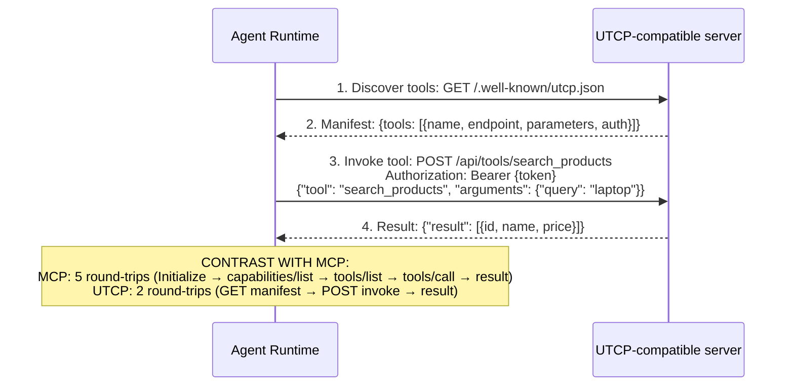

# UTCP Protocol Analysis &amp; Protocol Stack Synthesis — Part 2

## Part II: UTCP (Universal Tool Calling Protocol) — Balanced Enterprise Analysis

### 2.1 Origin and Evolution

#### Founding Context and Motivation

The Universal Tool Calling Protocol (UTCP) emerged in 2025 as a community-driven alternative to MCP for the agent-to-tool communication layer. Its founding motivation was a critique of MCP's protocol complexity — specifically the JSON-RPC 2.0 transport binding, the requirement for a persistent client-server session with a handshake lifecycle, and the perceived overhead of the MCP host/client/server three-tier architecture for simple tool invocation use cases.

UTCP's proponents argued that the dominant real-world use case — an agent calling a REST API — does not require a stateful bidirectional protocol; it requires a lightweight, stateless, discoverable function-call specification that maps cleanly to HTTP.

**GitHub:** Community project (2025), `utcp-spec` repository
**License:** Open (MIT or Apache 2.0; specification is open)
**Governance:** Community-maintained; no standards body; no foundation donation
**Status as of July 2026:** Niche — competing with MCP in the tool-calling layer; not gaining comparable adoption

:::warning Assessment Calibration
The characterization of UTCP as "not gaining adoption" should be read in relative terms. UTCP has an active community, published specification, and several open-source implementations. What it lacks is enterprise ecosystem traction — the multi-vendor SDK coverage, cloud-native integrations, and governance that MCP accumulated through 97M monthly downloads and AAIF membership. This section gives UTCP a fair architectural analysis, including the genuine technical merits of its design philosophy.
:::

#### Relationship to MCP

UTCP is a direct competitor in the same protocol layer as MCP (Layer 2 — Tool &amp; Resource Access). It addresses the same fundamental problem — how does an AI agent invoke a function with structured arguments and receive a structured result — with a different design philosophy. There is no formal relationship between UTCP and the AAIF; the MCP working group and UTCP community operate independently.

### 2.2 Problem Space

#### What UTCP Attempts to Solve

UTCP's core thesis is that MCP's JSON-RPC 2.0 transport model introduces unnecessary complexity for the most common tool invocation pattern: stateless request-response HTTP calls. The argument:

1. Most "tools" in enterprise AI deployments are existing REST APIs, not stateful servers requiring session lifecycle management
2. MCP's three-tier architecture (Host → Client → Server) adds an abstraction layer that requires framework-specific SDKs rather than standard HTTP clients
3. The MCP handshake sequence (initialize, capabilities exchange, tool listing) adds round-trips before the first tool call
4. Building a new MCP server for each existing REST API duplicates the OpenAPI spec already available for those APIs

UTCP's proposed solution: define tool calling as a thin JSON schema over HTTP POST, where tools are discovered via a manifest file, invoked via direct HTTP, and the schema is minimal enough to require no SDK — any HTTP client in any language can implement UTCP without a library.

#### Target Users

UTCP's design most appeals to:
- Developers building lightweight agentic scripts in languages without mature MCP SDKs
- Architects who want to expose existing REST APIs as agent tools without wrapping them in an MCP server
- Teams building on constrained runtimes (IoT, edge, WASM) where MCP SDK overhead is a concern
- Academic and research projects that prioritize protocol simplicity over ecosystem

### 2.3 Protocol Architecture

#### Core Design Philosophy

UTCP defines three core concepts:

```
UTCP CONCEPTUAL MODEL

Tool Manifest (discovery)
  A JSON file served at a known path (e.g., /.well-known/utcp.json)
  Describes all tools available on the server:
  - Tool name, description, parameters (JSON Schema)
  - HTTP endpoint for invocation
  - Authentication type (none, bearer, api_key, oauth2)

Tool Invocation (calling)
  HTTP POST to the tool's endpoint
  Request body: { "tool": "tool_name", "arguments": { ...typed args... } }
  Response body: { "result": &lt;any&gt;, "error": &lt;optional&gt; }

Tool Result (response)
  Synchronous JSON response
  No streaming support in base spec (streaming is protocol extension)
```

#### Architecture Diagram



#### Communication Model Comparison: UTCP vs MCP

| Dimension | UTCP | MCP |
|---|---|---|
| Transport | HTTP (stateless) | JSON-RPC 2.0 over Stdio, SSE, or HTTP (stateful session) |
| Session model | Stateless; no session | Stateful session; initialize/capabilities handshake required |
| Discovery | GET `/.well-known/utcp.json` manifest | `tools/list` RPC call after session initialization |
| Invocation | HTTP POST with JSON body | `tools/call` JSON-RPC method |
| Streaming support | Not in base spec; extension proposed | Native streaming via SSE transport; `resources/subscribe` |
| Resource access | Not defined (tools only) | First-class Resources primitive (read-only data sources) |
| Prompt templates | Not defined | First-class Prompts primitive |
| Bidirectional sampling | Not defined | Native: server can call `sampling/createMessage` to host LLM |
| SDK requirement | None (any HTTP client) | Official SDK strongly recommended; JSON-RPC lifecycle management |
| Version negotiation | Manifest version field | Protocol version negotiation in handshake |
| Metadata / capabilities | Limited to manifest fields | Rich capabilities object; extensions framework |
| State management | None (stateless) | Server can maintain session state |

### 2.4 Security Architecture

#### UTCP Security Properties and Gaps

UTCP inherits HTTP security properties directly — TLS, Bearer tokens, API keys, OAuth 2.0 — which is both a strength (standard tooling applies) and a limitation (no protocol-level security innovations beyond what any REST API provides).

| Security Concern | UTCP | MCP | Enterprise Assessment |
|---|---|---|---|
| **Transport encryption** | TLS (standard HTTP) | TLS (standard HTTP/SSE) | Equivalent — both require TLS |
| **Authentication** | Bearer, API key, OAuth 2.0 (declared in manifest) | OAuth 2.1 + PKCE mandatory (2026 RC); RFC 8707 resource indicators | MCP has stronger, more standardized auth posture; UTCP's auth declaration is advisory only |
| **Authorization** | None in spec; delegated to server | OAuth 2.1 scopes; tool-level scope enforcement | MCP has richer authorization model |
| **Message signing** | Not in spec | Not in base spec; extension pattern available | Equivalent gap |
| **Replay protection** | None in spec | None in base spec | Equivalent gap |
| **Tool poisoning** | Vulnerable (manifest can be tampered if served over HTTP) | Vulnerable (server can be compromised); AAIF security working group active | Equivalent risk; UTCP's stateless model removes some MCP-specific attack surfaces |
| **Prompt injection via results** | Same as MCP — output guardrails required | Same | Equivalent |
| **Audit trail** | None in spec | None in spec; OTel pattern available | Equivalent gap |
| **Enterprise IdP integration** | OAuth 2.0 (any standard flow) | OAuth 2.1 specifically; OBO flow documented | MCP has more enterprise-specific documentation |

:::warning UTCP Manifest Integrity Risk
UTCP's discovery mechanism — `GET /.well-known/utcp.json` — is a plain HTTP GET with no protocol-level signing or integrity verification. An attacker who can perform DNS spoofing, BGP hijacking, or a man-in-the-middle attack against the manifest endpoint can redirect an agent to a malicious tool endpoint. Always serve UTCP manifests over HTTPS with certificate pinning in high-assurance environments. Consider caching a signed copy of the manifest at agent startup and rejecting manifest changes during a run.
:::

### 2.5 Enterprise Readiness Assessment

#### Honest Enterprise Readiness Scorecard

| Criterion | Score | Detail |
|---|---|---|
| Protocol specification maturity | 2/5 | Community spec; no formal RFC; no standards body |
| SDK ecosystem | 2/5 | Community implementations; no official SDK from a major vendor |
| Cloud platform support | 1/5 | No native UTCP support in AWS, Azure, GCP, or Cloudflare (as of July 2026) |
| Enterprise tooling (monitoring, governance) | 1/5 | No enterprise-specific tooling; operators build on standard HTTP tooling |
| Governance and IP clarity | 2/5 | Open-source (MIT/Apache); no CLA; no foundation governance |
| Security audit | 0/5 | No published security audit or CVE tracking |
| Reference implementations | 2/5 | Community implementations; no enterprise reference architecture |
| Regulatory references | 0/5 | Not referenced in any regulatory guidance as of July 2026 |
| Long-term maintenance guarantee | 1/5 | Community-dependent; no commercial backer |
| Adoption trajectory | 2/5 | Stable niche community; not growing at MCP's rate |

**Overall Enterprise Readiness: Low.** UTCP is appropriate for experimental projects, research, and lightweight internal tooling where MCP's session overhead is a genuine constraint. It is not appropriate as the tool-calling standard for enterprise-scale production agent deployments in 2026.

### 2.6 Interoperability

#### UTCP and Existing Enterprise Infrastructure

UTCP's stateless HTTP model offers frictionless integration with existing infrastructure:

| Infrastructure | UTCP Integration | Notes |
|---|---|---|
| **REST API / OpenAPI** | Natural fit — UTCP is effectively a thin discovery layer over existing REST endpoints | UTCP manifest can be auto-generated from OpenAPI spec; bidirectional |
| **API Gateway** | Full compatibility — UTCP tools are standard HTTP endpoints; all gateway policies apply | JWT validation, rate limiting, WAF rules apply without modification |
| **Service mesh (Istio/Linkerd)** | Full compatibility — UTCP is standard HTTP/HTTPS | mTLS, traffic policies, circuit breakers work without changes |
| **Kubernetes** | Standard HTTP service; Kubernetes Service and Ingress routes UTCP endpoints normally | No special considerations |
| **MCP** | No direct interoperability; separate protocol layers | Bridging possible: run a UTCP adapter as an MCP server (converts MCP tools/call to UTCP POST) |
| **A2A** | No defined relationship | UTCP could be used as the tool-call mechanism within an A2A agent; A2A handles inter-agent delegation |
| **OAuth 2.1 / OIDC** | Full support via manifest auth declaration | Less prescriptive than MCP's mandatory OAuth 2.1 |
| **Event buses (Kafka)** | No native async support | UTCP is synchronous; async patterns require wrapper |
| **OpenAPI 3.x** | Strong alignment — UTCP parameter schema uses JSON Schema (subset of OpenAPI) | Tools can be generated bidirectionally with OpenAPI |

---

### 2.7 UTCP vs MCP — Enterprise Architect's Decision Guide

#### Structural Reasons for UTCP's Current Adoption Gap

To give UTCP a fair analysis, it is worth understanding the structural barriers to adoption — not just technical merits:

**1. The SDK Network Effect**

MCP reached 97M monthly SDK downloads because every major AI provider (Anthropic, OpenAI, Google, Microsoft, Amazon) ships official MCP SDKs. When a developer starts a new agent project, MCP is available in their framework by default. UTCP requires finding and evaluating a community SDK before the first line of code. This onboarding friction compounds over time into ecosystem asymmetry.

**2. Foundation Governance as Enterprise Procurement Signal**

Enterprise procurement and vendor risk teams evaluate protocols partly by governance. AAIF membership (co-founded by all six major AI vendors) signals long-term commitment, IP clarity, and defined deprecation processes. UTCP's community governance does not provide these assurances. An enterprise legal team reviewing UTCP for inclusion in a contract would lack the foundation governance artifacts that make MCP's legal risk profile manageable.

**3. Ecosystem Lock-In Through Framework Integration**

When LangGraph, CrewAI, Microsoft Agent Framework 1.0, and PydanticAI all ship first-party MCP support, switching costs for any single organization are low — MCP is the default. For UTCP to gain adoption, it would need comparable first-party integration from at least one major framework. To date, this has not occurred.

**4. The Missing Primitives Problem**

UTCP defines tool calling only. MCP defines Tools + Resources (read-only data) + Prompts (reusable templates) + Sampling (server-to-LLM). Enterprise AI deployments frequently use all four MCP primitives. An architect choosing UTCP for tool calling must then build bespoke mechanisms for resource access, prompt templates, and server-side sampling — negating the simplicity argument.

#### When Would an Architect Choose UTCP?

Despite the above, there are genuine scenarios where UTCP is the more appropriate choice:

| Scenario | UTCP Preferred? | Rationale |
|---|---|---|
| Wrapping an existing REST API quickly for agent access | Yes | UTCP manifest auto-generated from OpenAPI; no MCP server build needed |
| Constrained runtime (IoT/edge/WASM) | Yes | No SDK dependency; pure HTTP client sufficient |
| Research / academic implementation | Yes | Protocol simplicity enables faster experimentation |
| Language without an official MCP SDK | Yes | UTCP is implementable with any HTTP client; RUST, Dart, Kotlin UTCP implementations exist |
| Internal microservice tool calling, single org, no governance requirements | Maybe | Only if the simplicity benefit outweighs MCP ecosystem access |
| Production enterprise agent platform | No | Ecosystem, governance, security posture, cloud integrations all favor MCP |
| Regulated industry (banking, healthcare, insurance) | No | No audit tooling, no security posture documentation, no regulatory references |
| Multi-agent system where different agents call tools | No | MCP's session model is better suited to persistent agent-tool relationships |

#### What Would Need to Change for UTCP to Win Adoption?

A clear-eyed assessment of the conditions under which UTCP could realistically gain enterprise adoption:

```
UTCP ADOPTION PREREQUISITES (in approximate priority order)

P1: Foundation Donation
    UTCP donated to AAIF, CNCF, or Eclipse Foundation.
    Provides IP clarity, long-term governance, enterprise procurement signal.
    Estimated timeline: 12-18 months if pursued.

P2: First-Party Framework Integration
    One or more of LangGraph, Microsoft Agent Framework, CrewAI, PydanticAI
    ships first-party UTCP support alongside MCP.
    Creates parallel ecosystem path; reduces onboarding friction.
    Requires community consensus that UTCP solves a real gap.

P3: Missing Primitives Gap Closure
    UTCP spec extended to include Resources and Prompts equivalents.
    Without this, tools-only scope limits adoption to simplest use cases.

P4: Security Audit and CVE Tracking
    Third-party security audit published (equivalent to OWASP MCP Top 10).
    CVE tracking infrastructure established.
    Formal security response process defined.

P5: Cloud Native Integration
    At least one major cloud provider (AWS, Azure, GCP) ships native
    UTCP manifest support in managed agent runtime.
    (analogous to Bedrock AgentCore's MCP support)

P6: Streaming Extension Standardization
    UTCP streaming extension finalized and adopted as core spec.
    Without streaming, UTCP cannot support long-running tool invocations.

REALISTIC ASSESSMENT:
  Even if all six prerequisites were met simultaneously (unlikely),
  MCP's installed base advantage (10,000+ servers, 97M monthly downloads,
  universal framework support) would take 2-4 years to overcome.

  Most likely outcome: UTCP occupies permanent niche as preferred tool-calling
  mechanism for OpenAPI bridge scenarios (existing REST API → agent),
  constrained/edge environments, and research implementations.
  MCP remains enterprise standard for agent-tool integration.
```

#### Decision Matrix

| Dimension | MCP | UTCP |
|---|---|---|
| Protocol Layer | Tool + Resource + Prompt + Sampling | Tool only |
| Session Model | Stateful (lifecycle managed) | Stateless (HTTP request-response) |
| Discovery | tools/list RPC (post-handshake) | GET manifest JSON (pre-auth, any HTTP client) |
| Streaming | Native (SSE transport) | Not in base spec (extension only) |
| SDK Requirement | Recommended (official SDK per language) | None (any HTTP client) |
| Ecosystem Size | 10k+ public servers | Dozens community impls |
| Framework Support | Universal (all major frameworks) | None (first-party); community adapters only |
| Cloud Support | Native (AWS, Azure, GCP, Cloudflare) | None (standard HTTP only) |
| Governance | AAIF (Linux Foundation) | Community (no foundation) |
| Security Posture | Auth mandatory (OAuth 2.1); Security WG active | Advisory (declared in manifest); no formal security process |
| Regulated Industry | Suitable with controls | Not suitable (no audit tooling, regulatory refs) |
| Use When | Enterprise production; regulated industry; multi-vendor ecosystem | REST API bridging, edge/constrained, research, languages without MCP SDK |
| Avoid When | Simple REST API wrapping with no other MCP primitives needed | Production enterprise; regulated industry; multi-primitive needs; long-term platform bet |

## Synthesis: AG-UI and UTCP in the 2026 Enterprise Protocol Stack

### Where AG-UI Fits in a Mature Enterprise Architecture

AG-UI has crossed the threshold from framework-specific pattern to protocol standard. The evidence: 14 first-party framework integrations, 8 language SDKs, and cloud-native support in all three hyperscalers. It fills the Layer 4 position in the protocol stack that no other protocol addresses. For any enterprise building an agentic AI platform that surfaces agent work to human users — which is nearly every enterprise AI deployment — AG-UI is the appropriate standard.

The governance gap (no AAIF membership as of July 2026) is the primary enterprise risk. Architects in regulated industries should:

1. Document AG-UI as a technical-risk exception in the AI protocol governance register
2. Track the AAIF donation roadmap; target H1 2027
3. Implement the security hardening controls in Part 1 Section 1.4 before production deployment
4. Pin AG-UI SDK versions and maintain an internal mirror to prevent supply chain risk

### Where UTCP Fits in a Mature Enterprise Architecture

UTCP is a well-conceived alternative for a genuine design philosophy — simplicity over completeness, stateless over stateful — but it has not achieved the ecosystem momentum required for enterprise adoption at scale. Architects should monitor UTCP for two specific scenarios:

1. **OpenAPI Bridge Pattern**: When the requirement is to make an existing REST API callable by an agent without building a full MCP server, a UTCP manifest (auto-generated from OpenAPI spec) may be the lower-friction path. The caveat: validate that the target agent framework supports UTCP, or plan to build the adapter.

2. **Constrained Runtime Pattern**: For IoT, edge, or WASM agent deployments where MCP SDK dependencies are a hard constraint, UTCP's pure-HTTP-client model offers a viable alternative.

In all other scenarios, MCP is the correct choice at Layer 2, and the enterprise architect's energy is better spent on MCP tooling, governance, and security rather than evaluating UTCP as a replacement.

---

**Navigation:** [Back to Part 1 — AG-UI Architecture](pathname:///archon/protocols/19-emerging-protocols-agui-utcp.md)

---

&gt; **Document metadata**: Part 2 of "Emerging AI Agent Protocols Beyond MCP &amp; A2A — Enterprise Architecture, Standards, Security, and Adoption" (July 2026 edition). Section 2B: AG-UI &amp; UTCP Deep Dive. Research current as of 2026-07-11. Protocol status subject to rapid change; verify against primary sources before implementation decisions.
