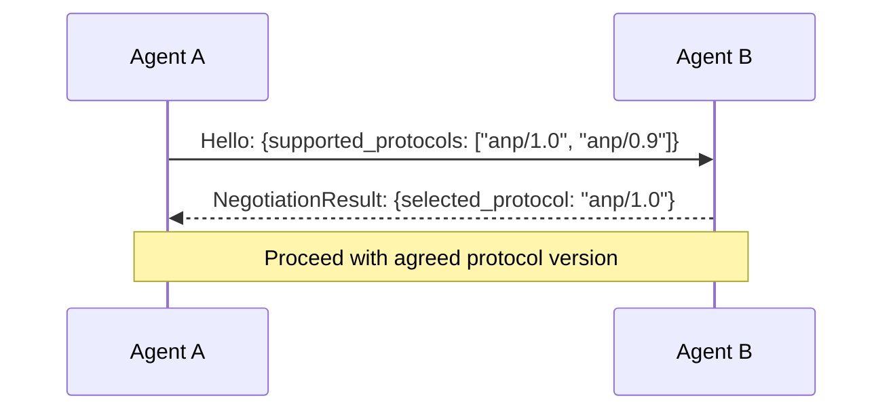
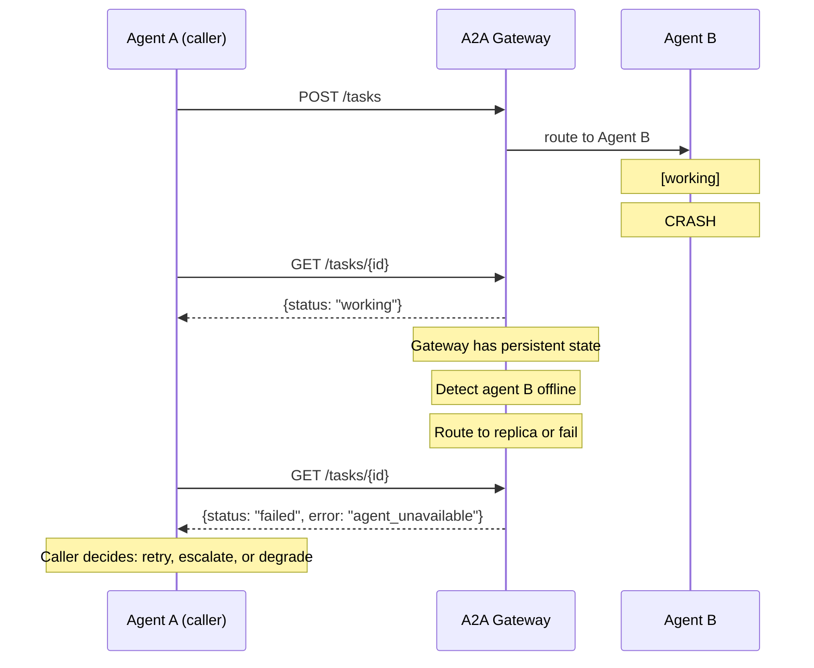
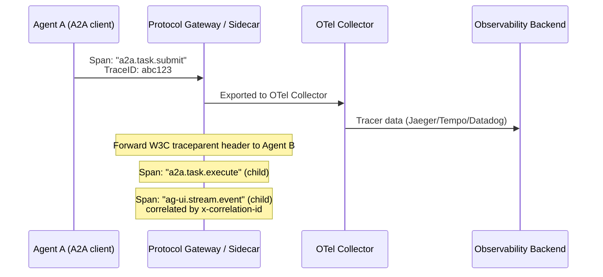
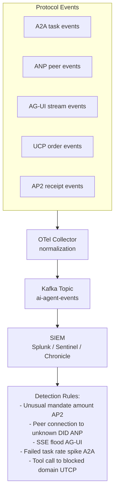
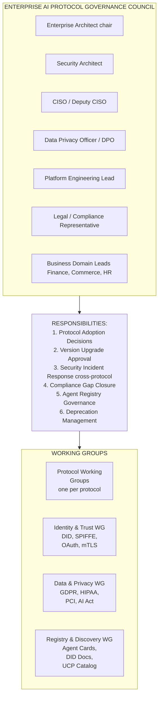
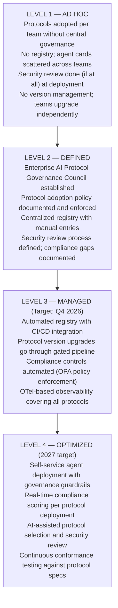

# Section 3 — Cross-Cutting Architecture (Part 2)

## Versioning, Compatibility, Failure Handling, Observability, Compliance & Governance

*Continuation from Part 1: [Cross-Cutting Architecture (Part 1) — Security, Governance, Compliance &amp; Observability](pathname:///archon/protocols/20-emerging-protocols-crosscutting.md)*

---

## 3.8 Versioning and Compatibility

### 3.8.1 Versioning Strategy Matrix

| Protocol | Protocol Versioning | API Versioning | Backward Compat Guarantee | Breaking Change Policy |
|---|---|---|---|---|
| **ACP→A2A** | Spec version in metadata; `specVersion` field | URL path versioning (`/v1/tasks`) | Yes: A2A v1.0 commits to stable core | Breaking changes require new major version + deprecation period |
| **ANP** | DID Document version + spec changelog | N/A (P2P negotiated) | Limited: community-governed | Meta-protocol handles version negotiation at runtime |
| **AG-UI** | Package version (semver) | Event type versioning (custom extension) | Limited: community spec | Additive events preferred; breaking = major version |
| **A2UI** | Explicit `version` field in payload (current: 0.9) | Not applicable | No (pre-1.0) | Pre-1.0: any change possible |
| **UCP** | OpenAPI semantic versioning | URL path (`/v1/`) | Yes (NRF commitment) | Coalition governance change control |
| **AP2** | `version` field in mandate schema | Not applicable | Limited (v0.1) | Pre-1.0: schema changes with notice |
| **NLIP** | Ecma version (standards body slow-burn) | Not applicable | Yes (Ecma process) | Ecma TC process: multi-year |
| **LMOS** | Eclipse release train | gRPC service version | Proposed (Eclipse governance) | Eclipse EMO change control |
| **UTCP** | Package semver | Tool schema version | Limited (community) | Community-governed |

### 3.8.2 Rolling Upgrade Strategies

**A2A Multi-Version Support:**

Agent Cards declare supported versions and the API gateway routes requests to the appropriate version:

```json
{
  "protocolVersion": "1.0",
  "supportedVersions": ["0.9", "1.0"]
}
```

Client agents check Agent Card before task submission:
- If both versions supported: use latest
- If only v1.0: use v1.0 client library

The API Gateway / Load Balancer routes traffic:
- `/v1/*` requests → A2A v1.0 agents (current)
- `/v2/*` requests → A2A v2.0 agents (new, Blue/Green deployment)

**ANP Meta-Protocol Version Negotiation:**



### 3.8.3 Schema Evolution Guidance

For protocols using JSON Schema (A2A, UCP, AP2):

```
SAFE SCHEMA CHANGES (backward-compatible):
  ✓ Add optional field with default value
  ✓ Widen type of existing field (string → string | null)
  ✓ Add new enum value (if consumers use unknown-value handler)
  ✓ Add new optional array element type

BREAKING SCHEMA CHANGES (require version bump):
  ✗ Remove or rename existing field
  ✗ Narrow type of existing field
  ✗ Change semantic meaning of existing field
  ✗ Make optional field required
  ✗ Remove enum value
```

---

## 3.9 Failure Handling

### 3.9.1 Failure Handling Matrix

| Protocol | Timeout Strategy | Retry Semantics | Circuit Breaker | Graceful Degradation | Offline Behavior |
|---|---|---|---|---|---|
| **A2A** | Task TTL in Agent Card; client polls until terminal state | Idempotent task submission (task ID) | Not specified; recommend gateway-level | Return cached task results; partial artifact delivery | Task state persists; can resume on reconnect |
| **ANP** | DIDComm `expires_time` per message | Mediator retry; exponential backoff | Not specified | Skip unavailable peers; retry via alternate DID service endpoint | Messages queued at mediator for offline peers |
| **AG-UI** | SSE keepalive interval; reconnect on drop | EventSource auto-reconnect; `Last-Event-ID` resume | Not specified | Show last known state; disable streaming features | Full degradation: falls back to polling or static state |
| **A2UI** | HTTP request timeout (ADK SLA) | HTTP retry with exponential backoff | ADK retry policy | Show error placeholder component | Cannot function offline (Google ADK dependency) |
| **UCP** | Per-merchant SLA timeout | Idempotency key retry | UCP gateway circuit breaker | Skip unavailable merchants; return partial catalog | Cannot function offline (catalog lookup required) |
| **AP2** | Mandate expiry (hard stop; no retry after expiry) | New mandate required for retry | Not applicable (atomic) | Fail closed: no payment if mandate expired | Cannot function offline |
| **NLIP** | Session timeout | Application-level retry | Not specified | Not specified | Not specified |
| **LMOS** | gRPC deadline propagation | gRPC retry policy (per RPC) | Proposed: resilience4j integration | Agent capability fallback (less capable agent) | Agent registry cache (TTL-based) |
| **UTCP** | Caller-defined timeout | HTTP retry | Not specified | Skip tool; return error to agent | Not specified |

### 3.9.2 Distributed Failure Patterns

**A2A Long-Running Task Failure Recovery:**



**AP2 Failure — Mandate Expiry:**

AP2's hard mandate expiry is intentional and cannot be worked around — it is a security feature, not a limitation. If a payment fails because the mandate expired:

1. Shopping agent must request a new mandate from the Credentials Provider
2. Human approval may be required above the `require_human_approval_above` threshold
3. The expired mandate's nonce is burned — no replay possible
4. A new `PaymentReceipt` will be created for the successful retry

**ANP Peer Failure — DID Unavailability:**

When DID document resolution fails, follow this process:
1. Check DID document cache (TTL-based, e.g., 1 hour)
2. If cached and not expired: use cached document
3. If expired: mark peer as temporarily unavailable
4. Log failure with DID, timestamp, resolution error
5. Retry after backoff interval (1m, 5m, 15m)
6. After 3 failures: mark peer as unreachable; alert operator

### 3.9.3 Cross-Protocol Conflict Resolution

In multi-protocol enterprise deployments, conflicts arise when protocols disagree:

| Conflict Type | Example | Resolution |
|---|---|---|
| **State divergence** | A2A task shows `completed` but AG-UI frontend still shows `working` | A2A task state is authoritative; AG-UI frontend should poll A2A task endpoint on SSE reconnect |
| **Payment mandate race** | Two agents attempt to use same AP2 mandate | Mandate `nonce` is single-use; second attempt rejected; Shopping Agent must serialize |
| **DID document stale** | ANP peer updated their DID document; old cached document used | TTL-based cache eviction; force refresh on authentication failure |
| **UCP / AP2 cart conflict** | UCP cart locked by one agent; AP2 mandate issued by another | Implement distributed lock at UCP cart level; AP2 mandate references specific cart ID |

---

## 3.10 Observability

### 3.10.1 Observability Coverage Matrix

| Protocol | Distributed Tracing | Metrics | Structured Logging | OpenTelemetry | Audit Trail | SIEM Integration |
|---|---|---|---|---|---|---|
| **A2A** | Task ID as correlation; A2A v1.0 recommends W3C Trace Context | Task state transition metrics | Task lifecycle JSON logs | Recommended (not mandated) | Task state history (immutable) | Export task events to SIEM |
| **ANP** | DIDComm message ID + thread ID | Connection metrics (proposed) | Message envelope + peer logs | Not specified | DID document access log | Limited: requires custom adapter |
| **AG-UI** | SSE event ID chaining | Stream event counts, latency | Event stream logs | Not specified | Event stream (ephemeral) | Forward SSE events to log aggregator |
| **A2UI** | ADK trace ID (GCP Cloud Trace) | GCP metrics (request latency, errors) | GCP Cloud Logging | Via GCP OpenTelemetry export | ADK audit log (GCP) | GCP → Chronicle / Splunk export |
| **UCP** | Order ID as correlation | Order success/failure rates, latency | Order lifecycle events | Not specified | Order audit trail (NRF requirement) | Order events → SIEM |
| **AP2** | Mandate ID + receipt ID | Transaction counts, mandate approval rates | Mandate lifecycle + receipt log | Not specified | Immutable PaymentReceipt (required) | Receipt events → SIEM (PCI requirement) |
| **NLIP** | Session ID | Not specified | Session logs | Not specified | Session transcript | Not specified |
| **LMOS** | W3C Trace Context (proposed) | Prometheus metrics (proposed) | Structured JSON (proposed) | Proposed: OTel SDK | Agent capability invocation log | Proposed: OTel → SIEM |
| **UTCP** | Caller-provided correlation ID | Tool call counts, latency | Tool invocation logs | Via caller instrumentation | Not specified | Via caller agent |

### 3.10.2 OpenTelemetry Integration Architecture

For enterprises instrumenting a multi-protocol agent stack, OpenTelemetry (https://opentelemetry.io) provides the unified observability layer:



OTel Semantic Conventions for AI Agents (contrib):
- `gen_ai.system` = "a2a" | "ag-ui" | "anp" | ...
- `gen_ai.request.model` = "claude-3-5-sonnet" (if applicable)
- `gen_ai.agent.id` = "did:web:enterprise.com:agents:billing"
- `gen_ai.task.id` = "task-uuid"
- `gen_ai.task.status` = "submitted" | "working" | "completed" | "failed"
- `gen_ai.protocol.version` = "1.0"

### 3.10.3 Audit Trail Requirements by Protocol

| Protocol | Audit Requirement | Minimum Retention | Regulatory Driver |
|---|---|---|---|
| **A2A** | Task create/update/complete events with principal | 90 days (enterprise policy) | SOC 2, ISO 27001 |
| **ANP** | Peer connection events; DID resolution logs | 30 days | ISO 27001 |
| **AG-UI** | Stream session open/close; human interrupt events | 30 days | SOC 2 |
| **A2UI** | Component render events; button action submissions | 90 days | SOC 2 |
| **UCP** | Full order lifecycle: browse → cart → checkout → confirm | 7 years | PCI DSS, consumer protection law |
| **AP2** | PaymentMandate creation + all signatures + PaymentReceipt | 7 years | PCI DSS, SOX, GDPR |
| **NLIP** | Session transcript (NL messages) | 30 days | GDPR (right to explanation) |
| **LMOS** | Agent capability invocations; capability delegation events | 90 days | SOC 2, EU AI Act |
| **UTCP** | Tool invocation log: tool name, args (redacted), result code | 90 days | SOC 2, OWASP LLM |

### 3.10.4 SIEM Integration Patterns



---

## 3.11 Compliance Matrix

### 3.11.1 Framework Reference Map

This section evaluates all 9 protocols against 12 compliance frameworks and standards. The evaluation reflects the state of each protocol's specification as of July 2026.

**Readiness Scale:**

- `STRONG` — Protocol specification explicitly addresses this framework's requirements
- `PARTIAL` — Some requirements are addressed; gaps require enterprise overlay controls
- `WEAK` — Framework requirements are not addressed in the protocol spec; significant implementation work required
- `N/A` — Framework is not applicable to this protocol's use case
- `[PCI]` — Special PCI DSS focus (AP2 and UCP)

### 3.11.2 OWASP Top 10 for LLM Applications

(Reference: https://owasp.org/www-project-top-10-for-large-language-model-applications/)

| OWASP LLM Risk | ACP/A2A | ANP | AG-UI | A2UI | UCP | AP2 | NLIP | LMOS | UTCP |
|---|---|---|---|---|---|---|---|---|---|
| **LLM01: Prompt Injection** | PARTIAL | PARTIAL | WEAK | PARTIAL | PARTIAL | STRONG* | WEAK | PARTIAL | WEAK |
| **LLM02: Insecure Output Handling** | PARTIAL | PARTIAL | WEAK | STRONG* | PARTIAL | PARTIAL | WEAK | PARTIAL | WEAK |
| **LLM03: Training Data Poisoning** | N/A | N/A | N/A | N/A | N/A | N/A | N/A | N/A | N/A |
| **LLM04: Model DoS** | PARTIAL | PARTIAL | PARTIAL | PARTIAL | PARTIAL | N/A | WEAK | PARTIAL | WEAK |
| **LLM05: Supply Chain** | PARTIAL | STRONG | WEAK | PARTIAL | PARTIAL | PARTIAL | WEAK | PARTIAL | WEAK |
| **LLM06: Sensitive Information** | PARTIAL | STRONG | WEAK | PARTIAL | PARTIAL | STRONG | WEAK | PARTIAL | WEAK |
| **LLM07: Insecure Plugin Design** | PARTIAL | N/A | WEAK | WEAK | N/A | N/A | WEAK | PARTIAL | WEAK |
| **LLM08: Excessive Agency** | PARTIAL | PARTIAL | WEAK | WEAK | PARTIAL | STRONG* | WEAK | PARTIAL | WEAK |
| **LLM09: Overreliance** | N/A | N/A | N/A | N/A | N/A | N/A | N/A | N/A | N/A |
| **LLM10: Model Theft** | N/A | N/A | N/A | N/A | N/A | N/A | N/A | N/A | N/A |

*AP2 STRONG for LLM01 (Prompt Injection) — PaymentMandate pre-commits agent to specific transaction scope before any LLM inference, preventing post-inference injection from changing financial intent. A2UI STRONG for LLM02 — Safe component primitive allowlist prevents malicious output rendering.

### 3.11.3 NIST AI Risk Management Framework

(Reference: https://www.nist.gov/system/files/documents/2023/01/26/AI_RMF_1.0.pdf)

| NIST AI RMF Function | ACP/A2A | ANP | AG-UI | A2UI | UCP | AP2 | NLIP | LMOS | UTCP |
|---|---|---|---|---|---|---|---|---|---|
| **GOVERN** (policies, roles, accountability) | PARTIAL | WEAK | WEAK | PARTIAL | PARTIAL | PARTIAL | WEAK | PARTIAL | WEAK |
| **MAP** (risk identification, categorization) | PARTIAL | WEAK | WEAK | PARTIAL | PARTIAL | STRONG | WEAK | PARTIAL | WEAK |
| **MEASURE** (risk analysis, metrics) | PARTIAL | WEAK | WEAK | PARTIAL | PARTIAL | STRONG | WEAK | PARTIAL | WEAK |
| **MANAGE** (risk treatment, response) | PARTIAL | PARTIAL | WEAK | PARTIAL | PARTIAL | STRONG | WEAK | PARTIAL | WEAK |

*No protocol in this survey achieves STRONG across all four NIST AI RMF functions. AP2 scores highest due to its explicit risk management through the mandate/guardrail model. Enterprise overlay governance is required for all protocols.*

### 3.11.4 Full Compliance Readiness Matrix

| Compliance Framework | ACP/A2A | ANP | AG-UI | A2UI | UCP | AP2 | NLIP | LMOS | UTCP |
|---|---|---|---|---|---|---|---|---|---|
| **OWASP LLM Top 10** | PARTIAL | PARTIAL | WEAK | PARTIAL | PARTIAL | STRONG | WEAK | PARTIAL | WEAK |
| **NIST AI RMF** | PARTIAL | WEAK | WEAK | PARTIAL | PARTIAL | STRONG | WEAK | PARTIAL | WEAK |
| **CSA AI Controls Matrix** | PARTIAL | PARTIAL | WEAK | PARTIAL | PARTIAL | PARTIAL | WEAK | PARTIAL | WEAK |
| **OpenSSF Supply Chain** | PARTIAL | STRONG | WEAK | PARTIAL | PARTIAL | PARTIAL | WEAK | PARTIAL | WEAK |
| **CNCF Cloud-Native** | PARTIAL | PARTIAL | WEAK | PARTIAL | PARTIAL | PARTIAL | WEAK | STRONG | WEAK |
| **ISO/IEC 27001** | PARTIAL | PARTIAL | WEAK | PARTIAL | PARTIAL | STRONG | WEAK | PARTIAL | WEAK |
| **ISO/IEC 42001 (AI MGMT)** | PARTIAL | WEAK | WEAK | PARTIAL | PARTIAL | PARTIAL | PARTIAL | PARTIAL | WEAK |
| **SOC 2 Type II** | PARTIAL | PARTIAL | WEAK | PARTIAL | PARTIAL | STRONG | WEAK | PARTIAL | WEAK |
| **PCI DSS v4.0** | N/A | N/A | N/A | N/A | PARTIAL | STRONG | N/A | N/A | N/A |
| **HIPAA** | PARTIAL | PARTIAL | WEAK | PARTIAL | N/A | N/A | WEAK | PARTIAL | WEAK |
| **GDPR** | PARTIAL | PARTIAL | WEAK | PARTIAL | PARTIAL | STRONG | PARTIAL | PARTIAL | WEAK |
| **DORA (EU)** | PARTIAL | WEAK | WEAK | PARTIAL | PARTIAL | PARTIAL | WEAK | PARTIAL | WEAK |
| **EU AI Act** | PARTIAL | WEAK | WEAK | PARTIAL | PARTIAL | STRONG | WEAK | PARTIAL | WEAK |

### 3.11.5 Framework-Specific Notes

**PCI DSS v4.0 — UCP and AP2 (Critical)**

UCP and AP2 are the only protocols in this survey that touch financial transaction data. PCI DSS v4.0 requirements apply to both:

| PCI DSS Requirement | UCP Relevance | AP2 Relevance |
|---|---|---|
| Req 1-2: Network Security | Cart/order data in transit; isolate UCP segment | Mandate chain over TLS; isolate AP2 endpoints |
| Req 3: Data Protection | Cardholder data must not appear in UCP order payload (tokenize) | Payment credentials in Credentials Provider only; not in mandate JSON |
| Req 6: Secure Development | NRF merchant certification process addresses this | AP2 mandate schema validation; Google security review |
| Req 7-8: Access Control | Merchant OAuth scopes; buyer identity | Mandate principal hierarchy enforces least privilege |
| Req 10: Logging | Order audit trail (7-year retention) | Immutable PaymentReceipt (7-year retention) |
| Req 12: Security Policy | NRF coalition governance | AP2 mandate governance |

:::warning PCI DSS Scoping
Any system that processes, stores, or transmits cardholder data via UCP or AP2 is in PCI DSS scope. If UCP order payloads or AP2 mandate signing infrastructure touch cardholder data, engage a Qualified Security Assessor (QSA) before production deployment. Tokenize all payment credentials — they must never appear in UCP catalog queries, cart JSON, or AP2 mandate documents.
:::

**GDPR — Cross-Protocol**

| GDPR Principle | Protocol Impact | Enterprise Control Required |
|---|---|---|
| Data Minimization | NLIP NL transcripts may contain PII; AG-UI streams may log PII | Implement PII scrubbing at OTel collector |
| Purpose Limitation | A2A task artifacts may contain personal data beyond original purpose | Scope task artifacts; implement data flow documentation |
| Right to Erasure | AP2 PaymentReceipt is immutable — tension with right to erasure | Pseudonymize personal data in receipts; store raw PII in erasable store |
| Data Portability | UCP order history; A2A task history | Implement data export API for end-user requests |
| Lawful Basis | ANP peer-to-peer connections may transfer personal data across borders | Document lawful basis per data flow; use SCCs for cross-border ANP connections |

**EU AI Act — Cross-Protocol**

The EU AI Act (effective August 2026 for prohibited AI) classifies AI systems by risk level. Protocol-layer implications:

| Risk Class | Protocol Usage Scenario | AI Act Obligation |
|---|---|---|
| **Prohibited** | Social scoring via NLIP (NL agent tracking behavior) | Must not implement |
| **High Risk** | AP2 autonomous payment decisions; UCP autonomous procurement above thresholds | Conformity assessment; human oversight; logging requirement |
| **Limited Risk** | AG-UI chatbot interactions (transparency obligation) | Disclose AI nature to users |
| **Minimal Risk** | A2A agent delegation for internal workflows | No specific obligation |

:::tip EU AI Act Implementation
For AP2 deployments: the `require_human_approval_above` field in the IntentMandate is the mechanism to implement the EU AI Act's human oversight requirement for high-risk autonomous financial decisions. Set this threshold to match your regulatory classification. Document this in your AI system technical documentation per Article 11.
:::

**DORA (EU Digital Operational Resilience Act)**

DORA (effective January 2025) applies to financial entities in the EU using ICT services. For enterprises using UCP and AP2 in financial contexts:

| DORA Pillar | AP2/UCP Requirement |
|---|---|
| ICT Risk Management | AP2 mandate expiry and circuit breaker patterns are DORA-aligned; document RTO/RPO for payment flows |
| Incident Reporting | Payment processing failures via AP2 must be reported within DORA timelines (major incidents: 4h initial, 72h intermediate) |
| Digital Operational Resilience Testing | Conduct TLPT (Threat-Led Penetration Testing) on AP2 mandate chain and UCP gateway annually |
| Third-Party Risk | Google as AP2/UCP provider is a "critical ICT third-party provider" under DORA — register with competent authority |
| Information Sharing | Share AP2 payment fraud intelligence via DORA information-sharing arrangements |

**ISO/IEC 42001 Mapping**

| ISO 42001 Clause | Protocol Relevance | Enterprise Action |
|---|---|---|
| 6.1: AI Risk Assessment | All protocols: identify risks per 3.1 threat model | Document AI risk register per protocol |
| 6.2: AI System Impact Assessment | High-impact protocols: AP2, UCP, A2UI | Complete AIIA for all high-impact deployments |
| 8.4: AI System Documentation | All protocols: document architecture decisions | Include protocol selection rationale in AI system docs |
| 9.1: Monitoring &amp; Measurement | All protocols: observability from §3.10 | Map OTel metrics to ISO 42001 performance indicators |
| 10.1: Nonconformity | Protocol failure patterns from §3.9 | Implement CAR (Corrective Action Request) for protocol failures |

---

## 3.12 Governance Operating Model

### 3.12.1 Protocol Governance Landscape

Understanding who governs each protocol is as critical as understanding the protocol's technical design. Governance determines: how bugs are fixed, who controls breaking changes, how security vulnerabilities are disclosed, and how long the protocol will survive.

**PROTOCOL GOVERNANCE MAP — JULY 2026**

**LINUX FOUNDATION (AAIF — Agentic AI Foundation)**
- A2A (incl. merged ACP) — GA, stable, 150+ orgs
- MCP — RC (stable July 28 2026)

**GOOGLE-LED (ecosystem governance)**
- ANP — open source, community governed
- AG-UI — community / Agno maintainer
- A2UI — Google ADK Team internal governance
- UCP — NRF coalition (Google + Shopify + retailers)
- AP2 — Google (internal → proposed coalition)

**STANDARDS BODIES**
- NLIP — Ecma International TC (formal standards process)
- ISO, NIST, W3C: provide underlying standards referenced by all

**ECLIPSE FOUNDATION**
- LMOS — Eclipse project governance

**COMMUNITY (informal governance)**
- UTCP — community maintainers; no formal governance body

### 3.12.2 Enterprise Multi-Protocol Governance Framework

When deploying multiple protocols simultaneously, enterprises need a governance layer that sits above individual protocol governance bodies:



### 3.12.3 Version Governance

Enterprises cannot absorb breaking changes from 9 protocol specifications simultaneously. A structured version governance process is required:

**PROTOCOL VERSION GOVERNANCE PROCESS**

**1. MONITOR (continuous)** - Subscribe to protocol release channels:
- AAIF mailing list (A2A, MCP)
- ANP GitHub releases
- Google ADK release notes (A2UI, UCP, AP2)
- Ecma TC newsletter (NLIP)
- Eclipse project page (LMOS)
- UTCP GitHub releases

**2. EVALUATE (on new release)** - Protocol Working Group reviews:
- Breaking change? Full governance cycle
- Security fix? Expedited review (48h target)
- New optional feature? Lightweight review
- Deprecation notice? Migration planning

**3. TEST (staging environment)** - All protocol version upgrades tested in:
- Unit: protocol SDK version bump
- Integration: cross-protocol compatibility
- Security: re-run security scan (SAST + DAST)

**4. APPROVE (governance council)** - Sign-off required for:
- Production deployment
- Agent Card version update
- Registry entry update

**5. DEPLOY (rollout)** - Blue/green or canary per protocol, rolling upgrade per §3.8.2

**6. RETIRE (old version)** - Deprecation notice to all agent consumers, 30-day migration window minimum, enforce via API gateway version routing

### 3.12.4 Identity Governance

Identity governance for multi-protocol deployments must handle four distinct identity systems simultaneously:

| Identity System | Protocols | Governance Tool | Review Cadence |
|---|---|---|---|
| **OAuth 2.1 clients** | A2A, UCP, AP2 | IdP admin (Entra ID, Okta, Ping) | Quarterly access review |
| **W3C DIDs** | ANP, LMOS | DID registry (custom or did:web DNS) | Monthly key rotation review |
| **API Keys** | UTCP, AG-UI (fallback) | Secrets manager (Vault, AWS SM, Azure KV) | 90-day rotation enforcement |
| **SPIFFE SVIDs** | LMOS | SPIRE server | Automatic (short-lived SVIDs, no manual review needed) |
| **AP2 Payment Mandates** | AP2 | AP2 mandate registry | Real-time (per-transaction governance) |

**Identity Lifecycle Automation Requirements:**

**Agent Deployment Triggers:**

1. **OAuth 2.1 Dynamic Client Registration (RFC 7591)**
   - IdP issues client_id + client_secret
   - Stored in secrets manager; injected at runtime

2. **DID Document Creation and Publication (ANP agents)**
   - Agent generates Ed25519 keypair on first boot
   - DID Document published to well-known endpoint
   - DID registered in enterprise DID registry

3. **SPIFFE SVID Issuance (LMOS agents)**
   - SPIRE agent running in Kubernetes namespace
   - SVID auto-issued to pod on scheduling
   - SVID auto-rotated every 1 hour

**Agent Decommission Triggers:**

- OAuth 2.1 client revocation (RFC 7592)
- DID Document deactivation
- SVID expiry (automatic; no action needed if SPIRE deregistered)
- Mandate revocation (AP2)

### 3.12.5 Registry Governance

Each protocol introduces a new "registry" concept. Enterprises must govern all of them:

| Registry Type | Protocol | What It Contains | Governance | Integrity Control |
|---|---|---|---|---|
| **Agent Card Registry** | A2A | Agent capability declarations | AAIF + enterprise internal | DNS + HTTPS (/.well-known/) |
| **DID Registry** | ANP, LMOS | DID documents + public keys | W3C DID method governance | Cryptographic (DID spec) |
| **NRF Merchant Registry** | UCP | Certified merchants + capabilities | NRF coalition governance | NRF certification process |
| **AP2 Principal Registry** | AP2 | Shopping agents + credential providers | Google (current) | Mandate chain signatures |
| **LMOS Agent Registry** | LMOS | IoA agent catalog + capabilities | Eclipse Foundation | Proposed: VC-signed entries |
| **Tool Registry** | UTCP | Available tools + schemas | Internal enterprise | Schema validation |

**Unified Registry Architecture (recommended):**

**Registry Entry (per agent):**
- agent_id: (UUID)
- protocols: ["a2a", "ag-ui", "utcp"]
- agent_card_url: "https://.../.well-known/agent-card.json"
- did: "did:web:enterprise.com:agents:billing"
- spiffe_id: "spiffe://enterprise.com/agent/billing"
- owner_team: "finance-engineering"
- compliance_tier: "high" (triggers PCI/GDPR controls)
- approved_versions: {"a2a": "1.0", "ag-ui": "0.8+"}
- last_reviewed: "2026-07-01"

**Registry API:**
- GET /registry/agents?protocol=a2a
- GET /registry/agents/{id}
- POST /registry/agents (requires governance approval)
- PUT /registry/agents/{id}/versions (approval required)
- DELETE /registry/agents/{id} (decommission workflow)

### 3.12.6 Metadata Governance

Metadata governance ensures that the information agents exchange (capability declarations, tool schemas, UI component definitions) is trusted, versioned, and auditable.

**SCHEMA GOVERNANCE**
- All agent capability schemas stored in internal schema registry
- Schema changes require PR review + protocol working group approval
- Schema versions pinned in agent deployments (no floating versions)
- Schema breaking changes trigger downstream agent impact analysis

**DATA CLASSIFICATION**
- All data flowing through protocols classified at source: PUBLIC, INTERNAL, CONFIDENTIAL, RESTRICTED
- AG-UI SSE streams: classify based on data types streamed
- A2A task artifacts: inherit classification from task input
- NLIP transcripts: default CONFIDENTIAL (may contain PII)
- AP2 receipts: RESTRICTED (financial data, 7-year retention)

**LINEAGE TRACKING**
- OTel TraceContext propagated across all protocol calls
- Data lineage graph: source → transformation → destination
- Per-protocol lineage capture:
  - A2A: task_id → artifact_id → downstream_task_id
  - ANP: message_id → thread_id → response_message_id
  - AG-UI: run_id → event_id → frontend_render_event_id
- Lineage data retained per compliance framework requirements

### 3.12.7 Governance Maturity Model

Enterprises should assess their multi-protocol governance maturity against this model and target Level 3 by the end of 2026:



---

## Cross-Section Summary: Protocol Maturity Assessment

The table below synthesizes all subsections of Section 3 into a single cross-cutting assessment:

| Dimension | ACP/A2A | ANP | AG-UI | A2UI | UCP | AP2 | NLIP | LMOS | UTCP |
|---|---|---|---|---|---|---|---|---|---|
| **Security Posture** | ★★★★☆ | ★★★★★ | ★★☆☆☆ | ★★★☆☆ | ★★★☆☆ | ★★★★★ | ★★☆☆☆ | ★★★☆☆ | ★★☆☆☆ |
| **Identity Model** | ★★★★☆ | ★★★★★ | ★★☆☆☆ | ★★★☆☆ | ★★★☆☆ | ★★★★☆ | ★★☆☆☆ | ★★★★☆ | ★★☆☆☆ |
| **Auth Completeness** | ★★★★☆ | ★★★★☆ | ★★☆☆☆ | ★★★☆☆ | ★★★★☆ | ★★★★★ | ★☆☆☆☆ | ★★★☆☆ | ★★☆☆☆ |
| **AuthZ Sophistication** | ★★★☆☆ | ★★★☆☆ | ★★☆☆☆ | ★★★☆☆ | ★★★☆☆ | ★★★★★ | ★☆☆☆☆ | ★★★★☆ | ★★☆☆☆ |
| **Network Compatibility** | ★★★★★ | ★★★★☆ | ★★★★★ | ★★★★★ | ★★★★★ | ★★★★★ | ★★★★☆ | ★★★☆☆ | ★★★★★ |
| **Messaging Completeness** | ★★★★★ | ★★★★☆ | ★★★★☆ | ★★★☆☆ | ★★★☆☆ | ★★★☆☆ | ★★☆☆☆ | ★★★☆☆ | ★★☆☆☆ |
| **Observability** | ★★★★☆ | ★★☆☆☆ | ★★★☆☆ | ★★★★☆ | ★★★☆☆ | ★★★★☆ | ★☆☆☆☆ | ★★★☆☆ | ★★☆☆☆ |
| **Compliance Readiness** | ★★★★☆ | ★★★☆☆ | ★★☆☆☆ | ★★★☆☆ | ★★★☆☆ | ★★★★★ | ★★☆☆☆ | ★★★☆☆ | ★★☆☆☆ |
| **Governance Maturity** | ★★★★★ | ★★★☆☆ | ★★☆☆☆ | ★★★☆☆ | ★★★★☆ | ★★★☆☆ | ★★★★☆ | ★★★☆☆ | ★★☆☆☆ |
| **Enterprise Production Ready** | ★★★★★ | ★★★☆☆ | ★★★☆☆ | ★★★☆☆ | ★★★☆☆ | ★★★☆☆ | ★★☆☆☆ | ★★☆☆☆ | ★★☆☆☆ |

**Key findings from Section 3:**

1. **A2A (incl. ACP merger) is the baseline.** It is the only protocol among the 9 with enterprise-grade governance (Linux Foundation AAIF), stable specification (v1.0), and broad multi-vendor adoption. All cross-cutting concerns discussed in this section assume A2A as the coordination backbone.

2. **AP2 has the strongest security design for autonomous action.** The PaymentMandate model represents the most complete implementation of the principle of "pre-committed, cryptographically bounded agency" — agents cannot exceed their mandate without a new cryptographic agreement. This pattern should be studied and applied beyond payments to any high-stakes autonomous action.

3. **ANP's DID-based identity is architecturally superior for cross-organizational trust.** The barrier is operational readiness, not design quality. Enterprises investing in ANP should prioritize DID document lifecycle tooling.

4. **AG-UI, NLIP, and UTCP require significant enterprise hardening.** These protocols carry weak security models, undefined observability, and no formal compliance mappings. They are not production-ready for regulated industries without substantial enterprise overlay controls.

5. **LMOS's IoA vision requires a multi-year horizon.** The Eclipse Foundation governance is solid, and the SPIFFE/OPA integration proposals are the right direction — but as of July 2026, LMOS remains a research-grade platform, not an enterprise production choice.

6. **Multi-protocol governance is the defining enterprise challenge of 2026.** No enterprise will deploy just one of these protocols. The Enterprise AI Protocol Governance Council model in §3.12 is the minimum governance structure needed to safely manage this complexity.

---

*Section 3 of 6 — Emerging AI Agent Protocols Beyond MCP &amp; A2A: Enterprise Architecture, Standards, Security, and Adoption (July 2026 Edition)*

*See also: Section 1 — Protocol Landscape Overview | Section 2 — Protocol Deep Dives | Section 4 — Enterprise Adoption Patterns | Section 5 — Reference Architectures | Section 6 — Executive Action Plan*

---

**Standards and Specifications Referenced**

| Standard | URL / Reference |
|---|---|
| W3C DID Core | https://www.w3.org/TR/did-core/ |
| W3C Verifiable Credentials v2.0 | https://www.w3.org/TR/vc-data-model-2.0/ |
| DIDComm Messaging | https://identity.foundation/didcomm-messaging/spec/ |
| OAuth 2.1 | draft-ietf-oauth-v2-1 |
| RFC 7591 — OAuth Dynamic Client Registration | https://www.rfc-editor.org/rfc/rfc7591 |
| RFC 8693 — OAuth Token Exchange | https://www.rfc-editor.org/rfc/rfc8693 |
| SPIFFE / SPIRE | https://spiffe.io |
| OpenTelemetry | https://opentelemetry.io |
| Open Policy Agent | https://www.openpolicyagent.org/ |
| OpenFGA | https://openfga.dev |
| Cedar Policy | https://cedarpolicy.com |
| OWASP LLM Top 10 | https://owasp.org/www-project-top-10-for-large-language-model-applications/ |
| NIST AI RMF 1.0 | https://www.nist.gov/system/files/documents/2023/01/26/AI_RMF_1.0.pdf |
| ISO/IEC 42001 | ISO/IEC JTC 1/SC 42 (published Dec 2023) |
| ISO/IEC 27001:2022 | ISO/IEC JTC 1/SC 27 |
| EU AI Act | Regulation (EU) 2024/1689 |
| DORA | Regulation (EU) 2022/2554 |
| PCI DSS v4.0 | https://www.pcisecuritystandards.org |
| GDPR | Regulation (EU) 2016/679 |
| CNCF Cloud Native Trail Map | https://landscape.cncf.io |

---

## Navigation

**Previous part:** [Cross-Cutting Architecture (Part 1) — Security, Governance, Compliance &amp; Observability](pathname:///archon/protocols/20-emerging-protocols-crosscutting.md)
