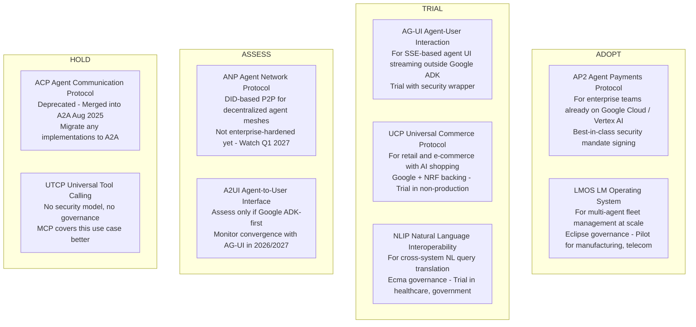
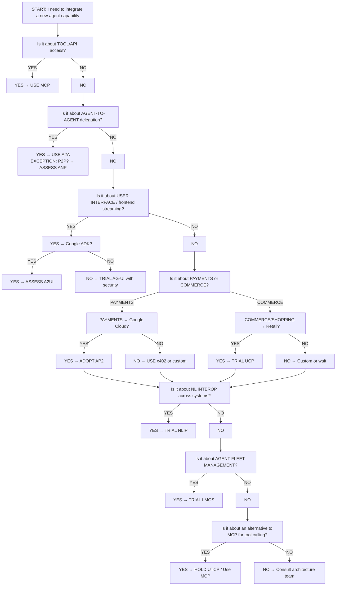
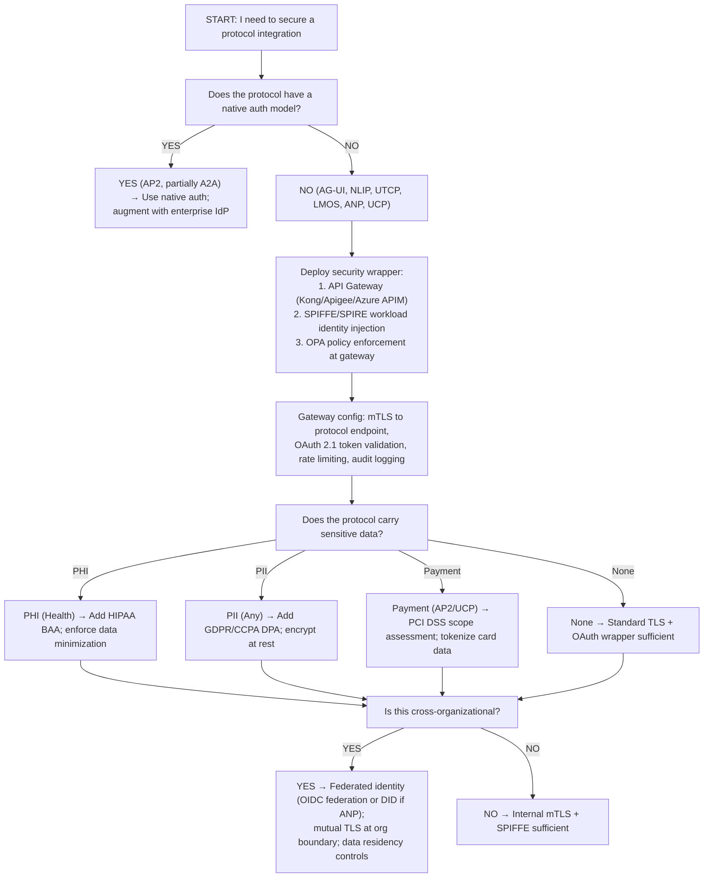
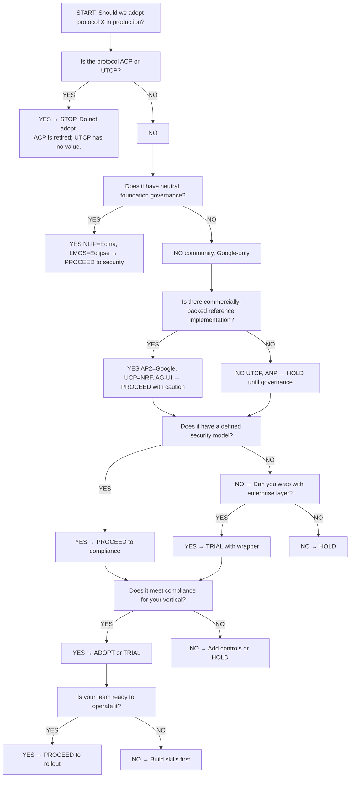

# Emerging AI Agent Protocols Overview (Part 2)

## Future Outlook, Vendor Dynamics, and Enterprise Decision Framework

*Continuation from Part 1: [Emerging AI Agent Protocols Overview (Part 1) — Executive Summary &amp; Landscape](pathname:///archon/protocols/21-emerging-protocols-overview.md)*

---

## Section 5: Future Outlook (2026–2031)

## 5.1 Likelihood of Becoming Industry Standards

| Protocol | Standardization Probability | 3-Year Horizon | 5-Year Horizon | Rationale |
|---|---|---|---|---|
| **ACP** | 0% | Archived | Archived | Merged into A2A. No independent future. |
| **ANP** | 25% | Niche (decentralized) | Possible W3C DID integration | Technically sound but lacks enterprise champion. DID ecosystem maturation is its key dependency. |
| **AG-UI** | 40% | Absorbed by AG-UI+A2A hybrid | Possibly folded into A2A spec | SSE-based frontend streaming is valuable; may be standardized as a profile of A2A rather than a standalone spec. |
| **A2UI** | 25% | Google-led open project | Possible AG-UI/A2A convergence | Apache 2.0 open project with CopilotKit contributions, but the roadmap is Google-controlled and tooling is ADK-first. Neutral-standard status would require a foundation home. |
| **UCP** | 55% | NRF industry adoption | Possible ISO/IEC ratification | NRF's involvement gives it a real path to ISO retail standard. Depends on market adoption velocity in 2026-2027. |
| **AP2** | 50% | Google + fintech ecosystem | Potential W3C or Open Banking integration | Payment mandate signing is genuinely valuable. Open Banking standards (PSD2 successor) may absorb or align. |
| **NLIP** | ✅ Standardized (Dec 2025) | Platform adoption growth | Possible ISO/IEC fast-track | Published by Ecma TC56 as ECMA-430–434 + TR/113 on 10 Dec 2025. The open question is no longer standardization but adoption — NLIP's natural language interop problem is real and unsolved elsewhere. |
| **LMOS** | 60% | Eclipse GA + cloud provider adoption | CNCF adoption likely | Eclipse Foundation's track record (Jakarta EE, MicroProfile) is strong. "Internet of Agents" is a genuine architectural gap. |
| **UTCP** | 5% | Absorbed by MCP or abandoned | Abandoned | No differentiation from MCP that justifies a separate standard. |

---

## 5.2 Convergence &amp; Merger Scenarios

The protocol landscape of mid-2026 will not persist unchanged. Based on historical precedent (ACP → A2A merger, August 2025), several consolidation paths are predictable.

**High-probability consolidations (&gt;60% by 2028):**

1. **UTCP → MCP absorption.** UTCP offers no meaningful differentiation from MCP. As MCP's stateless RC stabilizes and its extensions framework matures, any gap UTCP filled will close. UTCP contributors are likely to migrate to MCP.

2. **AG-UI → A2A profile.** The A2A spec's working group has indicated interest in defining a UI streaming profile. AG-UI's SSE model is the natural candidate to be absorbed as `a2a-ui-streaming-profile`. This reduces fragmentation without eliminating the AG-UI contribution.

3. **ACP is fully archived.** Already merged; no active community remains. All ACP-to-A2A migration should be completed by Q4 2026.

**Medium-probability convergences (40-60% by 2029):**

4. **NLIP → LMOS integration.** LMOS needs a natural language translation layer for cross-agent communication. NLIP fills this gap precisely. An Eclipse + Ecma joint working group is the plausible path.

5. **ANP → A2A decentralized profile.** A2A's current model assumes centralized Agent Card discovery (`/.well-known/agent.json`). ANP's DID-based P2P model addresses the decentralized case. A2A v2.0 may absorb ANP as a `decentralized-discovery` profile.

**Fragmentation risk:**

The greatest fragmentation risk is at the UI layer. AG-UI (CopilotKit-governed) and A2UI (Google-led, Apache 2.0) are incompatible frontend protocols despite both being open source — and despite CopilotKit contributing to A2UI itself. If the two efforts fail to converge on a shared event/rendering model, the result is a lasting split in how agents surface to users — with Google-ecosystem agents looking and behaving differently from the rest. The mitigating signal: AG-UI can already carry A2UI declarative payloads as a rendering format, which is the most plausible convergence path.

**Convergence Timeline Projection**

**Current State (2026)** → **Target State (2030+)**

- Agent finds a tool → MCP: Universal tool discovery via MCP global registry
- Agent delegates to agent → A2A: Federated agent delegation via A2A + ANP DID mesh
- Agent discovered P2P → ANP: Self-sovereign agent identity with ANP matured
- Agent pays for service → AP2: Open payment protocol via AP2 or ISO 20022 extension
- Agent interacts with user → AG-UI/A2UI: Standardized UI via AG-UI profile of A2A
- Cross-org NL queries → NLIP: Enterprise NL interop via NLIP broadly adopted
- Agent fleet managed → LMOS: Internet of Agents OS via LMOS CNCF project
- AI shopping → UCP: Cross-vertical AI commerce via UCP broadened
- Tool calling alt → UTCP: Absorbed into MCP

---

## 5.3 Vendor Influence Map

**VENDOR INFLUENCE MAP — JULY 2026**

**Google** governs: A2A (donated), UCP (co-lead), AP2 (Google-led), A2UI (Apache 2.0)

**Linux Foundation** governs: MCP (Anthropic donated), ACP (IBM donated, now merged/archived)

**Eclipse Foundation** governs: LMOS (SAP/IBM-initiated)

**Ecma International** governs: NLIP (TC56)

**NRF (National Retail Federation)** governs: UCP (co-lead with Google)

**IBM** contributed: BeeAI (now LMOS), ACP (donated to LF), LMOS contributor

**Community (no single owner):** ANP (open-source, Jul 2025), AG-UI (CopilotKit + community), UTCP (small community, low activity)

**Influence gradient:** Google has high influence on ADK users; moderate on enterprise architects

**Power Dynamics Analysis**

Google's position is the most complex: Google has donated A2A to Linux Foundation (neutral) while keeping AP2, A2UI, and UCP under Google-led governance (AP2 and A2UI are Apache 2.0, but Google controls the roadmaps). This is a deliberate "open core" strategy at the protocol layer — Google benefits from A2A adoption (drives ADK/Vertex AI usage) while steering payment and commerce flows through Google-controlled protocols.

Anthropic's position: MCP is fully donated; Anthropic retains no governance leverage. This is a genuine open-standard play. Anthropic benefits from MCP's ubiquity (drives Claude model usage via tool integration).

Eclipse/Ecma: Neutral governance with no commercial interest in adoption. LMOS and NLIP are the safest long-term bets for vendor-neutral stacks.

**Enterprise implication:** Any architecture that relies on more than two of Google's protocol portfolio (A2A, AP2, UCP, A2UI, Vertex AI, ADK) is developing a structural dependency on Google's commercial roadmap. Architect explicitly for substitutability at each protocol layer.

---

## 5.4 Internet of Agents Vision

The "Internet of Agents" — a global, interoperable mesh of autonomous agents that can discover, authenticate, and delegate to each other across organizational and vendor boundaries — is the long-term destination that the current protocol stack collectively enables. Here is how the current protocols map to that vision:

**INTERNET OF AGENTS — PROTOCOL CONTRIBUTION MAP**

| Current State (2026) | Target State (2030+) |
|---|---|
| Agent finds a tool → MCP | Universal tool discovery: MCP global registry |
| Agent delegates to agent → A2A | Federated agent delegation: A2A + ANP DID mesh |
| Agent discovered P2P → ANP (fragile) | Self-sovereign agent identity: ANP matured |
| Agent pays for service → AP2 (Google) | Open payment protocol: AP2 or ISO 20022 extension |
| Agent interacts with user → AG-UI/A2UI | Standardized UI: AG-UI profile of A2A |
| Cross-org NL queries → NLIP (ECMA-430–434) | Enterprise NL interop: NLIP broadly adopted |
| Agent fleet managed → LMOS (emerging) | Internet of Agents OS: LMOS CNCF project |
| AI shopping → UCP (retail-only) | Cross-vertical AI commerce: UCP broadened |
| Tool calling alt → UTCP (niche) | Absorbed into MCP |

**5-year trajectory (2026–2031):**

| Year | Key Development |
|---|---|
| **2026** | MCP stateless RC → GA. A2A v1.0 ecosystem consolidates. AG-UI gains first major platform adoption. First implementations of the published NLIP suite (ECMA-430–434, Dec 2025) appear. |
| **2027** | LMOS Eclipse GA. UTCP absorbed by MCP. ANP DID profile hardened for enterprise. AP2 Open Banking alignment begins. |
| **2028** | NLIP adoption reaches major platforms. LMOS proposed to CNCF. AG-UI → A2A UI profile. UCP NRF standard vote. |
| **2029** | LMOS CNCF incubation. ANP → A2A decentralized profile. First cross-organizational IoA pilots. |
| **2030–2031** | Internet of Agents: A2A + LMOS + ANP + NLIP form the interoperable mesh. Google-controlled protocols (AP2, UCP) either move to neutral governance or face competition from open alternatives. |

---

## 5.5 Technology Radar

The Technology Radar places each protocol in one of four rings: **Adopt** (use in production now), **Trial** (pilot with production intent), **Assess** (research and POC), **Hold** (do not invest; wait or avoid).

---

## Section 6: Decision Framework &amp; Best Practices

## 6.1 Architecture Decision Matrix

The following table maps problem types to protocol choices, with detailed guidance for each.

### Agent-to-Agent Communication

| Problem | Options | When to Use | When to Avoid | Benefits | Risks | Enterprise Recommendation |
|---|---|---|---|---|---|---|
| Agent delegates task to another agent | **A2A** (primary) | Any production agent-to-agent delegation | Never: A2A is the standard | Stable v1.0, 150+ orgs, Linux Foundation | None for production greenfield | **Use A2A** |
| Legacy ACP-based agents | **ACP → A2A migration** | Existing ACP implementations only | New implementations | Migration path exists | ACP is deprecated | Migrate to A2A by Q4 2026 |
| Decentralized P2P agent discovery | **ANP** | Cross-org, no central registry, DID identity | Any production use now | Vendor-neutral, DID-based | Not enterprise-hardened | Assess only |

### UI Streaming

| Problem | Options | When to Use | When to Avoid | Benefits | Risks | Enterprise Recommendation |
|---|---|---|---|---|---|---|
| Real-time agent output to browser/app | **AG-UI** | Non-Google stacks, SSE-based frontends | Production without security wrapper | Active community, SSE-native | No auth model, community governance | **Trial with security wrapper** |
| Declarative agent UI within Google ADK | **A2UI** | Google ADK-first stacks | Non-Google environments | Native ADK integration | Google lock-in, not portable | Trial only if Google-committed |
| Custom SSE streaming | **Custom** | Full control required | If AG-UI meets needs | Full control | Reinvention cost, maintenance burden | Use AG-UI instead |

**Recommendation:** For most enterprises, AG-UI with a TLS + OAuth sidecar is the pragmatic path. Build the UI layer to be protocol-agnostic so AG-UI can be swapped for an A2A UI profile when the spec stabilizes.

### Agent Shopping &amp; Commerce

| Problem | Options | When to Use | When to Avoid | Benefits | Risks | Enterprise Recommendation |
|---|---|---|---|---|---|---|
| AI-driven product discovery, cart, order | **UCP** | Retail, e-commerce, marketplace | Healthcare, financial, government | Purpose-built, NRF-backed | Google-centric, retail-only | **Trial in retail verticals** |

### Agent Payments

| Problem | Options | When to Use | When to Avoid | Benefits | Risks | Enterprise Recommendation |
|---|---|---|---|---|---|---|
| Agent-initiated payment/funds transfer | **AP2** | Google Cloud stacks, agent payment workflows | Non-Google stacks (limited utility) | Mandate signing, audit trail | Google dependency | **Adopt if Google-stack** |
| Lightweight micropayments | **x402** | HTTP 402-based microservice payments | Large transaction values | Lightweight, HTTP-native | Not enterprise-grade for large sums | Use as complement to AP2 |
| Custom payment | **Custom** | Existing payment infrastructure integration | Greenfield agent payments | Full control | Compliance risk, maintenance | Avoid; use AP2 or x402 |

### Natural Language Interoperability

| Problem | Options | When to Use | When to Avoid | Benefits | Risks | Enterprise Recommendation |
|---|---|---|---|---|---|---|
| NL queries across heterogeneous systems | **NLIP** | Healthcare, government, data silos | Systems with structured APIs only | Ecma governance, NL-native | Published standard but no major platform GA yet | **Trial in cross-system scenarios** |
| Custom NL translation | **Custom** | Highly domain-specific NL requirements | General enterprise NL interop | Full control | Maintenance burden, no standard | Use NLIP as baseline |

### Internet of Agents / Agent Fleet Management

| Problem | Options | When to Use | When to Avoid | Benefits | Risks | Enterprise Recommendation |
|---|---|---|---|---|---|---|
| Multi-agent fleet orchestration at scale | **LMOS** | Manufacturing, telecom, large enterprise | Small deployments (overkill) | Eclipse governance, Kubernetes-native | Emerging, needs case studies | **Trial for fleet &gt; 10 agents** |
| Custom orchestration platform | **Custom** | Proprietary requirements, existing platform | Greenfield agent orchestration | Full control | Enormous engineering cost | Use LMOS as foundation |

### Tool Calling

| Problem | Options | When to Use | When to Avoid | Benefits | Risks | Enterprise Recommendation |
|---|---|---|---|---|---|---|
| Agent calls external tool/API/database | **MCP** (primary) | All tool integration scenarios | Never: MCP is the standard | Linux Foundation, 10K+ servers | None for production greenfield | **Use MCP** |
| MCP alternative | **UTCP** | Never in enterprise | All production scenarios | None over MCP | No security, no governance | **Do not adopt** |

---

## 6.2 Decision Trees

### Protocol Selection Decision Tree

---

### Security Model Selection Decision Tree

---

### Enterprise Readiness Assessment Decision Tree

---

## 6.3 Best-Practice Checklists

### Protocol Adoption Checklist

Before adopting any emerging protocol in enterprise production:

- [ ] **Governance:** Protocol has a neutral standards body or commercially-backed reference implementation
- [ ] **License:** Spec and reference implementation are under Apache 2.0, MIT, EPL 2.0, or Ecma RF
- [ ] **Security:** Native auth model documented, or enterprise security wrapper designed and approved
- [ ] **Version stability:** Protocol is past draft stage (or you have accepted and documented the risk)
- [ ] **Vendor dependency:** Analyzed dependency on single vendor; substitution plan documented
- [ ] **Skill inventory:** Team has hands-on experience or training plan in place
- [ ] **Observability:** Metrics, logs, and traces can be instrumented (OpenTelemetry compatible)
- [ ] **Rollback plan:** Documented path to disable/replace protocol without service disruption
- [ ] **ARB approval:** Architecture Review Board has reviewed the ADR (Architecture Decision Record)
- [ ] **Legal review:** Reviewed for IP encumbrances, export controls, and data processing implications

### Security Hardening Checklist

For every protocol integration in production:

- [ ] **TLS 1.3** minimum enforced at all protocol endpoints
- [ ] **OAuth 2.1 + PKCE** for all human-in-the-loop auth flows
- [ ] **SPIFFE/SPIRE** workload identity for machine-to-machine auth
- [ ] **mTLS** at all service mesh boundaries
- [ ] **API Gateway** in front of all protocol endpoints (no direct access)
- [ ] **OPA policies** define allowed actions per protocol operation
- [ ] **Audit log** is immutable and captures all protocol events (who, what, when, outcome)
- [ ] **Secrets management** (Vault / AWS Secrets Manager) for all protocol credentials
- [ ] **Network segmentation** — protocol endpoints not reachable from internet without WAF
- [ ] **Dependency scanning** on all protocol SDKs and libraries (SBOM required)
- [ ] **Penetration test** completed before production launch
- [ ] **Incident response playbook** covers protocol-specific attack vectors

### Governance Setup Checklist

- [ ] Protocol version pinned in all deployments; upgrade cadence defined
- [ ] Owner team assigned for each protocol integration
- [ ] Change management process defined (who approves protocol version upgrades)
- [ ] SLA defined for protocol availability and latency
- [ ] Deprecation policy documented (what triggers migration off a protocol)
- [ ] Monitoring dashboards published and reviewed weekly
- [ ] Protocol coverage included in quarterly architecture review

### Observability Checklist

- [ ] OpenTelemetry instrumented at all protocol boundaries
- [ ] W3C Trace Context propagated across protocol calls
- [ ] Distributed trace visible end-to-end in observability platform
- [ ] SLI/SLO defined for each protocol (latency p99, error rate, availability)
- [ ] Alerting on SLO breach with runbook linked
- [ ] Protocol traffic analyzed for anomaly (unexpected volume spikes, auth failures)
- [ ] Cost attribution per protocol (especially important for UCP/AP2 which drive spend)

### Compliance Verification Checklist

- [ ] Data classification applied to all data flowing over protocol
- [ ] PII/PHI not transmitted unless encryption and BAA/DPA in place
- [ ] Payment data (UCP/AP2) in scope for PCI DSS assessment documented
- [ ] Cross-border data flows reviewed for data residency requirements
- [ ] EU AI Act classification assessed for agent behaviors enabled by this protocol
- [ ] GDPR/CCPA data subject rights coverage mapped to protocol data stores
- [ ] Audit trail retention period meets regulatory requirement (7 years for financial)

---

## 6.4 Anti-Pattern Catalog

The following ten anti-patterns are commonly observed when enterprises adopt emerging protocols. Each entry includes symptoms, root cause, and remedy.

**Anti-Pattern 1: Protocol FOMO — Adopting Every New Protocol**

*Symptoms:* Architecture diagrams showing 5+ protocols; teams unsure which protocol to use; integration complexity grows faster than capability.

*Root cause:* "We need to be up to date" pressure without a clear problem-to-protocol mapping.

*Remedy:* Enforce the decision tree in Section 6.2. Every protocol adoption requires an ADR. Maximum two new protocols per quarter per team.

---

**Anti-Pattern 2: Trusting ACP as Still-Active**

*Symptoms:* New implementations built on ACP SDK; team unaware of August 2025 merger; ACP dependency in new service.

*Root cause:* Stale documentation; AI-generated code suggestions pulling from pre-merger training data.

*Remedy:* Add ACP to the organization's "prohibited libraries" list immediately. Run SBOM scan across all services. Replace with A2A.

---

**Anti-Pattern 3: Skipping Security Wrapper for "Internal" Protocols**

*Symptoms:* AG-UI, NLIP, or UTCP deployed directly inside corporate network with no auth.

*Root cause:* Zero Trust principles not applied to agent protocol traffic.

*Remedy:* All protocol traffic, even internal, requires mTLS + SPIFFE identity + OPA policy gate.

---

**Anti-Pattern 4: Google-Stack Monoculture**

*Symptoms:* Architecture uses A2A + AP2 + UCP + A2UI + Vertex AI + ADK; no neutral-foundation protocol in the stack.

*Root cause:* Google's integrated stack is genuinely convenient.

*Remedy:* Apply the "substitution test" at each protocol layer. If Google deprecated this tomorrow, can we replace it in 6 months?

---

**Anti-Pattern 5: ANP in Production Without DID Hardening**

*Symptoms:* Cross-organizational agent communication routed through ANP; no enterprise review of DID resolution security.

*Root cause:* ANP's P2P model is appealing; its incompleteness at the enterprise security layer is not visible until post-deployment.

*Remedy:* ANP is Assess-only as of mid-2026. Use A2A with federated OIDC for cross-org delegation instead.

---

**Anti-Pattern 6: Treating Protocol Adoption as an Engineering Decision Only**

*Symptoms:* Protocol adopted by engineering team without ARB review; protocol carries compliance-relevant data; legal/security teams learn about it in an audit.

*Root cause:* Protocol adoption feels like a "library choice," not an architecture decision.

*Remedy:* Any protocol that carries PII/PHI/payment data; enables cross-organizational communication; or introduces a new auth boundary requires full ARB review and ADR.

---

**Anti-Pattern 7: UTCP as "Simpler MCP"**

*Symptoms:* Team chooses UTCP over MCP because the spec is shorter; MCP's full feature set (Resources, Sampling, Prompts) is unused anyway.

*Root cause:* MCP's richness appears as unnecessary complexity; UTCP's simplicity is appealing.

*Remedy:* MCP's simplicity floor (tools only) is already low. Use MCP; the cost of UTCP is absence of governance, security model, and ecosystem.

---

**Anti-Pattern 8: LMOS for Small Agent Deployments**

*Symptoms:* Two-to-three agent system deployed on LMOS; operational overhead (Eclipse registry, event bus) exceeds the value delivered.

*Root cause:* LMOS is designed for scale; it is overkill for small deployments.

*Remedy:* Use LMOS when managing more than ten agents with dynamic fleet membership. Re-evaluate when fleet size grows.

---

**Anti-Pattern 9: Protocol Version Drift**

*Symptoms:* Different services run different versions of the same protocol; breaking changes cause intermittent failures; nobody knows which version is authoritative.

*Root cause:* No centralized protocol version management; decentralized team structure; protocol upgrades treated as optional.

*Remedy:* Designate a Protocol Owner for each protocol in production. Establish a single "approved version" list. All services must upgrade within 60 days.

---

**Anti-Pattern 10: Conflating Protocol Stability with Spec Maturity**

*Symptoms:* Team cites "this protocol has been stable for 6 months" as evidence of production readiness; ignores that the spec itself is draft.

*Root cause:* Confusion between reference implementation stability and standards-body spec stability.

*Remedy:* Both must be true for enterprise production: (a) Spec maturity (is spec finalized?); (b) Implementation stability (is reference implementation stable?).

---

## 6.5 Glossary

| Term | Definition |
|---|---|
| **A2A** | Agent-to-Agent Protocol. Linux Foundation-governed standard (v1.0, April 2026) for agent-to-agent task delegation. Uses Agent Cards, Tasks, and Artifacts as primitives. |
| **A2UI** | Agent-to-User Interface Protocol. Google ADK-internal protocol for declarative UI rendering by agents. Not yet portable outside Google ADK. Version 0.9 as of mid-2026. |
| **ACP** | Agent Communication Protocol. IBM BeeAI initiative donated to Linux Foundation; merged into A2A in August 2025. Deprecated; do not adopt. |
| **ADK** | Agent Development Kit. Google's framework for building agents on Vertex AI. Host of A2UI. |
| **ADR** | Architecture Decision Record. Document capturing an architectural decision, its context, options, rationale, and consequences. |
| **AG-UI** | Agent-User Interaction Protocol. Community protocol (Agno, 2025) for SSE-based streaming of agent output to frontend applications. |
| **ANP** | Agent Network Protocol. Open-source P2P protocol (July 2025) using W3C DID for decentralized agent discovery without a central registry. |
| **AP2** | Agent Payments Protocol. Google-led protocol (2025) for agent-initiated financial transactions using cryptographic mandate signing and scoped payment authorization. |
| **ARB** | Architecture Review Board. Enterprise governance body that approves architectural decisions, technology adoptions, and standards. |
| **DID** | Decentralized Identifier. W3C standard for self-sovereign digital identities that do not require a central registry. Used by ANP. |
| **Eclipse Foundation** | European open-source foundation governing projects including Eclipse IDE, Jakarta EE, MicroProfile, and LMOS. Known for strong IP management. |
| **Ecma International** | European standards body responsible for ECMAScript, JSON, and NLIP (TC56). Publishes royalty-free standards. |
| **LMOS** | LM Operating System Protocol. Eclipse Foundation project (2025) providing an operating-system-level orchestration layer for fleets of AI agents. |
| **Linux Foundation** | US open-source foundation governing Kubernetes, CNCF, and AI projects including MCP (via AAIF) and A2A. |
| **MCP** | Model Context Protocol. Anthropic-initiated protocol (2024), donated to Linux Foundation, providing standard agent-to-tool access. 10,000+ public servers. |
| **mTLS** | Mutual TLS. TLS variant where both client and server authenticate each other via certificates. Required for Zero Trust machine-to-machine communication. |
| **NLIP** | Natural Language Interaction Protocol. Ecma International TC56 standard (ECMA-430–434 + TR/113, published Dec 2025) for natural-language communication between humans, agents, and enterprise systems. |
| **NRF** | National Retail Federation. US retail industry association co-leading UCP with Google. |
| **OPA** | Open Policy Agent. CNCF policy engine used for authorization enforcement across APIs and agent protocols. |
| **P2P** | Peer-to-peer. Architecture where agents communicate directly without a central broker. |
| **PKCE** | Proof Key for Code Exchange. OAuth 2.1 extension protecting public clients from authorization code interception. |
| **SPIFFE/SPIRE** | Secure Production Identity Framework For Everyone / SPIFFE Runtime Environment. CNCF standards for workload identity in distributed systems. Used for machine-to-machine authentication in agent networks. |
| **SSE** | Server-Sent Events. HTTP-based protocol for server-to-client streaming of real-time events. Used by AG-UI. |
| **TC56** | Technical Committee 56. Ecma working group (formed Dec 2024) responsible for the NLIP specification suite. |
| **UCP** | Universal Commerce Protocol. Google and NRF-led protocol (GA January 2026) for AI-driven shopping: product discovery, cart management, and order creation. |
| **UTCP** | Universal Tool Calling Protocol. Community protocol (2025) as an alternative to MCP for tool calling. No governance, no security model; in Hold status. |
| **W3C DID** | World Wide Web Consortium Decentralized Identifiers. Standard for self-sovereign identifiers used by ANP for agent identity without central authority. |
| **x402** | HTTP 402-based micropayment protocol used in AWS AgentCore Payments. Lighter-weight than AP2; suitable for small-value automated transactions. |
| **Zero Trust** | Security model that eliminates implicit trust; every request is authenticated, authorized, and audited regardless of network location. |

---

## 6.6 References

### ACP — Agent Communication Protocol

- IBM BeeAI project (archived): https://github.com/i-am-bee/bee-agent-framework
- Linux Foundation donation announcement (2025): https://linuxfoundation.org/press/acp-donation
- ACP → A2A merger notice (August 2025): Linux Foundation AAIF mailing list archives

### ANP — Agent Network Protocol

- ANP specification repository (open-source, July 2025): https://github.com/agent-network-protocol/anp-spec
- W3C Decentralized Identifiers (DID) Core Specification: https://www.w3.org/TR/did-core/
- W3C DID Use Cases: https://www.w3.org/TR/did-use-cases/

### AG-UI — Agent-User Interaction Protocol

- AG-UI specification (Agno/community): https://github.com/ag-ui-protocol/ag-ui
- Agno framework documentation: https://docs.agno.com
- SSE (Server-Sent Events) W3C specification: https://html.spec.whatwg.org/multipage/server-sent-events.html

### A2UI — Agent-to-User Interface Protocol

- Google Agent Development Kit (ADK) documentation: https://developers.google.com/agent-development-kit
- Google ADK A2UI specification (ADK-internal): Part of ADK v0.9 release notes

### UCP — Universal Commerce Protocol

- UCP specification: Google / NRF joint release (January 2026)
- National Retail Federation AI standards page: https://nrf.com/technology/artificial-intelligence
- Google UCP announcement blog post (2026)

### AP2 — Agent Payments Protocol

- AP2 specification: Google Cloud blog (2025) and Vertex AI documentation
- Google Wallet developer documentation (AP2 integration): https://developers.google.com/wallet
- Open Banking PSD2 framework (comparison reference): https://www.eba.europa.eu/regulation-and-policy/payment-services-and-electronic-money

### NLIP — Natural Language Interoperability Protocol

- Ecma TC56 charter and working documents: https://www.ecma-international.org/technical-committees/tc56/
- NLIP published standards: ECMA-430–434 + TR/113 (Dec 2025), free from ecma-international.org
- Ecma International royalty-free standards policy: https://www.ecma-international.org/policies/

### LMOS — LM Operating System Protocol

- Eclipse LMOS project: https://projects.eclipse.org/projects/technology.lmos
- Eclipse LMOS GitHub: https://github.com/eclipse-lmos/lmos
- Eclipse Foundation governance: https://www.eclipse.org/projects/handbook/
- SAP and IBM LMOS contribution announcement (2025)

### UTCP — Universal Tool Calling Protocol

- UTCP community specification: https://github.com/universal-tool-calling-protocol/utcp-spec
- Note: Minimal active development as of July 2026; prefer MCP

### MCP — Model Context Protocol (reference)

- MCP specification (Linux Foundation AAIF): https://spec.modelcontextprotocol.io
- MCP GitHub: https://github.com/modelcontextprotocol
- Anthropic MCP announcement: https://anthropic.com/news/model-context-protocol

### A2A — Agent-to-Agent Protocol (reference)

- A2A specification (Linux Foundation): https://agent2agent.ai
- A2A GitHub: https://github.com/agent2agent-project/a2a-spec
- A2A v1.0 release notes (April 2026)

### Supporting Standards

- OAuth 2.1: https://oauth.net/2.1/
- OpenID Connect Core: https://openid.net/specs/openid-connect-core-1_0.html
- SPIFFE specification: https://spiffe.io/docs/latest/spiffe-about/overview/
- SPIRE documentation: https://spiffe.io/docs/latest/spire-about/spire-concepts/
- W3C Trace Context: https://www.w3.org/TR/trace-context/
- OpenTelemetry specification: https://opentelemetry.io/docs/specs/
- OPA (Open Policy Agent): https://www.openpolicyagent.org
- CNCF landscape (LMOS, SPIFFE): https://landscape.cncf.io

### Enterprise Architecture Governance

- [Agent Interoperability &amp; Orchestration](../../enterprise-architecture/ai-architecture/agent-interoperability-orchestration.md) — internal guide
- [Auth &amp; Identity Standards Reference](../auth/auth-standards-reference.md) — internal guide
- [A2A Enterprise Security &amp; Governance Guide](../../enterprise-architecture/ai-architecture/a2a-enterprise-security-governance-guide.md) — internal guide
- [MCP Deep Research 2026](../mcp/MCP_Deep_Research_2026.md) — internal guide

---

*July 2026 Edition. Enterprise Architecture Research Division.*

---

## Navigation

**Previous part:** [Emerging AI Agent Protocols Overview (Part 1) — Executive Summary &amp; Landscape](pathname:///archon/protocols/21-emerging-protocols-overview.md)
