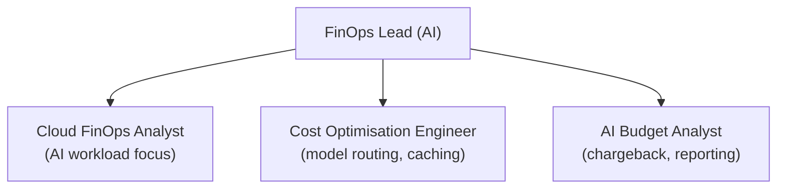
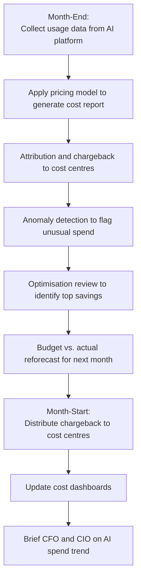

# Part 16 — AI Financial Operating Model

AI costs have a fundamentally different structure from traditional software. This guide provides the financial operating model framework for AI including cost taxonomy, optimisation strategies, and ROI measurement.

## The AI Cost Structure

AI costs are dominated by compute at inference time, not labour. This requires a different financial operating model:

| Cost Type | Traditional Software | AI / GenAI |
|-----------|---------------------|-----------|
| **Primary cost driver** | Labour (engineers) | Compute at inference time (token costs) |
| **Cost variability** | Fixed (headcount) + variable (infrastructure) | Highly variable (proportional to usage) |
| **Scaling curve** | Sub-linear (infrastructure scales efficiently) | Linear (each query costs regardless of prior queries) |
| **Predictability** | Highly predictable | Harder to predict (usage spikes, prompt length variation) |
| **Optimisation lever** | Architecture, caching, efficiency | Model routing, caching, prompt compression, batch processing |

## AI Cost Taxonomy

### GPU Cost (Training & Fine-Tuning)

- Pre-training: billions of dollars (only foundation model companies)
- Fine-tuning: £500–£50,000 depending on dataset size and model size
- LoRA/QLoRA fine-tuning: £50–£5,000 for most enterprise use cases
- Infrastructure: A100/H100 GPU-hours at £2–£5/hr (cloud), £0.50–£1.50/hr (reserved)

### Inference Cost (LLM API Usage)

The dominant cost category for most enterprise AI deployments.

| Model Tier | Typical Input Cost | Typical Output Cost | Use Case |
|-----------|-------------------|---------------------|---------|
| Frontier (Claude Opus, GPT-4o) | £15–£75/1M tokens | £75–£150/1M tokens | Complex reasoning, high-stakes |
| Standard (Claude Sonnet, GPT-4o-mini) | £3–£8/1M tokens | £12–£25/1M tokens | Most enterprise features |
| Efficient (Haiku, GPT-4o-mini) | £0.25–£1/1M tokens | £1.25–£3/1M tokens | High-volume, simple tasks |
| Open source (Llama 3, Mistral) | ~£0.10–£0.50/1M tokens | ~£0.30–£1/1M tokens | Highest volume, privacy needs |

### Embedding Cost

- Typical: £0.02–£0.13 per 1M tokens embedded
- Batch processing: 50% discount on most providers
- One-time cost for indexing; recurring cost only for new/updated documents

### Storage Cost

- Vector database: £0.10–£0.30/GB/month (includes index overhead)
- Document store (for RAG): £0.023–£0.10/GB/month
- Log/trace storage: £0.03–£0.05/GB/month

## Cost Optimisation Strategies

### Caching (10–40% saving)

- **Exact cache:** Identical prompts return cached response (for static or template-based prompts)
- **Semantic cache:** Similar prompts (cosine similarity >0.95) return cached response (GPTCache, Redis)
- **Prompt prefix caching:** Cache the static system prompt prefix across requests (up to 90% discount on cached tokens)

### Model Routing (20–50% saving)

Route each request to the cheapest model that can handle it adequately:

- Simple task → Haiku (£0.25/1M)
- Medium task → Sonnet (£3/1M)
- Complex task → Opus (£15/1M)

Tools: LiteLLM, OpenRouter, custom routing logic with LLM-as-classifier.

### Autoscaling

- Scale inference compute to match demand (vs. fixed provisioned capacity)
- AWS Bedrock, Azure OpenAI, and GCP Vertex AI all offer on-demand scaling
- Self-hosted: Kubernetes HPA for inference pods

### Batch Processing (30–60% saving)

Process non-real-time workloads asynchronously in batch:
- Document indexing / embedding
- Bulk classification or extraction
- Non-urgent analysis workloads
- Overnight model evaluation runs

### Prompt Compression (10–30% saving)

Reduce input token count without losing quality:
- Summarise long conversation histories
- Remove boilerplate instructions already in the model's training
- Use structured formats (JSON, structured prompts) vs. verbose prose

### Right-Sizing Models

Don't use a frontier model for a task a smaller model handles equally well. Run A/B evaluation:
- Is the quality difference statistically significant?
- What is the cost difference?
- Does the business case justify the premium?

## Cost Attribution Framework

### Attribution Hierarchy

```
Enterprise AI Spend
    ↓
Division/Business Unit
    ↓
Product / Use Case
    ↓
Feature
    ↓
API Request (with metadata: use_case_id, team_id, budget_code)
```

Every AI API call must carry attribution metadata to enable accurate cost allocation.

### Chargeback vs. Showback

| Model | Description | When to Use |
|-------|-------------|------------|
| **Showback** | Teams see their usage and cost but are not billed | Early maturity; building cost awareness |
| **Chargeback** | Teams are billed to their cost centre for actual usage | Mature adoption; accountability required |
| **Budgeted chargeback** | Teams have an AI budget; usage deducted; alerts at 80% | Best practice for scaled AI programmes |

### Chargeback Implementation

1. Tag every AI API call with `team_id`, `use_case_id`, `budget_code`
2. Collect usage data from AI gateway / inference service
3. Apply pricing model (token-based for LLMs; query-based for vector DB; minute-based for agents)
4. Generate monthly chargeback reports per cost centre
5. Allocate shared platform costs (amortised across users by consumption share)

## ROI & Business Value Measurement

### ROI Framework

```
AI ROI = (AI-Attributed Business Value - Total AI Cost) / Total AI Cost × 100%
```

### Business Value Measurement Methods

| Method | Description | Best For |
|--------|-------------|---------|
| **A/B Test** | Compare AI-assisted vs. control group outcomes | Features affecting measurable outcomes |
| **Before/After** | Compare KPI before and after AI deployment | Process automation |
| **Time Savings** | Hours saved × employee cost rate | Productivity improvements |
| **Quality Improvement** | Error rate reduction × cost-of-error | Quality use cases |
| **Revenue Attribution** | Revenue from AI-influenced interactions | Customer-facing AI |
| **Cost Avoidance** | Headcount growth avoided due to AI automation | Scale use cases |

### AI Investment Categories

| Investment Category | Time to Value | Risk | Expected ROI |
|--------------------|--------------|------|-------------|
| Productivity tools (copilots, assistants) | 3–6 months | Low | 20–40% productivity gain |
| Process automation (GenAI in workflows) | 6–12 months | Medium | 30–60% cost reduction in target process |
| Customer experience (AI-powered products) | 6–18 months | Medium-High | 10–25% revenue uplift |
| Agentic automation (autonomous agents) | 12–24 months | High | 40–80% automation of target processes |
| Foundational platform (AI platform) | 12–36 months | Medium | Enabler (reduces cost of all other investments) |

## AI FinOps Operating Model

### FinOps Team Structure

AI FinOps is best operated as part of the broader FinOps function, with AI specialists embedded:



**FinOps Team Hierarchy.** Three specialist roles report to the AI-focused FinOps Lead: cloud cost management, model optimization, and budget administration.

### Monthly FinOps Cycle



**Monthly FinOps Operating Cycle.** Repeating process that spans month-end (data collection, analysis, attribution) and month-start (distribution, visibility, reporting).

## Authoritative Guides

Comprehensive AI FinOps guidance is available in the **Enterprise Architecture** and **AI Economics** domains. Consult specialised guides for:

- Complete AI FinOps framework
- Cost structure and optimisation techniques
- 3-year financial models and investment levels
- Business value measurement methodology
- Value tracking for agentic use cases
- FinOps governance and decision economics

## Related

- [Part 10 — Service Catalog](20-part-10-service-catalog.md) — AI FinOps Service specification
- [Part 14 — Observability](24-part-14-observability.md) — Cost analytics as an observability signal
- [Part 17 — Transformation Roadmap](27-part-17-transformation-roadmap.md) — Investment levels by maturity stage

## Sources

[No external sources for this page.]
