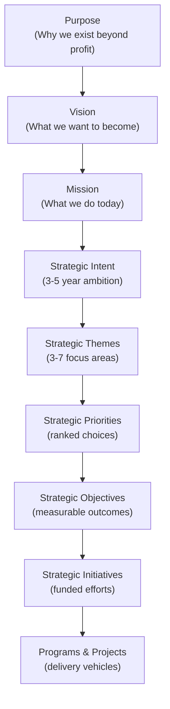

# Corporate Strategy: Vision, Mission, Purpose & Intent

Strategy exists to prevent the three failure modes every large organization faces: misalignment (divisions investing in conflicting directions), incoherence (initiatives launched opportunistically with no shared logic), and disconnection (leadership vision never reaching frontline execution). This section establishes the foundational hierarchy from purpose through intent that makes coherent strategy possible.

## The Strategy Hierarchy: Why It Exists

Every organization needs a decision hierarchy connecting the enduring (What do we exist to do?) to the tactical (What do we do this quarter?). Without it, organizations constantly confuse concepts — writing missions that are actually visions, creating objectives that are actually themes, approving initiatives with no connection to stated priorities.

The hierarchy forces coherence:



Every concept at each level must be traceable to the level above and must cascade logically to the level below. This prevents the ambiguity that paralyzes execution.

## Vision: The North Star

**Definition:** Vision is a vivid, compelling description of a desired future state — the organization as it will exist when it has fully achieved its aspirations. It answers: *"What do we want to become?"*

Vision operates on a 10–25 year horizon for large enterprises. It is deliberately aspirational and may never be fully "achieved" — it functions as a north star, not a finish line.

**Purpose of vision:**
- Provides directional coherence across complex organizations
- Motivates and inspires — particularly important in transformation periods
- Guides resource allocation when competing priorities arise
- Creates a shared identity and sense of collective destination

**Characteristics of a good vision:**

| Characteristic | What It Means | Poor Example | Good Example |
|---|---|---|---|
| **Aspirational** | Describes a future state beyond current capabilities | "Be a good bank" | "Democratize access to financial services globally" |
| **Specific** | Anchored to the organization's domain | "Be the best" | "Be the most trusted digital health platform" |
| **Memorable** | Short enough to repeat from memory | 3-paragraph document | One sentence |
| **Timeless** | Does not reference current tactics or technology | "Be the best mobile app" | "Make healthcare feel effortless for every patient" |
| **Challenging** | Requires genuine transformation to achieve | Status quo restatement | Requires organizational change |

**Examples across industries:**

- Banking: "Financial empowerment for every person on earth"
- Healthcare: "A world where no patient faces a diagnosis alone"
- Retail: "The most customer-centric company on earth"
- Telecom: "Connecting every community, enabling every ambition"
- Government: "Digital-first public services that leave no citizen behind"

## Mission: The Present State

**Definition:** Mission describes what the organization does today — its current business, the customers it serves, and the value it creates. It answers: *"What do we do, for whom, and why?"*

Mission operates at a 3–10 year horizon and is more operational than vision. While vision is aspirational, mission is descriptive. Mission should be achievable within a planning cycle.

**Vision vs. Mission distinction:**

| Dimension | Vision | Mission |
|---|---|---|
| **Temporal** | Future state | Current state |
| **Nature** | Aspirational | Descriptive |
| **Horizon** | 10–25 years | 3–10 years |
| **Achievability** | May never be fully reached | Achieved within planning cycle |

**Components of a strong mission:**

A complete mission statement answers four questions:

1. **What** — What product or service do we deliver?
2. **Who** — Who are our customers?
3. **How** — Through what mechanism or approach?
4. **Why** — What outcome does this create for stakeholders?

**Template:** "We [deliver WHAT] to [WHO] through [HOW] in order to [WHY / outcome]."

**Example (Healthcare):** "We deliver AI-powered diagnostic decision support to community hospitals through cloud-native SaaS, enabling clinicians to diagnose complex conditions accurately without specialist referral delays."

## Purpose: The Why Beyond Profit

**Definition:** Purpose is the organization's fundamental *reason for being* beyond financial returns. It answers: *"Why do we exist beyond making money?"*

Purpose became central to enterprise strategy after the Business Roundtable's 2019 Statement on the Purpose of a Corporation, which moved beyond pure shareholder primacy.

**Purpose-Vision-Mission hierarchy:**

```
PURPOSE (Why do we EXIST?)
    "We exist to advance human health"
        ↓
VISION (What do we want to BECOME?)
    "The world's most trusted preventive health platform"
        ↓
MISSION (What do we DO?)
    "We help 50M people make proactive health decisions through
     AI-powered screening and coaching delivered via primary care"
```

**Purpose in action:** When properly institutionalized, Purpose drives:

- **Portfolio prioritization** — Initiatives that advance Purpose receive investment; those that contradict it are rejected
- **Technology governance** — AI decisions evaluated against ethical alignment with Purpose
- **Talent strategy** — Purpose attracts aligned talent, particularly in competitive markets
- **Stakeholder governance** — ESG reporting anchored to Purpose commitments

**Examples by organization type:**

| Type | Purpose Example |
|---|---|
| Bank | "Financial empowerment for all" |
| Hospital | "Healing humanity, one patient at a time" |
| Technology | "Accelerate humanity's transition to sustainable energy" |
| Retailer | "Save people money so they can live better" |
| Telecom | "Connect humanity, enable possibility" |
| Government | "Protect and serve every citizen equitably" |

## Strategic Intent: The Competitive Declaration

**Definition:** Strategic Intent is the organization's bold, specific ambition for a defined medium-term horizon (typically 3–5 years). It is not a mission restatement but a *competitive declaration*: "We will achieve X within Y timeframe."

Strategic Intent acknowledges the gap between current capabilities and desired position, and commits the organization to closing that gap.

**Characteristics of strategic intent:**

- **Specific and competitive** — Names a position, not just a direction
- **Time-bound** — Has a horizon (usually 3–5 years)
- **Stretch** — Requires capability building, not just execution of existing strengths
- **Unifying** — Creates organizational alignment without over-specifying how

**Strategic Intent across industries:**

| Industry | Strategic Intent |
|---|---|
| Banking | "Become the #1 digital bank for SMBs in Southeast Asia by 2028" |
| Healthcare | "Eliminate preventable hospital readmissions across our network by 50% by 2027" |
| Retail | "Own the 30-minute grocery delivery market in top-10 U.S. metros by 2027" |
| Manufacturing | "Achieve carbon-neutral manufacturing across all facilities by 2030" |
| Telecom | "Reach 100M 5G subscribers across Africa by 2029" |
| Government | "Digitize 100% of citizen-facing services by 2028, with 90% digital adoption" |

**Strategic Intent vs. direction vs. goal:**

| Concept | Definition | Horizon | Specificity |
|---|---|---|---|
| **Strategic Intent** | Bold ambition declaring competitive position | 3–5 years | High — names a specific outcome |
| **Strategic Direction** | The broad trajectory or course being set | 1–3 years | Medium — sets course without full specificity |
| **Strategic Goal** | A measurable milestone supporting the intent | 1–2 years | High — SMART |

## Common Anti-Patterns

Organizations often stumble when formulating their foundational strategy statements:

- **The Jargon Vision**: "Leverage synergistic capabilities to deliver best-in-class outcomes" — meaningless
- **The Modest Vision**: "Be a profitable company in our market" — not aspirational
- **The Technology Vision**: "Be an AI-first company" — tactic masquerading as vision
- **The Annual Vision**: Rewritten every year; loses its north-star function
- **The Committee Vision**: Written by 15 executives; contains everyone's pet phrase; incoherent

## Related

- [Strategic Themes, Priorities & Objectives](./82-vol1-corporate-strategy-themes-priorities-initiatives.md)
- [Strategy Execution & Frameworks](./84-vol1-corporate-strategy-execution-templates-kpis.md)
- [AI Strategy Framework](./48-vol5-ai-strategy-transformation-glossary.md)

## Sources

---
