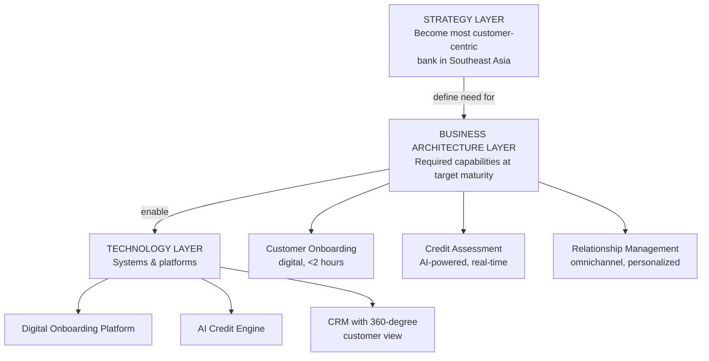
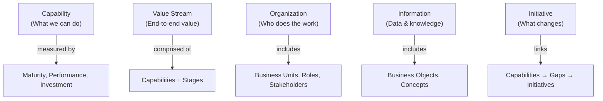
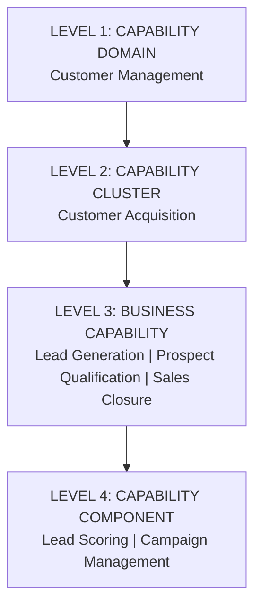

# Business Architecture: Discipline & Capabilities

Business Architecture is the translation layer between strategy and execution. Strategy says "what we want to achieve." Technology says "how we build it." Business Architecture says "what capabilities, processes, and structures must exist to bridge the two."

## What Is Business Architecture?

**Business Architecture** is the practice of defining how an organization creates and delivers value — through its capabilities, processes, information, stakeholders, and governance structures — independently of any specific technology implementation.

Business Architecture answers: *"How does this organization actually work?"*

**Strategy-to-Execution Bridge:**

Strategy flows to required capabilities, which are realized through technology platforms.

## The BIZBOK Standard

The **Business Architecture Body of Knowledge (BIZBOK)** published by the Business Architecture Guild is the primary professional standard for Business Architecture practice.

**BIZBOK Core Metamodel:**

## Business Architecture vs. Enterprise Architecture

| Dimension | Business Architecture | Enterprise Architecture |
|---|---|---|
| **Focus** | Business side (capabilities, processes, value) | Full stack (business + apps + data + tech) |
| **Primary Audience** | Business executives, strategy teams | Technology leaders, architects |
| **Language** | Business language | Technical + business hybrid |
| **Deliverables** | Capability maps, value stream maps, business glossary | Architecture blueprints, reference architectures, tech roadmaps |
| **Standard** | BIZBOK (Business Architecture Guild) | TOGAF (Open Group) |
| **Horizon** | Longer term, more stable | Shorter term, more dynamic |

**Key Insight**: You cannot do good Enterprise Architecture without Business Architecture. Technology decisions made without capability context produce technically excellent solutions that don't solve business problems.

## Business Capability Definition

A **Business Capability** is what an organization is able to do — expressed in business terms, independent of how it is done (people, process, technology). Capabilities are stable over time even as the underlying technology changes.

**Golden Rule:** A capability describes WHAT the organization can do, not HOW or WHO or WHERE.

| Approach | Example | Assessment |
|---|---|---|
| WRONG (describes how) | "Process loan applications using Salesforce" | Too technology-specific |
| WRONG (describes who) | "Loan Underwriting Team reviews applications" | Too organization-specific |
| RIGHT (describes what) | "Loan Underwriting" — assess creditworthiness and approve/decline | Pure capability |

**Capability Characteristics:**
- **Stable** — Does not change when technology changes
- **Outcome-focused** — Describes a business outcome, not a process step
- **Unique** — No two capabilities should mean the same thing
- **Business language** — No technology terms
- **Hierarchical** — Can be decomposed into sub-capabilities
- **Measurable** — Can be assessed for maturity and performance

## Capability Hierarchy and Maturity

Capabilities are organized in a hierarchy of three to four levels:

A four-level hierarchy of capabilities, with each level adding more specificity and detail.

**Rule of thumb:** Most business architecture works at Level 1–3. Level 4 is used for deep process analysis.

**Capability Maturity Model (1–5):**

| Level | Name | Description | Indicators |
|---|---|---|---|
| **1** | Initial | Ad hoc, undocumented, dependent on individuals | No process documentation, tribal knowledge |
| **2** | Developing | Some standardization, repeated but reactive | Documented process, inconsistent execution |
| **3** | Defined | Standardized, documented, proactively managed | Consistent execution, clear ownership |
| **4** | Managed | Quantitatively managed with metrics | KPIs tracked, continuous improvement |
| **5** | Optimized | Continuously improving, industry-leading | Benchmarked against best-in-class, innovating |

**How to Use Maturity Assessments:**

1. Score each capability (1–5) on current and target maturity
2. Calculate the **Maturity Gap** (Target − Current)
3. Prioritize investments based on gap × strategic importance
4. Build initiatives to close critical gaps

## Capability Heat Map

A **Capability Heat Map** overlays multiple data dimensions onto the capability map to create an at-a-glance view of where to invest:

**Common Heat Map Overlays:**
- **Maturity Gap** — Red = Large gap, Green = At target
- **Strategic Importance** — High / Medium / Low
- **Investment Level** — High / Medium / Low
- **Pain Level** — High / Medium / Low  
- **AI Transformation Potential** — High / Medium / Low

**Reading a Heat Map:**
- Red + High Strategic Importance = Critical capability gap to address now
- Green + Low Strategic Importance = Candidate for consolidation or cost reduction
- Low Investment + High Pain = Underinvested — candidate for budget reallocation

## Related

- [Value Streams, Domains & Model Design](./90-vol2-business-architecture-operating-model-value-streams-domains-model-design.md)
- [Business Architecture Operating Models](./91-vol2-business-architecture-operating-model-organization-operating-model-design.md)
- [Strategic Objectives Operationalization](./82-vol1-corporate-strategy-themes-priorities-initiatives.md)

## Sources

---
