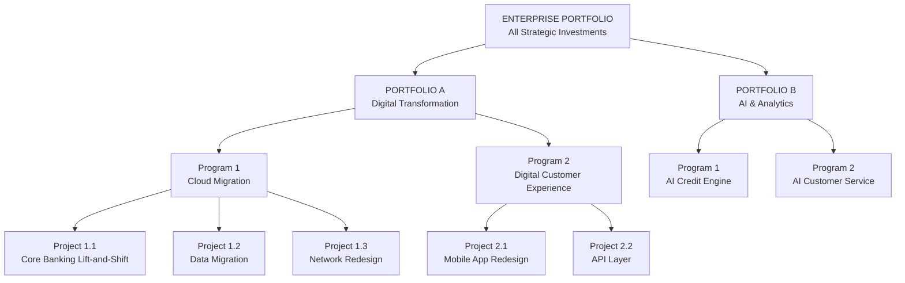
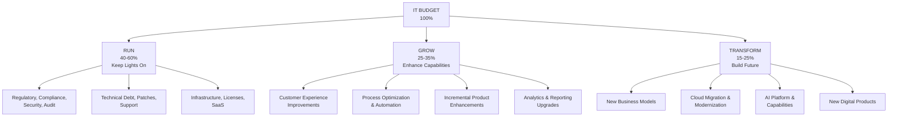
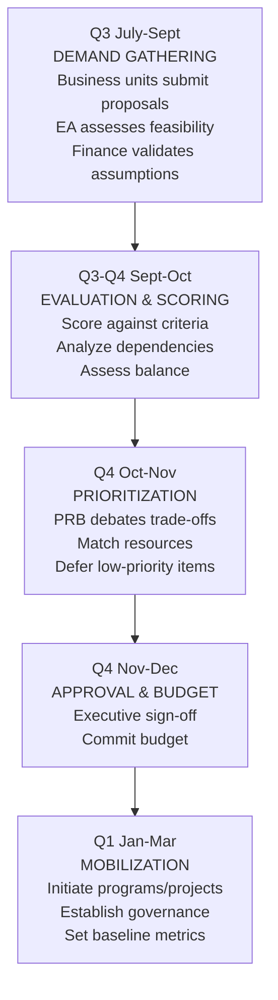

# Portfolio Governance: Fundamentals & Investment Planning

**Portfolio Management** is the centralized management of an organization's strategic investments — initiatives, programs, and projects — to maximize collective value delivered against strategic objectives. It asks: *"Are we doing the right things?"*

## Portfolio Hierarchy



Hierarchical decomposition of strategic investments from enterprise portfolio down to individual projects.

## Portfolio vs. Program vs. Project

| Dimension | Portfolio | Program | Project |
|---|---|---|---|
| **Focus** | Strategic value and alignment | Benefits realization | Deliverables |
| **Question** | Are we doing the right things? | Are we doing things right? | Are we doing things well? |
| **Horizon** | Multi-year, ongoing | 1–5 years | 3–18 months |
| **Success metric** | Strategic objectives achieved | Benefits delivered | On time, on budget, in scope |
| **Change handling** | Actively reallocates across investments | Manages changes within scope | Resists scope change |
| **Governance** | Portfolio Review Board | Program Steering Committee | Project Sponsor |
| **Standard** | Standard for Portfolio Management | Standard for Program Management | PMBOK |

## Portfolio Categories: Run / Grow / Transform

**The Three-Bucket Model** is the most common enterprise portfolio classification:



Three budget categories balance operational stability with growth and innovation initiatives.

**Portfolio Rebalancing:** Most large enterprises are over-invested in RUN and under-invested in TRANSFORM. Mature portfolio governance actively shifts the ratio toward growth and transformation over time.

## Investment Planning Process

**Investment Planning Calendar:**



Annual investment planning cycle from demand gathering through project mobilization.

## Business Case Structure

A **Business Case** is the documented justification for an investment — the formal argument that a proposed initiative will deliver value exceeding its costs and risks.

**The Five Cases Model (HM Treasury, UK Green Book):**

| Case | Content |
|---|---|
| **STRATEGIC CASE** | Does this align with strategy and solve a real problem? Problem statement, strategic fit, options considered, recommended option |
| **ECONOMIC CASE** | Is this the best use of money accounting for risk? Cost-Benefit Analysis, NPV, IRR, payback period, risk-adjusted scenarios |
| **COMMERCIAL CASE** | Is the procurement approach sound? Build vs. Buy vs. Partner, vendor selection, commercial risks |
| **FINANCIAL CASE** | Is it affordable and fits budgeting constraints? CapEx/OpEx, funding source, cash flow, impact on run costs |
| **MANAGEMENT CASE** | Can we actually deliver this? Delivery approach, governance, risks, dependencies, benefits realization plan |

## Financial Analysis

**Net Present Value (NPV):** Sum of discounted future cash flows minus initial investment.

```
NPV = -Initial Investment + Σ [Cash Flow_t / (1 + Discount Rate)^t]

Example:
Initial Investment: $2M
Annual benefit: $800K for 5 years
Discount rate: 10%
NPV = -$2M + $727K + $661K + $601K + $547K + $497K = $1.03M ✓
```

**Return on Investment (ROI):** `ROI = (Net Benefit / Total Cost) × 100`

**Payback Period:** `Payback = Initial Investment / Annual Cash Flow`

## Prioritization Models

**Weighted Scoring:** Score each initiative against weighted criteria (e.g., Strategic alignment 30%, Financial return 25%, Delivery risk 20%, Customer impact 15%, Time to value 10%).

**MoSCoW:** Must Have (non-negotiable), Should Have (high value), Could Have (nice to have), Won't Have (deferred).

**Cost of Delay (WSJF):** `WSJF = Cost of Delay / Job Duration` (SAFe prioritization).

## Related

- [PMO Models & Agile Governance](./93-vol3-portfolio-governance-pmo-agile-governance.md)
- [AI Governance & Metrics](./94-vol3-portfolio-governance-ai-governance-metrics.md)
- [Strategy Execution](./84-vol1-corporate-strategy-execution-templates-kpis.md)

## Sources

---
