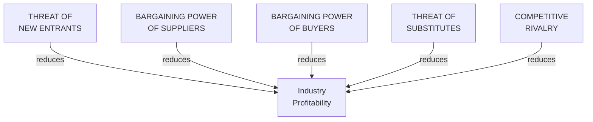
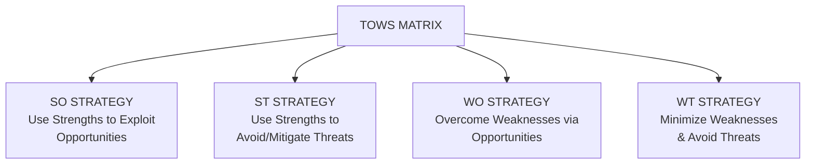
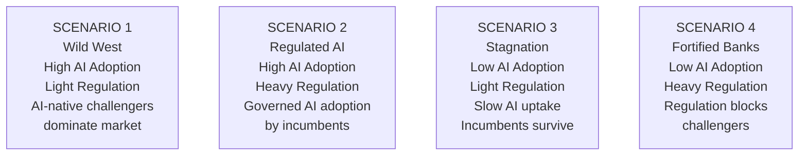

# Consulting Frameworks: Landscape & Environmental Analysis

Consulting frameworks are cognitive shortcuts — structured thinking tools that decompose complex problems into manageable components, ensure completeness, and create shared vocabulary between consultants and clients.

## Framework Taxonomy

```mermaid
graph TD
    ROOT["CONSULTING FRAMEWORKS"]
    
    EA["ENVIRONMENTAL ANALYSIS<br/>Where are we?"]
    SF["STRATEGY FORMULATION<br/>What should we do?"]
    OD["ORGANIZATIONAL DESIGN<br/>How should we organize?"]
    EP["EXECUTION & PERFORMANCE<br/>Are we executing well?"]
    ID["INNOVATION & DISRUPTION<br/>What's next?"]
    
    EA1["PESTLE"]
    EA2["Porter's Five Forces"]
    EA3["SWOT"]
    EA4["Scenario Planning"]
    
    SF1["Ansoff Matrix"]
    SF2["BCG Growth-Share"]
    SF3["Porter's Generic Strategies"]
    SF4["VRIO"]
    SF5["Blue Ocean Strategy"]
    SF6["Three Horizons"]
    
    OD1["McKinsey 7S"]
    OD2["MOST"]
    OD3["Congruence Model"]
    OD4["Star Model"]
    
    EP1["OKR"]
    EP2["Balanced Scorecard"]
    EP3["Hoshin Kanri"]
    EP4["Lean/Six Sigma"]
    
    ID1["Jobs To Be Done"]
    ID2["Wardley Mapping"]
    ID3["Business Model Canvas"]
    ID4["Value Proposition Canvas"]
    ID5["Disruption Analysis"]
    
    ROOT --> EA
    ROOT --> SF
    ROOT --> OD
    ROOT --> EP
    ROOT --> ID
    
    EA --> EA1
    EA --> EA2
    EA --> EA3
    EA --> EA4
    
    SF --> SF1
    SF --> SF2
    SF --> SF3
    SF --> SF4
    SF --> SF5
    SF --> SF6
    
    OD --> OD1
    OD --> OD2
    OD --> OD3
    OD --> OD4
    
    EP --> EP1
    EP --> EP2
    EP --> EP3
    EP --> EP4
    
    ID --> ID1
    ID --> ID2
    ID --> ID3
    ID --> ID4
    ID --> ID5
```

Five major framework categories organize strategy thinking from analysis through execution and innovation.

## PESTLE Analysis

**PESTLE** (Political, Economic, Social, Technological, Legal, Environmental) provides structured macro-environment scanning.

| Factor | Questions |
|---|---|
| **Political** | How do government decisions affect our business? Regulatory policy, government stability, trade policy, tax policy |
| **Economic** | How do economic conditions affect us? GDP growth, interest rates, inflation, employment, consumer spending |
| **Social** | How do social changes affect us? Demographics, cultural shifts, consumer behavior, health trends, education |
| **Technological** | What technology changes create opportunity or threat? AI, digital disruption, platform economics, cybersecurity, emerging tech |
| **Legal** | What legal obligations constrain us? Data protection (GDPR, CCPA, DPDP), industry regulations, employment law, competition, IP |
| **Environmental** | How do ecological factors affect us? Climate change, net-zero commitments, ESG reporting, resource scarcity, circular economy |

**Example (European Bank 2026):**

| Factor | Observation | Strategic Implication |
|---|---|---|
| Political | EU AI Act in force | High-risk AI systems require conformity assessment |
| Economic | ECB rate cycle turning | Net Interest Margin compression; fee income focus |
| Social | Gen Z expects fully digital | Physical branch reduction; digital-first design |
| Technology | Agentic AI available | Opportunity for AI-native banking operations |
| Legal | PSD3 / Open Finance | Must open APIs to third parties |
| Environmental | ECB green taxonomy | Loan portfolio must report ESG impact |

## Porter's Five Forces

Michael Porter's **Five Forces** model assesses structural industry attractiveness through five competitive forces.

**Force Characteristics:**

| Force | High Threat | Low Threat |
|---|---|---|
| **New Entrants** | Low capital, no regulation, easy distribution | High capital, patents, regulation, brand loyalty |
| **Supplier Power** | Few suppliers, unique inputs | Many suppliers, commodity inputs |
| **Buyer Power** | Buyers concentrated, price-sensitive | Fragmented buyers, differentiated products |
| **Substitutes** | Lower-cost alternatives, better performance | No alternatives, high switching costs |
| **Rivalry** | Many competitors, slow growth, commodity | Few competitors, fast growth, differentiated |

**AI Implication:** Agentic AI increases threat of new entrants (lower barrier) and substitutes (AI-native competitors) while potentially increasing buyer power.

## SWOT Analysis

**SWOT** (Strengths, Weaknesses, Opportunities, Threats) is widely used — and often abused.

**The Right Way to Use SWOT:**

| Quadrant | Content | Source |
|---|---|---|
| **Strengths** | Internal advantages relative to competitors | Internal assessment |
| **Weaknesses** | Internal disadvantages relative to competitors | Internal assessment |
| **Opportunities** | External conditions you can exploit | PESTLE + Five Forces |
| **Threats** | External conditions that could harm you | PESTLE + Five Forces |

**TOWS Matrix (Deriving Strategy from SWOT):**

Four strategic directions derived by matching internal capabilities (strengths/weaknesses) with external environment (opportunities/threats).

## Scenario Planning

**Scenario Planning** (Shell Oil / GBN method) builds multiple plausible futures and tests strategy robustness.

**Four-Step Process:**

1. Identify focal question: "What is our strategic position in 2030?"
2. Identify driving forces: Macro forces shaping the future (AI regulation, climate, geopolitics)
3. Identify critical uncertainties: Forces that are both important AND uncertain
4. Build 4 scenarios: Using the two most critical uncertainties as axes

**Example (Retail Banking 2030):**

Four plausible 2030 futures for retail banking defined by AI adoption rates and regulatory intensity.

## Related

- [Consulting Frameworks: Strategy Formulation](./95-vol4-consulting-frameworks-industry-strategy-execution-frameworks.md)
- [Industry Playbooks & Architecture](./96-vol4-consulting-frameworks-industry-architecture-industry-playbooks.md)
- [Framework Selection Guide](./97-vol4-consulting-frameworks-industry-framework-selection-glossary.md)

## Sources

---
