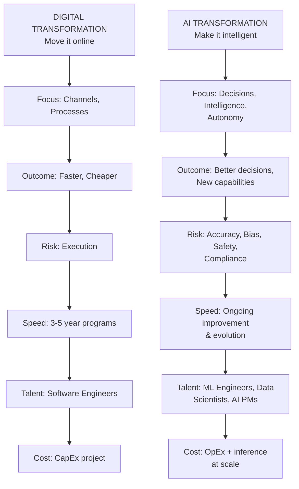
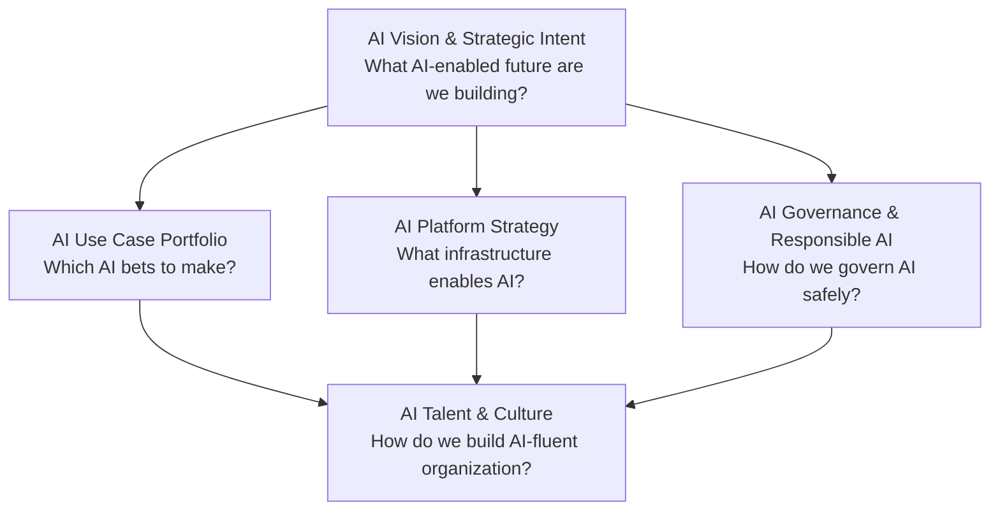
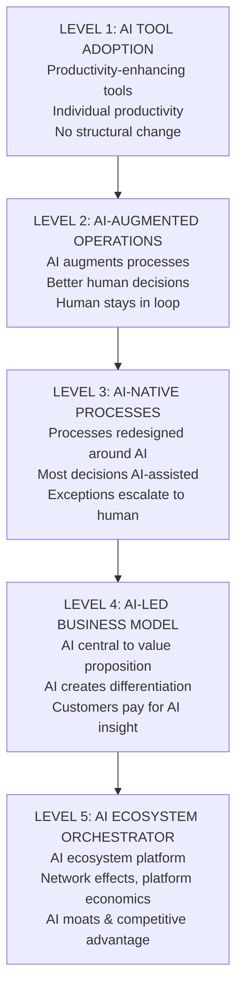
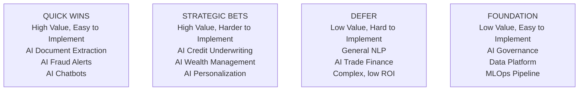
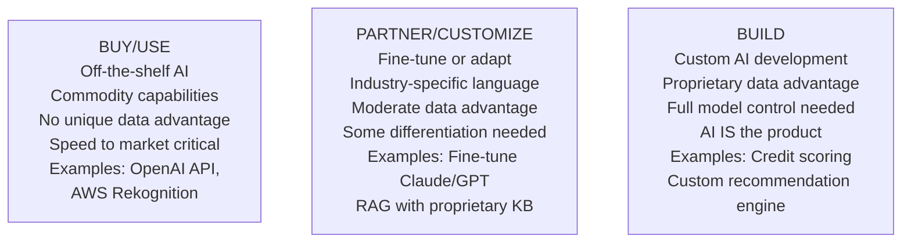

# AI Strategy & Transformation: Strategy Framework & Operating Model

## Why AI Strategy Is Different from Digital Strategy

Digital transformation was fundamentally about **channels and processes** — moving interactions online and automating manual steps. AI transformation is about **intelligence and autonomy** — fundamentally changing how decisions are made, knowledge is used, and work is executed.

Digital transformation focused on channels and processes, while AI transformation focuses on intelligence and decision-making.

## The Five-Dimension AI Strategy Framework

A complete AI strategy has five interdependent dimensions:

## AI Vision and Strategic Intent

**AI Vision** translates the corporate vision into what role AI will play in the organization's future.

**AI Vision Spectrum:**

Five levels of AI maturity and strategic intent, from tools to ecosystem platform.

## AI Use Case Portfolio

**AI Use Case Portfolio Management** applies portfolio thinking to AI investment — not all use cases deserve equal investment.

**AI Use Case Evaluation Matrix:**

| Criterion | Weight | Scoring |
|---|---|---|
| Strategic alignment | 25% | Does it advance a strategic objective? |
| Business value (NPV) | 25% | What is the measurable financial impact? |
| Data availability | 15% | Do we have the data to train/operate? |
| Technical feasibility | 15% | Can we build this with current tech? |
| Regulatory risk | 10% | Is this high-risk per EU AI Act or sector rules? |
| Time to value | 10% | How quickly does this pay back? |

**Use Case Portfolio Grid:**

Portfolio grid prioritizing AI use cases by business value and implementation difficulty.

**Quick Wins by Industry:**

| Industry | Quick Wins | Strategic Bets |
|---|---|---|
| **Banking** | Document AI, chatbots | AI credit, wealth AI |
| **Healthcare** | Clinical documentation AI | Diagnostic AI, predictive care |
| **Retail** | Search/recommendation AI | Demand forecasting, pricing |
| **Manufacturing** | Predictive maintenance | Digital twin, quality AI |
| **Telecom** | AI chatbot, churn prediction | Network AI, B2B advisor AI |

## Build vs. Buy vs. Partner: AI Edition

The Build/Buy/Partner decision is more nuanced for AI:

Strategic sourcing decision for AI capabilities based on data uniqueness, time pressure, and competitive differentiation needs.

## Related

- [AI Operating Model & Building Blocks](./92-vol2-business-architecture-operating-model-ai-operating-model-building-blocks.md)
- [AI Transformation & Maturity Models](./98-vol5-ai-strategy-transformation-glossary-transformation-maturity-models.md)
- [Master Glossary A-Z](./99-vol5-ai-strategy-transformation-glossary-glossary-a-to-h.md)

## Sources

---
