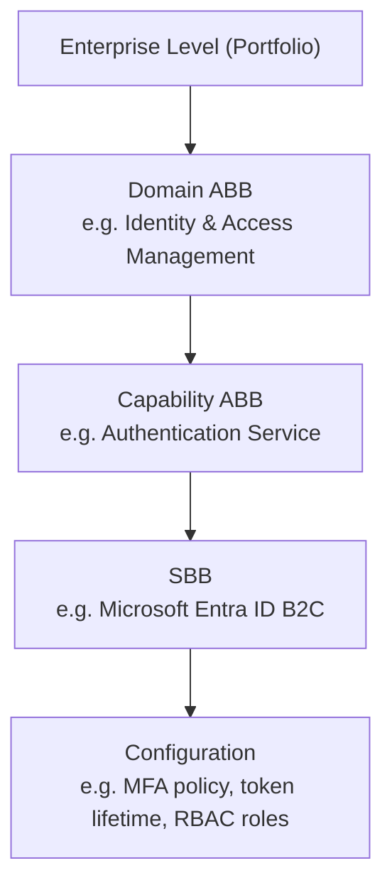

# Enterprise Building Blocks: Concept & Business Blocks

Why this matters: Building blocks solve the duplication problem. Every business unit building its own identity service creates waste. A building block catalog enables reuse, consistency, and scale.

## The Building Block Concept

The most persistent problem in enterprise architecture is not that organizations lack good ideas, but that they rebuild the same capabilities over and over. Every business unit builds its own identity service, every product team constructs its own notification system, every AI team stands up its own vector database.

The consequence is duplication of cost, inconsistency of quality, security fragmentation, integration complexity, and maintenance drag.

Building blocks solve this by defining a catalog of reusable, well-governed, composable capability units that all teams consume rather than rebuild.

## TOGAF Building Blocks Concept

TOGAF 10 defines two types of building blocks:

**Architecture Building Block (ABB):**
- Defines a *capability* without specifying a specific implementation
- Technology-agnostic; describes what is needed, not how it is built
- Example: "Identity Provider"—the capability to authenticate users and issue tokens
- Defined during Architecture Definition

**Solution Building Block (SBB):**
- A *specific implementation* of an ABB
- Names a product, service, or system that delivers the capability
- Example: "Microsoft Entra ID"—the specific identity provider selected
- Defined during Opportunities & Solutions and Implementation Planning

**Building Block Hierarchy**

*Each level narrows from an abstract architectural building block (ABB) at the top to a concrete, configured solution building block (SBB) at the bottom.*

## Building Block Quality Criteria

A well-designed building block must satisfy:

| Criterion | Definition |
|-----------|------------|
| **Reusable** | Can be used by more than one consumer without modification |
| **Replaceable** | Can be swapped for a different implementation with bounded impact |
| **Self-contained** | Has clear interfaces; dependencies are explicit |
| **Well-governed** | Has a named owner, SLA, versioning policy |
| **Discoverable** | Catalogued; consumers can find and evaluate it |
| **Composable** | Can be combined with other building blocks |
| **Testable** | Can be independently verified against its specification |

## The Building Block Catalog

A building block catalog is a governed registry of all ABBs and SBBs in the enterprise.

Minimum catalog entry includes:
- Building block ID and name
- Type (ABB or SBB)
- Domain and layer
- Purpose statement
- List of SBBs (if ABB)
- Owner and governance requirements
- List of consumers
- Standards and compliance requirements

---

## Business Building Blocks

### Customer Management Domain

**Business Capability: Customer Data Management**

| Building Block | Purpose | Typical Implementation |
|----------------|---------|----------------------|
| **Customer Profile Store** | Single source of truth for customer identity | MDM platform (Informatica, SAP MDG) |
| **Customer Data Platform (CDP)** | Unified real-time customer profile | Segment, mParticle, Adobe Real-Time CDP |
| **Customer Interaction History** | Complete record of all touchpoints | CRM activity log, Salesforce Service Cloud |
| **Customer Consent Manager** | Privacy preference and consent recording | OneTrust, TrustArc |

### Product Management Domain

| Building Block | Purpose | Enterprise Examples |
|----------------|---------|---------------------|
| **Product Catalogue** | Master record of all products, variants, attributes | SAP Ariba, Akeneo PIM, Salsify |
| **Pricing Engine** | Dynamic pricing rules, promotions, discounting | SAP CPQ, Zuora, Chargebee |
| **Product Configurator** | Rules-based product configuration (CPQ) | Salesforce CPQ, Oracle CPQ |
| **PIM** | Enrich and distribute product data | Akeneo, Syndigo |

### Order Management Domain

| Building Block | Purpose | Enterprise Examples |
|----------------|---------|---------------------|
| **Order Capture** | Accept and validate orders from all channels | OMS core, Salesforce OMS |
| **Order Orchestration** | Route, split, and sequence fulfilment | IBM Sterling, Manhattan OMS |
| **Inventory Visibility** | Real-time stock levels across locations | Manhattan, Blue Yonder |
| **Fulfilment Engine** | Pick, pack, ship logic | WMS integration, ShipBob |

### Finance Domain

| Building Block | Purpose | Enterprise Examples |
|----------------|---------|---------------------|
| **General Ledger (GL)** | Double-entry accounting, chart of accounts | SAP S/4HANA, Oracle ERP Cloud |
| **Accounts Payable (AP)** | Supplier invoice processing and payment | Coupa, SAP Ariba |
| **Accounts Receivable (AR)** | Customer invoicing, collections, cash application | HighRadius, Oracle AR |
| **Treasury Management** | Cash positioning, liquidity, FX | Kyriba, FIS Quantum |
| **Tax Engine** | Tax calculation, compliance, filing | Vertex, Avalara |

### HR Domain

| Building Block | Purpose | Enterprise Examples |
|----------------|---------|---------------------|
| **HRIS / HCM Core** | Employee data, org structure, positions | Workday, SAP SuccessFactors |
| **Talent Acquisition** | Requisitions, ATS, interviewing, offer | Workday Recruiting, Greenhouse |
| **Learning Management (LMS)** | Course delivery, completion tracking | Cornerstone, LinkedIn Learning |
| **Performance Management** | Goals, reviews, feedback, calibration | Workday, SAP, Culture Amp |
| **Compensation & Benefits** | Pay structures, equity, benefits admin | Workday, Mercer Darwin |

### Procurement Domain

| Building Block | Purpose | Enterprise Examples |
|----------------|---------|---------------------|
| **Sourcing & RFx** | Supplier evaluation and selection | Coupa, Jaggaer, SAP Ariba |
| **Contract Management** | Contract lifecycle, obligations, renewals | Icertis, Agiloft |
| **Purchase Order Management** | PO creation, approval, tracking | ERP core + Coupa |
| **Invoice Processing** | 3-way match, AI invoice extraction | Basware, Hypatos, Tipalti |

### Supply Chain & Logistics Domain

| Building Block | Purpose | Enterprise Examples |
|----------------|---------|---------------------|
| **Demand Planning** | Statistical forecasting + AI enrichment | Blue Yonder, o9 Solutions, Kinaxis |
| **Inventory Management** | Stock positioning, reorder points, safety stock | Manhattan, Oracle WMS |
| **Transportation Management (TMS)** | Carrier selection, routing, freight audit | Oracle TMS, MercuryGate |
| **Warehouse Management (WMS)** | Putaway, picking, packing, shipping | Manhattan, Blue Yonder |

---

## Related

- [Enterprise Building Blocks: Application & Core AI Blocks](vols/05-vol7-enterprise-building-blocks-application-core-ai-blocks.md)
- [Enterprise Building Blocks: AI Infrastructure & Platform Engineering](vols/06-vol7-enterprise-building-blocks-ai-infrastructure-platform-engineering.md)
- [Enterprise Building Blocks: Agentic AI & Selection Guide](vols/07-vol7-enterprise-building-blocks-agentic-ai-selection-guide.md)
---

*Volume 7 of 10 — Enterprise Strategy & Business Architecture Handbook (Part 1 of 4)*
