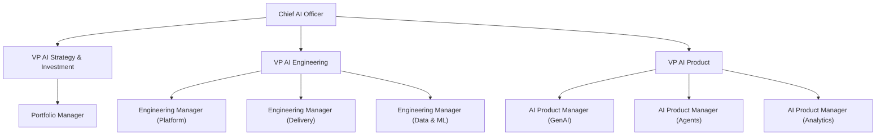
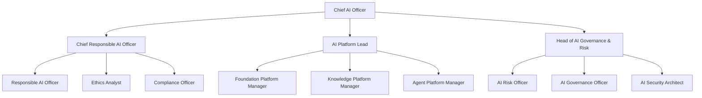

# Governance, Risk & Advisory Roles + Master RACI Matrix

Governance, risk, and advisory roles ensure enterprise AI operates within policy guardrails, regulatory requirements, and ethical frameworks.

## Responsible AI Officer

**Level:** Manager / Senior Manager | **Reports to:** Chief Responsible AI Officer or CAIO

**Responsibilities:** Conduct fairness and bias assessments for AI systems; perform responsible AI reviews for all high-risk deployments; monitor responsible AI incidents and trends; develop RAI training materials; advise teams on responsible AI principles; maintain responsible AI documentation and audit trails.

**Skills Required:** AI ethics and fairness principles; bias assessment methodologies; fairness metrics and tools; regulatory requirements; documentation and communication; technical understanding of AI systems.

## AI Risk Officer

**Level:** Senior Manager / Director | **Reports to:** CRO or Chief Compliance Officer

**Responsibilities:** Maintain enterprise AI risk register; quantify AI-specific risks; recommend risk mitigations; escalate material risks to Board; conduct quarterly risk reviews; monitor emerging AI risks; ensure AI risk integration with enterprise ERM.

**Skills Required:** Risk management and quantification; AI-specific risk taxonomy; scenario analysis; regulatory requirements; communication with Board and executives.

## AI Governance Officer

**Level:** Manager / Senior Manager | **Reports to:** CAIO or Chief Compliance Officer

**Responsibilities:** Develop and maintain AI governance policies and standards; manage AI governance approval workflows; track policy compliance; conduct governance audits; document governance decisions and rationale; update policies based on regulatory changes; ensure consistency across governance domains.

**Skills Required:** Policy development and governance frameworks; regulatory compliance; AI technical literacy; documentation and communication; process management.

## CISO / AI Security Architect

**Level:** Director / VP | **Reports to:** CISO or CEO

**Responsibilities:** Develop AI-specific security architecture and standards; conduct security threat modelling for AI systems; implement security controls for AI infrastructure; manage AI security incidents; advise on adversarial attack risks; ensure agent identity and authorization frameworks.

**Skills Required:** Security architecture and threat modelling; AI/ML security specifics; cryptography and identity; incident response; regulatory security requirements.

## Chief Data Officer (AI Perspective)

**Level:** VP / C-Suite | **Reports to:** CEO or Chief Analytics Officer

**Responsibilities:** Govern data used for AI training and inference; ensure data quality for AI; maintain data lineage and provenance; implement PII and sensitive data protections; govern AI-generated data; conduct data bias assessments; manage data access control for AI teams.

**Skills Required:** Data governance frameworks; data quality management; metadata and lineage tools; regulatory compliance (GDPR, CCPA); technical data architecture knowledge.

## AI Auditor / Internal Audit

**Level:** Manager / Senior Manager | **Reports to:** Chief Audit Officer or Board Audit Committee

**Responsibilities:** Conduct internal audits of AI governance; evaluate compliance with AI policies; assess effectiveness of controls; test monitoring and observability; report findings to Board/Audit Committee; recommend improvements.

**Skills Required:** Audit methodologies; AI/ML technical knowledge; control evaluation; sampling and statistical methods; report writing; regulatory standards.

## Master RACI Matrix

### AI Strategy & Investment Governance

| Activity | CAIO | AI Steering Committee | Portfolio Board | CFO |
|----------|------|---------------------|-----------------|-----|
| AI strategy approval | R/A | C | I | C |
| AI investment decisions | R/A | C/R | I | R/C |
| AI budget allocation | R | C | I | C |
| Executive reporting on AI | R/A | I | I | I |

### AI Delivery Governance

| Activity | AI Delivery Lead | Architect | PM | Responsible AI Officer |
|----------|-----------------|-----------|----|-----------------------|
| Proof of concept approval | R/A | C | C | C |
| Pilot deployment approval | R/A | C | C | R/C |
| Production deployment approval | R/A | C | C | R/C |
| Post-production monitoring | R/A | C | I | C |

### Risk & Compliance

| Activity | AI Risk Officer | Governance Officer | CISO | Chief Data Officer |
|----------|-----------------|-------------------|------|-------------------|
| AI risk register update | R/A | C | C | C |
| Policy compliance assessment | C | R/A | C | C |
| Security incident response | C | C | R/A | C |
| Data governance for AI | C | C | I | R/A |

### Agent Governance (Highest Risk)

| Activity | Agent Owner | AgentOps Lead | Governance Board | Responsible AI |
|----------|------------|----------------|-----------------|-----------------|
| Agent Charter approval | C | R/A | R/A | C |
| High-risk agent deployment | I | C | R/A | C |
| Agent incident response | R | R/A | C | C |
| Agent retirement approval | R/A | C | I | I |

## Organizational Structure Example (Large Enterprise, Level 4)

**Strategy, Engineering & Product Branches:**

**Chief AI Officer Organizational Structure (Part 1).** Strategy, engineering, and product leadership report directly to the CAIO, each with specialized managers.

**Responsible AI, Platform & Governance Branches:**

**Chief AI Officer Organizational Structure (Part 2).** Responsible AI, platform, and governance/risk leadership report directly to the CAIO, supporting policy, platform operations, and risk management.

---

## Related

- [AI Leadership Roles](18-part-08-organizational-roles.md)
- [Core Delivery & Engineering Roles](66-part-08-organizational-roles-core-delivery-engineering-roles.md)
- [Career Pathways & Compensation](68-part-08-organizational-roles-career-pathways-salary-benchmarks.md)

## Sources

