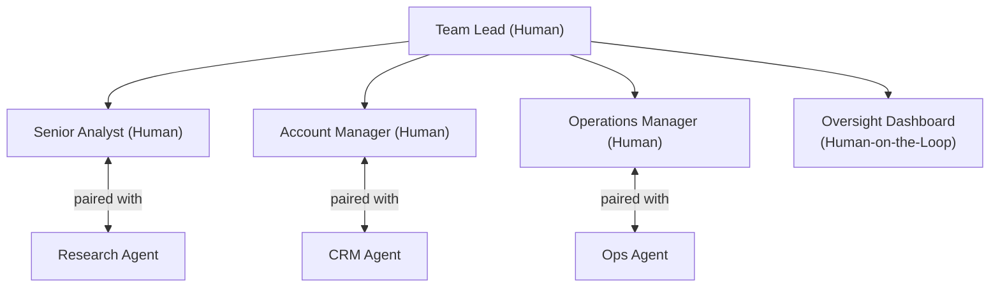

# Part 21 — Agentic Blueprints by Function & Agent-Infused Teams

## Agentic Process Blueprints by Function

### Invoice Processing (Finance)

**Current state:** Invoice received → manual data entry → validation check → 3-way match → approval routing → payment

**Agentic reimagination:**

| Step | Current Actor | Agentic Actor | HITL? |
|------|--------------|--------------|-------|
| Invoice receipt & extraction | Human (data entry) | Extraction Agent (OCR + LLM) | No |
| Validation (fields complete, supplier exists) | Human | Validation Agent | No |
| 3-way match (PO / GR / Invoice) | Human | Matching Agent | Only on mismatch |
| Exception handling | Human | Exception Agent proposes resolution | Yes |
| Approval routing | Human | Routing Agent (rules-based + AI) | No |
| Final approval (>£10K) | Human | — | Yes |
| Final approval (&lt;£10K, within policy) | Human | Payment Agent | No |
| Payment execution | Human | Payment Agent | No |

**Metrics:** Cycle time 5 days → 2 hours (exception: 4 hours). Cost per invoice £25 → £3. Error rate 8% → 0.5%. Straight-through processing 20% → 85%.

### Customer Complaint Resolution (Customer Service)

**Agentic reimagination:**

| Step | Current Actor | Agentic Actor | HITL? |
|------|--------------|--------------|-------|
| Complaint intake & classification | Human agent | Intake Agent (NLP classification) | No |
| Sentiment analysis | Human (gut feel) | Sentiment Agent | No |
| Policy lookup & eligibility check | Human (system search) | Policy Agent (RAG on policy KB) | No |
| Resolution identification | Human | Resolution Agent (proposes options) | Tier 1: No; Tier 2: Yes |
| Communication drafting | Human | Communication Agent (drafts response) | Agent sends for simple; human reviews for complex |
| Escalation decision | Human | Escalation Agent (triggers on criteria) | Human approves escalation |
| Compensation authorisation | Human (manager) | — | Yes |
| Customer notification | Human | Communication Agent | Human reviews for sensitive cases |
| Case closure & logging | Human | Closure Agent | No |

**Metrics:** Resolution time 3 days avg → 4 hours avg. First contact resolution 45% → 72%. CSAT 3.2 → 4.1 / 5. Agent capacity freed 40%.

### Loan Underwriting (Banking)

**Agentic reimagination:**

| Step | Current Actor | HITL Level |
|------|--------------|------------|
| Application intake & completeness check | Intake Agent | None |
| Credit bureau data pull | Data Agent | None |
| Income & employment verification | Verification Agent (API to payroll data) | Exception only |
| Risk scoring (credit model) | Risk Agent (ML model + LLM explainer) | None |
| Policy compliance check | Compliance Agent | None |
| Decision (auto-approve: &lt;£50K, score >750) | Decision Agent | None (straight-through) |
| Decision (borderline: score 650–750) | Decision Agent + human reviewer | Yes |
| Decision (complex / >£250K) | Human underwriter (Agent informs) | Human-led |
| Offer letter generation | Document Agent | None |
| Customer communication | Communication Agent | Human reviews for rejected applications |

**Metrics:** Underwriting cycle time 5–7 days → 2 hours (simple) / 1 day (complex). Straight-through processing 15% → 55%. Consistency (policy compliance) 92% → 99.5%.

## Agent-Infused Teams: Organisational Pattern

### What Is an Agent-Infused Team?

An **Agent-Infused Team** is a human team where AI agents are integrated as functional members — handling defined tasks, producing work products, and participating in the team's workflow — rather than being a background tool.

The mental model shifts from *"a team that uses AI tools"* to *"a team whose roster includes human and agent members."*

### Agent-Infused Team Structure

**Agent-Infused Team Structure.** Each human team member is paired with a corresponding agent that handles routine tasks; the Team Lead coordinates all members and oversees the system via a monitoring dashboard.

### Agent-Infused Team Design Principles

1. **Each human member has a corresponding agent** that handles their routine cognitive load
2. **Agents have a job description** (agent specification / charter) just like a human team member
3. **Agents attend the team retrospective** (their performance metrics are reviewed in team standups)
4. **Human owns the agent's work** — the human is accountable for what the agent produces
5. **Agent learns from human feedback** — corrections and approvals feed back to improve agent performance

### Agent Team Member "Job Descriptions"

| Agent Role | Human Equivalent | Responsibilities |
|-----------|-----------------|-----------------|
| Research Agent | Junior Analyst | Gather data, synthesise findings, draft reports |
| Communication Agent | Coordinator | Draft emails, meeting summaries, status updates |
| Data Agent | Data Analyst | Pull reports, run queries, flag anomalies |
| Scheduling Agent | EA / Coordinator | Manage calendar, schedule meetings, send reminders |
| Compliance Agent | Compliance Analyst | Check actions against policy, flag risks |
| Monitoring Agent | Operations Analyst | Monitor dashboards, alert on exceptions |

### Metrics for Agent-Infused Teams

| Metric | Measurement |
|--------|------------|
| Agent task completion rate | % of delegated tasks completed without human intervention |
| Time saved per human per week | Hours reclaimed from routine tasks |
| Human capacity utilisation | % time spent on high-value vs. routine tasks |
| Agent error rate | % tasks requiring correction or rework |
| Team satisfaction with agents | NPS / survey: do team members feel agents help? |
| Business output per team | Team productivity measured by outcomes |

## Process Metrics & Measurement Framework

### Efficiency Metrics

| Metric | Formula | Baseline | Target |
|--------|---------|----------|--------|
| Cycle Time | End time − Start time | Process-dependent | 50–80% reduction |
| Throughput | Transactions per hour | Process-dependent | 3–10× increase |
| Cost per Transaction | Total cost / Volume | Process-dependent | 60–80% reduction |
| Straight-Through Rate | Auto-completed / Total | 10–30% typical | 60–85% target |

### Quality Metrics

| Metric | Formula | Target |
|--------|---------|--------|
| Error Rate | Errors / Transactions | &lt;1% (vs. 3–8% human) |
| Rework Rate | Rework / Transactions | &lt;0.5% |
| Policy Compliance Rate | Compliant / Total | >99.5% |
| First-Time-Right Rate | Correct first attempt / Total | >98% |

### Autonomy Metrics

| Metric | Formula | Target |
|--------|---------|--------|
| Agent Autonomy Rate | Agent-completed steps / Total steps | 70–85% (mature) |
| HITL Rate | Human interventions / Transactions | 10–20% (target) |
| Human Override Rate | Overrides / Agent decisions | &lt;5% |
| Escalation Accuracy | Necessary escalations / Total escalations | >80% |

### Business Outcome Metrics

Always tie agentic process metrics to the business outcome:
- Invoice processing → working capital efficiency, vendor satisfaction
- Loan underwriting → approval cycle time, default rate, customer conversion
- Customer service → CSAT, resolution rate, NPS, cost per contact

## Related

- [Part 21 — Agentic Process Design Methodology](31-part-21-agentic-process-blueprint.md) — Design methodology and patterns
- [Part 2 — Operating Models](12-part-02-operating-models.md) — Digital Workforce and Agent Factory operating models
- [Part 5 — Agentic AI Delivery Lifecycle](15-part-05-agentic-lifecycle.md) — How to build the agents in this blueprint
- [Part 9 — AI Operating Processes](19-part-09-operating-processes.md) — Agent approval, rollback, and monitoring processes

## Sources

[No external sources for this page.]
