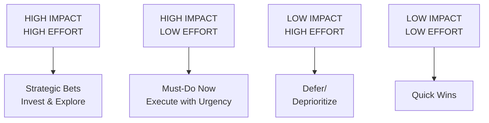
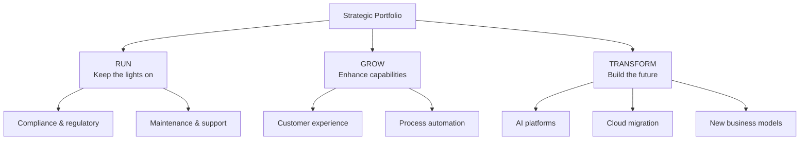
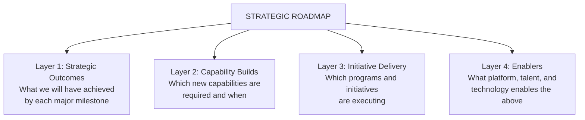

# Corporate Strategy: Themes, Priorities & Initiatives

Strategic themes translate strategic intent into domains of focus. Priorities operationalize those themes when resource constraints force trade-offs. Objectives make priorities measurable. This section connects the organization's enduring ambition to actionable work.

## Strategic Themes

**Strategic Themes** are the 3–7 categories into which the organization groups its strategic work. They translate the strategic intent into domains of focus. Themes function as organizational "chapters" — everything done strategically belongs to one or more themes. They are not projects; they are sustained organizational commitments lasting multiple planning cycles.

**Typical theme categories across industries:**

| Theme Category | Banking Example | Healthcare Example |
|---|---|---|
| **Growth** | "Expand SMB digital banking" | "Grow outpatient volumes by 20%" |
| **Customer** | "Deliver seamless mobile-first experience" | "Reduce patient wait times by 40%" |
| **Operational Excellence** | "Reduce cost-to-serve by 30%" | "Automate claims processing" |
| **Technology & Platform** | "Cloud-native core banking migration" | "Unified clinical data platform" |
| **People & Culture** | "Build AI-fluent workforce" | "Zero burnout operating model" |
| **Risk & Compliance** | "AI-powered fraud prevention" | "HIPAA + AI governance framework" |
| **Sustainability** | "Net-zero operations by 2030" | "Green hospital initiative" |

## Strategic Priorities

**Strategic Priorities** are ranked choices within and across themes. When resource constraints force trade-offs — and they always do — priorities determine which work gets funded, staffed, and executed first. Priorities are the executive's answer to: *"If you could only do three things this year, which three would create the most strategic value?"*

**Prioritization framework (Two-Axis Model):**

## Strategic Objectives

**Strategic Objectives** are specific, measurable outcomes the organization commits to achieving within a defined planning period (usually 1–3 years). They operationalize themes and priorities.

A well-formed Strategic Objective is SMART:
- **Specific**: Names the outcome clearly
- **Measurable**: Has a quantified target
- **Achievable**: Realistic given available resources
- **Relevant**: Directly supports a strategic theme
- **Time-bound**: Has a deadline

**Strategic Objectives by theme (examples):**

| Theme | Objective |
|---|---|
| Customer Experience | Increase NPS from 32 to 55 by Q4 2027 |
| Digital Transformation | Migrate 80% of core banking workloads to cloud by end of FY2027 |
| AI Enablement | Deploy AI assistants across 100% of frontline roles by Q2 2027 |
| Risk & Compliance | Reduce false-positive fraud alerts by 60% by Q3 2027 |
| Operational Excellence | Cut cost-to-serve per customer by 25% by FY2028 |

## Strategic Initiatives and Programs

**Strategic Initiatives** are funded, time-bound efforts designed to achieve one or more strategic objectives. They are larger than projects but smaller than programs. An initiative crosses multiple teams and requires governance.

**Initiative anatomy:**

| Element | Content |
|---|---|
| Strategic Objective Supported | Must link to at least one objective |
| Scope | What is in and out |
| Outcomes / KPIs | Measurable success criteria |
| Investment Required | CapEx, OpEx, headcount |
| Risks | Top 3–5 risks with mitigations |
| Dependencies | Other initiatives or programs |
| Owner | Named executive sponsor |
| Timeline | Start, key milestones, end |

**Strategic Programs** are structured groupings of related projects and initiatives that deliver a shared strategic outcome. Programs have lifecycles, governance structures, benefit realization plans, and dedicated leadership.

**Program vs. Project:**

| Dimension | Program | Project |
|---|---|---|
| **Duration** | 1–5 years | 3–18 months |
| **Scope** | Multiple delivery streams | Single delivery scope |
| **Governance** | Program Steering Committee | Project Sponsor |
| **Benefits** | Ongoing benefits realization | Defined at project completion |
| **Change** | Accepts and manages scope evolution | Resists scope change |
| **Complexity** | High — multiple dependencies | Medium — contained |

## Strategic Portfolio and Roadmap

The **Strategic Portfolio** is the enterprise's full inventory of strategic initiatives, programs, and transformation efforts, viewed holistically for investment balance, risk, and alignment.

**Portfolio management dimensions:**

**Horizon 3 Framework (McKinsey / BCG):**

| Horizon | Description | Typical Investment |
|---|---|---|
| **H1 — Core** | Defend and extend current core business | 60–70% |
| **H2 — Emerging** | Nurture emerging growth engines | 20–30% |
| **H3 — Futures** | Seed transformational bets | 5–10% |

The **Strategic Roadmap** is the temporal visualization of when initiatives, programs, and capabilities will be delivered — and in what sequence — to achieve the Strategic Intent.

A complete Strategic Roadmap has four layers:

Four-layer temporal roadmap showing strategic outcomes, capabilities, initiatives, and enabling infrastructure.

## Related

- [Corporate Strategy: Vision, Mission, Purpose & Intent](./43-vol1-corporate-strategy.md)
- [Strategy Taxonomy & 24 Types](./83-vol1-corporate-strategy-strategy-taxonomy-24-types.md)
- [Portfolio Governance Fundamentals](./46-vol3-portfolio-governance.md)

## Sources

---
