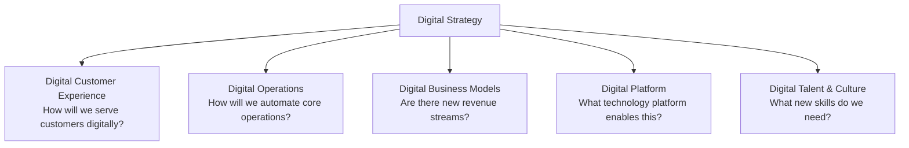
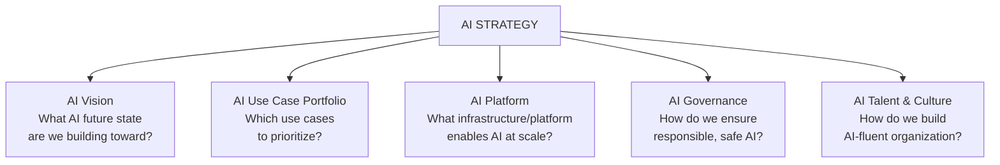
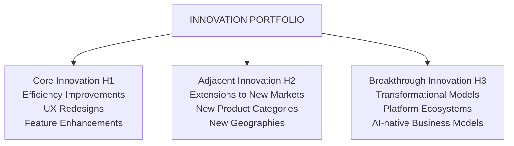

# Corporate Strategy: The 24-Type Strategy Taxonomy

Not all strategies are the same. Organizations execute 24 distinct strategy types — from corporate strategy (which businesses to be in) through tactical product strategy. Understanding the taxonomy prevents confusion and ensures coherent strategy formulation.

## Corporate Strategy

**Definition:** The highest-level strategy defining the scope of the enterprise — which businesses to be in, how to allocate capital, and how to create synergies across business units.

**Key decisions:**
- Diversification: Related vs. unrelated business units
- Portfolio balance: Which units to grow, hold, or divest
- Capital allocation: Where to invest enterprise resources
- M&A: Which acquisitions or partnerships strengthen position
- Corporate center model: Holding company vs. operating company

**Consulting lens:** BCG Growth-Share Matrix (Stars, Cash Cows, Question Marks, Dogs), McKinsey Portfolio Strategy, Ansoff Matrix.

**Example:** A global bank's Corporate Strategy decides whether to operate retail banking, investment banking, asset management, and insurance as integrated or separately governed businesses — and how capital is deployed across each.

## Business Strategy

**Definition:** The strategy for a specific business unit — how it will compete within its market to achieve sustainable competitive advantage.

**Michael Porter's Generic Strategies:**
- **Cost Leadership**: Win by being the lowest-cost producer (Walmart, Ryanair)
- **Differentiation**: Win by offering uniquely valuable features (Apple, Tesla)
- **Focus / Niche**: Win by serving a specific segment better than anyone (Rolls Royce, boutique SaaS)

**Example:** A hospital system's Business Strategy might choose differentiation through clinical excellence and AI-assisted diagnostics rather than competing on cost.

## Functional Strategy

**Definition:** Strategy for a specific function (Finance, HR, Marketing, Technology, Operations) that aligns functional priorities with the business strategy.

| Function | Strategy Example |
|---|---|
| **Finance** | Zero-based budgeting to reallocate 20% of cost base to growth |
| **HR** | Hire-to-learn culture with AI literacy upskilling for all roles |
| **Marketing** | Shift 70% of budget from paid acquisition to content/community |
| **Technology** | API-first, cloud-native, vendor-agnostic platform strategy |
| **Operations** | Six Sigma + AI-assisted quality management across all plants |

## Digital Strategy

**Definition:** The plan for using digital technologies (cloud, mobile, data, AI) to transform business models, customer experiences, and operational capabilities.

**Digital Strategy Components:**



**Maturity Stages:**
1. Digital Dabbler — Isolated digital experiments
2. Digital Follower — Copying digital leaders
3. Digital Challenger — Differentiating through digital
4. Digital Native — Business model fundamentally digital
5. Digital Leader — Setting industry standards

## AI Strategy

**Definition:** The strategic framework for how an organization will develop, deploy, govern, and extract value from Artificial Intelligence — including GenAI, ML, and Agentic AI systems.

**AI Strategy Framework (Five Dimensions):**



Five interdependent dimensions for comprehensive AI strategy development.

**AI Maturity Stages:**
1. AI Aware — Exploring, isolated POCs
2. AI Adopter — Deploying AI tools, early value realization
3. AI Practitioner — AI embedded in key processes
4. AI Native — AI in core business model
5. AI Leader — Setting industry standards

## Data Strategy

**Definition:** The framework for how an organization collects, stores, governs, and monetizes data as a strategic asset.

**Data Strategy Pillars:**

| Pillar | Description |
|---|---|
| **Data as Product** | Treat datasets as managed products with owners, SLAs, consumers |
| **Data Governance** | Policies, standards, ownership, and quality controls |
| **Data Architecture** | Platforms (data lake, lakehouse, mesh, fabric) |
| **Data Culture** | Data literacy, self-service analytics, evidence-based decisions |
| **Data Monetization** | How data creates direct or indirect revenue |

## Cloud Strategy

**Definition:** The framework for how an organization uses cloud platforms (AWS, Azure, GCP) to deliver technology capabilities faster, more elastically, and at lower cost.

**Cloud Strategy Patterns:**

| Pattern | Description | When to Use |
|---|---|---|
| **Cloud First** | Default to cloud for all new workloads | Greenfield / modernizing organization |
| **Cloud Native** | Build on cloud-native services from the start | New products, startups |
| **Hybrid Cloud** | Mix of on-premises and cloud | Regulated, data sovereignty, legacy |
| **Multi-Cloud** | Use multiple cloud providers strategically | Avoid lock-in, best-of-breed |
| **Sovereign Cloud** | Data and compute stay in-country | Government, defense, healthcare |

**Migration Strategy (6 R's):**
- **Retire**: Decommission no-longer-needed systems
- **Retain**: Keep on-premises (too risky/costly to migrate now)
- **Rehost**: "Lift and shift" — move as-is
- **Replatform**: Move with minor optimizations
- **Repurchase**: Replace with SaaS equivalent
- **Refactor**: Redesign for cloud-native architecture

## Technology Strategy

**Definition:** The organization's decisions about which technology capabilities to build, buy, or partner; what standards to adopt; and how to evolve the technology landscape over time.

**Technology Strategy Components:**

| Component | Description |
|---|---|
| **Build vs. Buy vs. Partner** | Decision framework for capability acquisition |
| **Platform Selection** | Which technology platforms anchor the stack |
| **Standards & Principles** | Non-negotiable architectural standards |
| **Technical Debt Strategy** | How legacy systems are rationalized |
| **Open Source Policy** | Contribution, consumption, governance |
| **Vendor Management** | Strategic vs. commodity vendor relationships |

## Innovation Strategy

**Definition:** The framework for how an organization identifies, funds, incubates, and scales new ideas — from incremental product improvements to business model reinvention.

**Innovation Portfolio (3 Horizons applied to Innovation):**



Three innovation horizons balance incremental improvements, adjacent market expansion, and transformational business model innovation.

## Product Strategy

**Definition:** The framework for which products to build, for which customers, at which price points, and through which channels — and how to evolve the product portfolio over time.

**Product Strategy Hierarchy:**

```
PRODUCT VISION → PRODUCT STRATEGY → PRODUCT ROADMAP → PRODUCT BACKLOG
```

**Product Strategy Tools:** Jobs To Be Done (JTBD), Opportunity-Solution Tree, Kano Model, Product-Market Fit analysis.

## Customer Strategy

**Definition:** How the organization will acquire, retain, grow, and delight customers — including segmentation, value proposition design, and customer experience.

| Dimension | Key Question | Tools |
|---|---|---|
| **Segmentation** | Which customers do we serve? | RFM analysis, psychographics, needs-based |
| **Value Proposition** | Why do they choose us? | Value Proposition Canvas, JTBD |
| **Acquisition** | How do we win new customers? | Channel strategy, growth loops |
| **Retention** | How do we keep them? | NPS, Customer Success, lock-in |
| **Growth** | How do we expand wallet share? | Cross-sell, upsell, ecosystem |
| **Experience** | How do we delight them? | Customer Journey Map, CX blueprint |

## Platform Strategy

**Definition:** The strategy for building or participating in multi-sided platforms that create network effects — connecting producers and consumers while enabling third-party ecosystem participation.

**Platform vs. Pipeline Business:**

| Dimension | Pipeline | Platform |
|---|---|---|
| **Value Creation** | The firm creates value | Network participants create value |
| **Economics** | Linear cost scaling | Exponential value with network growth |
| **Competition** | Compete on product features | Compete on ecosystem size |
| **Examples** | Traditional manufacturer | Apple App Store, AWS Marketplace |

**Platform Strategy Types:**
- **Transaction Platform**: Enables exchange (Uber, eBay)
- **Innovation Platform**: Enables third-party building (iOS, Salesforce)
- **Integration Platform**: Connects enterprise systems (MuleSoft)
- **Data Platform**: Aggregates and shares data (Bloomberg, Palantir)

## Related

- [Corporate Strategy Overview](./43-vol1-corporate-strategy.md)
- [Consulting Frameworks Landscape](./47-vol4-consulting-frameworks-industry.md)
- [AI Strategy Deep Dive](./48-vol5-ai-strategy-transformation-glossary.md)

## Sources

---
