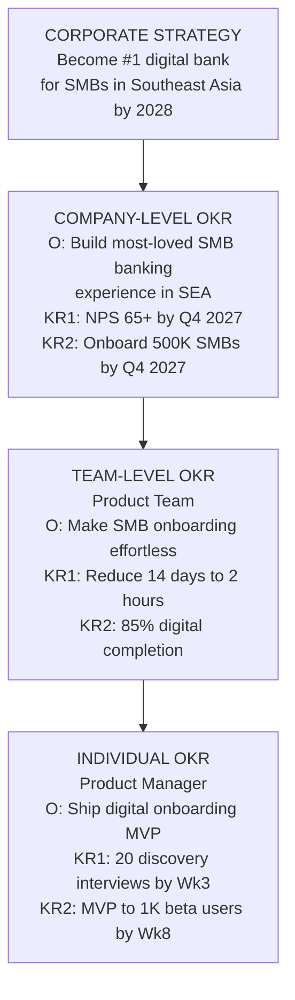
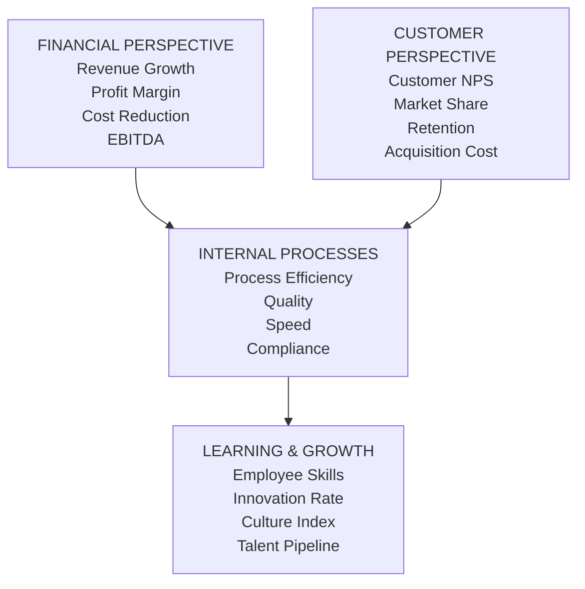
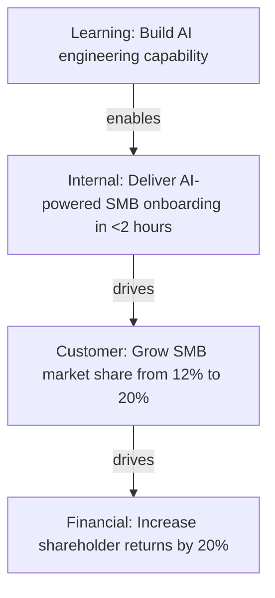
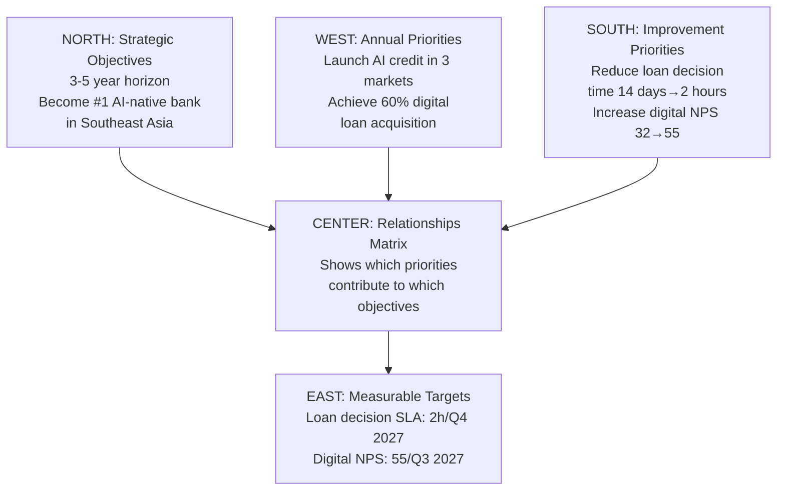

# Corporate Strategy: Execution, Templates & KPIs

Seventy to ninety percent of strategies fail — not in formulation but in execution. This section addresses how to translate strategy into action, track execution, and adapt.

## The Execution Gap

Research consistently shows that the gap between strategy formulation and strategy execution stems from predictable causes:

1. **Strategy not translated** — Frontline teams never know what the strategy means for their work
2. **Resources not realigned** — Budget and headcount continue funding old priorities
3. **Governance absent** — No mechanism to track strategy delivery and course-correct
4. **Capability gaps** — Strategy requires capabilities the organization doesn't have
5. **Culture misalignment** — Strategy requires behaviors the culture doesn't support

## OKR Framework: Linking Strategy to Execution

**Objectives and Key Results (OKRs)** are the dominant mechanism for translating strategy into executable goals across the organization.

**How OKRs cascade:**



OKRs cascade from corporate strategy through company, team, and individual levels with specific measurable key results.

**OKR design rules:**
- **Ambitious** — Should feel slightly uncomfortable; 70% completion is good
- **Qualitative Objective** — Inspiring, memorable, directional
- **Quantitative KRs** — 3–5 per objective; clearly measurable; binary
- **Time-bound** — Quarterly (teams) or Annual (company)
- **Transparent** — Published across the organization
- **Tracked** — Weekly check-ins; quarterly scoring

**OKR Scoring:**
- 0.0–0.3: Failed to make real progress
- 0.4–0.6: Made progress but fell short
- 0.7–1.0: Delivered (0.7 is considered "ideal")

## Balanced Scorecard: Multi-Perspective Measurement

The **Balanced Scorecard** (Kaplan & Norton) provides four perspectives for measuring strategy execution — preventing over-focus on financial metrics alone.



Four balanced perspectives on strategy execution: financial results drive customer metrics and internal processes enable learning and growth.

**Strategy Map:** Kaplan & Norton's companion tool shows causal linkages between objectives across the four perspectives.



## Hoshin Kanri: Strategy Deployment

**Hoshin Kanri** (Japanese for "policy deployment") is Toyota's method for cascading strategy through the organization with disciplined alignment at every level.

**Hoshin X-Matrix:**



Toyota's policy deployment framework uses compass directions to align strategic objectives, annual priorities, improvements, and measurable targets.

## Strategy Governance Cadence

**Strategy Governance** is the formal mechanism for reviewing strategy execution, making course corrections, and reallocating resources when conditions change.

| Cadence | Forum | Agenda | Owner |
|---|---|---|---|
| **Weekly** | Program / Team level | Sprint delivery, blockers | Program Managers |
| **Monthly** | Initiative level | Milestone tracking, risk | Initiative Owners |
| **Quarterly** | Strategy Review | OKR progress, portfolio | C-Suite + EA |
| **Annual** | Strategic Planning | Refresh strategy, roadmap | CEO + Board |

## Strategy Templates

### One-Page Strategic Plan

```
ORGANIZATION: ____________________    PERIOD: FY____

VISION: ____________________________________________
(What we want to become — 10+ year horizon)

MISSION: ___________________________________________
(What we do today — for whom and how)

STRATEGIC INTENT: __________________________________
(Our specific competitive ambition for the next 3–5 years)

STRATEGIC THEMES:
1. _________________ 2. _________________ 3. _________________
4. _________________ 5. _________________

STRATEGIC OBJECTIVES (FY____):
Theme 1: ___________________________  KPI: ______  Target: ______
Theme 2: ___________________________  KPI: ______  Target: ______
Theme 3: ___________________________  KPI: ______  Target: ______

TOP 5 STRATEGIC INITIATIVES:
1. _________________ Owner: ______ Budget: $______ Completion: ______
2. _________________ Owner: ______ Budget: $______ Completion: ______
3. _________________ Owner: ______ Budget: $______ Completion: ______
4. _________________ Owner: ______ Budget: $______ Completion: ______
5. _________________ Owner: ______ Budget: $______ Completion: ______

KEY RISKS:
1. _________________________________ Mitigation: _________________
2. _________________________________ Mitigation: _________________
3. _________________________________ Mitigation: _________________
```

### Strategic Initiative Brief

```
STRATEGIC INITIATIVE BRIEF

Initiative Name: ___________________________________________
Strategic Objective Supported: _____________________________
Initiative Sponsor: ________________________________________
Initiative Owner: __________________________________________

PROBLEM STATEMENT
What problem are we solving? Who does it affect? Cost of inaction?
_____________________________________________________________

PROPOSED SOLUTION
What will we build/change? What is the scope?
_____________________________________________________________

EXPECTED OUTCOMES
KPI 1: _________________  Current: ______  Target: ______
KPI 2: _________________  Current: ______  Target: ______
KPI 3: _________________  Current: ______  Target: ______

INVESTMENT REQUIRED
CapEx: $_______  OpEx (annual): $_______  Headcount: _____ FTE

TIMELINE
Start: ________  Milestones: ________  End: ________

TOP RISKS
1. _________________________ (Likelihood: H/M/L, Impact: H/M/L)
2. _________________________ (Likelihood: H/M/L, Impact: H/M/L)

DEPENDENCIES
Upstream: _______________  Downstream: _______________

APPROVAL REQUIRED FROM: ___________________________________
```

## KPIs and Metrics for Strategy

### Corporate Strategy KPIs

| KPI | Definition | Formula |
|---|---|---|
| **Shareholder Value Created** | Economic Value Added | NOPAT − (WACC × Capital Employed) |
| **Revenue Growth Rate** | YoY revenue change | (Current − Prior) / Prior × 100 |
| **Market Share** | Share of addressable market | Own Revenue / TAM × 100 |
| **Strategic Initiative ROI** | Return on strategic investment | Net Benefit / Total Investment |
| **Strategy Execution Score** | % of OKRs achieved at green | Achieved OKRs / Total OKRs × 100 |

### Business Strategy KPIs

| KPI | Definition | Best For |
|---|---|---|
| **Customer Lifetime Value (CLV)** | Total value of customer relationship | Customer strategy, retention |
| **Net Promoter Score (NPS)** | Likelihood to recommend | CX, brand |
| **Gross Margin** | Revenue − COGS / Revenue | Competitive position |
| **Customer Acquisition Cost (CAC)** | Cost to acquire one customer | Growth strategy |
| **Market Penetration Rate** | % of addressable market captured | Growth tracking |

## Common Strategy Mistakes

| Mistake | What It Looks Like | How to Avoid |
|---|---|---|
| **Strategic Ambiguity** | Generic themes like "Be innovative" | Force SMART objectives with targets |
| **Kitchen Sink Strategy** | 20+ strategic priorities | Limit to 5 priorities maximum |
| **Inside-Out Strategy** | No competitive analysis | Porter's Five Forces + PESTLE analysis |
| **Strategy by Template** | BCG matrix filled in cosmetically | Connect every tool to real investment decisions |
| **Resource Non-alignment** | Strategy changes but budget stays the same | Zero-based strategic budgeting |
| **No Governance Rhythm** | No monthly/quarterly review cadence | Strategy governance calendar from Day 1 |
| **Cascade Failure** | Strategy stops at VP level | OKRs cascaded to every team |

## Related

- [Strategic Themes, Priorities & Initiatives](./82-vol1-corporate-strategy-themes-priorities-initiatives.md)
- [Portfolio Governance & PMO Models](./46-vol3-portfolio-governance.md)
- [Consulting Frameworks](./47-vol4-consulting-frameworks-industry.md)

## Sources

---
