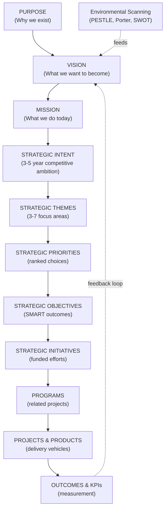

# Corporate Strategy: Relationships & Industry Comparisons

Strategic concepts do not exist in isolation. This section maps how every strategy concept connects, how strategy translates across industries, and the consulting vocabulary that bridges theory and practice.

## Strategy Hierarchy — Full Relationship Map

Every concept must be traceable upward to its strategic anchor and downward to its execution vehicle. This prevents strategy from becoming disconnected from operations.

## Industry Strategy Comparisons 2026

### Banking Strategy

**Strategic Context:** Embedded finance, AI-native challengers (Nubank, Revolut), open banking mandates, BNPL disruption, crypto/DeFi, post-SVB regulatory tightening.

**Key Strategic Moves:**
- **Platform play**: Offer BaaS (Banking as a Service) to third parties
- **AI-first risk**: Replace rule-based credit scoring with AI models
- **Ecosystem**: Integrate beyond financial services (insurance, tax, payments)
- **Workforce**: AI + automation reducing middle/back office headcount

**Capability Priorities:** Digital onboarding, embedded finance APIs, AI credit, real-time payments, cloud-native core.

### Healthcare Strategy

**Strategic Context:** Provider consolidation, payer-provider convergence, value-based care, AI diagnostics, GLP-1 drug transformation, staffing shortage.

**Key Strategic Moves:**
- **Vertical integration**: Payer-provider convergence (UnitedHealth/Optum model)
- **AI adoption**: Ambient AI for clinical documentation, AI-assisted diagnostics
- **Virtual care**: Hybrid care models (in-person + telehealth)
- **Data monetization**: Aggregated patient data for pharmaceutical research

**Capability Priorities:** Unified patient record, AI clinical decision support, value-based contract management, care navigation platform.

### Retail Strategy

**Strategic Context:** Physical store decline, Amazon dominance, social commerce, q-commerce (15-minute delivery), sustainability pressure, AI personalization.

**Key Strategic Moves:**
- **Unified commerce**: Seamless omnichannel experience (physical+digital)
- **Retail media**: Monetize first-party data through advertising
- **Supply chain AI**: Demand forecasting, inventory optimization
- **Sustainability**: Circular economy, returns optimization

**Capability Priorities:** Composable commerce platform, first-party data platform, AI personalization, supply chain visibility.

### Manufacturing Strategy

**Strategic Context:** Supply chain resilience post-COVID, Industry 4.0/5.0, reshoring, energy transition, labor automation, predictive maintenance AI.

**Key Strategic Moves:**
- **Smart factory**: IoT + AI for predictive maintenance and quality control
- **Supply chain resilience**: Dual-sourcing, nearshoring, real-time visibility
- **Sustainability**: Carbon tracking, circular manufacturing, green energy
- **Digital twin**: Virtual factory models for simulation and optimization

**Capability Priorities:** Manufacturing execution system, IoT + edge AI, supply chain control tower, digital twin platform.

### Telecommunications Strategy

**Strategic Context:** 5G monetization challenge, OTT competition, infrastructure costs, B2B opportunity, enterprise connectivity, satellite competition.

**Key Strategic Moves:**
- **B2B pivot**: Enterprise and government contracts for private 5G
- **Infrastructure monetization**: Tower sharing, spectrum trading, API economy
- **AI operations**: Network automation, AI-powered NOC
- **Beyond connectivity**: Edge computing, IoT platforms, smart city plays

**Capability Priorities:** Network-as-a-Service API, private 5G platform, AI network operations, B2B digital channel.

### Government Strategy

**Strategic Context:** Digital-first citizen services, AI adoption with safety guardrails, legacy modernization, cyber threats, trust deficit, data sovereignty.

**Key Strategic Moves:**
- **Citizen-centric digital services**: Single digital identity, joined-up services
- **AI with guardrails**: Deploy AI at scale with human oversight (Human-in-the-Loop)
- **Cloud sovereignty**: Government cloud with data sovereignty compliance
- **Zero trust security**: Architecture-wide security modernization

**Capability Priorities:** Digital identity platform, AI governance framework, cloud sovereign foundation, interoperability platform.

## Consulting Terminology for Strategy

| Term | Meaning | Firm Origin |
|---|---|---|
| **True North** | The ultimate guiding objective | Lean / Toyota |
| **Big Hairy Audacious Goal (BHAG)** | Ambitious 10–30 year goal | Collins & Porras |
| **Bright Spots** | Areas of success to replicate at scale | Switch / Chip Heath |
| **Burning Platform** | Crisis creating urgency for change | Change management |
| **Hockey Stick** | Optimistic growth projection showing sharp future upturn | Investment/VC |
| **North Star Metric** | Single metric capturing core value delivered | Product strategy |
| **Day 1 Mentality** | Acting as if you are still a startup | Bezos / Amazon |
| **Working Backwards** | Start with customer need, work back to solution | Amazon / PR-FAQ |
| **5 Whys** | Root cause analysis by asking "why" five times | Toyota / Lean |
| **MECE** | Mutually Exclusive, Collectively Exhaustive | McKinsey |
| **Issue Tree** | Hierarchical decomposition of a problem | McKinsey / BCG |
| **Hypothesis-Led** | Start with hypothesis, gather evidence to confirm/reject | McKinsey |
| **Time to Value** | How quickly an initiative produces measurable benefit | Consulting |
| **Run Rate** | Annualized projection of current performance | Finance |
| **Waterfall Benefits** | Benefits that flow from upstream to downstream initiatives | Program Mgmt |

## Concept-to-Concept Relationships

| Concept A | Relationship | Concept B |
|---|---|---|
| Vision | Achieved through | Mission execution |
| Mission | Operationalizes | Strategic Intent |
| Strategic Intent | Expressed in | Strategic Themes |
| Strategic Themes | Prioritized into | Strategic Priorities |
| Strategic Priorities | Measured by | Strategic Objectives |
| Strategic Objectives | Achieved by | Strategic Initiatives |
| Strategic Initiatives | Grouped into | Programs |
| Programs | Decomposed into | Projects |
| Business Strategy | Defines requirements for | Capabilities |
| Capabilities | Delivered by | Value Streams |
| Value Streams | Executed through | Business Processes |
| Business Processes | Supported by | Applications |
| Capability Gaps | Drive | Strategic Initiatives |

## Related

- [Corporate Strategy Overview](./43-vol1-corporate-strategy.md)
- [Strategy Themes & Priorities](./82-vol1-corporate-strategy-themes-priorities-initiatives.md)
- [Consulting Frameworks & Playbooks](./47-vol4-consulting-frameworks-industry.md)
- [Master Glossary A-Z](./99-vol5-ai-strategy-transformation-glossary-glossary-a-to-h.md)

## Sources

---
