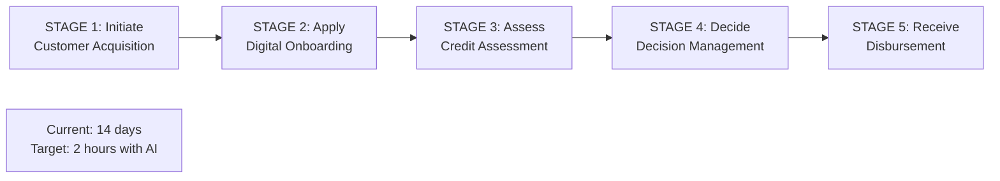
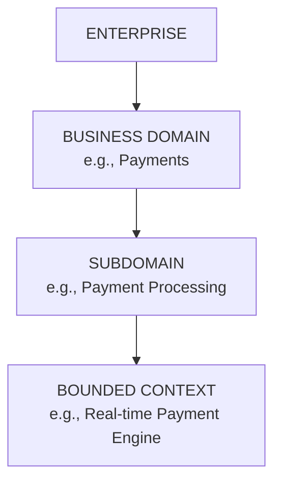

# Business Architecture: Value Streams, Domains & Model Design

Value streams map stakeholder experiences end-to-end. Domains establish autonomous organizational boundaries. Business model canvas captures how organizations create value.

## Porter's Value Chain

**Porter's Value Chain** decomposes an organization into strategically relevant activities to identify competitive advantage sources.

Primary Activities (directly create value): Inbound Logistics → Operations → Outbound Logistics → Marketing & Sales → Service

Support Activities (enable primary): Firm Infrastructure, HR Management, Technology Development, Procurement

**Value Chain Analysis for AI Transformation:**

| Stage | AI Application | Value Created |
|---|---|---|
| Inbound | AI demand forecasting, supplier risk scoring | Reduced inventory cost |
| Operations | Predictive maintenance, quality AI | Reduced downtime, zero-defect quality |
| Outbound | AI route optimization | Reduced delivery time/cost |
| Sales | AI personalization, lead scoring | Higher conversion |
| Service | AI agents, predictive service | Lower cost to serve |

## Value Streams (BIZBOK Definition)

A **Value Stream** is an end-to-end sequence of activities that creates value for a specific stakeholder — customer, employee, partner, or regulator.

**Value Stream vs. Business Process:**

| Dimension | Value Stream | Business Process |
|---|---|---|
| **Perspective** | Outside-in (stakeholder experience) | Inside-out (how we do work) |
| **Boundary** | End-to-end, crosses departments | Often within a function |
| **Focus** | Value delivered | Activity sequence |
| **Measurement** | Value delivered to stakeholder | Efficiency of execution |

**Example: Retail Banking "Customer Gets a Loan"**

End-to-end value stream stages showing loan origination from customer acquisition through disbursement with AI-driven acceleration.

## Value Streams in SAFe

SAFe uses Value Streams as the organizing unit for large-scale agile delivery. **Agile Release Train (ART):** A SAFe team-of-teams aligned to a single development value stream, delivering every 8–12 weeks.

## Business Domains and Domain-Driven Design

A **Business Domain** is a bounded area of business knowledge and activity that is cohesive and distinct. Domains bridge business architecture and software architecture.

**Domain Hierarchy:**

Hierarchical decomposition from enterprise to specific bounded contexts defining software architecture boundaries.

**Domain-Driven Design (DDD)** (Eric Evans, 2003) provides vocabulary for designing software that reflects business domains accurately.

| DDD Concept | Definition | BA Equivalent |
|---|---|---|
| **Domain** | Sphere of knowledge | Business Domain |
| **Ubiquitous Language** | Shared vocabulary | Business Glossary |
| **Bounded Context** | Explicit boundary where model applies | Sub-domain / microservice boundary |
| **Context Map** | Shows bounded context relationships | Business Domain integration map |
| **Aggregate** | Cluster treated as unit | Business Object |
| **Domain Event** | Something that happened | Business Event |

**Context Map Patterns:**
- **Shared Kernel** — Two contexts share a subset of domain model
- **Customer-Supplier** — Upstream-downstream dependency
- **Conformist** — Downstream adopts upstream model
- **Anti-Corruption Layer** — Isolation layer from legacy/external systems
- **Published Language** — Shared interchange format (e.g., FHIR in healthcare)
- **Open Host Service** — Upstream exposes API for downstream

**Business Events** trigger processes, decisions, and notifications across domains. Event-driven architecture translates business events into technical messages enabling loose coupling and real-time responsiveness.

## Business Model Canvas

**Business Model Canvas** (Osterwalder, 2010) is the dominant tool for designing how organizations create, deliver, and capture value.

Nine Building Blocks:

| Block | Question | Example (SaaS) |
|---|---|---|
| **Customer Segments** | Who are we creating value for? | Mid-market finance teams |
| **Value Propositions** | What value do we deliver? | Close books 10x faster with AI |
| **Channels** | How do we reach customers? | Product-led, inside sales, partner |
| **Customer Relationships** | How do we maintain relationships? | Self-serve + Customer Success |
| **Revenue Streams** | How do we generate revenue? | Subscription + usage-based |
| **Key Resources** | What assets does our model require? | AI models, data, engineering talent |
| **Key Activities** | What must we do well? | Product development, AI training, sales |
| **Key Partners** | Who do we work with? | AWS, Salesforce, accounting firms |
| **Cost Structure** | What are the major costs? | R&D, cloud infrastructure, sales |

**Value Proposition Canvas** zooms into one cell — the customer segment × value proposition — to ensure fit between customer needs and value offered.

## Related

- [Business Architecture: Capabilities](./45-vol2-business-architecture-operating-model.md)
- [Organization Design & Operating Models](./91-vol2-business-architecture-operating-model-organization-operating-model-design.md)
- [Customer Journey & Service Blueprint](./82-vol1-corporate-strategy-themes-priorities-initiatives.md)

## Sources

---
