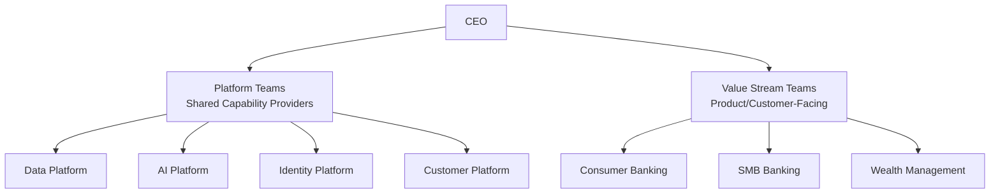
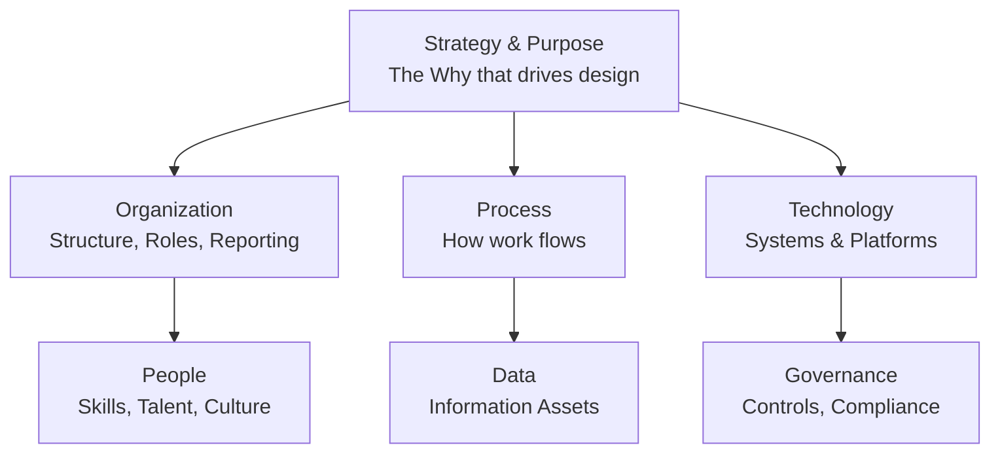
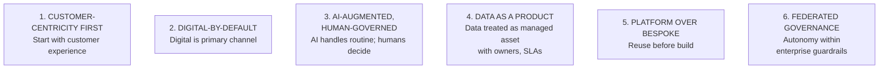

# Business Architecture: Organization & Operating Model Design

## Organization Design

**Organization Design** is the deliberate structuring of roles, reporting lines, decision rights, processes, and culture to deliver on strategy. Peter Drucker: *"Structure follows strategy."*

**Classic Organization Structures:**

**Functional:** CEO → CFO, CMO, CTO, COO, CHRO. Best for: Stable, efficiency-focused organizations.

**Divisional:** CEO → Division A/B/C (each with Marketing, Sales, Operations). Best for: Large, diverse organizations.

**Matrix:** Functional leaders + Business unit leaders (dual reporting). Best for: Balancing functional excellence with business agility.

**Platform Organization (2026):**

Modern platform organization structure separating shared capability platforms from autonomous customer-facing value stream teams.

Best for: Digital-native or transforming organizations. Enables autonomy + shared capability.

**Modern Organizational Archetypes:**

| Archetype | Description | Best For |
|---|---|---|
| **Hierarchical** | Command-and-control | Regulated, stable industries |
| **Federated** | Central standards + local autonomy | Multi-BU enterprises |
| **Platform + Teams** | Shared platforms + autonomous product teams | Digital/tech organizations |
| **Networked** | Fluid, project-based teams | Innovation, professional services |
| **Agile at Scale** | SAFe/Spotify model | Large-scale software delivery |
| **Ecosystem** | Orchestrating partner network | Marketplace, platform businesses |

**Centers of Excellence (CoE):** Centralized teams providing expertise, standards, tools, and governance for specific capability domains.

Common CoEs: AI CoE, Data CoE, Cloud CoE, Security CoE, Platform Engineering CoE, Architecture CoE.

**Digital Factory:** Dedicated organizational unit for accelerating digital product delivery through autonomous cross-functional teams, modern engineering, and streamlined governance.

## Operating Model Design

**Operating Model** defines how an organization delivers on strategy — combining capabilities, processes, people, technology, governance, and information.

**Six Dimensions of Operating Model:**

Six interdependent dimensions of operating model design, cascading from strategic purpose through organizational structure, processes, and technology to enable people, data, and governance.

**Target Operating Model (TOM):** The future-state design of how the organization will operate.

**TOM Components:**

| Component | Description | Example (Bank Digital TOM) |
|---|---|---|
| Strategic Intent | The objective TOM supports | "AI-native bank by 2028" |
| Organization Design | Future structure, roles, reporting | Platform + Value Stream teams |
| Capability Model | Target capabilities and maturity | L5 AI credit, L4 digital onboarding |
| Value Streams | Key end-to-end flows | Customer gets loan in 2 hours |
| Process Design | Future-state processes | STP for loans <$25K |
| Technology Architecture | Future application and platform | Cloud-native, API-first core |
| Data & Analytics | Future data capabilities | Real-time data platform, AI/ML |
| Governance | Decision rights, committees | Federated governance with AI CoE |
| People & Culture | Skills, structure, behaviors | AI-fluent workforce, product mindset |
| Transition Plan | How to get from current to target | 18-month phased roadmap |

**TOM Design Principles:**

Six foundational principles guiding operating model design from customer focus through platform thinking to federated autonomy.

**Operating Model Gap Analysis:**

| Dimension | Current State | Target State | Gap |
|---|---|---|---|
| Organization | Siloed by function (12 BUs) | Platform + Value Stream teams | Reorganization required |
| Processes | Manual, 14-day loan approval | STP for <$25K loans | Process redesign, AI workflow |
| Technology | 3 core banking systems, legacy | Cloud-native single platform | 7-year migration, API layer |
| Data | 10 siloed data warehouses | Unified data platform, customer 360 | Data migration, MDM, governance |
| People | 80% operations specialists | 60% engineering/product talent | Reskilling, AI literacy training |

**Operating Model Archetypes:**

**Coordination Model (McKinsey):**
- **Diversification** — BUs independent; corporate adds little synergy
- **Coordination** — BUs related; corporate facilitates sharing
- **Replication** — Same model replicated across geographies
- **Unification** — Single operating model across all units

**Technology Delivery Model:**
- **Centralized IT** — Single IT serves all BUs (Efficiency vs. agility trade-off)
- **Federated IT** — Each BU has IT with central standards (Agility vs. fragmentation)
- **Product IT** — Product teams own technology end-to-end (Speed vs. duplication)
- **Platform IT** — Platform teams + stream-aligned product teams (Team Topologies model)

## Related

- [Business Architecture: Capabilities](./45-vol2-business-architecture-operating-model.md)
- [AI Operating Model](./92-vol2-business-architecture-operating-model-ai-operating-model-building-blocks.md)
- [Enterprise Transformation](./98-vol5-ai-strategy-transformation-glossary-transformation-maturity-models.md)

## Sources

---
