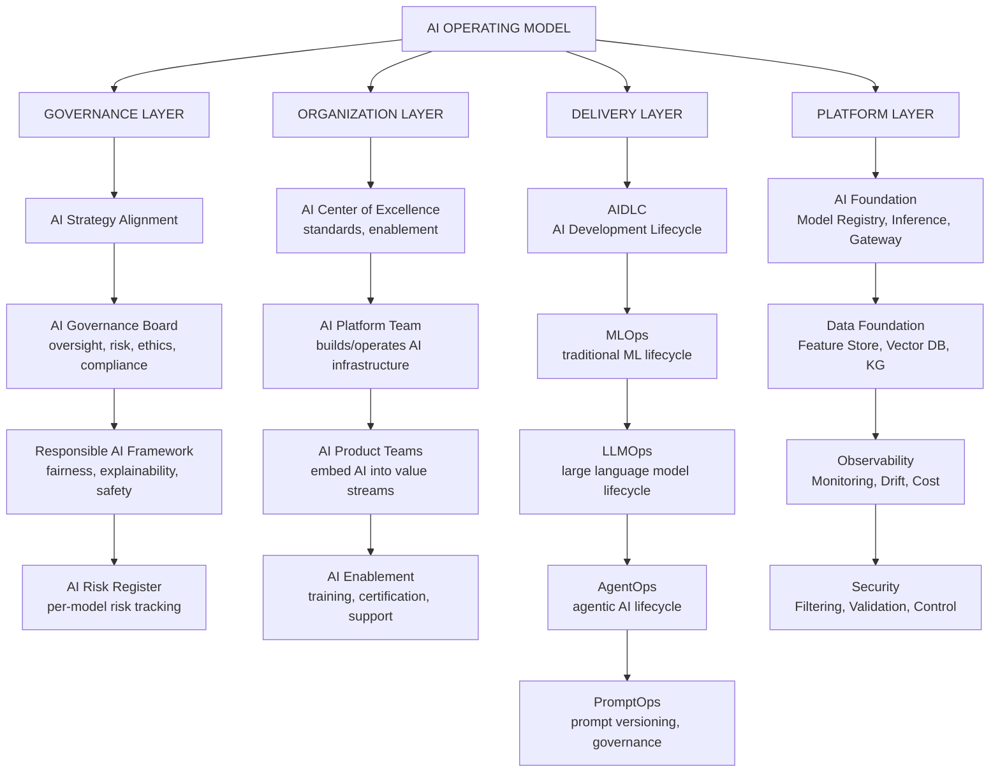
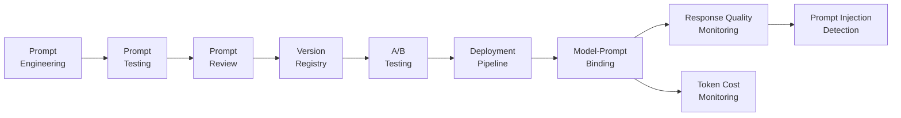
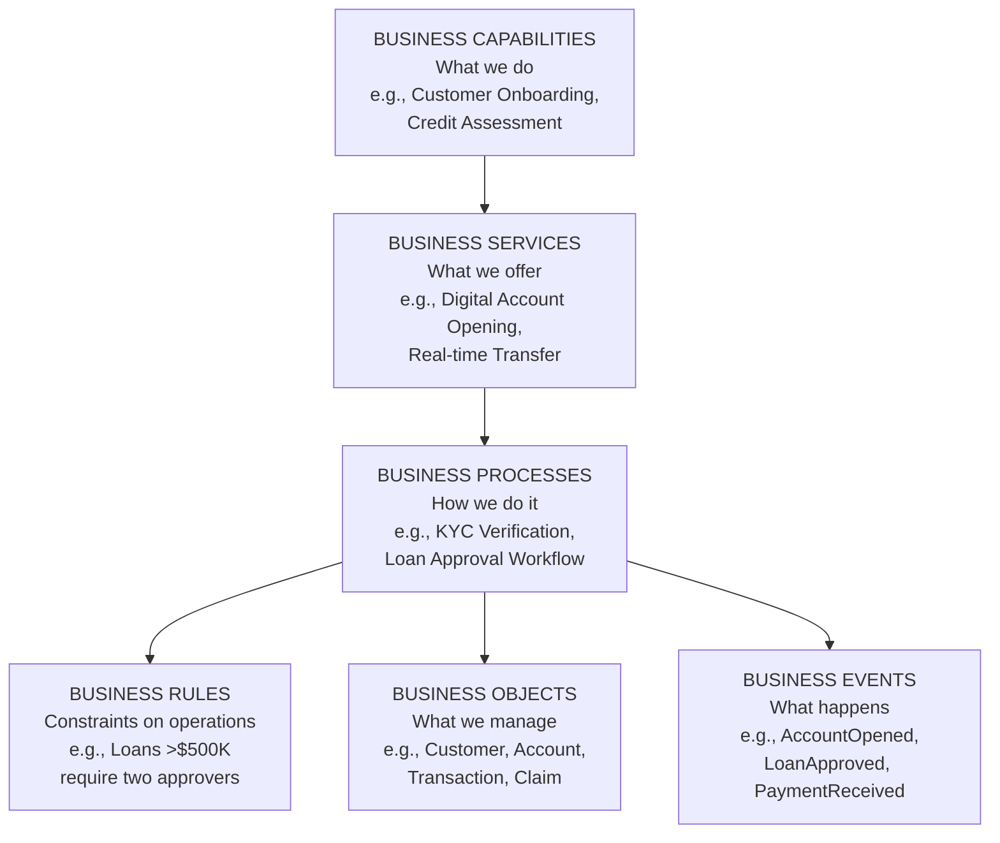

# Business Architecture: AI Operating Model & Building Blocks

## Why a Distinct AI Operating Model?

AI capabilities require a fundamentally different operating model from traditional IT:

| Dimension | Traditional IT | AI Operating Model |
|---|---|---|
| **Delivery** | Requirements → Build → Release | Experiment → Validate → Scale |
| **Maintenance** | Bug fixes, features | Model retraining, drift monitoring, prompt updates |
| **Quality** | Functional correctness | Accuracy, fairness, explainability |
| **Governance** | Technical standards | Responsible AI + regulatory compliance |
| **Skills** | Software engineers | ML engineers, data scientists, AI architects |
| **Risk** | System failure | Hallucination, bias, adversarial attack |
| **Lifecycle** | SDLC | MLOps + LLMOps + AgentOps |

## AI Operating Model Components

Four-layer AI operating model spanning governance, organization, delivery, and platform foundations.

## MLOps, LLMOps, AgentOps Compared

| Dimension | MLOps | LLMOps | AgentOps |
|---|---|---|---|
| **What it governs** | Traditional ML models | Large language models | Agentic AI systems |
| **Training** | Regular retraining from data | Fine-tuning + RLHF | Prompt engineering + RAG |
| **Deployment** | Model serving endpoints | API integration + prompts | Agent orchestration + tools |
| **Monitoring** | Accuracy, drift, feature drift | Hallucination rate, cost/token | Task completion, tool errors |
| **Key tools** | MLflow, SageMaker, Vertex AI | LangSmith, PromptLayer | LangGraph, AutoGen |
| **Risk** | Model drift, bias | Hallucination, prompt injection | Runaway agents, tool misuse |
| **Cost driver** | Training compute | Inference tokens | Tokens + tool calls |
| **Governance** | Model cards, bias testing | Constitutional AI, guardrails | Human-in-the-loop, kill switch |

## PromptOps

**PromptOps** is the operational discipline for managing prompts in production LLM/GenAI systems:

End-to-end lifecycle for managing prompts in production systems from engineering through testing, deployment, and continuous monitoring.

## AI Centers of Excellence (AI CoE)

**AI CoE Charter:**

Mission: Enable responsible, scalable, and value-creating AI adoption across the enterprise.

Responsibilities:
- STANDARDS: Define AI development standards and guidelines
- PLATFORM: Build and operate shared AI infrastructure
- ENABLEMENT: Train and certify AI practitioners
- GOVERNANCE: Run AI risk reviews and approvals
- INNOVATION: Track emerging AI capabilities
- EVANGELISM: Share success stories; drive adoption

**Operating Model:** Federated — AI CoE sets standards; teams execute within those standards; AI CoE available for consulting support.

## Business Building Blocks

**Building Blocks** are reusable, standardized components — business, application, data, or technology — that can be assembled to create capabilities.

TOGAF distinguishes:
- **Architecture Building Blocks (ABBs)** — Abstract, specification-level components (e.g., "Authentication Service")
- **Solution Building Blocks (SBBs)** — Concrete, implemented components (e.g., "Microsoft Entra ID")

**Business Building Block Taxonomy:**

Six levels of business building blocks from capabilities and services through processes, rules, objects, and events.

**Technology Building Blocks (2026):**

| Building Block | Examples |
|---|---|
| **Identity** | Entra ID, Okta, AWS IAM |
| **API Gateway** | Kong, Apigee, AWS API Gateway |
| **Integration** | Kafka, MuleSoft, Azure Service Bus |
| **Observability** | Datadog, Grafana, OpenTelemetry |
| **Container Platform** | Kubernetes, ECS, AKS |
| **CI/CD** | GitHub Actions, ArgoCD, Tekton |
| **AI Inference** | AWS Bedrock, Azure OpenAI, vLLM |
| **Vector Store** | Pinecone, Weaviate, pgvector |
| **Knowledge Graph** | Neo4j, AWS Neptune |
| **Agent Framework** | LangGraph, Strands, AutoGen |

## Business Glossary and Taxonomy

**Business Glossary:** The authoritative dictionary of business terms ensuring everyone uses the same words to mean the same things. Prevents data integration failures and AI model inconsistencies.

**Business Taxonomy:** Hierarchical classification system for organizing concepts (products, customers, geographies, channels). Critical for AI classification models and RAG system accuracy.

## Related

- [Business Architecture: Organization Design](./91-vol2-business-architecture-operating-model-organization-operating-model-design.md)
- [AI Strategy & Transformation](./48-vol5-ai-strategy-transformation-glossary.md)
- [AI Transformation Models](./98-vol5-ai-strategy-transformation-glossary-transformation-maturity-models.md)

## Sources

---
