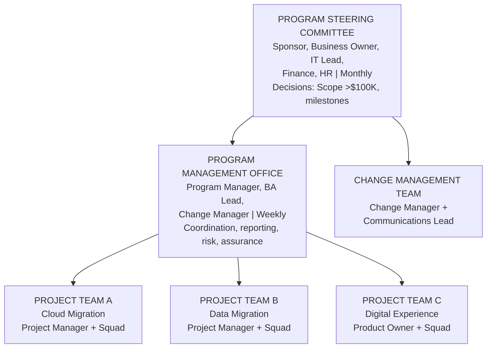
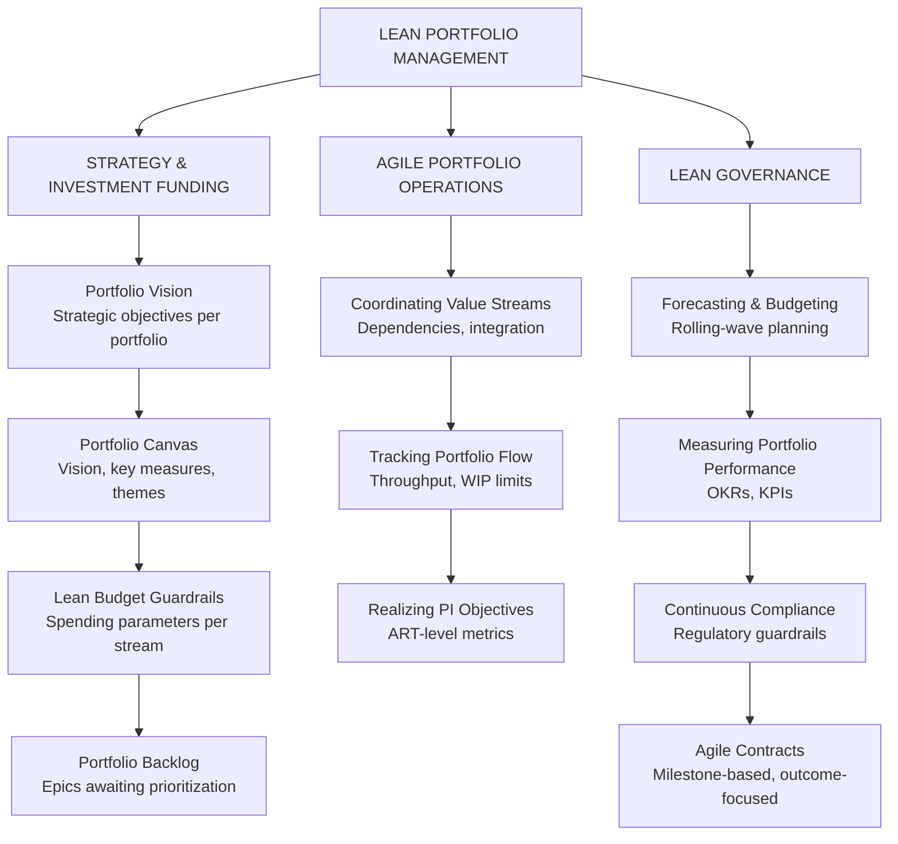
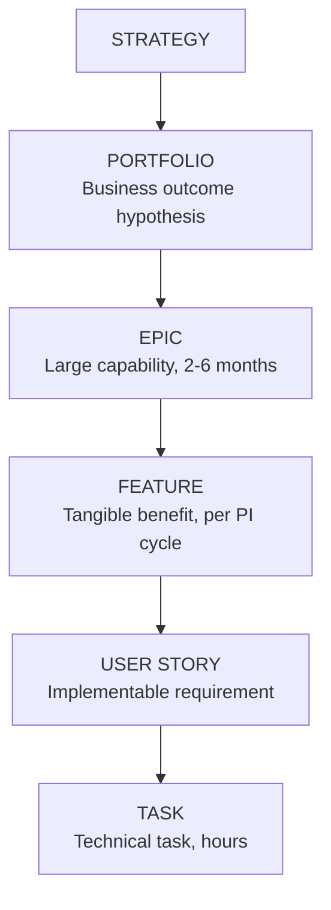
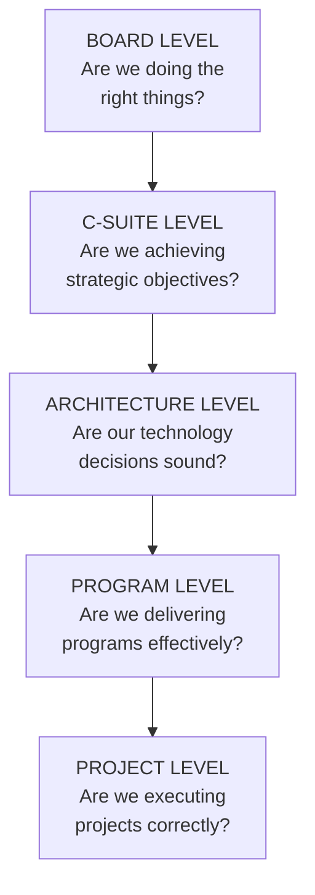

# Portfolio Governance: PMO Models, Agile Portfolio & Enterprise Governance

## PMO Types and Roles

| PMO Type | Role | Authority | Best For |
|---|---|---|---|
| **Supportive PMO** | Templates, training, tools | Low — advisory only | Organizations with mature delivery teams |
| **Controlling PMO** | Standards, governance, audit | Medium — compliance required | Regulated, risk-aware organizations |
| **Directive PMO** | Runs projects directly | High — owns delivery | Centralized delivery, consistent approaches |
| **Strategic PMO** | Portfolio governance, strategy execution | Very High — investment decisions | Strategy execution offices, C-suite |

## Enterprise Portfolio Management Office (EPMO)

The **EPMO** operates at the corporate level to:
- Govern the enterprise portfolio (all strategic investments)
- Coordinate cross-program dependencies
- Maintain the strategic roadmap
- Track benefits realization
- Report portfolio health to the Board and C-Suite

**EPMO Cadence:**

| Forum | Frequency | Participants | Agenda |
|---|---|---|---|
| Portfolio Review Board | Monthly | C-Suite, EPMO | Portfolio health, investment decisions |
| Program Status Reviews | Bi-weekly | Program Managers, EPMO | RAG status, risks, escalations |
| Benefits Review | Quarterly | Business owners, Finance | Benefits tracking vs. plan |
| Strategic Planning | Annual | Board, CEO, C-Suite | Portfolio refresh, investment allocation |

## Benefits Realization Management (BRM)

**Benefits Realization Management** is the practice of defining, tracking, and confirming that benefits committed in the business case are actually achieved after the program delivers.

**Benefits Types:**

| Type | Description | Measurement |
|---|---|---|
| **Financial** | Direct cash savings or revenue | $ savings, ROI, NPV |
| **Efficiency** | Process speed or quality improvement | Time, error rate, FTE hours |
| **Customer** | Improved customer outcomes | NPS, CSAT, retention |
| **Risk** | Reduced exposure or improved compliance | Risk score, incidents |
| **Strategic** | Positioning for future advantage | Market share, capability maturity |

## Program Governance Structure

Governance hierarchy from steering committee through PMO to individual project teams and change management.

## Lean Portfolio Management (SAFe)

**Lean Portfolio Management (LPM)** is the SAFe approach to connecting strategy to execution through value streams, decentralized funding, and continuous prioritization.

**LPM Three Core Competencies:**

Three core competencies of Lean Portfolio Management: strategy & funding, agile operations, and governance.

**SAFe Portfolio Hierarchy:**

Five-level hierarchy from strategy through portfolio epics to user story tasks, enabling SAFe execution.

**Funding Models: Project vs. Product**

Traditional: Project approved → Budget allocated → Project closes → Team dispersed (Problem: Stops/starts, knowledge lost)

Modern: Value Stream funded annually → Stable team owns end-to-end → Continuous delivery (Benefit: Stable teams, faster delivery, retained knowledge)

**Lean Budget Guardrails (SAFe):**
- 20–30% discretionary spend within ART (no central approval needed)
- 30–50% requiring LPM review for re-allocation
- 50%+ requiring Portfolio Review Board decision

## Enterprise Governance

**Governance Pyramid:**

Five-level governance pyramid from board strategy through C-suite, architecture, program, and project execution.

**Decision Rights Framework (RACI):**

| Letter | Role | Description |
|---|---|---|
| **R** | Responsible | The person who does the work |
| **A** | Accountable | The person ultimately answerable; signs off |
| **C** | Consulted | Subject matter experts; two-way communication |
| **I** | Informed | Stakeholders kept up to date; one-way communication |

**Governance Forums:**
- **Architecture Review Board (ARB)** — Reviews technology decisions against standards
- **Portfolio Review Board (PRB)** — Governs enterprise investment portfolio
- **Risk Committee** — Oversees enterprise risk
- **AI Governance Board** — Oversight of AI use, responsible AI, risk
- **Steering Committee** — Governs individual programs

**Governance Models:**

| Model | Description | Trade-off |
|---|---|---|
| **Centralized** | All decisions approved by central governance | Consistency vs. Bottleneck, slow |
| **Federated** | Central standards with local decision-making | Speed, agility vs. Inconsistency |
| **Anarchic** | No central governance | Maximum speed vs. Technology sprawl |
| **Governed Federation** | Clear guardrails + local autonomy within rails | Best of both |

## Related

- [Portfolio Fundamentals & Investment Planning](./46-vol3-portfolio-governance.md)
- [AI Governance & Metrics](./94-vol3-portfolio-governance-ai-governance-metrics.md)
- [Enterprise Transformation](./98-vol5-ai-strategy-transformation-glossary-transformation-maturity-models.md)

## Sources

---
