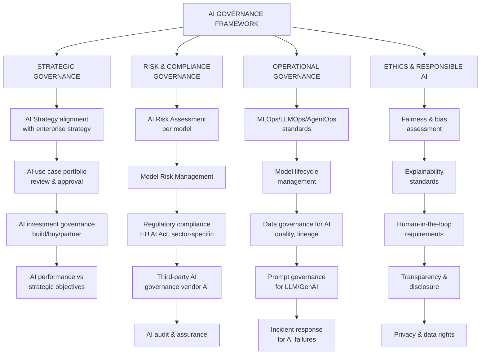
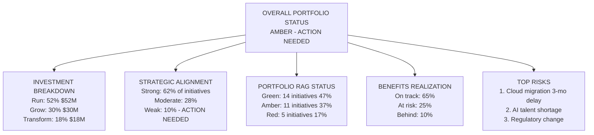

# Portfolio Governance: AI Governance, Reporting & Deliverables

## Why AI Governance Is Different

Traditional IT governance is insufficient for AI because:

1. **Non-deterministic outputs** — Same input produces different output each time
2. **Explainability gap** — Black-box models cannot explain decisions (critical for credit, healthcare)
3. **Bias risk** — Models trained on historical data perpetuate historical bias
4. **Drift** — Model performance degrades over time as world changes
5. **Adversarial risk** — Models can be manipulated with adversarial inputs
6. **Agentic autonomy** — AI agents can take real-world actions; errors have real consequences
7. **Regulatory exposure** — EU AI Act, FDA AI/ML, banking AI regulations impose obligations

## AI Governance Framework

Four pillars of AI governance: strategic alignment, risk & compliance, operational standards, and ethics.

## AI Risk Register

Every AI use case should maintain a risk register:

| Risk Category | Risk | Likelihood | Impact | Mitigation |
|---|---|---|---|---|
| **Accuracy** | Model misclassifies credit risk | Medium | High | Threshold review, human escalation |
| **Bias** | Model discriminates by race in lending | Low | Very High | Bias testing, protected class monitoring |
| **Security** | Prompt injection on customer-facing agent | Medium | High | Input filtering, output validation |
| **Compliance** | EU AI Act Article 6 high-risk classification | High | High | Conformity assessment, documentation |
| **Drift** | Model accuracy degrades over 6 months | High | Medium | Monthly drift monitoring, retraining trigger |
| **Hallucination** | Agent provides incorrect medical advice | Medium | Very High | Grounding, fact-checking, HITL |

## AI Governance Maturity

| Level | Name | Characteristics |
|---|---|---|
| **1** | Ad Hoc | No AI governance; teams do what they want |
| **2** | Developing | Some policies exist; inconsistently followed |
| **3** | Defined | AI governance framework; risk register; approval process |
| **4** | Managed | AI governance quantitatively tracked; compliance monitored |
| **5** | Optimizing | Continuous AI governance improvement; industry-leading responsible AI |

## Portfolio Health Dashboard

Executive portfolio health dashboard showing investment distribution, strategic alignment, RAG status, benefits tracking, and key risks.

## Key Portfolio Metrics

| Metric | Definition | Formula | Target |
|---|---|---|---|
| **Portfolio ROI** | Return across all investments | (Total Benefits − Total Cost) / Total Cost | > 150% |
| **Strategic Alignment Score** | % of portfolio aligned to strategy | Aligned Initiatives / Total × 100 | > 80% |
| **Benefits Realization Rate** | % of planned benefits actually achieved | Realized Benefits / Planned Benefits × 100 | > 75% |
| **Portfolio Velocity** | Rate of value delivery | Benefits delivered per quarter | Improving trend |
| **Time to Value** | Average time from approval to first value | Approval date to first benefit measurement | Decreasing trend |
| **Initiative Success Rate** | % completing on time, budget, scope | Successful / Total completed × 100 | > 70% |

## Enterprise Deliverables by Role

| Role | Key Deliverables | Consumed By |
|---|---|---|
| **EPMO** | Portfolio dashboard, investment register, benefits report | CEO, Board, Finance |
| **Program Manager** | Program charter, status report, risk register, benefits plan | PSC, EPMO |
| **Project Manager** | Project plan, RAID log, status report | Program Manager, PSC |
| **Business Analyst** | Business case, requirements, process maps | Program Manager, Architects |
| **Enterprise Architect** | Architecture review, capability map, roadmap | ARB, CTO, Program Managers |

## RAID Log

**RAID Log** (Risks, Assumptions, Issues, Dependencies) is the fundamental tracking artifact for every program and project:

| Field | Description | Example |
|---|---|---|
| **Risk** | Potential future problem | "AWS capacity unavailable in target region" |
| **Assumption** | Believed to be true without full verification | "Business resources available 50% for UAT" |
| **Issue** | Current problem requiring action | "Data migration tool failing on legacy formats" |
| **Dependency** | External requirement for success | "Core banking vendor API must be ready by Q2" |

Each item should have: Owner, Likelihood/Impact (for risks), Status, Mitigation/Action, Date Due.

## Related

- [Portfolio Fundamentals](./46-vol3-portfolio-governance.md)
- [PMO & Agile Governance](./93-vol3-portfolio-governance-pmo-agile-governance.md)
- [AI Strategy & Operating Model](./48-vol5-ai-strategy-transformation-glossary.md)

## Sources

---
