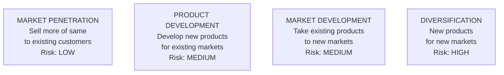
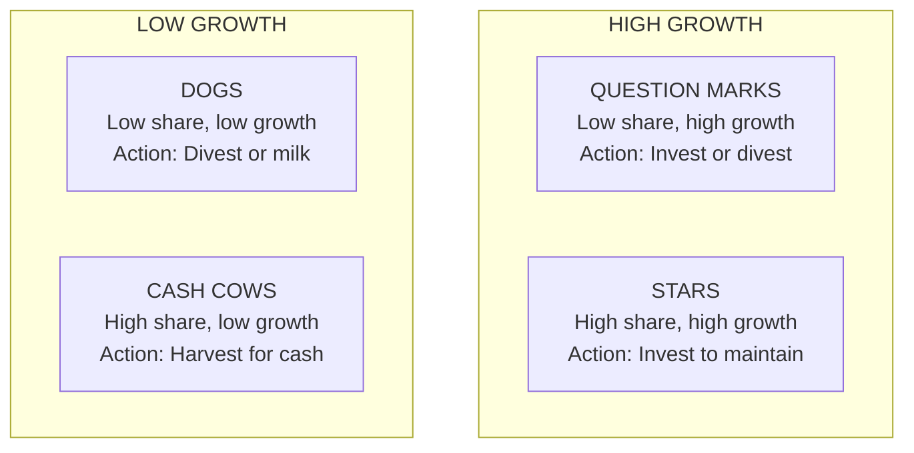
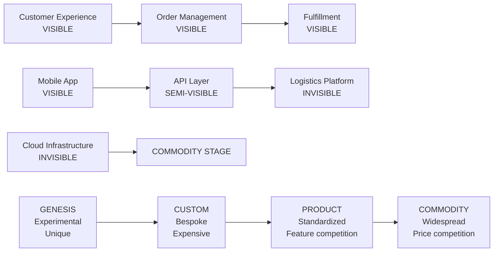
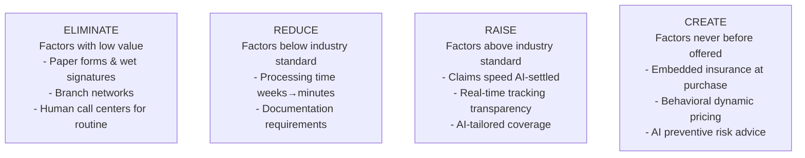
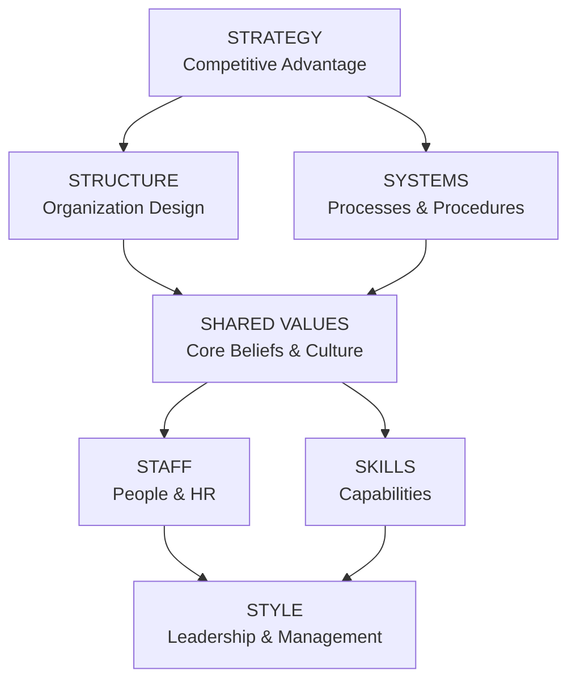

# Consulting Frameworks: Strategy & Execution

## Ansoff Matrix

The **Ansoff Matrix** (Igor Ansoff, 1957) provides four growth strategy options based on market and product dimensions:

Four growth strategies from low-risk market penetration through moderate-risk product/market development to high-risk diversification.

## BCG Growth-Share Matrix

The **BCG Growth-Share Matrix** classifies business units by market growth rate and relative market share:

Four-quadrant portfolio analysis matrix for strategic investment decisions based on market growth and relative share.

**Strategic Actions:**

| Quadrant | Action | Investment |
|---|---|---|
| **Stars** | Invest to maintain leadership | High |
| **Cash Cows** | Harvest cash; minimal new investment | Low |
| **Question Marks** | Invest in winners; divest losers | Selective |
| **Dogs** | Divest or run for cash | Minimal |

## VRIO Framework

**VRIO** (Barney, 1991) assesses whether a capability creates sustainable competitive advantage:

| Test | Question | If Yes | If No |
|---|---|---|---|
| **Valuable** | Does this capability allow us to exploit opportunities or neutralize threats? | Proceed | Competitive disadvantage |
| **Rare** | Is this capability possessed by few competitors? | Proceed | Competitive parity |
| **Inimitable** | Is it costly/difficult for competitors to copy? | Proceed | Temporary advantage |
| **Organized** | Are we organized to exploit it? | **Sustainable advantage** | Unused potential |

**VRIO Applied to AI:**

| AI Capability | V | R | I | O | Advantage |
|---|---|---|---|---|---|
| Off-the-shelf ChatGPT | ✅ | ❌ | ❌ | ✅ | None — parity |
| Proprietary training data | ✅ | ✅ | ✅ | ✅ | Sustainable |
| AI operating model | ✅ | ✅ | ❌ | ✅ | Temporary |
| AI + customer data flywheel | ✅ | ✅ | ✅ | ✅ | Sustainable |

## Wardley Mapping

**Wardley Mapping** (Simon Wardley, 2016) maps capabilities on two axes — visibility to user and evolutionary stage — to guide strategic decisions.

Two-dimensional map of capabilities showing visibility to users and evolutionary maturity stages from genesis through commodity.

**Evolutionary Stages:**

| Stage | Characteristics | Strategy |
|---|---|---|
| **Genesis** | Unique, poorly understood, experimental | R&D, tolerate failure |
| **Custom** | Better understood, bespoke, expensive | Build to differentiate |
| **Product** | Standardized, feature competition | Buy or build best-in-class |
| **Commodity** | Widespread, price competition | Buy cheapest, outsource |

**Wardley Mapping for AI (2026):**

| AI Capability | Evolutionary Stage | Implication |
|---|---|---|
| LLM foundation models | Product → Commodity | Buy from hyperscaler (don't build) |
| AI orchestration frameworks | Custom → Product | Use LangGraph/AutoGen, don't reinvent |
| AI governance | Genesis → Custom | Build internally — no commodity solution |
| AI personalization | Custom → Product | Build with differentiating data |
| AI agent memory | Genesis → Custom | Research + early investment |

## Blue Ocean Strategy

**Blue Ocean Strategy** (Kim & Mauborgne, 2005) advocates creating uncontested market space rather than competing in existing ("red ocean") markets.

**ERRC Grid (Eliminate-Reduce-Raise-Create):**

Four-box framework for creating uncontested market space by eliminating, reducing, raising, and creating value factors.

## McKinsey 7S Framework

The **McKinsey 7S** (Peters, Waterman, 1980) provides holistic organizational alignment view:

Seven interconnected elements of organizational alignment, with strategy and shared values at the center.

**The 7 Elements:**

| Element | Definition | Question |
|---|---|---|
| **Strategy** | Plan to build competitive advantage | Is the strategy clear and unique? |
| **Structure** | Organization design and reporting | Does structure support strategy? |
| **Systems** | Processes and procedures | Do our processes enable or hinder strategy? |
| **Shared Values** | Core beliefs and culture | Does culture support strategic goals? |
| **Staff** | People and HR practices | Do we have the right people? |
| **Skills** | Capabilities of the organization | Do we have required capabilities? |
| **Style** | Leadership and management approach | Does leadership style match strategy? |

## Related

- [Environmental Analysis Frameworks](./47-vol4-consulting-frameworks-industry.md)
- [Architecture Frameworks & Playbooks](./96-vol4-consulting-frameworks-industry-architecture-industry-playbooks.md)
- [Framework Selection Guide](./97-vol4-consulting-frameworks-industry-framework-selection-glossary.md)

## Sources

---
