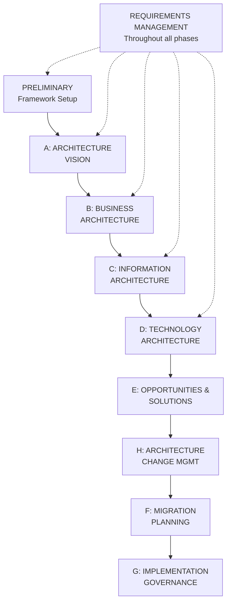
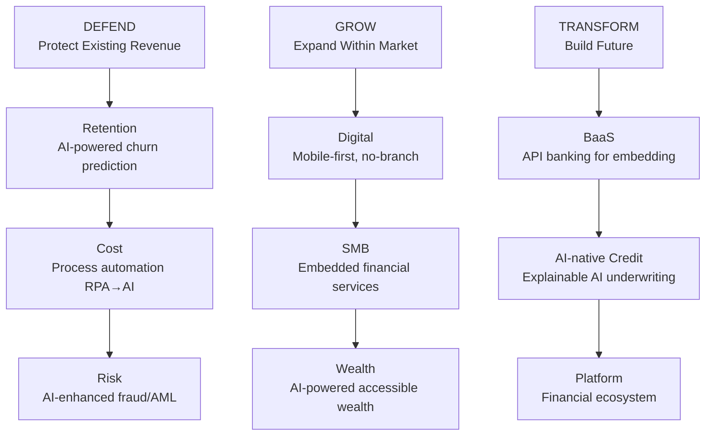
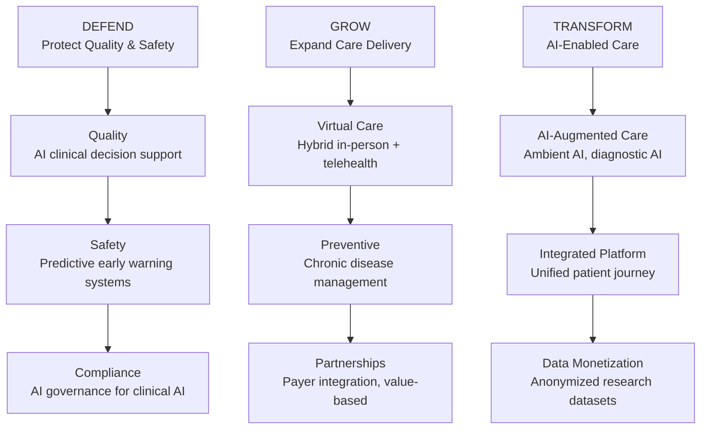
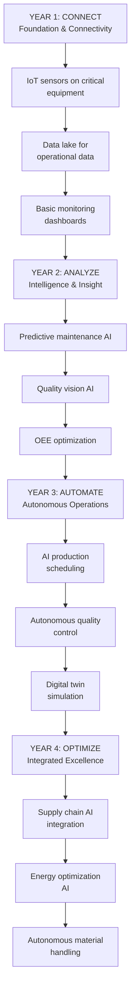

# Consulting Frameworks: Architecture & Industry Playbooks

## TOGAF (The Open Group Architecture Framework)

**TOGAF** is the most widely adopted enterprise architecture framework globally, providing systematic architecture development and governance.

**TOGAF Architecture Development Method (ADM):**

TOGAF's eight-phase architecture development method with continuous requirements management.

**TOGAF Architecture Domains:**

| Domain | Covers | Artifacts |
|---|---|---|
| **Business Architecture** | Capabilities, value streams, organization | Capability map, value stream map |
| **Data Architecture** | Data entities, relationships, governance | Data model, data flow, dictionary |
| **Application Architecture** | Systems, integrations, APIs | Application portfolio, integration map |
| **Technology Architecture** | Infrastructure, platforms, cloud | Technology stack, network topology |

## Zachman Framework

The **Zachman Framework** (John Zachman, 1987) is a classification schema for organizing architecture artifacts by perspective (who, what, how, where, when, why) and stakeholder level.

## Industry Strategy Playbooks

### Banking & Financial Services 2026

**Strategic Context:** Embedded finance, AI-native challengers, open banking mandates, BNPL, crypto/DeFi, post-SVB regulatory tightening.

**Banking Strategy 2026 Playbook:**

Three-pronged strategic approach: defend existing revenue, grow in current markets, and transform with new business models.

**Banking Capability Priorities:**

| Capability | Current | Target | Importance |
|---|---|---|---|
| Digital Onboarding | L2 | L5 | Critical |
| AI Credit Scoring | L1 | L4 | Critical |
| Real-time Payments | L3 | L5 | High |
| Open Banking API | L2 | L4 | High |
| AI Fraud Detection | L3 | L5 | Critical |
| Customer 360 Analytics | L2 | L4 | High |

### Healthcare 2026

**Strategic Context:** Payer-provider convergence, GLP-1 drugs, AI diagnostics, value-based care, staffing shortage, ambient AI.

**Healthcare Strategy 2026 Playbook:**

Healthcare's three-pronged strategy: defend clinical quality, grow care delivery channels, and transform with AI.

**Healthcare AI Use Cases by ROI:**

| Use Case | Difficulty | ROI | Timeline |
|---|---|---|---|
| AI clinical documentation | Low | High | 0–6 months |
| Predictive readmission | Medium | High | 6–12 months |
| AI medical imaging | High | Very High | 12–24 months |
| Drug interaction detection | Medium | High | 6–12 months |
| Claims automation | Low | Medium | 3–6 months |
| Patient scheduling | Low | Medium | 3–6 months |

### Retail 2026

**Strategic Context:** Unified commerce, social commerce, q-commerce (15-min delivery), AI personalization, retail media, sustainability.

**Retail Capability Map (AI-Era):**

| Capability | Traditional | AI-Transformed |
|---|---|---|
| Demand Forecasting | Historical averages | AI + real-time signals |
| Pricing | Manual schedule | AI dynamic pricing |
| Inventory | Safety stock buffers | AI-optimized lean |
| Personalization | Segment-based | Individual-level AI |
| Customer Service | Call center | AI agent + human |
| Supply Chain | Reactive | AI predictive |

### Manufacturing 2026

**Strategic Context:** Industry 4.0/5.0, digital twin, reshoring, green manufacturing, labor automation, predictive maintenance.

**Smart Factory Roadmap:**

Four-year roadmap for smart factory transformation: connect, analyze, automate, and optimize manufacturing operations.

## Related

- [Consulting Frameworks Overview](./47-vol4-consulting-frameworks-industry.md)
- [Strategy Execution Frameworks](./95-vol4-consulting-frameworks-industry-strategy-execution-frameworks.md)
- [Framework Selection Guide](./97-vol4-consulting-frameworks-industry-framework-selection-glossary.md)

## Sources

---
