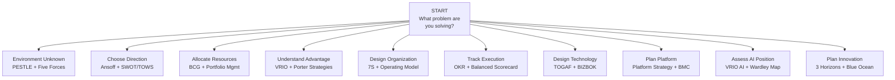

# Consulting Frameworks: Selection Guide & Glossary

## Framework Selection Decision Tree

Decision tree for selecting the right consulting framework based on strategic problem type.

## Framework Comparison Matrix

| Framework | Complexity | Speed | Depth | Best At |
|---|---|---|---|---|
| SWOT | Low | Fast | Shallow | Situation summary |
| Porter's Five Forces | Medium | Medium | Good | Industry attractiveness |
| PESTLE | Low | Fast | Medium | Environment scan |
| Ansoff | Low | Fast | Shallow | Growth direction |
| BCG Matrix | Low | Fast | Shallow | Portfolio allocation |
| McKinsey 7S | Medium | Medium | Good | Org alignment diagnosis |
| OKR | Medium | Fast | Good | Strategy execution |
| Balanced Scorecard | High | Slow | Deep | Strategy measurement |
| TOGAF | Very High | Very Slow | Very Deep | Enterprise architecture |
| Wardley Map | High | Slow | Deep | Strategic positioning |

## Consulting Terminology Glossary

| Term | Firm / Origin | Definition |
|---|---|---|
| **MECE** | McKinsey | Mutually Exclusive, Collectively Exhaustive — structure with no overlaps, no gaps |
| **Issue Tree** | McKinsey/BCG | Hierarchical decomposition of a business problem |
| **Hypothesis-Driven** | McKinsey | Start with answer hypothesis, gather evidence to test |
| **Pyramid Principle** | Barbara Minto / McKinsey | Communication: lead with conclusion, then supporting argument |
| **So What?** | All consulting firms | Test whether an insight is actionable |
| **Top-Down Communication** | McKinsey | Lead with recommendation, then evidence |
| **Value Driver Tree** | BCG | Decompose business value into measurable components |
| **Experience Curve** | BCG | Costs fall by 20–30% with each doubling of cumulative volume |
| **Growth Share Matrix** | BCG | Stars, Cash Cows, Question Marks, Dogs portfolio tool |
| **Net Promoter Score** | Bain (Reichheld) | Likelihood to recommend; defines promoters, passives, detractors |
| **Value Creation** | Private equity / BCG | The mechanism by which an investment increases in value |
| **EBITDA** | Finance | Earnings Before Interest, Tax, Depreciation, and Amortization |
| **Run Rate** | All | Annualized projection of current revenue or cost |
| **Synergy** | M&A strategy | Value created by combining two organizations beyond their standalone value |
| **Core Competence** | Hamel & Prahalad | Deep competence providing competitive advantage across many markets |
| **Burning Platform** | Change management | Crisis creating urgency for change |
| **Quick Win** | Program management | Early, visible improvement that builds transformation momentum |
| **Low-Hanging Fruit** | All | Easy improvements available without significant investment |
| **Boiling the Ocean** | All | Trying to solve everything at once — a failure mode to avoid |
| **Proof of Concept (PoC)** | Technology / Innovation | Limited test to prove a concept before full investment |
| **Pilot** | All | Limited-scope deployment to validate an approach before scaling |

## Framework Decision Guide

### Diagnostic Questions

**"What is our competitive position?"**
- Use: VRIO Framework
- Complement with: Porter's Five Forces, Industry analysis

**"How do we compete?"**
- Use: Porter's Generic Strategies (Cost Leadership, Differentiation, Focus)
- Complement with: Blue Ocean Strategy for disruptive positioning

**"What is our portfolio strategy?"**
- Use: BCG Growth-Share Matrix, Horizon 3 Framework
- Complement with: Strategic Initiative ROI analysis

**"How do we align our organization to strategy?"**
- Use: McKinsey 7S
- Complement with: Operating Model design, RACI matrices

**"How do we measure strategy execution?"**
- Use: OKR + Balanced Scorecard
- Complement with: Strategic dashboards, KPI tracking

**"What is our technology strategy?"**
- Use: Wardley Mapping for capability positioning
- Complement with: TOGAF for architecture governance, BIZBOK for capability mapping

**"How do we plan growth?"**
- Use: Ansoff Matrix for direction, Business Model Canvas for business model innovation
- Complement with: Customer Journey mapping, Value Proposition Canvas

## Related

- [Consulting Frameworks: Environmental Analysis](./47-vol4-consulting-frameworks-industry.md)
- [Consulting Frameworks: Strategy Formulation](./95-vol4-consulting-frameworks-industry-strategy-execution-frameworks.md)
- [Industry Playbooks & Architecture](./96-vol4-consulting-frameworks-industry-architecture-industry-playbooks.md)

## Sources

---
