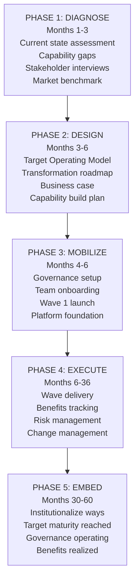
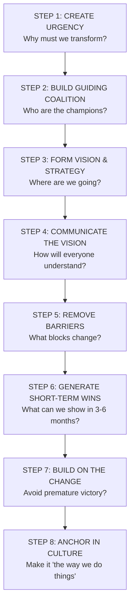
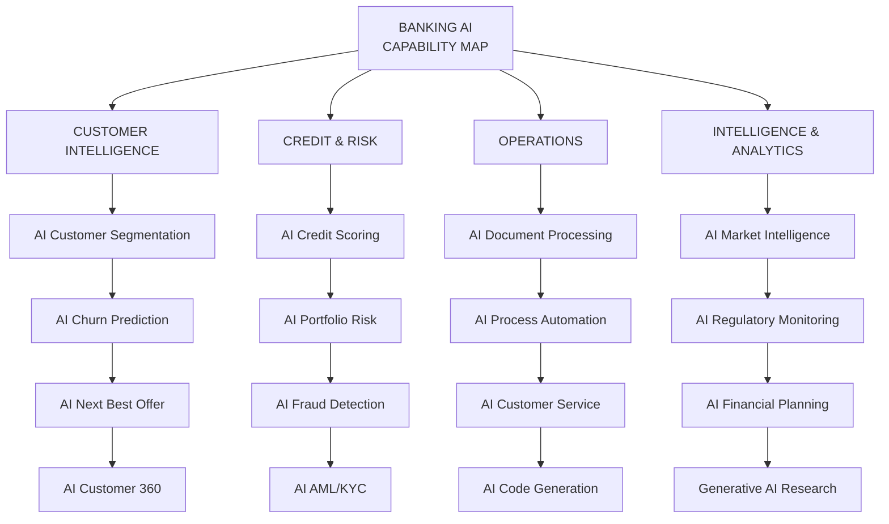
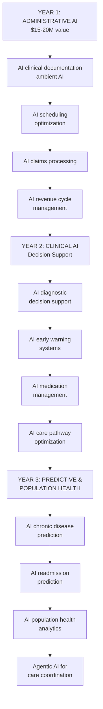

# AI Strategy & Transformation: Transformation & Maturity Models

## Transformation Archetypes

**Four Enterprise Transformation Archetypes:**

| Archetype | Trigger | Scope | Duration |
|---|---|---|---|
| **Digital Transformation** | Digital disruption, customer expectation change | Business model, channels, processes | 3–7 years |
| **AI Transformation** | AI capability availability, competitive pressure | Capabilities, processes, people, governance | 2–5 years |
| **Cloud Transformation** | Infrastructure modernization, cost, agility | Technology stack | 2–4 years |
| **Operating Model Transformation** | Strategic pivot, merger, efficiency mandate | Organization, process, governance | 2–4 years |

## Transformation Phases

Five-phase transformation roadmap from diagnosis through design, mobilization, execution, and embedding.

## Change Management: Kotter's 8-Step Model

**John Kotter's 8 Steps for Leading Change:**

Kotter's eight-step change management process for successfully leading organizational transformation.

## AI Transformation Blueprint

```mermaid
graph TD
    FOUND["FOUNDATION<br/>Months 1-6<br/>Build to Learn"]
    F1["AI Strategy finalized<br/>& board-approved"]
    F2["AI CoE established<br/>5-15 people"]
    F3["AI platform foundation<br/>MLOps, data pipeline, governance"]
    F4["3-5 pilot use cases<br/>Quick wins + visibility"]
    F5["Responsible AI framework"]
    F6["AI literacy program<br/>all staff"]
    
    SCALE["SCALE<br/>Months 6-18<br/>Build to Scale"]
    S1["AI use case factory<br/>10-15 live"]
    S2["AI platform<br/>Production-grade, multi-team"]
    S3["Data foundation<br/>Feature store, vector DB"]
    S4["MLOps + LLMOps +<br/>AgentOps operational"]
    S5["50+ AI practitioners<br/>embedded in teams"]
    S6["AI governance board<br/>monthly cadence"]
    
    TRANS["TRANSFORM<br/>Months 18-36<br/>AI-Native Operations"]
    T1["Core processes<br/>redesigned around AI"]
    T2["Agentic AI in<br/>selected processes"]
    T3["AI decision support<br/>for leadership"]
    T4["AI product operating<br/>model established"]
    T5["Benefits realization<br/>vs business case"]
    T6["L4+ maturity in<br/>priority domains"]
    
    FOUND --> F1 --> F2 --> F3 --> F4 --> F5 --> F6
    F6 --> SCALE
    SCALE --> S1 --> S2 --> S3 --> S4 --> S5 --> S6
    S6 --> TRANS
    TRANS --> T1 --> T2 --> T3 --> T4 --> T5 --> T6
```

18-36 month AI transformation blueprint with three phases: Foundation (build to learn), Scale (build to scale), Transform (AI-native operations).

## AI Transformation: Sector-Specific Mappings

### Banking: AI Capability Map

Four domains of AI capabilities for banking transformation: customer intelligence, credit & risk, operations, and analytics.

### Healthcare: AI Transformation Roadmap

Three-year healthcare AI roadmap progressing from administrative automation through clinical decision support to predictive population health.

## Maturity Models

### Enterprise Strategy Maturity Model

| Level | Name | Characteristics | Indicators |
|---|---|---|---|
| **1** | Ad Hoc | No formal strategy; reactive decisions | No strategic plan; budget allocated by politics |
| **2** | Developing | Annual planning exists; limited cascade | Strategy plan exists; not linked to budget |
| **3** | Defined | Strategy linked to budget and OKRs | Strategy tracked; governance in place |
| **4** | Managed | Data-driven strategy execution; adaptive | Real-time portfolio visibility; benefits tracked |
| **5** | World-Class | Continuous strategy learning; predictive | AI-assisted strategy; market-sensing capability |

### Business Architecture Maturity Model

| Level | Name | Characteristics |
|---|---|---|
| **1** | None | No business architecture practice |
| **2** | Reactive | Ad hoc capability maps created for specific projects |
| **3** | Managed | Formal BA practice; capability map maintained |
| **4** | Integrated | BA integrated with EA, strategy, and portfolio governance |
| **5** | Advanced | AI-assisted BA; real-time capability analytics |

### AI Maturity Model (Full Detail)

| Level | Name | Characteristics | Use Cases | Governance |
|---|---|---|---|---|
| **1** | AI Aware | Exploring AI; isolated experiments | ChatGPT for personal productivity | None |
| **2** | AI Experimenter | POCs running; no production AI | AI demos, proof of concepts | Ad hoc |
| **3** | AI Deployer | First production AI; some value | Document AI, chatbots live | Initial policies |
| **4** | AI Practitioner | AI in multiple core processes; ROI proven | AI credit, fraud AI, ops AI | AI governance board |
| **5** | AI Native | AI in core value proposition | AI-first processes, agentic AI | Responsible AI embedded |
| **6** | AI Leader | Setting industry standards; AI ecosystem | AI platform-as-a-service | Industry governance leadership |

## Related

- [AI Strategy Framework](./48-vol5-ai-strategy-transformation-glossary.md)
- [Master Glossary](./99-vol5-ai-strategy-transformation-glossary-glossary-a-to-h.md)
- [Portfolio Governance](./93-vol3-portfolio-governance-pmo-agile-governance.md)

## Sources

---
