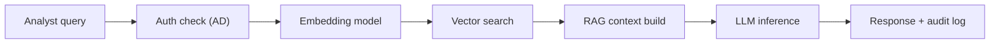

**Classification:** Confidential — Architecture Brief. **Scale:** 500+ users, data analysis and reports. **Model:** Llama 3.3 70B, p95 latency under 3 seconds, zero external connectivity, 16-week deployment.

An on-premises, air-gapped AI platform for enterprise banking — no external API calls, no cloud LLM dependency — designed for jurisdictions where customer data cannot leave the datacenter (CBUAE, SAMA, DPDPA/PDPL).

## System Architecture

Data ingestion runs entirely on-prem: a document scanner handles PDFs, Excel, CSV, SWIFT messages, and internal reports via OCR and parsers with no external calls; data connectors adapt to Bloomberg Terminal, core banking systems (Temenos, Finacle), and data warehouses; a pre-processing pipeline handles PII masking, schema normalization, and chunking inside isolated Docker containers.

The knowledge store pairs an on-prem vector database (Qdrant or Weaviate) storing embeddings for semantic search across all ingested documents with a structured data lake (MinIO S3-compatible object storage for raw files, PostgreSQL for structured financial data) and a locally-run embedding model (BGE-M3 or Nomic-Embed) generating vectors with no cloud dependency.

AI inference runs on a primary LLM — Llama 3.3 70B, Q4_K_M quantized at roughly 40GB — handling complex analysis, report drafting, and cross-document reasoning, served through vLLM with an OpenAI-compatible API that batches requests, manages GPU memory, and supports 500+ concurrent sessions, orchestrated by an on-prem RAG layer (LangChain or Haystack) that routes queries, retrieves relevant documents, augments prompts, and returns responses.

The API gateway exposes a FastAPI internal layer that all applications call — zero direct model access — with Active Directory-integrated auth and RBAC (analysts see only their desk's data, with full audit logging to SIEM) and rate limiting/routing that prevents GPU saturation, prioritizes critical desks (risk, treasury), and caches repeated-query responses.

The user interface layer offers an Analyst Workbench (a React web app for ad-hoc Q&A on financial data, e.g. "Compare Q3 NPL ratios across GCC branches"), a Report Generator (templated automation pulling live data from the lake into narrative-plus-table PDF/Word exports), and BI Dashboard Integration (a Power BI/Tableau plugin surfacing AI-generated commentary alongside existing charts).

Air-gap operations cover offline model updates (new weights shipped quarterly via encrypted hard drive, hash-verified before deployment), an on-prem monitoring stack (Prometheus plus Grafana tracking GPU utilization, latency, and queue depth, alerting via internal email only), and disaster recovery (a hot standby inference node with model weights replicated to a secondary datacenter in the same jurisdiction).

## Hardware Specification

| Role | Specification | Note |
| --- | --- | --- |
| Primary Inference | 4x NVIDIA H100 80GB (NVLink) | Serves 500+ users at under 3s p95 latency |
| Embedding / CPU Tasks | 2x AMD EPYC 9654 (96-core) | Runs vector DB, pre-processing, API layer |
| Storage | 2PB NVMe + 20PB SAS array | Document lake + vector index + backups |
| Network | 25GbE internal fabric (no uplink) | Completely isolated from internet |

## Query Data Flow

*Isolation guarantee: all traffic is intranet-only, with no DNS resolution and no outbound ports — the firewall policy is default-deny for everything external.*

## 16-Week Deployment Timeline

| Weeks | Task |
| --- | --- |
| W1-2 | Hardware procurement & DC prep |
| W3-4 | OS hardening, network isolation, storage setup |
| W5-6 | Model deployment & quantization validation |
| W7-8 | Data connectors + ingestion pipeline |
| W9-10 | RAG pipeline + API gateway |
| W11-12 | UI deployment + user acceptance testing |
| W13-14 | Security audit + pen test (air-gapped) |
| W15-16 | Phased rollout: pilot desk → full enterprise |

## Regulatory Alignment

| Framework | Requirement Met |
| --- | --- |
| CBUAE (Central Bank UAE) | No customer data leaves jurisdiction — all processing on-prem |
| SAMA (Saudi Arabia Monetary Authority) | On-prem data residency satisfied; no cloud provider dependency |
| DPDPA / PDPL | Data protection laws — PII stays encrypted, on-device; no external transfer |

## Related

- [Sovereign Constitutional AI Foundations](sovereign-constitutional-ai/11-sovereign-ai-foundations.md)
- [Agentic AI Security Guardrails](04-agentic-ai-security-guardrails.md)
- [Agent Communication, Identity & AI Gateway](03-agent-communication-identity-gateway.md)
