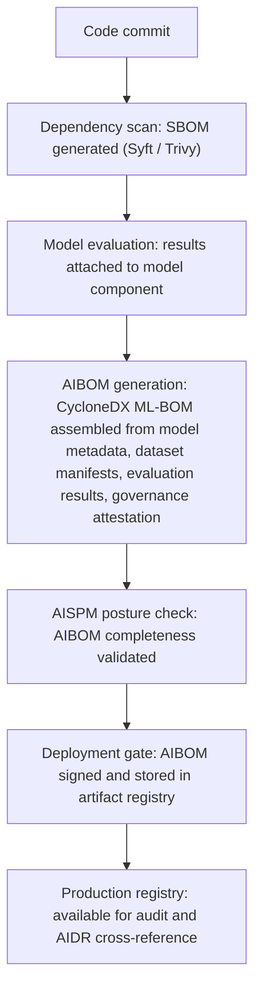

A structured, machine-readable inventory of every AI component in a system — models, datasets, agents, tools, guardrails, and runtime dependencies — with provenance, rights, integrity, and evaluation evidence.

## What Is an AIBOM?

An AI Bill of Materials (AIBOM) is a complete, structured inventory of every component that makes up an AI system, along with evidence of where it came from, who owns the rights, whether it has been evaluated, and how it has changed over time. The EU AI Act (effective August 2026) makes AIBOM documentation functionally mandatory for high-risk AI systems.

The concept extends the traditional Software Bill of Materials (SBOM) — which tracks software packages and libraries — to cover AI-specific assets that SBOMs cannot capture:

| SBOM Covers | AIBOM Adds |
|---|---|
| Python packages, npm modules | Foundation model identity and version |
| Container images | Training dataset provenance and licenses |
| Library dependencies | Fine-tuning run artifacts |
| CVE vulnerability status | Model evaluation results and bias assessments |
| License compliance | Agent tool manifests |
| — | RAG index composition and freshness |
| — | Guardrail configurations |
| — | Regulatory compliance attestations |

## Why AIBOMs Are Now Required

**EU AI Act.** Article 11 and Annex IV require high-risk AI system providers to maintain technical documentation covering the training data and its governance practices, the system's components and their interactions, monitoring and control mechanisms, and validation and testing results. An AIBOM is the most efficient way to produce this documentation — the inventory built for security is most of what a regulator needs.

**US Executive Order on AI.** Requires AI developers providing systems to the US government to submit documentation of training data, model architecture, evaluation results, and known limitations.

**Supply chain security mandates.** Following incidents like SolarWinds and Log4Shell, regulators have extended supply-chain security requirements to AI components; the AgentRiskBOM research proposal introduces a risk-scoping BOM specifically for agentic AI systems.

## Six Areas of an AIBOM

**Models:** model name and version (exact identifier, semantic version, or hash); architecture family (transformer, MoE, diffusion); provider with contact; a SHA-256 weights identifier; license (commercial, open-weight, custom, with usage restrictions); provenance (training organization, date, dataset names); evaluation results (benchmark scores, safety evaluation, bias assessment); and documented known limitations and out-of-scope uses.

**Datasets:** name and version with a source URL or registry identifier; collection method (web scrape, licensed, synthetic, human-generated); license and redistribution rights; preprocessing steps applied (cleaning, filtering, deduplication); documented representation gaps or biases; sensitive content flags (PII presence, regulated content); and consent status for AI training use.

**Code and dependencies:** frameworks in use (LangChain, LangGraph, CrewAI, Semantic Kernel, with versions); all transitive library dependencies with versions; container base images with digests and layer breakdowns; and known CVE status.

**Hardware:** training hardware (GPU model, cluster size, training compute in FLOPs); inference hardware requirements; and the geographic location of data centers for residency compliance.

**Data processing pipelines:** the training pipeline from raw data to model weights; the validation pipeline and how performance was measured; the RAG/retrieval pipeline (index construction, embedding model, retrieval configuration); and orchestration logic and decision flows.

**Governance:** approval history (ARB sign-offs, risk assessment dates, approvers); a change log between versions; pass/fail evaluation results per suite; compliance attestations (EU AI Act, ISO 42001, NIST AI RMF); human-oversight requirements and review triggers; and incident history for the component.

## Standards and Formats

**SPDX 3.0 AI Profile**, from the Linux Foundation, extends SPDX (Software Package Data Exchange) with AI-specific fields; it is best for regulatory submissions and vendor procurement requirements, and is required by EU AI Act-aligned procurement in 2026.

**CycloneDX ML-BOM**, from OWASP, is an extensible XML/JSON ML-specific schema; it is best for CI/CD-generated AIBOMs, developer tooling, and internal use, and is widely implemented across MLOps toolchains.

**AgentRiskBOM** is an emerging research proposal that extends CycloneDX with an agentic-risk taxonomy, best suited to risk-scoped BOMs specifically for agentic AI systems.

**2026 procurement consensus:** require the SPDX 3.0 AI Profile from external vendors for regulatory weight, and use CycloneDX ML-BOM internally for CI/CD-generated AIBOMs.

## AIBOM in the CI/CD Pipeline

*The AIBOM pipeline runs alongside standard CI/CD: every model, dataset, and evaluation artifact is assembled into a signed, versioned AIBOM before deployment is permitted.*

## AIBOM Generation Tools

| Tool | Type | Output Format |
|---|---|---|
| Syft (Anchore) | Open-source SBOM generator; AI component extensions in progress | SPDX, CycloneDX |
| Trivy (Aqua Security) | Vulnerability scanner with SBOM generation | SPDX, CycloneDX |
| Noma | Commercial; ML pipeline-aware AIBOM | CycloneDX ML-BOM |
| Palo Alto Prisma | Automated AIBOM as part of AI-SPM | Proprietary + export |
| Hugging Face Hub | Model card metadata as a partial AIBOM | JSON-LD |
| MLflow | Model registry with lineage tracking as AIBOM components | Custom + export |

## AIBOM for Procurement

When procuring AI systems from vendors, require:

- [ ] Model identity: name, version, provider, weights hash
- [ ] Training dataset provenance: sources, licenses, consent
- [ ] Evaluation results: safety, bias, performance benchmarks
- [ ] License terms: usage restrictions, redistribution rights
- [ ] Known limitations and failure modes
- [ ] Data residency: where training/inference occurs
- [ ] Third-party components: all dependencies with licenses
- [ ] Update notification: process for notifying of model changes
- [ ] Vulnerability disclosure: process for reporting model vulnerabilities
- [ ] EU AI Act compliance attestation (for high-risk systems)

## Key Metrics

| KPI | Target |
|---|---|
| AIBOM coverage | 100% of production AI systems have a current AIBOM |
| AIBOM freshness | Updated within 24 hours of any component change |
| Completeness score | All six areas populated; no "unknown" in critical fields |
| License compliance | Zero prohibited licenses in production |
| CVE status freshness | Vulnerability data less than 7 days old |
| EU AI Act documentation readiness | 100% of high-risk systems have Annex IV documentation |

## Related

- [AI TRiSM Complete Guide](43-ai-trism-complete-guide.md)
- [AISPM: AI Security Posture Management](45-aispm-ai-security-posture-management.md)
- [Model Cards & System Cards Guide](46-model-cards-system-cards-guide.md)
