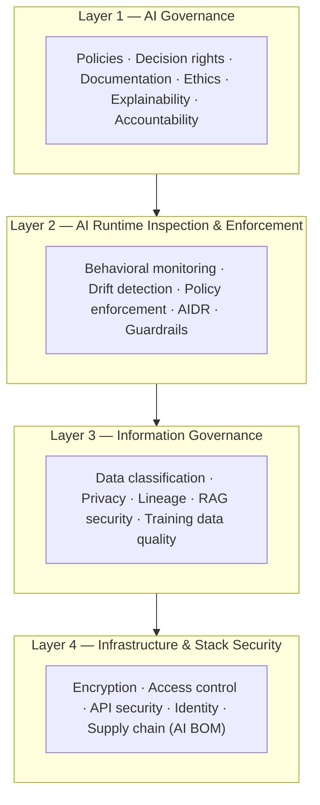

Gartner's umbrella framework for operationalizing governance, trust, and security across the full AI lifecycle — the parent framework under which AIDR, AISPM, AI red teaming, and policy-as-code controls all sit.

## What Is AI TRiSM?

AI TRiSM (AI Trust, Risk and Security Management) provides the technical foundation and controls to operationalize modern AI governance, embedding oversight, controls, and validation mechanisms across the AI lifecycle so systems remain trustworthy, reliable, and secure. Gartner predicts that organizations operationalizing AI transparency, trust, and security will see a 50% improvement in AI model adoption, business-goal attainment, and user acceptance. AI TRiSM is not a product — it is a framework of practices, controls, and organizational behaviors; individual vendors implement portions of it, and no single vendor covers the entire framework.

## The Four Layers of AI TRiSM

*The four TRiSM layers stack from governance policy down to infrastructure controls; each layer's tooling enforces the layer above it.*

**Layer 1 — AI Governance** establishes the formal structure governing how AI systems are approved, deployed, and maintained: policies (acceptable use, data handling, human oversight requirements); decision rights (who can approve AI deployments, ARB scope and authority); documentation standards (model cards, system cards, risk assessments, audit trails); explainability requirements scaled to risk classification; an ethics framework (fairness, harm avoidance, accountability mechanisms); and escalation procedures for how incidents reach executives and breach notification paths.

**Layer 2 — AI Runtime Inspection & Enforcement** provides continuous oversight ensuring AI systems behave as intended in production: behavioral monitoring for output drift, policy violations, and anomalous patterns; AIDR integration for runtime detection and response to agent-specific threats; guardrail pipelines for input/output filtering, content safety, and PII redaction; model drift detection via statistical monitoring of output distributions; policy enforcement through OPA/Cedar policies evaluated at every agent action; and explainability signals such as confidence scores, reasoning traces, and human-readable explanations.

**Layer 3 — Information Governance** ensures data quality, security, and compliance across the AI data lifecycle: data classification (PII, PHI, confidential, public, with automated labeling at ingestion); training data governance (lineage tracking, consent management, license compliance); RAG security (preventing injection and data leakage through retrieval pipelines); privacy by design (differential privacy, anonymization, data minimization); and regulatory compliance mapping (GDPR, CCPA, HIPAA) to AI-specific data flows.

**Layer 4 — Infrastructure & Stack Security** provides the foundational security controls for AI infrastructure: encryption at rest and in transit for model weights, embeddings, and prompts; API security (rate limiting, authentication, input validation on all AI endpoints); access control (RBAC/ABAC for model and tool access, least privilege); agent identity (SPIFFE/SVID for workload identity, OAuth 2.1 for user delegation); AI supply chain visibility via an AI Bill of Materials; and regular vulnerability management scanning of AI dependencies and model packages.

## AI TRiSM vs. Adjacent Frameworks

| Framework | Relationship to AI TRiSM |
|---|---|
| AIDR | Implements AI TRiSM Layer 2 (runtime inspection) for agentic systems |
| AISPM | Implements AI TRiSM Layers 3-4 pre-deployment (posture management) |
| AI Red Teaming | Validates AI TRiSM Layer 2 effectiveness through adversarial testing |
| AI BOM | Implements AI TRiSM Layer 4 (supply chain visibility) |
| NIST AI RMF | Parallel standard; TRiSM's GOVERN/MANAGE functions map to NIST GOVERN/MANAGE |
| ISO 42001 | TRiSM's governance layer operationalizes ISO 42001 control requirements |
| EU AI Act | TRiSM provides the technical controls the EU AI Act mandates at the policy level |
| OWASP Agentic Top 10 | Threat taxonomy that TRiSM Layer 2 controls are designed to address |

## AI TRiSM Across the AI Lifecycle

| Lifecycle Phase | AI TRiSM Controls Active |
|---|---|
| Design | Risk classification, data governance requirements, ethics review |
| Development | Training data lineage, model evaluation, bias testing, AI BOM generation |
| Deployment | AISPM posture check, ARB sign-off, policy configuration, identity provisioning |
| Production | AIDR runtime monitoring, drift detection, cost governance, audit logging |
| Continuous Improvement | Incident review, model upgrade governance, red-team cycle |
| Decommission | Data deletion, model weight disposal, audit record archival |

## Gartner Predictions

Gartner projects a 50% improvement in AI adoption for organizations implementing TRiSM by 2026, strengthening the ROI case for governance investment. Through 2026, an estimated 80% of unauthorized AI transactions stem from internal policy violations rather than external attack — shadow AI and oversharing are the primary risk, not adversarial breach. By 2027, more than 40% of agentic AI projects are projected to be canceled due to governance failures, making TRiSM implementation a prerequisite for sustainable AI programs. And by 2026, organizations without AI transparency are projected to operate at a 30-40% structural disadvantage, creating competitive urgency for enterprise TRiSM adoption.

## Implementation Roadmap

**Quarter 1 — Foundation:** conduct an AI asset inventory (models, agents, datasets, APIs); classify all AI systems by EU AI Act risk category; establish an AI governance committee and decision-rights matrix; publish an AI acceptable-use policy; select tooling for each TRiSM layer.

**Quarter 2 — Runtime Controls:** deploy AIDR sensors for production agents; implement a prompt firewall at the AI Gateway; configure OPA/Cedar policies for tool and data access; enable behavioral baseline monitoring.

**Quarter 3 — Information & Infrastructure:** implement automated data classification at ingestion; generate an AI BOM for all production systems; enable agent identity lifecycle management (SPIFFE or equivalent); encrypt all model artifacts and vector stores at rest.

**Quarter 4 — Governance Maturity:** publish model cards for all production AI systems; establish an AI red-team cadence (quarterly minimum); complete the first AI TRiSM audit against ISO 42001 controls; implement continuous compliance monitoring dashboards.

## Vendor Landscape

| Vendor | TRiSM Coverage |
|---|---|
| Palo Alto Networks (Prisma AI) | Layers 2-4: AISPM, AIDR, AI BOM |
| CrowdStrike (Falcon AIDR) | Layer 2: runtime inspection and enforcement |
| Zenity | Layer 2: agent runtime security |
| Securiti | Layers 1 + 3: governance and information security |
| IBM (watsonx.governance) | Layers 1-2: governance, drift monitoring, explainability |
| Microsoft (Security Copilot + Purview) | Layers 1 + 3: governance and data classification |
| Wiz | Layers 3-4: posture management and infrastructure |
| Mindgard | Layer 2: automated AI red teaming |

No single vendor covers all four layers. Most enterprises combine two to three tools alongside open standards such as OPA, OpenTelemetry, and SPIFFE.

## Key Metrics

| KPI | Target |
|---|---|
| AI asset inventory completeness | 100% of production AI systems registered |
| Risk classification coverage | 100% of AI systems classified |
| Policy enforcement rate | &gt;99.5% of agent actions policy-evaluated |
| Drift alerts actioned within SLA | &gt;95% |
| AI incident MTTC | &lt;30 minutes |
| Compliance audit pass rate | 100% for high-risk systems |
| Model card publication rate | 100% before production deployment |

## Related

- [AIDR: AI Detection & Response](44-aidr-ai-detection-response-complete-guide.md)
- [AISPM: AI Security Posture Management](45-aispm-ai-security-posture-management.md)
- [AI Red Teaming Guide](42-ai-red-teaming-guide.md)
- [AI Bill of Materials Guide](41-ai-bill-of-materials-guide.md)
