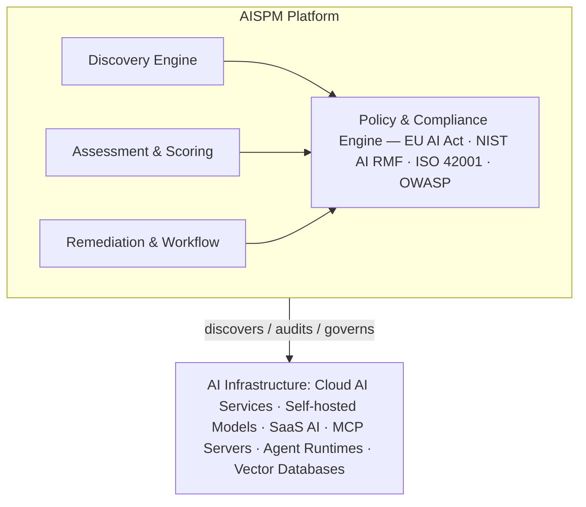
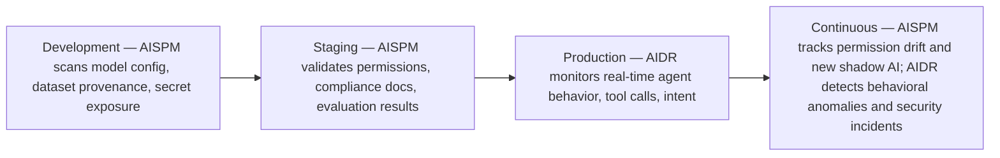

The pre-deployment and continuous configuration-auditing discipline for AI assets — the counterpart to AIDR's runtime monitoring, ensuring AI infrastructure is configured correctly before and throughout operation.

## What Is AISPM?

AI Security Posture Management (AISPM) is the ongoing practice of discovering AI assets, assessing their security configuration, and reducing risk across the AI lifecycle from build through production. AISPM emerged from the same lineage as Cloud Security Posture Management (CSPM): where CSPM tracks cloud infrastructure drift, misconfigured S3 buckets, and overpermissive IAM roles, AISPM applies equivalent continuous-monitoring principles to AI-specific assets. The market is projected to reach over $2B as a standalone category by 2028.

## AISPM vs. AIDR

| Dimension | AISPM | AIDR |
|---|---|---|
| When | Pre-deployment + continuous configuration audit | Runtime — during agent execution |
| What it monitors | Configuration, posture, inventory, permissions, supply chain | Agent behavior, tool calls, intent, execution graphs |
| Primary question | "Is this AI system correctly configured and compliant?" | "Is this agent behaving correctly right now?" |
| Detection target | Misconfiguration, exposed models, overpermissive access, supply-chain risk | Prompt injection, goal hijack, tool misuse, data exfiltration |
| Response type | Alert + remediation guidance + policy enforcement | Automated containment, agent quarantine, access revocation |
| Analogy | CSPM (cloud posture) | EDR (endpoint detection and response) |

Used together, AISPM reduces static risk before deployment and AIDR enforces controls during execution.

## What AISPM Discovers and Monitors

**AI asset inventory.** AISPM maintains a continuously updated catalog of every AI asset in the enterprise: foundation models (versions, endpoints, access configs); fine-tuned models (internal LoRA adaptations, domain-specific models); AI agents (registered agents, tool scopes, memory configurations); inference endpoints (SaaS APIs, self-hosted model servers, cloud-provider endpoints); prompt templates (the system-prompt inventory with risk classification); RAG pipelines (vector databases, embedding models, retrieval configurations); training/fine-tuning datasets (provenance, licenses, known-bias assessments); MCP servers (registered tool servers, capability manifests, authentication status); and shadow AI (unapproved AI tools discovered via SaaS integration scanning).

**Posture assessment.** For each discovered asset, AISPM evaluates access control (overpermissive IAM roles, missing authentication on API endpoints); secret exposure (API keys in environment variables, hardcoded credentials in prompt templates); model configuration (unguarded temperature/top-p settings, missing output filters); data exposure (PII in vector stores, training datasets with regulated content); supply chain integrity (model weight checksums, training data lineage, dependency vulnerabilities); compliance gaps (missing model cards, undocumented EU AI Act classification); and shadow AI (employees using unapproved AI tools with access to enterprise data).

**Continuous drift monitoring.** AISPM re-evaluates posture continuously, detecting new AI assets deployed without approval, permission changes that expand an agent's blast radius, model version updates that bypass evaluation gates, and MCP server additions or capability changes.

## Architecture

*The AISPM platform's discovery, assessment, and remediation engines all feed a shared policy and compliance engine, which continuously audits the AI infrastructure layer.*

## Vendor Landscape

| Vendor | Approach | Strength |
|---|---|---|
| Palo Alto Prisma AI-SPM | Extension of Prisma Cloud; acquired Dig Security | Deepest cloud AI integration; scans AWS/GCP/Azure AI services |
| Wiz | Unified security platform with an AI dashboard | Graphical AI pipeline dependency mapping; policy library |
| Noma | Dedicated AI-SPM; ML pipeline security | Purpose-built for ML/AI workflows; deep MLOps integration |
| Orca | Cloud-native; agentless scanning | Agentless deployment; minimal footprint |
| Microsoft Defender for Cloud (AI-SPM) | Built into Azure Security Center | Native Azure AI integration; Copilot coverage |
| Zenity | Combined AISPM + AIDR; SaaS focus | Best for SaaS AI agents (Copilot, ServiceNow, Salesforce) |
| Securiti | Data + AI governance combined | Strongest on the information governance layer |

## AISPM Implementation Guide

**Step 1 — Discovery (Weeks 1-2).** Connect AISPM to cloud accounts (AWS, Azure, GCP); integrate with SaaS AI platforms (Microsoft 365, Salesforce, ServiceNow); configure MCP server registry scanning; enable employee AI tool usage monitoring via a browser extension or proxy.

**Step 2 — Classify and Prioritize (Week 3).** Apply EU AI Act risk classification to all discovered assets; score posture findings by severity (critical/high/medium/low); identify shadow AI with access to sensitive data as an immediate priority; map every asset to the data classification it can access.

**Step 3 — Remediate Critical Findings (Weeks 4-6).** Work through a strict priority order: P0 exposed API keys or credentials in AI configs; P1 unauthenticated MCP servers accessible externally; P2 agents with excessive permissions violating least privilege; P3 AI systems without model cards or risk documentation; P4 shadow AI tools accessing enterprise data.

**Step 4 — Enforce Policy (Weeks 6-8).** Configure automated blocking for new AI deployments that fail posture checks; integrate AISPM findings into CI/CD deployment gates; enable drift alerting for production AI assets; connect AISPM to the ticketing system for remediation tracking.

## AISPM + AIDR: Complementary Controls

*AISPM's static posture checks run pre-production; AIDR's behavioral monitoring takes over once agents reach production, and both continue running in parallel afterward.*

## Key Metrics

| KPI | Target |
|---|---|
| AI asset inventory completeness | 100% |
| Shadow AI discovery SLA | &lt;48 hours from first usage |
| Critical posture findings mean time to remediate | &lt;24 hours |
| High posture findings MTTR | &lt;7 days |
| Deployments blocked by posture gate | Tracked; target 0 by improving upstream process |
| Compliance coverage | 100% of high-risk systems mapped |

## Related

- [AI TRiSM Complete Guide](43-ai-trism-complete-guide.md)
- [AIDR: AI Detection & Response](44-aidr-ai-detection-response-complete-guide.md)
- [AI Bill of Materials Guide](41-ai-bill-of-materials-guide.md)
