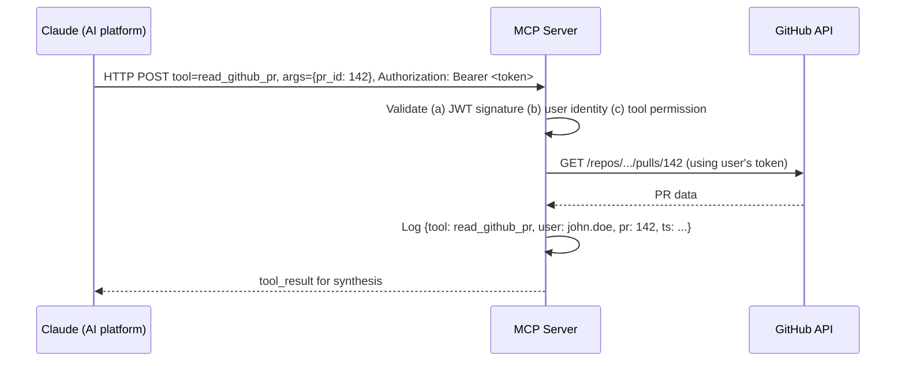

Enterprise authentication and identity propagation for AI agents: agent runtime comparison, MCP and A2A protocol security, Zero Trust principles, authorization models, and the complete audit chain.

## Agent Runtime — Authentication Context

Agent runtimes are the execution environments in which AI agents invoke tools, manage state, and orchestrate multi-step workflows. How authenticated context is passed through the runtime — and what each tool receives — determines the security properties of the entire agentic system.

**Major agent runtimes compared:**

| Runtime | Auth Context Passing | User Identity | MCP Support | Production Use |
|---|---|---|---|---|
| MCP (Model Context Protocol) | HTTP headers / OAuth per tool | Per-tool user token | Native (is MCP) | Claude, custom agents |
| A2A (Agent-to-Agent, Google) | AgentCard + JWT bearer | `sub` claim in JWT | Compatible | Google ADK, enterprise agents |
| Function Calling (OpenAI/Anthropic) | Context in system prompt + tool result | Not standardized — implementation-specific | Via adapter | GPT-4, Claude API |
| LangGraph | Runnable config (configurable fields) | Injected via `RunnableConfig` or State | Via MCP tools node | LangChain ecosystem |
| Amazon Bedrock AgentCore | AWS IAM + STS AssumeRole | IAM principal (user or role) | Via action groups | AWS-native agents |
| Google ADK | Service account + user delegation | OIDC `sub` claim | Vertex Extensions | Google Cloud agents |
| OpenAI Responses API | API key + user param | `user` string (opaque) | Via tools | ChatGPT, custom GPTs |

**What context should every tool receive?** A well-designed agent runtime passes rich context with every tool invocation, not just an OAuth token — this context is what enables authorization, audit, and governance at the tool layer:

| Context Field | Purpose | Passed By | Required? |
|---|---|---|---|
| User Identity (sub/UPN/email) | Identify the acting user | Auth token / header | Mandatory |
| Tenant / Org ID | Multi-tenant isolation | Token claim / header | Mandatory for SaaS systems |
| Roles / Groups | RBAC authorization at the tool | Token claims | Recommended |
| Custom Claims (ABAC attrs) | Fine-grained attribute-based authz | Token claims / header | For sensitive tools |
| Conversation / Session ID | Audit correlation | Header (`X-Conversation-ID`) | Mandatory for audit |
| Trace ID | Distributed tracing | OpenTelemetry `traceparent` header | Highly recommended |
| Span ID | Per-tool call tracking | OpenTelemetry | Recommended |
| Agent ID | Identify which agent is calling | Header / JWT `actor` claim | Mandatory for agent audit |
| Request Timestamp | Replay prevention | Header or JWT `iat` claim | Recommended |
| Scope List | Explicit scope boundary | OAuth `scope` claim | Mandatory to prevent scope creep |

## MCP — Model Context Protocol Security

MCP is Anthropic's open standard for AI tool integration. An MCP server exposes a set of tools (functions) that an AI can call. Security in MCP is primarily the responsibility of the MCP server — it must validate the caller's identity and enforce authorization before executing any tool.

**MCP server security requirements:** authenticate every tool invocation — never trust tool calls without verified identity; use OAuth 2.0 or signed JWTs for MCP server authorization per the MCP auth spec; validate the AI platform's identity (who is calling the MCP server) separately from user identity; enforce tool-level authorization, since not all users should access all tools on an MCP server; log every tool call with tool name, user ID, timestamp, input schema, and outcome; implement rate limiting per user and per tool to prevent abuse; and reject tool schemas containing unexpected parameters, a common prompt-injection vector.

**MCP tool invocation security flow:**

*Every MCP tool call is validated for identity and permission before the downstream API call is made, and logged before the result returns to the model.*

## A2A — Agent-to-Agent Protocol (Google)

Google's A2A protocol defines how AI agents communicate with each other in a standardized way. Agent identity is established through an AgentCard — a well-known JSON document describing the agent's capabilities and authentication requirements. A2A security relies on JWT bearer tokens with the acting user's identity preserved in the `sub` claim.

**A2A protocol security properties:**

| A2A Security Dimension | Implementation |
|---|---|
| Agent Authentication | AgentCard at `/.well-known/agent.json`; JWT bearer for API calls |
| User Identity Propagation | `user_id` field in the A2A message; `sub` claim in the bearer JWT |
| Trust Establishment | Agent registers with the enterprise registry; admin approves the AgentCard |
| Authorization | The receiving agent validates both the caller agent's identity and the user's identity |
| Audit | Each A2A message includes a `trace_id` for end-to-end correlation |
| Replay Prevention | JWT `iat`/`exp` claims plus a nonce in the message body |

## Security — Zero Trust for AI Agents

Zero Trust architecture treats every request — even from inside the corporate network — as potentially hostile. For AI agents, this means every tool call must be authenticated, authorized, and logged, regardless of where the agent is running.

| Principle | AI Agent Application | Implementation |
|---|---|---|
| Verify Explicitly | Authenticate every tool call | OAuth tokens per tool; no implicit trust based on network location |
| Use Least Privilege | Minimal scopes per tool | Request only read scopes unless write is explicitly needed for the task |
| Assume Breach | Expect tokens will be stolen | Short token lifetimes; Continuous Access Evaluation; anomaly detection on token use patterns |
| Micro-segmentation | Isolate tool access | An agent cannot call GitHub with the same token used for ServiceNow |
| Device Health | Validate agent runtime integrity | Agent image signing; attestation; no unapproved plugins |
| Data Classification | Respect sensitivity labels | AI output filtered by the data classification of sources used |

**Security threat taxonomy for AI agents:**

| Threat | Description | Mitigation |
|---|---|---|
| Prompt Injection | Malicious content in tool results instructs the AI to take unauthorized actions | Sanitize tool outputs before passing to the LLM; output validation; human approval gates |
| Tool Injection | A malicious MCP server exposes dangerous tools not approved by admin | Allowlist MCP servers; validate tool schemas; sign MCP server manifests |
| Identity Spoofing | An attacker claims to be a different user in the AI context | Validate identity from the trusted IdP token only; reject self-asserted identity |
| Session Hijacking | An attacker steals a session cookie or access token | HttpOnly cookies; token binding; anomaly detection; CAE revocation |
| Replay Attack | An old token is reused after expiry | Short token lifetimes; nonce validation; token binding; CAE |
| Token Theft | An access token is extracted from logs, prompts, or storage | Never log tokens; encrypt at rest; never include a token in an LLM prompt |
| Confused Deputy | The AI platform acts with elevated permissions it received but the user doesn't have | Always use delegated (user) tokens for user-driven actions; validate scopes |
| Privilege Escalation | An agent uses capabilities beyond what the user authorized | Scope validation at the tool layer; deny by default; explicit capability grants |
| Cross-Agent Attacks | A malicious agent poisons shared memory or context | Agent isolation; signed A2A messages; no shared mutable state |
| Data Leakage via LLM | The LLM includes sensitive data from one user in another user's response | Per-conversation context isolation; DLP on outputs; no cross-user context |

**MCP-specific security risks:** tool name collision, where a malicious MCP server registers a tool with the same name as a trusted one; schema injection, where a tool description contains hidden instructions to the AI (prompt injection via schema); credential exfiltration, where a rogue MCP server returns a `tool_result` with an encoded token-stealing payload; scope creep, where an MCP server requests broader OAuth scopes than the tool actually requires; and unauthorized tool registration, possible whenever the MCP server list isn't cryptographically signed.

## Governance — Authorization Models

Enterprise AI governance requires authorization checks at multiple layers. The choice of authorization model determines how fine-grained and auditable these checks can be:

| Model | Full Name | Granularity | Best For | Example Policy |
|---|---|---|---|---|
| RBAC | Role-Based Access Control | Role-level | Simple enterprise structures | Developers can read all repos |
| ABAC | Attribute-Based Access Control | Attribute-level | Dynamic, context-sensitive policies | A user in the EU can read EU data only |
| PBAC | Policy-Based Access Control | Policy-level | Complex compliance rules | Action allowed if MFA occurred in the last 5 minutes |
| Cedar | Cedar Policy Language (AWS) | Fine-grained, entity-based | AWS, Verified Permissions | Policy as code with entity graphs |
| OPA/Rego | Open Policy Agent | Arbitrary rule complexity | Kubernetes, API gateways | Rego rules evaluated per request |

**Where authorization occurs in the AI stack:**

| Authorization Point | What Is Checked | Who Enforces | Failure Mode |
|---|---|---|---|
| Before LLM (pre-processing) | Is this user allowed to use this AI feature? | AI platform IAM / entitlement service | Request rejected before the LLM sees it |
| After LLM (intent validation) | Is the LLM's intended action permitted? | Policy engine (OPA/Cedar) | Action blocked; user informed; logged |
| Before tool call | Does the user have permission for this specific tool? | Tool orchestrator + policy engine | Tool call blocked; LLM receives an "access denied" tool result |
| Inside tool (at the API) | Does the user's OAuth token have the required scopes? | The target API (GitHub, ServiceNow, etc.) | API returns 401/403; agent handles it gracefully |
| After tool response | Does the response contain data the user shouldn't see? | DLP / data classification layer | Response redacted; audit event raised |
| After LLM response | Does the final answer contain sensitive data? | Output DLP / data-loss-prevention layer | Response filtered before delivery to the user |

**Microsoft Entra Conditional Access for AI.** Conditional Access policies in Microsoft Entra ID can enforce authentication requirements before users can access AI platforms or specific tools, providing governance at the IdP layer, upstream of the AI system itself:

| Condition | Example Policy | AI Agent Impact |
|---|---|---|
| MFA Required | All AI platform access requires MFA | User must complete MFA before an AI session begins |
| Compliant Device | AI access only from managed devices | Blocks AI use from personal/unmanaged devices |
| Location Restriction | AI access only from corporate IP ranges | Prevents AI use from untrusted networks |
| Sign-in Risk | High-risk sign-ins blocked from AI | Identity Protection flags risky logins |
| Session Controls | Limit AI session to 8 hours | Forces re-authentication after an absolute timeout |
| App Restriction | Block AI apps in guest/B2B tenants | External users cannot use AI on corporate data |

## Complete Audit Chain

A complete enterprise AI audit chain connects every user action to every downstream API call through a set of correlated identifiers — essential for compliance, incident investigation, and demonstrating to auditors that AI actions are traceable to human actors.

```mermaid
flowchart LR
    A[user_id — IdP login] --> B[session_id — AI platform session]
    B --> C[conversation_id — per conversation]
    C --> D[turn_id — per message/response pair]
    D --> E[trace_id — end-to-end distributed trace]
    E --> F[span_id — individual tool call or API request]
    F --> G[token_jti — the specific token used]
    G --> H[oauth_client_id / agent_id — which app or agent acted]
    H --> I[Downstream API log entry]
```

*Each identifier narrows scope from the human user down to a single downstream API call, so any log line can be traced back to the person who ultimately triggered it.*

**Correlation ID taxonomy:**

| Identifier | Scope | Generated By | Used In |
|---|---|---|---|
| `user_id` (UPN/sub) | Global user identifier | IdP (Entra ID / Okta) | All audit logs; maps all activity to one person |
| `session_id` | AI platform session | AI platform on login | Conversation grouping; absolute timeout enforcement |
| `conversation_id` | A single conversation | AI platform per conversation start | Groups all turns, tool calls, responses |
| `turn_id` | A single user message + response | AI platform per message | Associates a prompt with a specific LLM response |
| `trace_id` | End-to-end distributed trace | OpenTelemetry (W3C `traceparent`) | Correlates across AI platform, MCP servers, APIs |
| `span_id` | A single operation within a trace | OpenTelemetry | Individual tool calls, API requests, LLM invocations |
| `token_jti` | A JWT token instance | IdP (`jti` claim) | Identifies the specific token used for each API call |
| `oauth_client_id` | The OAuth client (AI app) | OAuth registration | Identifies which AI app performed the token exchange |
| `agent_id` | An AI agent instance | Agent runtime | For multi-agent systems, identifies which agent acted |

**Audit log requirements for regulated industries:** SOC 2 requires retaining audit logs for one year and reviewing access logs monthly; ISO 27001 requires logging all access to sensitive assets and reviewing logs for anomalies; PCI DSS requires logging all access to the cardholder data environment and retaining logs 12 months (3 months online); NIST SP 800-53 requires centralized log management, tamper-evident log storage, and real-time alerting; GDPR requires logging access to personal data and providing an audit trail for data subject requests; and financial regulations such as SOX and FCA rules require non-repudiation for all financial transactions performed via AI.

**SIEM integration for AI audit logs:**

| Log Source | Log Type | SIEM Format | Key Fields |
|---|---|---|---|
| Microsoft Purview | Copilot activity | CEF / JSON | UserId, ConversationId, ActionType, PolicyResult |
| Entra ID | Sign-in + audit | JSON / Log Analytics | UserId, AppId, TokenType, CondAccessStatus |
| GitHub | Org audit log | JSON / SIEM streaming | actor, repo, action, programmatic |
| ServiceNow | `sys_audit` | JSON / MID Server | user, table, field_name, old_value, new_value |
| MCP Server | Tool invocation log | JSON / structured | tool_name, user_id, conversation_id, trace_id |
| Slack | Audit Logs API | JSON | actor, action, entity, context (ip, ua) |
| Salesforce | Event Monitoring | CSV / JSON | UserId, EventType, ObjectType, QueriedEntities |

## Related

- [Agent, Tool & MCP Authorization](27-agent-tool-mcp-authorization.md)
- [Identity for AI Agents](10-identity-for-ai-agents.md)
- [AI Security Operations Center](17-ai-soc.md)
