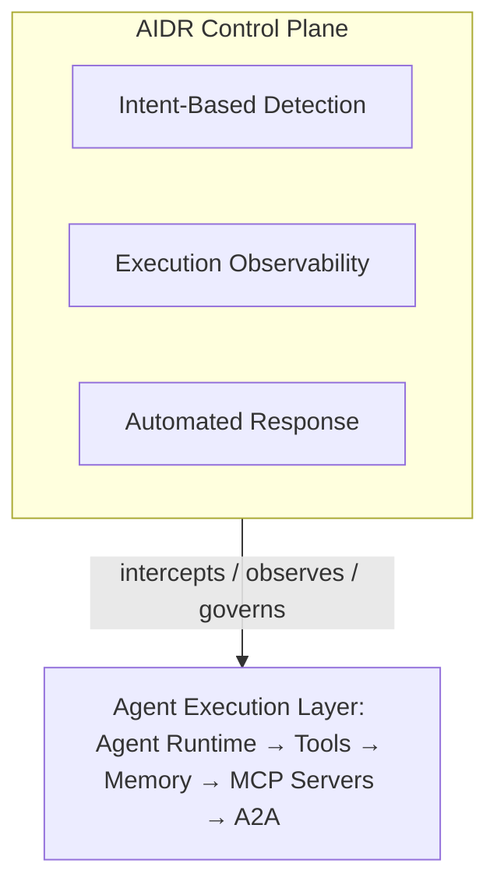

The AIDR open-source ecosystem, the three-component runtime architecture, the OWASP Agentic Top 10 threat mapping, and the supporting security architecture for agent identity, MCP, and compliance.

## Open Source Ecosystem

**ADR-Bench** (Uber Research, arXiv 2605.17380) is a 302-task benchmark suite covering 17 attack techniques for evaluating AIDR/ADR systems, published May 2026 as a community evaluation harness enabling reproducible comparison of detection approaches. **AgentDojo** is a public benchmark of 93 task-based scenarios for evaluating agent security against injection attacks, established in the agent security research community and used in the ADR paper's own evaluation. **Bifrost** is an open prompt firewall providing gateway-layer prompt injection defense across LLM providers and MCP tools, using dual-stage input/output guardrails, CEL-based rule targeting, and MCP tool allow-lists, requiring no application code changes. The **OWASP GenAI Security Project** is the open community producing threat taxonomies, guidelines, and tooling for AI security — its key outputs are the Agentic Top 10, the LLM Top 10, and MCP security guidelines, backed by an active community of 100-plus contributors.

**Supporting open standards** underpin most AIDR implementations regardless of vendor: OpenTelemetry GenAI semantic conventions provide the standard telemetry schema for AI agent traces; SPIFFE/SPIRE provides agent identity attestation and credential issuance; OPA (Open Policy Agent) provides policy-as-code for tool and data access decisions; and Cedar provides Amazon's policy language for fine-grained authorization.

## Architecture Deep Dive

AIDR operates as a runtime security control plane that intercepts, observes, and governs AI agent execution, sitting above the agent execution layer (runtime, tools, memory, MCP servers, A2A) and interposing on every action:

*The AIDR control plane's three components — intent detection, execution observability, and automated response — sit above and mediate the entire agent execution layer.*

**Component 1 — Intent-Based Detection.** Traditional signature matching fails against indirect prompt injection embedded in retrieved documents or external API responses, so AIDR's intent layer relies on cross-layer behavioral correlation (linking prompt content, tool calls, memory reads, and data access into a unified execution graph), behavioral baselining (establishing what "normal" looks like per agent, per workflow, per user context), anomaly classification (scoring deviations against threat categories like goal hijack, tool misuse, and privilege escalation), and indirect injection detection (identifying injections arriving through RAG documents, email, database records, or web content the agent itself retrieved).

**Component 2 — Full Execution Observability.** AIDR must capture telemetry existing EDR/SIEM tools cannot produce: the full execution graph (prompt → reasoning → tool selection → tool call → output → next action); a memory access log (which namespaces were read/written, and context window contents at each step); a tool invocation trace (name, parameters, response, latency, authorization result); an MCP session log (server identity, capability negotiation, tool manifest hash, call chain); an A2A message trace (inter-agent messages, delegated task IDs, sub-agent identities, outcome chains); identity events (token issuance, permission checks, scope validations, OBO flows); and data egress events (what left the trust boundary, in what form, to which destination). The ADR Sensor addresses precisely the observability gap where "existing EDR tools see file writes but not agent reasoning, prompts, or causal chains linking intent to execution."

**Component 3 — Automated Response at Agent Speed.** Human analysts cannot respond at the speed agents operate, so AIDR automates: agent quarantine on a confirmed malicious goal hijack or privilege escalation; action blocking when a tool call matches a deny policy or exceeds parameter bounds; real-time permission revocation via identity token revocation; session termination when critical data exfiltration is detected in flight; alert escalation to a human SOC analyst when the anomaly score exceeds threshold; automated remediation via a pre-built SOAR playbook with a forensic snapshot; and memory sanitization that quarantines poisoned memory entries and restores a clean state.

**Supporting architecture components.** An Agent Governance Registry is a central catalog of every deployed agent — owner, model version, data access scope, tool manifest, deployment environment — and is a prerequisite for AIDR, since it's impossible to monitor what hasn't been inventoried. A Prompt Firewall inline-inspects every prompt entering and every response exiting an agent or model, implementable at the AI Gateway layer, the MCP proxy layer, or directly in the agent SDK. A Policy Engine enforces behavioral constraints as code (OPA/Cedar/Rego), governing which tools an identity can invoke, what data scopes are accessible in what contexts, which output transformations are permitted, and when human approval is required. Sandboxed Execution runs high-risk agent actions (OS commands, browser control, code execution) in isolated containers — Firecracker microVMs or gVisor-sandboxed Kubernetes pods — to bound blast radius.

## Threat Model: OWASP Agentic Top 10

OWASP released the first Agentic Top 10 in December 2025 (ASI01-ASI10). AIDR platforms are evaluated against their coverage of these ten threats:

| ID | Threat | AIDR Detection Method |
|---|---|---|
| ASI01 | Agent Goal Hijack | Intent analysis detects redirected objectives; indirect injection detection |
| ASI02 | Tool Misuse & Exploitation | Tool invocation monitoring; parameter bounds checking; allow-list enforcement |
| ASI03 | Agent Identity & Privilege Abuse | Identity event logging; privilege escalation anomaly detection |
| ASI04 | Agentic Supply Chain Compromise | MCP tool manifest hash verification; dependency scanning |
| ASI05 | Unexpected Code Execution | Sandbox isolation; code execution telemetry |
| ASI06 | Memory & Context Poisoning | Memory access logging; context integrity monitoring |
| ASI07 | Insecure Inter-Agent Communication | A2A message tracing; mutual TLS verification |
| ASI08 | Cascading Agent Failures | Multi-agent execution graph analysis; circuit breaker monitoring |
| ASI09 | Human-Agent Trust Exploitation | Behavioral baseline deviation; social engineering pattern detection |
| ASI10 | Rogue Agents | Agent registry enforcement; unregistered agent detection |

Beyond this list, production deployments also encounter shadow AI — employees using unapproved AI tools without IT awareness, affecting an estimated 45% of organizations per CrowdStrike data; model poisoning, where training data or fine-tuning contamination affects agent behavior at runtime; credential exposure, where agents inadvertently include API keys, tokens, or secrets in tool outputs (206 such exposures were identified in Uber's ADR deployment); and data residency violations, where an agent sends regulated data to an AI provider in a non-compliant region.

## Security Architecture

**Identity and authentication for AI agents.** AIDR requires that every agent has a verifiable, revocable identity. SPIFFE/SPIRE provides production-ready cryptographic workload identity via SVID certificates; the IETF's `draft-klrc-aiagent-auth-00` proposes a nine-layer AI agent identity framework, still in draft as of 2025; OAuth 2.1 with PKCE is the current best practice for user-delegated agent authorization; On-Behalf-Of token exchange is production-ready on Entra ID for downstream tool calls; and DID-based signatures for non-repudiation are an emerging approach (arXiv 2505.19301).

**Zero Trust principles applied to agents:** verify explicitly, so every agent call is authenticated with no implicit trust; enforce least privilege, so tool scopes stay minimal under default-deny policies; and assume breach, so agent sessions are monitored from the first call with blast radius bounded in advance.

**MCP security controls.** MCP has become the dominant tool-integration protocol for AI agents — and also the dominant attack surface. AIDR must address tool poisoning via malicious tool descriptions (mitigated by tool manifest hash verification pre-execution), credential theft via tool output (mitigated by output scanning before returning to agent context), indirect injection through retrieved content (mitigated by semantic analysis of tool responses), unauthenticated MCP server exposure (mitigated by OAuth 2.1 enforcement on all MCP connections), and excessive tool permissions (mitigated by least-privilege tool scopes and parameter validation). The scale of MCP risk is material: security researchers counted 492 unauthenticated MCP servers exposed on the public internet, and identified 1,184 malicious "skills" distributed through a popular skill marketplace.

**Authorization models in AIDR:** RBAC assigns agents to roles that grant tool and data scopes; ABAC evaluates context-aware policies combining agent identity, data classification, and action type; and PBAC evaluates OPA/Cedar policies at every tool call, versioned and deployed as code.

**Compliance alignment.** EU AI Act Articles 9 and 17 (risk management plus post-market monitoring for high-risk AI) map directly to AIDR functions; NIST AI RMF's MANAGE function maps to AIDR's incident response and continuous monitoring; ISO 42001 Control A.6 (AI risk management) requires the runtime monitoring AIDR provides; the OWASP LLM Top 10 is operationalized at runtime through AIDR detection; and MITRE ATLAS's adversarial TTP coverage maps to AIDR detection signatures.

## Related

- [AIDR: Definition, Landscape & Ecosystem (Part 1)](../44-aidr-ai-detection-response-complete-guide.md)
- [AIDR: Implementation & Roadmap (Part 3)](44-aidr-ai-detection-response-complete-guide-part3.md) — protocol integrations, reference architectures, implementation code, anti-patterns, and the 2026-2029 roadmap
- [Agent, Tool & MCP Authorization](../27-agent-tool-mcp-authorization.md)
