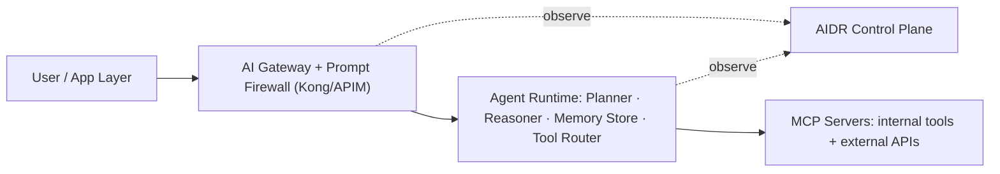

Protocol and framework integrations, enterprise reference architectures, an implementation guide with runnable code, common anti-patterns, and the 2026-2029 AIDR roadmap.

## Relationship with Agent Protocols and Frameworks

**MCP (Model Context Protocol)** is the primary integration point for AIDR: every MCP tool call is an observable unit of agent behavior; AIDR sensors instrument the MCP transport layer to capture call chains; MCP-aware AIDR can verify tool manifest integrity before any execution; and Uber's ADR was specifically designed as "the first large-scale, production-validated enterprise security framework for MCP-based agents."

**A2A (Agent-to-Agent Protocol)** creates inter-agent communication channels AIDR must trace: AgentCard verification precedes delegation; mutual TLS secures A2A transport; trace propagation crosses A2A boundaries via W3C Trace Context headers; and AIDR must correlate execution graphs across the A2A boundary specifically to detect cascading failures (ASI08).

**Relationship matrix across the broader ecosystem:** MCP is AIDR's primary telemetry source, instrumented directly at the transport layer; A2A provides inter-agent trace correlation and delegation-chain verification; LangGraph node transitions and LangChain callbacks/middleware are both directly instrumentable as observable events; CrewAI's task delegation and AutoGen's multi-agent conversations are both visible to AIDR sensors; the OpenAI Agents SDK's tool calls and handoffs are traceable via OTel GenAI conventions; AWS Bedrock AgentCore's platform-native controls are complemented by AIDR; Azure AI Foundry gets partial AIDR coverage from Microsoft Sentinel plus Security Copilot; Google ADK's Vertex AI security controls allow third-party AIDR to integrate via telemetry; and Semantic Kernel's plugin/tool calls are traceable through middleware-layer integration.

## Runtime Internals and Observability

AIDR must cover the full agent lifecycle, from identity verification at initialization through to the next-step decision after memory update:

```mermaid
flowchart LR
    A["Initialization — identity verified"] --> B["Planning — goal scope checked"]
    B --> C["Reasoning — chain-of-thought logged"]
    C --> D["Tool Selection — permission checked"]
    D --> E["Tool Execution — params validated"]
    E --> F["Response — output scanned"]
    F --> G["Memory Update — write audited"]
    G --> H["Next Step — loop or terminate"]
```


*Every stage of the agent lifecycle has a corresponding AIDR check — identity, scope, permission, validation, scanning, and audit — before the agent is allowed to proceed to the next stage.*

**Telemetry standards** underpinning this observability: OpenTelemetry GenAI semantic conventions provide the standard schema for LLM/agent spans, attributes, and events; W3C Trace Context provides distributed trace propagation across agent and service boundaries; and CloudEvents provides the standard event envelope for agent lifecycle events.

**Compatible observability tooling:** Langfuse is an LLM/agent observability platform that AIDR telemetry can feed into; Phoenix (Arize) provides ML observability including hallucination detection and prompt monitoring; the OpenTelemetry Collector aggregates agent traces from AIDR sensors; Grafana plus Prometheus provide metrics dashboards for AIDR detection rates, latency, and alert volumes; and Elastic SIEM correlates AIDR alerts with broader enterprise security events.

**Key metrics:**

| Metric | Target |
|---|---|
| Detection latency (prompt attack) | &le;30ms (CrowdStrike benchmark) |
| Credential detection precision | &ge;97% (Uber ADR benchmark) |
| False positive rate | &le;3% at production scale |
| Attack detection rate | &ge;67% across 17 techniques (ADR-Bench) |
| Agent session coverage | 100% of registered agents |
| Mean Time to Detect (MTTD) | &lt;60 seconds for confirmed incidents |

## Enterprise Reference Architectures

**Single-tenant enterprise deployment.** A user or application layer sends requests through an AI Gateway (with an embedded prompt firewall), which both routes traffic to the Agent Runtime and streams observations to the AIDR Control Plane; the Agent Runtime's planner, reasoner, memory store, and tool router in turn call out to MCP servers exposing internal tools and external APIs:


*The AI Gateway and Agent Runtime both stream telemetry to the AIDR Control Plane, which observes without sitting directly in the request path.*

**Highly regulated enterprise (banking, healthcare, government)** requires additional controls beyond the baseline: an air-gap option runs the AIDR sensor with a local model for detection so no data leaves the boundary; human-in-the-loop gates require approval for all actions above a defined risk threshold; a cryptographic audit trail keeps immutable, signed execution logs in WORM storage; data residency enforcement blocks cross-border data flows in real time via AIDR policy; post-quantum-ready identity uses PQC algorithms for agent credentials; and third-party audit exports AIDR telemetry to an independent compliance system.

**30-60-90 day implementation plan.** Days 0-30 (Foundation): deploy an agent governance registry to inventory every deployed agent; implement an AI Gateway with a prompt firewall; set tool permission defaults to default-deny; enable centralized logging from an OTel collector into the SIEM; deploy sandbox infrastructure for high-risk tool categories. Days 31-60 (Detection): deploy an AIDR sensor across all agent runtimes; run a red-team evaluation using the ADR-Explorer pattern; establish behavioral baselines per agent workflow; implement agent identity lifecycle management (issuance, rotation, revocation); verify tool manifests and lock them to known-good hashes. Days 61-90 (Response): integrate AIDR alerts into SOC playbooks; implement automated response actions (quarantine, block, revoke); enable human-approval workflows for critical agent actions; run a tabletop incident simulation; begin a weekly adversarial testing cycle.

## Implementation Guide

**Python — AIDR sensor integration (OTel pattern).** A monitored tool call wraps execution in a span, runs a policy check before executing, and scans output for data leakage afterward:

```python
from opentelemetry import trace
from opentelemetry.sdk.trace import TracerProvider
from opentelemetry.sdk.trace.export import BatchSpanProcessor
from opentelemetry.exporter.otlp.proto.grpc.trace_exporter import OTLPSpanExporter

provider = TracerProvider()
exporter = OTLPSpanExporter(endpoint="http://aidr-collector:4317")
provider.add_span_processor(BatchSpanProcessor(exporter))
trace.set_tracer_provider(provider)
tracer = trace.get_tracer("aidr.agent.sensor", schema_url="https://opentelemetry.io/schemas/1.24.0")

def monitored_tool_call(tool_name: str, params: dict, agent_id: str):
    with tracer.start_as_current_span(f"agent.tool.{tool_name}") as span:
        span.set_attribute("agent.id", agent_id)
        span.set_attribute("agent.tool.name", tool_name)
        span.set_attribute("agent.tool.params_hash", hash(str(params)))
        if not aidr_policy_check(tool_name, params, agent_id):
            span.set_attribute("aidr.blocked", True)
            raise PermissionError(f"AIDR policy blocked {tool_name}")
        result = execute_tool(tool_name, params)
        if not aidr_output_scan(result, agent_id):
            span.set_attribute("aidr.data_leak_detected", True)
            return sanitize_output(result)
        return result
```

**TypeScript — MCP-aware AIDR middleware** verifies tool policy before the MCP call and scans the response for credential exposure or leakage afterward:

```typescript
import { MCPClient } from "@modelcontextprotocol/sdk/client";
import { AIDRSensor } from "./aidr-sensor";

const sensor = new AIDRSensor({ endpoint: "https://aidr-api.internal" });

async function securedMCPCall(
  client: MCPClient,
  toolName: string,
  args: Record<string, unknown>,
  context: { agentId: string; sessionId: string }
): Promise<unknown> {
  const traceId = await sensor.beginTrace(context.agentId, context.sessionId);
  await sensor.assertToolPolicy(toolName, args, context.agentId);

  const result = await client.callTool({ name: toolName, arguments: args });

  const scanResult = await sensor.scanOutput(result, { traceId, toolName });
  if (scanResult.blocked) throw new AIDRViolationError(scanResult.reason);

  await sensor.endTrace(traceId, { success: true });
  return result;
}
```

**Policy-as-code (OPA/Rego)** enforces parameter bounds, blocks PII egress, and flags irreversible actions for human approval:

```rego
package aidr.agent.policy

deny[msg] {
  input.action == "tool_call"
  input.tool_name == "sql_query"
  not input.params.query_type == "SELECT"
  msg := "AIDR: Only SELECT queries permitted for this agent identity"
}

deny[msg] {
  input.action == "http_request"
  input.destination_classification == "external"
  input.data_labels[_] == "PII"
  msg := "AIDR: PII cannot be sent to external destinations"
}

requires_approval[reason] {
  input.action_type == "DELETE"
  input.resource_type == "production_database"
  reason := "Irreversible production action requires human approval gate"
}
```

## Anti-Patterns and Common Mistakes

| Anti-Pattern | Problem | Correct Approach |
|---|---|---|
| Prompt-only filtering | Misses indirect injection via tool responses, RAG content, email | Instrument the full execution graph, not just ingress prompts |
| Monitoring only, no response | Detection without automated response creates alert fatigue | Automate responses for high-confidence, high-severity events |
| Agent inventory skipped | Cannot monitor what is not registered | Build the governance registry before deploying AIDR sensors |
| Shared agent identities | Cannot attribute actions to a specific agent instance | Give every agent instance a unique SPIFFE identity |
| Static rule-only detection | Rules fail against novel injection techniques | Combine rules with behavioral baselining and LLM-assisted reasoning |
| AIDR deployed as gateway only | Misses MCP tool chains, memory interactions, A2A hops | Deploy sensors at the agent runtime level, not just at the edge |
| No red-team baseline | Cannot calibrate detection thresholds without adversarial ground truth | Run a red-team evaluation (the ADR-Explorer pattern) before going live |
| Ignoring shadow AI | An estimated 45% of employees use unapproved AI tools that bypass AIDR | Combine AIDR with AISPM for shadow-AI discovery across SaaS |

## Future Roadmap (2026-2029)

**Near-term (2026):** analyst firms are expected to publish AIDR market guides by Q4 2026; an open-source AIDR reference implementation tied to the OWASP Agentic Top 10 is anticipated; the IETF's agent-identity draft targets RFC status; and EDR/XDR leaders are absorbing AIDR as specialist vendors compete on depth.

**Medium-term (2027-2028):** autonomous AIDR systems are expected to self-tune detection thresholds and playbooks using reinforcement learning from incident outcomes; federated AIDR telemetry sharing across organizational boundaries could enable cross-enterprise agent trust and threat intelligence; post-quantum-ready algorithms are expected to reach agent SPIFFE credentials; and EU AI Act high-risk category requirements are likely to explicitly mandate AIDR-class controls by 2027.

**Long-term (2028-2029):** AIDR is expected to evolve from behavioral detection into a cognitive security plane that understands agent intent semantically; hardware-rooted, TEE-backed agent attestation ecosystems are anticipated for the highest-assurance deployments; and OpenTelemetry GenAI semantic conventions may formalize AIDR-specific spans as a standard telemetry schema.

## Glossary

| Term | Definition |
|---|---|
| AIDR | AI Detection and Response — runtime security for AI agents |
| AISPM | AI Security Posture Management — pre-deployment AI security auditing |
| ADR | Agentic Detection and Response — the academic/Uber synonym for AIDR |
| ADR-Bench | Open benchmark (302 tasks, 17 attack techniques) for evaluating AIDR/ADR systems |
| Agent Goal Hijack (ASI01) | Attack redirecting an agent's objectives via injected instructions |
| Behavioral baseline | Statistical model of normal agent behavior used to detect anomalies |
| Execution graph | Full trace of an agent's decision chain, tool calls, and memory interactions |
| Intent analysis | Inferring what an agent is actually trying to achieve, not just what its inputs/outputs look like |
| MCP | Model Context Protocol — the dominant tool-integration standard for AI agents |
| Memory poisoning (ASI06) | Injecting malicious content into an agent's persistent memory |
| Prompt firewall | Inline inspection system blocking malicious prompt inputs and scanning outputs |
| Prompt injection (LLM01) | Attack embedding instructions in input content to override agent behavior |
| Shadow AI | Unauthorized AI tools used without IT approval |
| SPIFFE/SPIRE | Secure Production Identity Framework for Everyone — a workload identity standard |
| Tool misuse (ASI02) | Agent invoking tools outside its sanctioned operational scope |
| Zero Trust (agent) | Security model requiring explicit verification of every agent action, with no implicit trust |

## Related

- [AIDR: Definition, Landscape & Ecosystem (Part 1)](../44-aidr-ai-detection-response-complete-guide.md)
- [AIDR: Architecture & Threat Model (Part 2)](44-aidr-ai-detection-response-complete-guide-part2.md)
- [AI Security Operations Center](../17-ai-soc.md)
