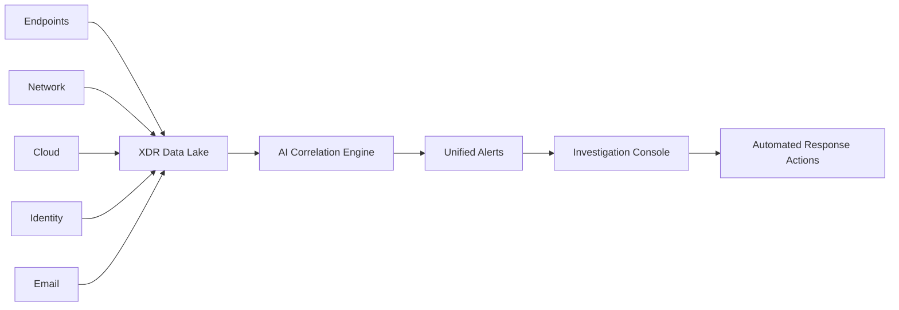
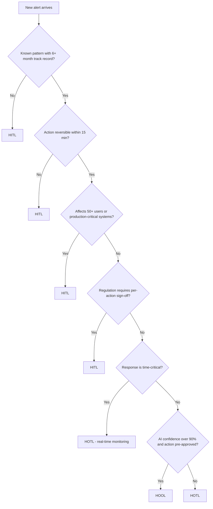

The SOC is no longer primarily a monitoring function — it's an intelligence-driven, increasingly autonomous response platform. Designing the operating model correctly before deploying AI is the single most important success factor: the five-level maturity model, operating-model patterns, KPIs/SLAs, capacity planning, and the human-in-the-loop architecture that governs how much autonomy AI actually gets.

## SOC Maturity Model

Five levels, each characterized by MTTD/MTTR, automation rate, and false-positive rate. **L1 Reactive** (manual log review, no SIEM correlation): MTTD 72-168 hrs, MTTR 5-30 days, under 5% automation, over 70% FP rate — 18% of enterprises in 2026, predominantly SMB and early-stage regulated. **L2 Monitored** (SIEM deployed, correlation rules, ticketing): MTTD 24-72 hrs, MTTR 2-14 days, 10-25% automation, 50-70% FP — 31%, mid-market/traditional enterprise. **L3 Automated** (SOAR deployed, top-20 playbooks automated, TI integrated): MTTD 4-24 hrs, MTTR 4-48 hrs, 30-55% automation, 30-50% FP — 28%, large enterprise/financial services. **L4 AI-Assisted** (LLM copilots, AI triage, ML anomaly detection): MTTD 30 min-4 hrs, MTTR 1-8 hrs, 55-75% automation, 15-30% FP — 19%, early adopters and security-mature organizations. **L5 Autonomous** (agentic investigation, gated autonomous containment, self-healing): MTTD under 15 min, MTTR 15 min-2 hrs, 75-95% automation, under 10% FP — only 4%, leading financial/technology/government organizations (Gartner SOC Survey 2026, Forrester Wave Security Analytics Q2 2026).

Transition prerequisites gate each jump. **L1→L2** needs 80%+ SIEM log-source coverage, a defined alert taxonomy, top-10 alert-type runbooks, and SLA-tracked ticketing. **L2→L3** needs an operational SOAR platform, automated enrichment for the top-10 alert types, integrated threat intelligence, FP rate tracked below 60%, and detection coverage mapped to MITRE ATT&CK. **L3→L4** needs operational LLM alert summarization, AI anomaly detection run in shadow mode for at least 30 days, established SOC prompt-engineering standards, an AI observability baseline, and approved AI governance policy. **L4→L5** needs HOTL operation for at least 3 automated playbooks with a 6-month track record, an operational agent identity/authorization framework, a quarterly-reviewed AI risk register, a quarterly-tested kill switch, a 12-month complete human-approval audit trail, and legal/compliance sign-off for autonomous containment authority.

## SOC Operating Models

The **traditional tier model** structures analyst workflow by skill level: Tier 1 handles alert monitoring, triage, and initial enrichment (acknowledge under 15 min, triage under 1 hr); Tier 2 handles incident investigation, malware analysis, and threat correlation (begin investigation under 2 hrs); Tier 3/IR handles threat hunting, advanced forensics, and architecture decisions (P1 engagement under 4 hrs); Management handles metrics, vendor management, and executive communication. In the AI-era transformation, Tier 1's enrichment-through-escalation steps are fully automated by a triage agent — the analyst reviews an AI summary in 60 seconds instead of 15 minutes, confirms or overrides the verdict, and override data feeds back into model improvement.

**Follow-the-sun SOC** designs for 24×7 coverage across regional teams handing off at shift boundaries — APAC, EMEA, and Americas shifts with 2-hour overlap windows. An AI-generated structured handoff report (open incidents, status, key findings, pending actions) cuts shift-lead review from 60 minutes to 10, with agent memory maintaining continuous investigation context across handoffs; critical incidents still get a synchronous video handoff regardless of time zone. AI-generated summaries solve most knowledge-transfer-quality problems, a triage agent enforces consistent global triage standards, and an automated escalation matrix with management on-call closes time-zone escalation gaps.

**Managed Detection and Response (MDR)** provides a fully staffed SOC as a service. Basic MDR (provided SIEM, included triage, notification-only IR, no threat hunting, 4-hour MTTD SLA, $50-150K/yr) sits below Advanced MDR (included AI triage, guided IR, monthly hunting, full custom playbooks, 1-hour SLA, $150-500K/yr) and Co-Managed MDR (customer-owned SIEM, shared AI triage, full IR and forensics, 30-min SLA, $200K-1M/yr). Vendor selection should weigh coverage scope, AI triage quality and its measurement methodology, integration depth, data residency, Tier 3 escalation access, SLA enforcement, investigation-visibility transparency, and custom playbook capability.

**Extended Detection and Response (XDR)** unifies endpoint, network, identity, cloud, and email telemetry into one detection/response platform. Native XDR (a single vendor's own telemetry, deep pre-built correlation, high lock-in, low integration effort — Microsoft XDR, CrowdStrike Falcon) trades off against Open XDR (any data source via connectors, correlation quality dependent on connector quality, low lock-in, medium-high integration effort — Palo Alto XSIAM, Stellar Cyber).

*XDR architecture: telemetry from five surfaces feeds a shared data lake, correlated by AI into unified alerts routed through an investigation console to automated response.*

An **AI-First SOC** is designed from scratch for autonomous operation — not a traditional SOC with AI bolted on. Five design principles: AI handles every routine alert, with humans engaging only for novel threats, policy decisions, and governance; human judgment is treated as a scarce, premium input, not the default first contact; AI earns autonomy through tracked decision quality over time (evidence-based trust); every AI decision is logged, scored, and fed into improvement pipelines; and multiple independent validation layers gate any containment action (defense-in-depth for AI). Its org chart reports an AI Engineering Team (builds/maintains agents and models), a Threat Intel Team (human threat hunters), and Governance & Compliance (AI risk, policy, approvals) all to the SOC Director.

## SOC KPIs and SLAs

Core KPIs, pre-AI benchmark vs. AI-era target: MTTD (24-72 hrs → under 30 min for known threats); MTTR (4-48 hrs → under 2 hrs); MTTC, mean time to contain (2-24 hrs → under 30 min automated); false-positive rate (40-70% → under 15%); alert-to-ticket ratio (1:50-200 → 1:1 for true positives); automation rate (20-40% → 70-85%); detection coverage against ATT&CK techniques (25-45% → 60-80%); SOAR playbook coverage (30-60% → over 85%); cost per alert ($8-25 → $1-5); cost per incident ($500-5000 → $100-500); analyst utilization on investigation vs. admin (40-55% → 70-80%); and AI decision accuracy, the AI's true-positive agreement rate with analysts, targeted above 90%.

SLA tiers by severity: **P1 Critical** (active breach, ransomware, executive compromise) — 5 min acknowledge, 15 min triage, 30 min contain, 4 hr resolve. **P2 High** (lateral movement, confirmed intrusion, cloud breach) — 15 min / 30 min / 2 hrs / 24 hrs. **P3 Medium** (suspicious activity, policy violation, anomaly) — 30 min / 2 hrs / 8 hrs / 72 hrs. **P4 Low** (informational, low-confidence anomaly) — 4 hrs / 24 hrs / best effort / 7 days.

Production before/after data (2025-2026 deployments) shows the scale of realistic impact: a global bank's MTTD dropped from 4.2 hours to 22 minutes (91% reduction) and MTTR from 18.5 hours to 3.1 hours (83% reduction), with FPR improving from 58% to 12%; a tech enterprise's automation rate rose 44 points (34%→78%); a healthcare system's cost per alert dropped 83% ($18.40→$3.20); a government agency's detection coverage rose 36 points (31%→67%) (Microsoft Sentinel Copilot, Palo Alto XSIAM, and SentinelOne Purple AI customer reports, 2026).

## SOC Capacity Planning

Daily alert volume scales roughly as (endpoints × 15-40/day) + (cloud workloads × 5-20/day) + (network devices × 10-30/day) + (filtered identity events × 2-8/day) + (filtered email events × 5-15/day) — for example, 10,000 endpoints plus 500 cloud workloads plus 200 network devices produces roughly 259,000 raw events, correlating down to about 8,000 alerts/day after SIEM correlation.

Traditional staffing for that volume, with Tier 1 capacity of 40-80 alerts/shift and Tier 2 capacity of 5-10 investigations/shift across 3 shifts for 24×7 coverage, requires roughly 133 Tier 1 FTEs and 320 Tier 2 FTEs — about 453 total. AI-augmented staffing, with AI handling 75-85% of Tier 1 alerts autonomously and AI-assisted analysts reviewing 200-300 alerts/shift, needs roughly 19 Tier 1 FTEs and 40 Tier 2 FTEs — about 59 total, an 87% reduction in analyst hours.

LLM infrastructure cost for a triage agent runs roughly 2,900 tokens/alert (800 system prompt, 500 alert context, 1,200 enrichment, 400 output); at Claude Sonnet pricing (~$3/MTok input, $15/MTok output), 8,000 alerts/day costs roughly $146/day (~$4,400/month). An investigation agent for P2/P3 incidents at ~20,000 tokens/investigation and 400/day costs roughly $72/day (~$2,160/month). Total LLM cost of roughly $6,560/month compares to a single fully-loaded analyst FTE at $8,000-12,000/month.

## Human-in-the-Loop Architecture

This is the most critical design decision in an AI SOC — getting it wrong causes either analyst fatigue (too many approvals) or security incidents (too much autonomy). Three operating modes:

**Human-IN-the-Loop (HITL)**: AI recommends, a human approves every individual action before execution. Use for novel threat types outside training data, high-impact containment (disabling accounts, isolating production systems), regulated industries requiring per-action sign-off, the first 90 days of any AI deployment, and any action affecting over 100 users or critical systems. The approval gate presents a confidence score, a 2-3 sentence reasoning explanation, supporting evidence links, and a proposed action with rollback procedure; the analyst reviews (target under 2 minutes) and approves, denies, or modifies.

**Human-ON-the-Loop (HOTL)**: AI acts autonomously within a defined scope; a human monitors and can override in real time. Use for well-understood patterns with a 6-month-plus track record, reversible actions (blocking an IP, quarantining a file), isolated/non-critical systems, and time-critical response where review latency is unacceptable (active ransomware spread). Pre-approved HOTL actions typically include blocking an external IP at the perimeter, quarantining a file in an endpoint sandbox, resetting MFA after verified compromise, disabling an OAuth token, and snapshotting a cloud resource before investigation — disabling an AD account, isolating a production server, deleting data, or any action affecting over 50 users still requires HITL. A real-time action feed with a 5-minute override window, automatic rollback computation, and logged override reasons keeps HOTL auditable.

**Human-OUT-of-the-Loop (HOOL)**: fully autonomous, only periodic audit. Use for pre-approved response automation (EDR-triggered malware quarantine), high-confidence/low-impact/easily-reversible actions already defined in IR policy, and throughput scenarios where human approval is physically impossible (over 10,000 events/sec). Governance requirements: a 12-month track record with under 2% error rate; legal counsel review of autonomous action authority; annual board/CISO approval of HOOL scope; a real-time kill switch activating in under 30 seconds; a daily audit report reviewed by the SOC manager; and immediate escalation on any anomaly in AI behavior.

*Mode-selection decision tree: track record, reversibility, blast radius, regulation, and time-criticality gate whether an action runs under HITL, HOTL, or HOOL.*

An approval-gate request carries a structured schema: incident and agent IDs, timestamp, the proposed action (type, target, scope, duration, reversibility, rollback procedure), an AI reasoning summary, confidence and risk scores, linked evidence items with relevance ratings, mapped MITRE techniques, an SLA expiry, and the governing mode — giving both the analyst and the audit trail everything needed to evaluate the decision without re-deriving it.

## Alert Fatigue: Root Causes and AI Mitigation

Alert fatigue occurs when volume exceeds analyst processing capacity, causing desensitization and missed threats. Common root causes and their AI mitigations: overly broad detection rules (AI-tuned per-rule thresholds); missing enrichment context (automated enrichment pipelines); duplicate alerts for the same event (AI deduplication and clustering); no priority differentiation (AI risk scoring with business context); outdated, unmaintained rules (AI-generated rule-improvement suggestions); and tool sprawl across too many alert sources (alert normalization and deduplication).

Traditional alert processing — reading the raw alert (3-5 min), manual enrichment (8-15 min), context lookup (5-10 min), severity decision (2-5 min) — totals 18-35 minutes per alert, capping a shift at roughly 64 alerts. AI-augmented processing — AI pre-processing (10-30 sec), analyst review of the AI summary (30-90 sec), approve/override (15-30 sec) — totals 1-2.5 minutes per alert, raising shift capacity to roughly 240 alerts: a 3.75x throughput improvement with the same headcount.

## SOC Skills Evolution

Roles evolve rather than disappear: Tier 1 Analyst becomes AI Triage Reviewer (AI literacy, prompt evaluation, override judgment); Tier 2 Analyst becomes AI Investigation Partner (agent supervision, complex scenario analysis); Tier 3/Threat Hunter becomes AI Hypothesis Engineer (prompt engineering for hunting, graph analysis); SOAR Engineer becomes AI Playbook Engineer (LLM integration, agent design, tool development); Detection Engineer becomes AI Detection Engineer (SIGMA plus LLM rule generation, ATT&CK mapping); SOC Manager becomes AI SOC Orchestrator (AI governance, agent capacity planning); and two new roles emerge — AI Security Engineer (MLOps, model evaluation, guardrail design) and Agent Governance Lead (policy design, AI risk register, compliance).

A practical training roadmap: months 1-2 build AI literacy foundations (how LLMs work, prompt engineering basics, prompt-injection awareness, hands-on copilot labs); months 3-4 cover AI-augmented operations (working with triage recommendations, override workflows, evaluating confidence scores, assisted-investigation exercises); months 5-6 cover agent supervision (understanding agentic behavior, governance and kill switches, monitoring agent activity logs, supervising automated incident response).

## Related

- [AI SOC Playbooks Part 02: AI Use Cases in Security Operations](02-part-02-ai-use-cases.md)
- [AI SOC Playbooks Part 11: Implementation Roadmap](11-part-11-implementation-roadmap.md)
- [Memory Governance & AI Observability/SOC](../ai-security-governance/35-ai-soc-observability-redteam-memory.md)
