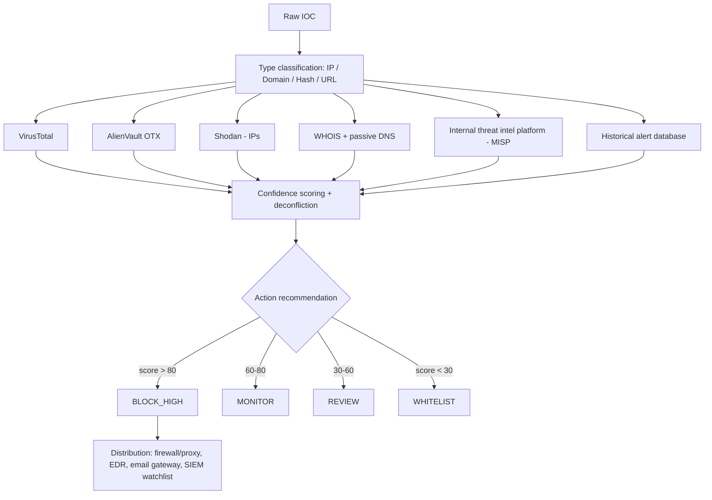

Every meaningful AI use case in a modern SOC, with implementation depth: for each, the AI technique, data requirements, tool integrations, and measurable business impact — spanning alert operations, threat intelligence, incident operations, behavioral analytics, cloud/Kubernetes detection, malware/forensics, and detection engineering.

## Alert Operations

**Alert triage** has an LLM agent read the raw alert, query enrichment sources, evaluate severity, and produce a structured verdict with reasoning — replacing the first 15-20 minutes of manual analyst work. The technique is zero-shot classification plus tool calling plus structured JSON output, drawing on raw alert fields, asset inventory, user directory, threat intel feeds, and historical alert context, via SIEM, VirusTotal/OTX/Shodan, AD/LDAP, CMDB, and the ticket database. A ReAct-style prompt gives the agent tools (`enrich_ip`, `get_user_profile`, `get_asset_info`, `search_similar_alerts`, `get_process_reputation`) and asks it to reason through each enrichment step before producing a verdict:

```json
{
  "verdict": "TRUE_POSITIVE",
  "confidence": 87,
  "severity": "HIGH",
  "reasoning": "The PowerShell command downloads a payload from a domain registered 48 hours ago with no reputation. The source process (Word.exe) is an unusual parent for PowerShell. The destination IP resolves to known Cobalt Strike C2 infrastructure.",
  "evidence": ["threat_intel_match", "unusual_process_ancestry", "new_domain"],
  "recommended_action": "QUARANTINE_ENDPOINT",
  "mitre_techniques": ["T1059.001", "T1566.001"],
  "escalate_to": "TIER_2"
}
```

2026 production benchmarks: time savings from 15-20 minutes to 30-60 seconds; 88-94% agreement with analyst verdict; 40-60% fewer false-positive escalations; throughput of 200-300 alerts/analyst/shift, up from 60-80.

**Alert prioritization** risk-scores each alert by combining AI severity assessment with business context into an ordered work queue: `Risk Score = (AI Threat Severity × 0.4) + (Asset Criticality × 0.25) + (User Privilege × 0.20) + (Threat Actor Targeting Match × 0.15)`, each component 0-100, with bands under 30 Low, 30-60 Medium, 60-80 High, 80-100 Critical. Business context shifts the score materially — the same alert on a CEO laptop adds roughly 30 points versus a test environment subtracting 20; an alert during an active sector-targeting campaign adds 15; a PCI-in-scope system adds 20; a system already isolated from the network subtracts 30.

**Alert deduplication** uses embedding-based semantic similarity plus temporal clustering to collapse duplicate or near-duplicate alerts from different tools or time windows into a single investigation unit — sentence-embedding cosine similarity above a threshold (commonly ~0.92) within a time window (commonly 60 minutes) merges alerts into clusters, cutting the actionable alert queue by 25-40%.

**Alert clustering** groups alerts from the same attack session into a unified incident view using temporal, entity, behavioral (ATT&CK technique commonality), and causal (process ancestry) dimensions, revealing the kill chain across sources — a spear-phishing-to-lateral-movement cluster spanning 49 minutes across five alerts (delivery, PowerShell spawn, download, unusual process, SMB connection attempts) gets synthesized by the LLM into a single narrative: "active compromise, attacker progressing from initial access to lateral movement, immediate containment recommended."

## Threat Intelligence Operations

**Threat intelligence summarization** ingests unstructured reports (PDFs, blog posts, ISAC feeds) and extracts structured intelligence — report metadata, threat actor profile (name, aliases, motivation, targeting), IOCs (IPs, domains, hashes), TTPs mapped to ATT&CK, and defensive recommendations — via NLP extraction, entity recognition, and structured output validated against a schema.

**IOC extraction and enrichment** pulls indicators from email headers/bodies (regex plus NLP), malware reports (PDF parsing plus LLM), phishing pages (browser automation plus NLP), SIEM alert fields (structured mapping), and sandbox reports (JSON parsing plus NLP), then enriches and routes them:


*IOC enrichment pipeline: parallel multi-source lookups feed a confidence score that drives an automated block/monitor/review/whitelist decision and distribution.*

**MITRE ATT&CK mapping** works two ways: alert-to-technique mapping, where the AI reads a raw event (a PowerShell process spawned by Word.exe with an encoded command) and maps it to specific technique IDs (T1059.001, T1204.002, T1140); and coverage heat-map generation, where detections are aggregated by technique to surface gaps against the full ATT&CK matrix — the practical output detection engineers use to prioritize new rule development.

## Incident Operations

**Incident summarization** synthesizes correlated alerts, endpoint process trees, network flow records, sandbox reports, and threat actor intelligence into a structured narrative for Tier 2/3 handoff: a timeline with precise timestamps, the observed ATT&CK technique pattern, impact assessment (systems/data/users affected or at risk), threat actor attribution where possible, current containment status, and the top 3 recommended immediate actions — written for an analyst taking over the investigation cold, factual, evidence-referenced, with uncertainties flagged explicitly.

**Executive summaries** translate technical findings into business-impact language for CISO, CEO, or Board communication: what happened in plain language, business impact (affected systems/data, financial exposure, customer impact), actions taken, actions in progress, and the next update time. A sample brief: "A sophisticated attacker gained access to our corporate email system through a targeted phishing email sent to 3 executives... Affected: 3 executive mailboxes (CEO, CFO, General Counsel). Data at risk: strategic planning documents, M&A materials... Blocked attacker access (14:47 UTC); preserved forensic evidence; notified legal counsel."

**Root cause analysis** traces an incident backward from detection to origin in four steps: chronological reconstruction (sort evidence by timestamp, identify patient zero, map the causal chain to detected impact); control failure analysis (for each attack step, which control should have prevented it, and why it failed — misconfigured, missing, bypassed, or evaded); root cause categorization (Vulnerability — unpatched/misconfigured; Process — inadequate detection rule or missing playbook; Human — phishing victim or policy violation; Tool — EDR gap or logging failure); and a causal chain diagram linking each attack stage (initial access → execution → persistence → lateral movement → exfiltration) to its specific control failure.

## Behavioral Analytics and UEBA

User Entity Behavior Analytics establishes behavioral baselines and detects statistically anomalous deviation across users (login hours, locations, access patterns, data volume), devices (process execution, network connections, USB usage, patch status), service accounts (API call patterns, resource access, time-of-day activity), applications (query patterns, error rates, geographic access), and cloud resources (API call volume, config-change frequency, network egress). An anomaly score combines weighted signals — time (15%), location (30%), volume (20%), access pattern (25%), velocity (10%) — into a single 0.0-1.0 risk score per event.

Statistical methods include Z-score (normally distributed metrics), MAD/Median Absolute Deviation (robust to outliers, better for skewed distributions), Isolation Forest (multi-dimensional high-dimensional anomaly), and LSTM Autoencoders (sequential time-series behavior). ML model tradeoffs: Isolation Forest needs moderate training data (~30 days) with medium interpretability; One-class SVM needs 60+ days with low interpretability; LSTM Autoencoders need 90+ days with low interpretability; Random Forest needs labeled data but gives high interpretability; LLM-based contextual reasoning needs only examples and gives very high interpretability.

Lateral movement signals include new SMB connections to previously-unaccessed hosts, Pass-the-Hash (NTLM authentication without a prior Kerberos TGT request), Pass-the-Ticket (a TGT used from an IP different from its issuance IP), admin share access from non-administrative workstations, unexpected WMI remote execution, SSH from a Windows host, and server-to-server RDP. Graph-based detection models the enterprise as hosts/users/service-accounts as nodes and communication relationships as weighted edges, then flags never-before-seen edges, traversal patterns matching known lateral-movement paths, shortest paths from a compromised node to crown-jewel assets, and betweenness-centrality spikes indicating a new hub in the attack path.

Insider threat detection fuses data-access anomalies (volume/type deviation from baseline), communication anomalies (emailing competitors or personal webmail), behavioral anomalies (late-night logins, remote access spikes), HR correlation (notice period, performance issues, grievances), and pre-departure activity spikes (mass download before resignation) into a composite score — data exfiltration (0-40 pts), communication anomaly (0-25), behavioral deviation (0-20), HR indicators (0-15) — with tiered response: above 60 alerts SOC and HR, above 80 triggers immediate investigation, above 90 escalates to Legal and the CISO.

## Cloud and Infrastructure Attack Detection

High-value AWS CloudTrail events to monitor include `CreateUser`/`AttachUserPolicy` (IAM privilege escalation), `CreateAccessKey` (persistence), `PutBucketAcl`/`PutBucketPolicy` (storage exposure), `CreateVpc`/`CreateInternetGateway` (C2 infrastructure), `GetSecretValue` (credential access), `DisableCloudTrailLogging` (critical — defense evasion), and `StartInstances` at scale (possible cryptomining) — AI flags volume anomalies (10x normal call rate), geographic anomalies, unusual-hour administrative activity, first-time callers, and privilege-escalation chains like `GetPolicy` → `AttachPolicy` → `CreateUser`. Azure equivalents include role-assignment writes, Key Vault secret reads, network security group writes, storage container writes, VM extension writes, and Entra ID sign-in anomalies.

Kubernetes audit-log detection targets `kubectl exec` into privileged pods, creating a service account bound to `cluster-admin`, accessing secrets in `kube-system`, `hostPath` volume mounts, `privileged: true` security contexts, disabling PodSecurityPolicy/NetworkPolicy, and DaemonSets with host network access — container-escape indicators specifically include mounting the root filesystem, `CAP_SYS_ADMIN` usage, namespace breakout via `/proc/1/ns/`, and Docker socket mounts. An AI assessment agent triggers on high-risk verb/resource combinations (exec/create/patch against pods/exec, clusterrolebindings, or secrets), gathers namespace/user/resource context, and evaluates against the MITRE ATT&CK for Containers framework.

## Malware and Forensics

AI enhances static malware analysis (disassembly interpretation in natural language, string deobfuscation across base64/XOR/ROT13/custom encodings, import-table behavior explanation, YARA rule generation, code-embedding similarity to known families) and dynamic analysis (sandbox-report summarization, C2 beaconing pattern identification, anti-analysis/evasion detection, persistence mechanism identification). A structured malware-analysis prompt asks for malware family, capabilities, C2 infrastructure, evasion techniques, persistence mechanism, IOCs, threat level with justification, and a basic YARA rule — all cited against specific sandbox-report evidence.

AI-assisted DFIR automates evidence collection across endpoint triage (memory capture, process tree, network connections, unsigned modules, scheduled tasks, recently modified files, browser history, Windows Event Logs, Prefetch, Amcache), identity evidence (login history, token usage, MFA logs, privileged access events), network evidence (DNS logs, proxy logs, email logs, DLP events), and cloud evidence (CloudTrail/Activity Log, storage access logs, IAM changes) — then reconstructs a unified, UTC-sorted timeline from hundreds of raw artifacts with confidence-scored causal links, explicit evidence gaps, and attribution indicators. A sample reconstructed timeline: phishing email received (09:23, high confidence) → attachment opened (09:47:02) → PowerShell spawned with encoded command (09:47:18) → payload downloaded (09:47:22) → scheduled task created for persistence (09:47:35) → an explicit evidence gap flagged (no DNS logs for the period) → a medium-confidence SMB connection 25 minutes later.

Memory forensics AI identifies process injection (unusual memory regions matching shellcode signatures), process hollowing (PE headers in non-standard memory locations), rootkit indicators (DKOM artifacts), and credential-extraction artifacts (LSASS access patterns, Mimikatz indicators) — typically by running Volatility 3 plugins (`pslist`, `netscan`, `malfind`) and having an LLM interpret the combined output for injected processes, suspicious network activity, shellcode regions, credential access, and persistence mechanisms.

## AI Detection Engineering

SIGMA rule generation follows a workflow: new threat intel ingested → AI extracts TTPs and behavioral patterns → AI generates a SIGMA rule → automated testing against historical data for false-positive rate → human engineer review and approval → deployment via a Detection-as-Code pipeline. An AI-generated rule for Cobalt Strike's default named-pipe patterns:

```yaml
title: Cobalt Strike Named Pipe Patterns
status: experimental
tags: [attack.command_and_control, attack.t1572]
logsource:
  category: pipe_created
  product: windows
detection:
  selection:
    PipeName|startswith:
      - '\postex_'
      - '\status_'
      - '\msagent_'
      - '\MSSE-'
  condition: selection
falsepositives: Unlikely
level: high
```

AI purple teaming closes the loop autonomously: an attack generator selects an uncovered ATT&CK technique, generates an atomic test case, and executes it in an isolated environment; a detection validator checks whether the SIEM and EDR triggered, recording DETECTED/MISSED/PARTIAL; a detection fixer generates a new rule for MISSED, improves the existing rule for PARTIAL, and validates false-positive rate for DETECTED; and a coverage report updates the ATT&CK heat map and tracks coverage improvement week over week.

## Related

- [AI SOC Playbooks Part 01: SOC Operating Model & Maturity](01-part-01-soc-operating-model.md)
- [AI SOC Playbooks Part 03: Agentic SOC Architecture](03-part-03-agentic-soc.md)
- [AI SOC Playbooks Part 04: AI Automation Playbooks](04-part-04-automation-playbooks.md)
