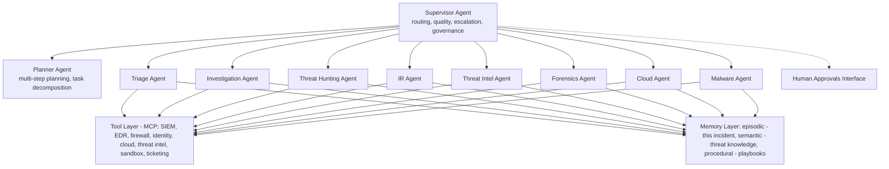

The Agentic SOC is not a SOAR platform with an LLM bolted on — it's a fundamentally different architecture: a network of specialized AI agents with tools, memory, and the ability to delegate, collaborate, and reason across time. Designing it correctly requires decisions about agent identity, trust, autonomy boundaries, and governance that cannot be retrofitted later.

## Agent Types and Roles

The Agentic SOC uses specialized agents rather than a single general-purpose AI: specialization gives smaller, focused system prompts with less ambiguity; domain-specific tool sets without over-permissioning; independent versioning and quality evaluation per agent; and blast-radius limitation when an agent is compromised or underperforms.


*Agentic SOC topology: a supervisor routes to specialist agents sharing a common MCP tool layer and a three-type memory layer, with a human approvals interface for gated decisions.*

Five agent specifications anchor the fleet. The **Triage Agent** does first-pass alert analysis, severity scoring, and FP filtering — high autonomy (handles 75-85% of alerts without a human), internal read-only trust, SLA under 60 seconds/alert, auto-escalating below 70% confidence or at Critical severity. Its system prompt enforces an analysis protocol (extract indicators, enrich each via tools, assess severity against the risk matrix, produce a structured verdict), explicit decision thresholds (above 85% confidence: autonomous verdict; 70-85%: autonomous plus notification; below 70%: human review), and hard security constraints — never execute containment, never touch systems outside its tool list, and flag any instruction asking it to bypass these rules. The **Investigation Agent** does deep investigation (timeline, attack chain, root cause) — medium autonomy requiring approval for certain evidence collection, elevated read access, SLA under 15 min for initial findings and under 2 hrs for complete investigation, escalating to the Supervisor on novel TTPs. The **Threat Hunting Agent** does proactive detection via hypotheses and broad search — medium autonomy (executes queries autonomously, flags results for review), continuous SLA alerting within 30 minutes of a finding; it generates hunting hypotheses from recent threat intel, detection gaps, and incident patterns, each scored with a rationale, query approach, mapped ATT&CK techniques, and priority, focused specifically on techniques the organization lacks detections for. The **Incident Response Agent** executes containment, eradication, and recovery — low-medium autonomy (most containment requires HITL approval), elevated write access gated by approval, SLA under 5 min from approval to action. The **Supervisor Agent** orchestrates specialists, quality-controls output, and makes escalation decisions — high autonomy for routing, low autonomy for final decisions, full visibility across all memory types, routing decisions under 30 seconds.

## Multi-Agent Architecture Patterns

Four patterns cover most SOC topologies. **Sequential pipeline** — alert flows through triage → investigation → IR → human review, each stage producing a verdict/timeline/containment-request in turn. Best for known threat patterns with well-defined response steps; latency is additive (each agent adds 30-120 seconds); risk is a single point of failure if a middle agent fails. **Parallel investigation** — Identity, Network, and Cloud agents work simultaneously on the same incident, with a synthesizer resolving their findings into one report. Best for complex incidents spanning multiple domains (cloud plus endpoint plus identity); latency is the max of agent times rather than their sum; risk is agents reaching conflicting conclusions that the synthesizer must resolve. **Hierarchical (supervisor plus specialists)** — the supervisor receives all incidents and dynamically routes to Triage, Hunt, or IR agents based on incident type. Best for enterprise SOCs with diverse incident types, letting the supervisor adapt the workflow as an incident develops. **Event-driven swarm** — agents subscribe to an event bus (Kafka/EventHub) and self-activate on matching topics (`endpoint.*` activates Triage, `cloud.*` activates the Cloud agent, and so on). Best for high-volume environments needing natural scaling; risk is duplicate work without a coordinating supervisor.

## Agent Communication Protocols

**Model Context Protocol (MCP)** standardizes how agents discover and invoke tools — every security tool becomes an MCP server agents call uniformly (a SIEM server exposing `search_logs`/`create_alert`/`get_incident`; an EDR server exposing `get_process_tree`/`isolate_endpoint`/`get_file_events`; an Identity server exposing `get_user`/`disable_acct`/`reset_mfa`; a Threat Intel server exposing `lookup_ioc`/`get_actor_profile`/`enrich_domain`). A minimal server tool definition:

```python
@soc_siem.tool()
async def create_incident(title: str, severity: str, description: str, evidence: list[str]) -> dict:
    """Create an incident ticket in the SIEM/ticketing system."""
    if severity not in ["Critical", "High", "Medium", "Low"]:
        raise ValueError(f"Invalid severity: {severity}")
    return await siem_client.create_incident(title=title, severity=severity,
                                               description=description, evidence_ids=evidence)
```

MCP security controls matter as much as the tools themselves: OAuth2 client-credentials authentication with scoped tokens; OPA-based authorization against a Rego policy file; full audit logging of tool inputs and outputs (with PII redaction on outputs); per-agent and per-tool rate limiting; and Kubernetes-namespace sandboxing with a restricted network policy allowing egress only to approved internal tool endpoints.

**Agent2Agent (A2A)**, Google's inter-agent protocol, lets agents discover and delegate tasks to other agents across organizational boundaries. A task card delegating IOC enrichment to a threat-intel agent carries a task ID, the delegating agent's identity and capability, the receiving agent's endpoint and capability, the task objective/inputs/required-outputs/deadline/priority, and a scoped, time-limited authorization token — the same compound-identity and delegation-chain discipline covered in the [Identity/MCP/A2A Security Blueprint](../ai-security-governance/34-identity-mcp-a2a-security-blueprint.md) applies directly here.

**Context propagation** keeps an investigation coherent as it moves across agents: an `InvestigationContext` object accumulates evidence, confirmed and suspected ATT&CK techniques, a timeline, prior agent findings (summarized, not full output), current status, open questions, and human approvals — serialized to a token-bounded summary for LLM context injection rather than a raw dump, compressing when the full context would exceed the budget.

## Agent Memory Architecture

Four memory types serve distinct purposes: **episodic** memory (events in the current investigation — alerts, findings, actions) lives in Redis/in-memory for the incident's duration; **semantic** memory (threat knowledge — actor TTPs, IOC reputation, detection logic) lives in a vector DB plus knowledge graph, updated long-term; **procedural** memory (playbook steps, query templates) lives in a versioned document store; **working** memory (the active LLM context window) is per-inference and in-memory only.

Episodic memory implementations append timestamped findings per agent to a Redis list keyed by incident ID with a 30-day retention expiry, and summarize the most recent N entries into a compact string for LLM context. Semantic memory implementations run vector search (e.g., Pinecone) over embedded threat-intelligence content, returning relevance-scored entries with source and publication date — the same mechanism powers "find past incidents similar to this one" by searching against incident-report-typed documents.

## Long-Running Investigations

Investigations can last hours or days, so agent state must be persisted to survive restarts. A checkpoint captures the investigation ID, timestamp, all agent states, pending and completed tasks, collected evidence, human approvals, and planned next steps, written to encrypted object storage under a checkpoint ID — resumption reloads the latest checkpoint into a fresh `InvestigationState`.

Human approval integration blocks agent execution pending a decision: a `HumanApprovalGate` creates a request carrying the agent ID, proposed action, reasoning, and evidence, notifies analysts across SOC console/Slack/PagerDuty, and waits on the decision with a timeout (commonly 10 minutes) — on timeout, it escalates to a manager and returns a `TIMED_OUT` result rather than silently proceeding or silently blocking forever.

## Agent Governance

Every agent needs a verifiable identity and least-privilege credentials. An identity specification pairs a SPIFFE ID with an OAuth client carrying explicitly granted scopes (`siem:alerts:read`, `threat-intel:ioc:read`, `cmdb:assets:read`, `tickets:create`) and, just as importantly, explicitly **denied** scopes (`edr:isolate:write`, `iam:modify:write`, `firewall:rules:write`) — with credentials rotated on a short cycle (commonly weekly) and stored in a secrets vault, not agent configuration.

A kill switch immediately halts all agent activity on unexpected behavior, compromise, or operational emergency. Trigger sources include a SOC Manager's manual console trigger, automated anomaly detection on AI behavior outside bounds, an external API call (e.g., from a CISO's mobile app), a watchdog timer on missed heartbeats, and a circuit breaker on error-rate threshold breach. Activation publishes a stop signal to an emergency-stop topic; agent containers receive SIGTERM with a 10-second graceful shutdown window, then SIGKILL; state is checkpointed; PagerDuty P1 and Slack notify humans immediately; and the full event is audit-logged (who, when, why) for compliance. Recovery requires investigating the trigger cause, manual SOC Director approval to restart, 48 hours back in HITL mode at maximum oversight, and only a gradual return to HOTL/HOOL once stability is reconfirmed.

Every agent decision and action is recorded for non-repudiation and compliance: event ID, timestamp, agent ID and version, incident ID, action type, tool called, PII-redacted tool inputs and outputs, reasoning, confidence, human-approval status and approver ID, and outcome — written to append-only object storage with object-lock retention (commonly 1 year minimum) and chained by hash for tamper evidence.

## Enterprise Deployment

Agents deploy as Kubernetes workloads with hardened defaults: non-root user, dropped Linux capabilities, read-only root filesystem, no privilege escalation, and the default seccomp profile — LLM API keys sourced from a Kubernetes secret, never baked into the image. A companion `NetworkPolicy` restricts egress to the `soc-tools` namespace over TLS plus DNS only, denying any other outbound path by default — the same "credentials and network access live outside the agent's own control" discipline applied at the infrastructure layer.

## Related

- [AI SOC Playbooks Part 02: AI Use Cases in Security Operations](02-part-02-ai-use-cases.md)
- [AI SOC Playbooks Part 04: AI Automation Playbooks](04-part-04-automation-playbooks.md)
- [Identity/MCP/A2A Security Blueprint](../ai-security-governance/34-identity-mcp-a2a-security-blueprint.md)
