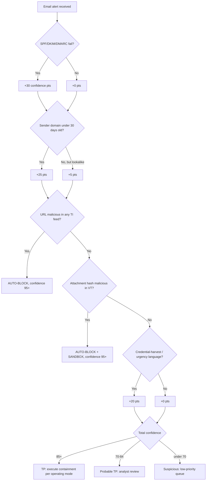

Six AI automation playbooks covering email and identity attack paths — phishing, business email compromise, malware execution, ransomware, password spray, and OAuth consent abuse. Every playbook follows the same standard: trigger, inputs, AI reasoning, tools, workflow, decision logic, confidence/risk scoring, MITRE ATT&CK/D3FEND mapping, automation steps, approval gates, rollback, evidence preservation, reporting, KPIs, and failure scenarios.

## PB-001: Phishing Email Detection and Response

**Trigger:** an email security gateway phishing-confidence score above 70%, a user "Report Phishing" click, or a SIEM rule catching multiple recipients of the same suspicious email.

**AI reasoning** evaluates sender legitimacy (SPF/DKIM/DMARC alignment, domain age, lookalike patterns), link analysis (redirect chains, login-page destinations, domain age), attachment risk (hash reputation, executable file types), content (urgency language, impersonation, credential-harvesting requests), target sensitivity (privileged/executive/finance recipients), and campaign correlation (are other employees receiving the same email right now) — drawing on the email security gateway, VirusTotal, URLScan.io, WHOIS/passive DNS, LDAP/Azure AD, SIEM, and a detonation sandbox.

*Phishing confidence-scoring decision tree: authentication failure, domain age, TI matches, and content signals accumulate into a confidence score that gates the response mode.*

The investigation runs in roughly two minutes end to end: ingestion and header parsing (0-30 sec), parallel enrichment of URLs/hashes/sender domain plus a 24-hour similar-email search (30-90 sec), and a verdict (90-120 sec) — 85%+ confidence gets a definitive verdict, 70-84% a probable verdict with caveat, under 70% escalates to an analyst. Containment depends on verdict and operating mode: HITL presents to an analyst for approval, HOTL executes and notifies, and any mass campaign (over 10 recipients) is always HITL regardless of confidence. Response actions include blocking the sender domain/IP at the gateway, quarantining all copies organization-wide, deleting from user inboxes when executive-authorized, blocking URLs at the web proxy, and resetting credentials if a link was clicked (evidence-preserving at this stage, not yet punitive). Risk scoring multiplies a base threat score (definite 80, probable 60, suspicious 30) by a recipient multiplier (C-suite 2.0, finance 1.8, IT admin 1.5, general staff 1.0) and adds business-context points (active M&A period +15, tax/audit season +10, recent high-profile company news +10) to produce a P1-P4 priority.

Approval gates scale with blast radius: quarantining a single email needs no approval (HOOL); blocking a sender domain needs only analyst notification (HOTL); an organization-wide inbox sweep needs analyst approval (HITL); blocking an entire TLD needs SOC Manager approval; deleting from all inboxes needs CISO plus Legal approval. Rollback for an incorrect quarantine releases the email, notifies the recipient, removes the IOCs from threat feeds, and labels the case as a false positive for model improvement — target under 5 minutes. Evidence preservation requires the original `.eml`, complete unmodified headers, the attachment with its hash chain, URLScan screenshots, VT scan JSON, the AI analysis report, the action timeline, and human decision rationale, retained 90 days (PCI DSS) to 7 years (legal hold) in WORM-policy storage. Target KPIs: under 2 minutes alert-to-verdict, under 5 minutes verdict-to-containment, under 5% false-positive rate, over 99% of affected recipients identified, under 30 minutes to user notification.

## PB-002: Business Email Compromise (BEC)

**Trigger:** behavioral analytics flagging an executive account sending unusual requests, a financial-system alert on an unusual wire-transfer request, or a user reporting a suspicious CEO/CFO-claiming email.

BEC requires social-context reasoning, not just technical indicators: is the account actually compromised or merely spoofed; is the request a financial transfer, HR data pull, or gift-card ask; does it match the executive's normal communication style; did SPF/DKIM pass and does the display name match the sending address; did the process skip a normal approval step; is deadline pressure being used to bypass verification. If the sending address is spoofed (not the executive's real account), it's classified as high-confidence phishing (T1566.002); if it's the real account, account compromise is suspected, escalated further by a recent login from a new country, a recent password change, or a newly registered device. Any request for a wire transfer, gift cards, or W-2 data triggers immediate P1 escalation and a financial-team alert.

The mandatory control for every BEC case is out-of-band verification: the AI generates a pre-drafted phone script for the analyst — "Hi [Name], this is [Analyst] from the Security team. We received an email from your account requesting [X]. Can you confirm you sent this?" — using a phone number from the company directory or HR's personal-mobile record, never the number in the suspicious email, never a reply to the email itself, and never a chat thread the suspicious party created. MITRE mapping: T1566.002 (spearphishing link), T1534 (internal spearphishing, if account compromised), T1078 (valid accounts, if credentials stolen), T1110 (brute force, if initially compromised via spray).

## PB-003: Malware Execution on Endpoint

**Trigger:** an EDR malicious-process alert above 85% confidence, a SIEM signature match, or a network C2-beaconing alert from an endpoint.

Rapid context gathering (0-45 sec) pulls the full EDR process tree/timeline/network connections, hash reputation across VT/EDR-cloud/internal intel, asset criticality, and user privilege level. AI analysis (45-90 sec) identifies the malware family, behavioral classification (RAT, ransomware, infostealer, dropper), C2 infrastructure, and an infection-vector hypothesis. The containment decision depends on asset class: a critical server stays HITL given business-disruption risk; a standard workstation above 90% confidence goes HOTL (isolate automatically); a test/dev environment goes HOOL (auto-isolate and sandbox). Approved containment isolates the endpoint from the network, kills the malicious process tree, quarantines files, blocks C2 IPs/domains at the firewall, and creates a SIEM watchlist for the IOCs — followed by forensic preservation (memory capture, KAPE triage collection, EDR telemetry preservation) and a sibling hunt across all endpoints for the same hash, process pattern, or C2 connections. Confidence bands: 95-100 (hash in threat intel or signed malware signature) isolates immediately; 85-94 (behavioral/sandbox match) isolates under HITL on servers, HOTL on workstations; 70-84 (heuristic/process anomaly) quarantines the process pending analyst review; 50-69 (low-confidence anomaly) just monitors and alerts. MITRE spans execution (T1059.001/.003), persistence (T1547.001, T1053.005), defense evasion (T1055, T1036), and C2 (T1071, T1105).

## PB-004: Ransomware Active Encryption Detection — Time-Critical, P1, HOOL Authorized

**Trigger:** mass file modification exceeding 100 files/minute with encryption-level entropy, shadow-copy deletion (`vssadmin.exe`/`wmic.exe`), new ransom-pattern file extensions, mass internal SMB connections indicating lateral spread, or backup-system tampering.

Ransomware spreads exponentially — every second of delay encrypts more data. This is the one playbook authorized for full HOOL autonomy, because false containment (temporary isolation) costs far less than terabytes of encryption, the actions are reversible (remove isolation), and the combined-trigger pattern carries under 1% false-positive rate when all conditions fire simultaneously. Within 30 seconds of trigger: page the SOC (T+0), isolate the infected endpoint from all network (T+5s), block its IP at the firewall (T+10s), disable the AD account running the process (T+15s), kill the process tree (T+20s), trigger an emergency backup snapshot of unaffected shares (T+25s), and search for the same process on other hosts (T+30s) — in parallel, search for lateral spread, check backup-storage reachability from the infected host, identify and block C2 infrastructure, and preserve forensic evidence, while simultaneously paging the on-call engineer, posting to `#incident-critical`, and SMS-alerting the SOC Manager and CISO.

The decision gate requires all three signals present (mass file modification, shadow-copy deletion attempt, encryption-strength entropy) for full HOOL auto-containment; a partial match requires HITL confirmation within 2 minutes. After containment, check for lateral spread (isolate any other host running the same process), backup-system impact (invoke the DR plan if affected), and network-share encryption scope. Evidence preservation is critical and must happen before any remediation: memory dump, a screenshot (may capture the ransom note), the running process list and network connections at containment time, a file-system snapshot, registry hives, all event logs, browser history for infection-vector investigation, the EDR timeline export, and a copy of the ransom note (never pay without Legal/CISO approval) — law enforcement and cyber insurance both require this, evidence collected after cleanup is inadmissible, and chain of custody must be documented. MITRE: T1486 (data encrypted for impact), T1490 (inhibit system recovery), T1083/T1135 (discovery), T1570 (lateral tool transfer), T1047 (WMI propagation).

## PB-005: Credential Theft / Password Spray

**Trigger:** over 50 failed authentications across accounts within 5 minutes, a single source IP hitting over 10 unique accounts, numerous AD lockouts in a short window, or an Azure AD identity-protection risk detection.

The AI first distinguishes spray (many accounts, few attempts each, evading lockout thresholds) from brute force (one account, many attempts, quickly locked out) — different risk profiles requiring different responses. Any successful authentication from a spray source triggers immediate account disable and session revocation; absent that, monitoring continues at increased sensitivity. Source characterization checks IP reputation against known spray infrastructure, ASN/VPN/datacenter classification, geolocation consistency, and timing-pattern fingerprinting for automated tooling. Response blocks source IPs at the perimeter automatically above 85% confidence, forces MFA step-up for targeted accounts, notifies targeted users, and opens a full account investigation on confirmed compromise. MITRE: T1110.003 (password spraying), T1110.001 (guessing), T1078 (valid accounts, if successful), T1110.004 (credential stuffing, if from a leaked list).

## PB-006: OAuth Abuse / Consent Phishing

**Trigger:** an unusual Azure AD OAuth app consent grant, a user granting a third-party app high-risk scopes, a phishing email containing an OAuth consent link, or impossible travel immediately following an OAuth consent event.

The attack doesn't steal a password at all: an attacker registers a malicious OAuth app, sends a phishing email with a consent link, the victim authenticates to the legitimate identity provider and unknowingly grants scopes like `Mail.Read`, `Files.ReadWrite`, or `User.Read.All`, and the attacker receives a valid OAuth access token that persists until explicitly revoked — MFA doesn't prevent this, because the victim genuinely consented. AI evaluates application legitimacy (known-good catalog, verified publisher, registration recency), permission scope risk (`Mail.Read`/`Send` and `Files.ReadWrite.All` and `User.Read.All` are high; `User.Read` alone is low), and consent context (did a phishing email precede the consent, how much time elapsed, any behavioral anomaly around it). A high-risk app plus suspicious context routes to HITL approval for disabling the app tenant-wide, revoking all its OAuth tokens, notifying every user who consented, searching for data accessed via the app in the last 90 days, and blocking the app's registration at the perimeter where possible. MITRE: T1528 (steal application access token), T1550.001 (use alternate authentication material), T1566.002 (if phishing delivered the consent URL).

## Related

- [AI SOC Playbooks Part 03: Agentic SOC Architecture](03-part-03-agentic-soc.md)
- [AI SOC Playbooks Part 04: Identity & Endpoint Attack Playbooks (Part 2)](parts/04-part-04-automation-playbooks-part2.md) — impossible travel, MFA fatigue, insider threat, cloud exposure, container escape, privilege escalation
- [AI SOC Playbooks Part 05: SOAR Platform Comparison](05-part-05-soar-platforms.md)
