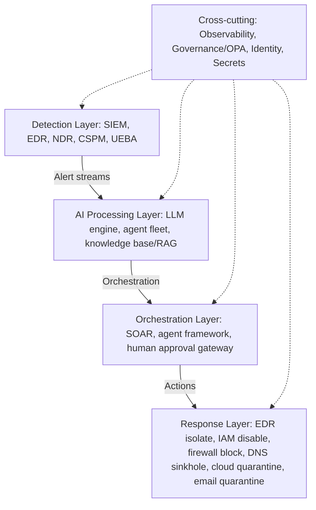
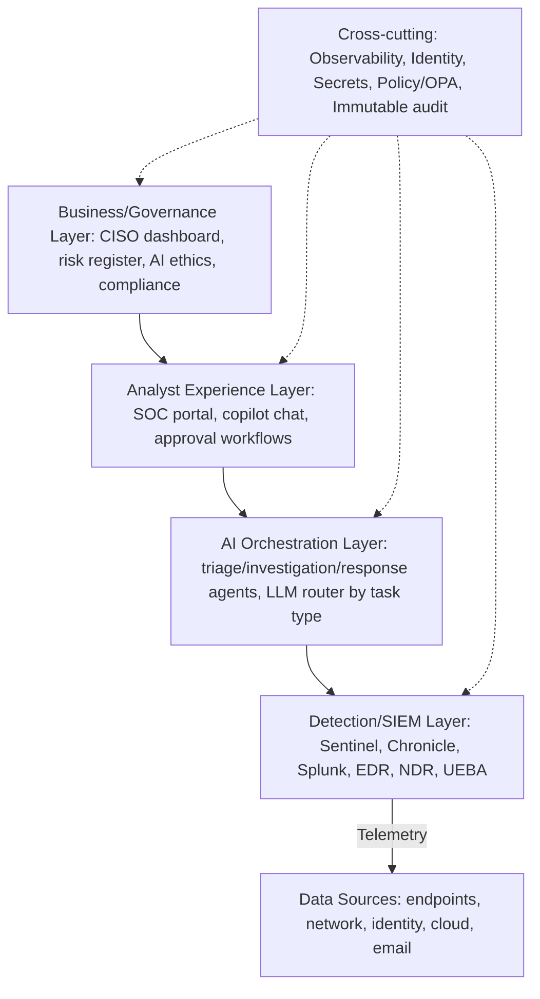

TOGAF-aligned enterprise architecture for the AI SOC: business, application, and data architecture; a capability map; Zero Trust agent identity; AWS/Azure landing-zone integration; event-driven alert architecture; and a Detection-as-Code pipeline.

## TOGAF Alignment for AI SOC

**Business architecture.** The SOC mission is protecting enterprise assets through rapid detection, investigation, and response, with AI augmentation enabling comprehensive coverage at scale. Four value streams anchor it: threat detection (raw telemetry through AI triage to actionable alerts, valued by reduced attacker dwell time), incident response (a confirmed incident through AI investigation to a contained threat, valued by reduced breach impact), threat intelligence (TI feeds through AI extraction and correlation to detection rules, valued by proactive prevention), and compliance assurance (a controls framework through AI audit assistance to evidence packages, valued by regulatory confidence). The stakeholder map spans the CISO (SOC effectiveness, AI ROI, risk reduction), CRO (risk posture, breach-probability reduction), CFO (AI SOC cost versus traditional-model ROI), CTO (platform architecture, AI infrastructure cost), Legal (evidence handling, AI-assisted incidents, GDPR), the Board (cyber-risk materiality, AI governance), and regulators (DORA, NIS2, SOC 2, EU AI Act compliance).

**Application architecture** layers five tiers. The detection layer runs SIEM (Sentinel), EDR (Defender), NDR (Darktrace), CSPM (Wiz), and UEBA (Sentinel) in parallel, streaming alerts into the AI processing layer — an LLM engine (Claude/GPT-4o), the specialist agent fleet (triage, investigation, response), and a knowledge base (RAG, playbooks, threat intel). The orchestration layer (SOAR via Sentinel Logic Apps or Splunk SOAR, an agent framework like LangGraph/AutoGen/Strands, and a human approval gateway) drives the response layer's concrete actions (EDR isolation/process kill, IAM account disable, firewall IP block, DNS sinkhole, cloud resource quarantine, email quarantine). Cross-cutting every layer: observability (Langfuse plus Grafana), governance (OPA), identity (Entra ID plus Managed Identity), and secrets management (Key Vault).


*SOC application landscape: detection feeds AI processing, which drives orchestration and response, with observability, governance, identity, and secrets management cutting across every layer.*

**Data architecture** classifies four tiers by volume and retention: telemetry (high volume — logs, network flows, process/auth events — 90 days hot then 1 year cold, stored in the SIEM/Log Analytics/OpenSearch); evidence (medium volume — alert details, investigation notes, IOCs, artifacts — 3 years, in a case-management DB plus object storage); knowledge (low volume, permanent and versioned — playbooks, threat intel, MITRE mappings, analyst notes — in a vector DB plus knowledge graph); and AI artifacts (medium volume, 2 years for audit — prompts, completions, agent traces, tool calls — in self-hosted Langfuse plus object-storage backup). Data flows from source systems through streaming ingest (Kafka/EventHub) into the SIEM/lake, through the AI processing pipeline, into the evidence store and knowledge base, and out to reporting — governed by PII redaction before AI processing, chain-of-custody preservation via immutable storage, jurisdiction-specific data-residency enforcement, and model training-data provenance tracking.

## Capability Map

**Detection capability**: telemetry collection across endpoint, network, identity, cloud, and application; detection engineering via SIGMA, YARA, ML models, AI-assisted rule generation, and purple teaming; alert correlation via real-time alerting, multi-stage fusion, AI enrichment, and deduplication. **Investigation capability**: alert triage (AI severity scoring, IOC enrichment, asset context, UEBA risk); incident investigation (attack chain, lateral movement, data exfiltration, malware analysis); threat hunting (AI hypothesis generation, proactive IOC hunting, TTP-based hunting). **Response capability**: containment (IP blocking, host isolation, account suspension, cloud quarantine); eradication (malware removal, persistence removal, credential reset); recovery (system restoration, service validation, AI-assisted recovery procedures); post-incident (AI-generated incident reports, lessons learned, detection improvements). **Threat intelligence capability**: ingestion (MISP/STIX, commercial feeds, OSINT, AI extraction from unstructured reports); analysis (IOC correlation, actor profiling, campaign detection); operationalization (TI-to-detection-rule conversion, IOC dissemination, ISAC sharing). **Governance and compliance capability**: AI governance (model lifecycle, bias monitoring, audit trail, risk assessment); compliance (NIST CSF 2.0 mapping, ISO 27001/42001 evidence, regulatory reporting); performance (SOC KPIs, AI accuracy evaluation, analyst productivity analytics).

## Zero Trust Integration

Zero Trust principles translate directly into AI SOC controls: **verify explicitly** means verifying agent identity, context, and posture per action rather than trusting network location; **least privilege** means granular per-agent permissions (the triage agent is read-only) rather than shared admin credentials for SOC tooling; **assume breach** means monitoring every agent action with a kill switch always armed, rather than relying on perimeter protection alone. Each agent gets its own managed identity with an explicit, minimal permission set — the triage agent gets `logs.read` and `threat_intel.read`; the investigation agent adds `edr.read` and `tickets.write`; the IR agent adds `edr.isolate` and `firewall.block` — authenticated via short-lived tokens (a 15-minute TTL, re-authenticated on every call) rather than long-lived stored secrets:

```python
class ZeroTrustAgentIdentity:
    AGENT_PERMISSIONS = {
        "triage_agent": ["logs.read", "threat_intel.read"],
        "investigation_agent": ["logs.read", "edr.read", "tickets.write"],
        "ir_agent": ["logs.read", "edr.read", "edr.isolate", "firewall.block"]
    }
    def __init__(self, agent_type: str):
        self.allowed_actions = self.AGENT_PERMISSIONS.get(agent_type, [])
        self.credential = ManagedIdentityCredential(client_id=os.environ[f"AGENT_CLIENT_ID_{agent_type.upper()}"])
    def can_perform(self, action: str) -> bool:
        return action in self.allowed_actions
```

Infrastructure-as-code makes this enforceable and auditable rather than a documentation-only policy. A Terraform module provisions a distinct Azure managed identity per agent type; a triage-agent role assignment grants only `Log Analytics Reader` against the Sentinel workspace; a custom IR-agent role definition explicitly grants read access to security assessments and VM state while explicitly denying VM write and delete actions in `not_actions` — the containment capability an IR agent actually needs (isolate, block) is deliberately narrower than general compute administration.

## Cloud Landing Zone Integration

On **AWS**, GuardDuty (with S3, Kubernetes audit log, and EBS malware-protection data sources enabled, findings published every 15 minutes) feeds an EventBridge rule filtering for severity ≥7.0, routing matching findings into a Step Functions state machine that drives the AI SOC investigation — with a least-privilege IAM policy for the triage agent allowing only `guardduty:GetFinding`/`ListFindings`, `securityhub:GetFindings`, and `cloudtrail:LookupEvents`, while explicitly denying `ec2:*`, `iam:*`, and `s3:DeleteObject` regardless of any other grant. On **Azure**, a Sentinel Log Analytics workspace (90-day retention, customer-managed key enforced for GDPR) drives an automation rule that routes any High or Critical severity incident directly to an AI-triage Logic App playbook — declarative condition-and-action routing rather than custom polling code.

## Event-Driven Alert Architecture

A Kafka-based stream processor routes alerts to the appropriate agent by severity and type — Critical/High severity goes straight to the triage agent, Malware/Ransomware-typed alerts get their own dedicated malware agent, and everything else runs through the standard pipeline — rather than every alert flowing through one undifferentiated queue. For the audit trail itself, an event-sourcing pattern makes every investigation fully reconstructable from its event history: each event (investigation ID, event ID, type, data, actor, timestamp) is HMAC-signed at write time using a dedicated signing key, so any retroactive tampering with a stored event is cryptographically detectable, not just access-controlled against.

## Detection-as-Code Pipeline

Detection rules live in version control and ship through a CI/CD pipeline like any other code: a GitHub Actions workflow triggers on changes under `detections/**`, validates SIGMA rule syntax, converts SIGMA to platform-native KQL for Sentinel, runs the converted rules against sample data to catch regressions, and runs an AI-assisted rule review step (an LLM reviewing the diff for common SIGMA anti-patterns and coverage gaps) before a separate deployment job — gated to the main branch and a protected production environment — pushes the validated rules to the live Sentinel workspace via the Azure CLI. This is the same "policy code gets the same review discipline as application code" principle applied specifically to detection engineering.

## Reference Architecture Summary


*Full-stack AI SOC reference architecture: governance and analyst experience sit above AI orchestration, which drives detection against raw telemetry, with observability/identity/secrets/policy/audit cutting across every layer.*

## Related

- [AI SOC Playbooks Part 03: Agentic SOC Architecture](03-part-03-agentic-soc.md)
- [AI SOC Playbooks Part 05: SOAR Platform Comparison](05-part-05-soar-platforms.md)
- [AI SOC Playbooks Part 10: Standards & Compliance Mapping](10-part-10-standards-compliance.md)
