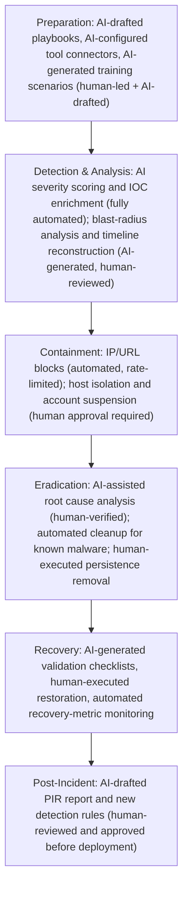

AI-powered SOC operations sit at the intersection of cybersecurity regulation, AI governance regulation, and privacy law. This part maps AI SOC capabilities to NIST CSF 2.0, NIST SP 800-61 r3, and the NIST AI Risk Management Framework, with specific control implementations.

## NIST CSF 2.0 Mapping

NIST CSF 2.0 (published February 2024) added the GOVERN function and expanded AI-related coverage across all six functions.

**GOVERN** anchors AI SOC accountability: an organizational AI SOC mission needs a board-approved charter (GV.OC-01); stakeholder roles need an explicit RACI — CISO accountable, SOC Director responsible, analysts informed (GV.OC-02); legal and regulatory requirements map to the EU AI Act, NIS2, DORA, GDPR, and SOC 2 Type II (GV.OC-03); outcomes-based performance tracks MTTD, MTTR, AI accuracy, and false-positive rate (GV.OC-05); AI risk gets integrated into the enterprise risk register (GV.RM-01) with an explicit risk appetite — auto-containment permitted for IP blocks, human approval required for host isolation (GV.RM-02); an AI Risk Officer role and quarterly review cadence assign ownership (GV.RM-03); and supply-chain risk requires model vendor risk assessment and provenance tracking (GV.RM-04, GV.RM-07).

**IDENTIFY** requires a complete AI model registry (all models inventoried with version, purpose, and training-data source), an inventoried AI platform asset base (GPU clusters, vector DBs, embedding models, agent frameworks), documented AI data flows from telemetry source through the LLM to output, mapped external dependencies (OpenAI, Anthropic, Google Vertex APIs), and criticality classification (triage agents as critical-path systems). Risk identification specifically covers ML-framework CVEs (PyTorch, Hugging Face), AI-specific threat intelligence via MITRE ATLAS and the OWASP LLM Top 10, and the adversarial-attack/prompt-injection/model-poisoning threat class.

**PROTECT** requires managed identities for every agent with no static credentials, mTLS for agent-to-API communication, OPA-based per-agent authorization scopes, SSO via Entra ID for human access, and least-privilege IAM roles restricting each agent to its specific allowed actions. Data protection requires AES-256 encryption at rest for training data with logged access, TLS 1.3 minimum for LLM API calls, and automated PII detection/redaction before any AI processing. Incident-response planning needs AI-specific playbooks covering model compromise, prompt injection, and agent failure — and any AI-generated detection rule requires human approval before deployment.

**DETECT** layers AI onto existing detection: UEBA plus AI anomaly scoring supplements rule-based detection; AI correlates alerts across SIEM/EDR/NDR into unified incidents; AI estimates blast radius and business impact per incident; MITRE ATLAS-based rules detect adversarial activity targeting the SOC AI itself; AI extracts threat intelligence and generates indicators from raw reports; ML-based predictive models supplement reactive detection; AI-powered NDR adds behavioral network anomaly detection; and AI-driven ITDR extends identity threat detection.

**RESPOND** requires automated triage with AI-generated investigation plans, ML-based severity scoring with mandatory human-in-the-loop for CRITICAL classifications, AI-drafted stakeholder notifications, AI-reconstructed attack chains and root-cause analysis, evidence-based containment/eradication recommendations, and AI-projected likely next attacker steps based on observed TTP patterns — with automated execution limited to IP/URL blocks, while host isolation and network segmentation require approval.

**RECOVER** requires AI-generated recovery procedures drawn from incident data and the playbook library, AI validation of restored systems against expected behavioral baselines, and AI-drafted public communications requiring CISO approval before release.

## NIST SP 800-61 r3 (Incident Response)

Mapping the AI SOC onto the standard incident-response lifecycle shows where automation actually sits at each phase, not just that AI is "involved":

*NIST SP 800-61 r3 lifecycle mapped to AI SOC automation level — automation concentrates in detection/analysis and short-term containment; human approval gates everything with real blast radius (isolation, account actions, persistence removal).*

The consistent pattern: fully automated where actions are low-risk and reversible (alert triage, IOC enrichment, IP/URL blocking); AI-generated-but-human-reviewed where judgment matters (blast radius, root cause, PIR reports); and human-approval-required wherever the action has real, hard-to-reverse blast radius (host isolation, account suspension, network segmentation changes).

## NIST AI RMF Mapping

The NIST AI Risk Management Framework (AI RMF 1.0) provides the governance layer specifically for the AI systems inside the SOC, organized around four functions.

**GOVERN** establishes AI risk culture: GV-1.1 requires a CISO-approved, quarterly-reviewed AI SOC Policy document; GV-1.2 requires a defined risk tolerance (commonly above 99% recall on CRITICAL alerts, below 10% false-positive rate); GV-1.3 requires quarterly AI risk review with defined model-retirement criteria; GV-2.1 requires annual AI security training plus MITRE ATLAS-based red-team exercises; GV-3.1 requires AI risks integrated into the enterprise risk register with quarterly updates; GV-4.1 requires explicit ownership (SOC Director) with AI Ethics Officer oversight; GV-6.1 requires annual third-party vendor assessment (Anthropic, OpenAI, Google) plus a model SBOM.

**MAP** categorizes the specific risk landscape: the system context is an AI-powered SOC automation platform, used for alert triage/investigation assistance/response automation, by augmented SOC analysts plus autonomous SOAR automation for pre-approved actions, deployed in an enterprise production SOC, at HIGH criticality since it supports breach detection and response. Identified risks span hallucination (a false benign verdict — medium likelihood, critical impact; a fabricated IOC — low likelihood, high impact), prompt injection (indirect injection via logs — high likelihood, critical impact), model drift (accuracy degradation — medium likelihood, high impact), data leakage (PII in AI prompts — medium likelihood, high impact), tool abuse (excessive containment — low likelihood, critical impact), supply chain (poisoned fine-tune data — low likelihood, critical impact), availability (LLM API outage — medium likelihood, high impact), and bias (unfair alert prioritization — medium likelihood, medium impact). Impact areas span security (false negatives letting breaches proceed), operations (false positives disrupting business continuity), legal (AI actions creating liability without an audit trail), regulatory (AI Act non-compliance for high-risk systems), and reputational (public disclosure of an AI SOC failure).

**MEASURE** quantifies these risks with concrete targets: alert-triage accuracy above 95% (precision plus recall against analyst ground truth); critical-alert recall above 99%; false-positive rate below 10%; hallucination rate below 2%; prompt-injection detection above 95%; adversarial-input resistance above 90%; model-drift detection within 30 days; availability above 99.9%; plus qualitative measures for bias (alert-severity distribution by geographic source, escalation rate by user department), transparency (analyst satisfaction with AI reasoning, percentage of AI actions with complete audit trail, percentage of outputs citing specific evidence).

**MANAGE** treats the identified risks concretely. For hallucination producing a false benign verdict: structured output validation against fact databases, mandatory human review for all CRITICAL-alert AI verdicts, an evidence-citation requirement in the system prompt, and daily hallucination-rate monitoring with an alert above 2% — residual risk LOW with controls in place. For indirect prompt injection: data-boundary enforcement in all prompts, input sanitization for known injection patterns, behavioral anomaly detection on AI outputs, and output validation against the expected severity distribution — residual risk MEDIUM, since novel techniques may still evade detection. For model supply-chain poisoning: a model SBOM for every fine-tuned model, behavioral baseline testing before production deployment, continuous post-deployment behavioral monitoring, and vendor risk assessment — residual risk LOW with controls in place.

## Related

- [AI SOC Playbooks Part 10: ATT&CK, ATLAS, OWASP LLM & Global Compliance (Part 2)](parts/10-part-10-standards-compliance-part2.md) — MITRE ATT&CK/ATLAS coverage, OWASP LLM Top 10, EU AI Act, ISO 42001, compliance dashboard
- [AI SOC Playbooks Part 09: Enterprise Architecture Integration](09-part-09-enterprise-architecture.md)
- [AI SOC Playbooks Part 11: Implementation Roadmap](11-part-11-implementation-roadmap.md)
