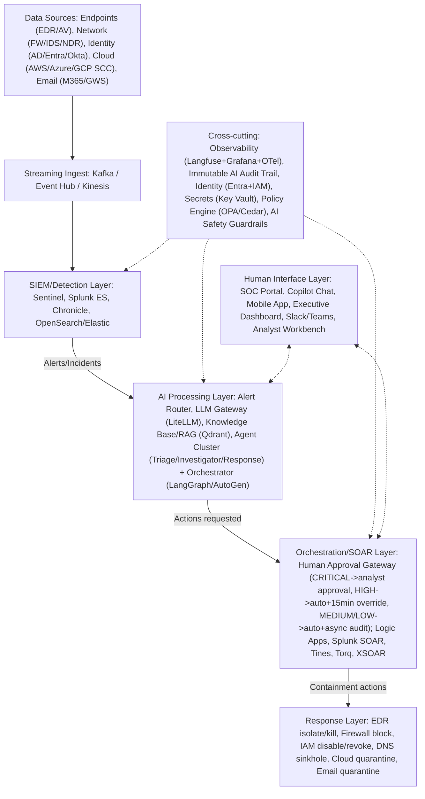

A practical, phased implementation roadmap for building an AI-powered SOC from any starting maturity level, spanning pre-implementation assessment through a five-phase build-out, plus a complete reference architecture and an on-premises deployment stack for air-gapped environments.

## Pre-Implementation Assessment

Before starting, a two-week Phase 0 assessment covers four areas. **Current SOC inventory**: all connected SIEM platforms and data sources; SOAR platforms and existing playbook count/quality; EDR platform and endpoint coverage percentage; identity providers (AD, Entra ID, Okta); enabled cloud-native security tools; NDR/NTA solutions and network visibility. **Alert metrics baseline**, critical for the eventual ROI calculation: daily alert volume by source and severity, current MTTD by alert category, current MTTR by incident type, false-positive rate by source, analyst handle time per alert category, and Tier-1-to-Tier-2 escalation rate. **Team assessment**: staffing model (in-house/hybrid/MDR), analyst skill-tier distribution, current tool proficiency, existing AI/ML literacy, and change-management capacity. **Technical and governance prerequisites**: API access to all core security tools, network connectivity for agent API calls (or an on-premises LLM plan), an existing CI/CD pipeline for GitOps deployment, appropriate cloud service quotas, and a secrets-management solution — alongside a drafted AI acceptable-use policy, a completed data-privacy review for AI processing, a change-management process for automated containment, legal review of AI-assisted evidence, and approved budget.

A maturity-scoring model evaluates five dimensions — data quality, tool API coverage, process maturity, team capability, governance readiness — each 0-1, averaged into an overall score that routes the recommended starting point: 0.8+ is ready for Phase 2 (Automation) directly; 0.6-0.8 should start with Phase 1 (Foundation); below 0.6 needs prerequisite work completed first. Low-scoring dimensions generate specific gap recommendations — for example, data quality below 0.7 flags normalizing log formats to OCSF/ECS, ensuring SIEM coverage spans endpoint/network/identity/cloud, and reducing alert suppression that hides real signal.

## Phase 1 — Foundation (Days 1-30)

Objectives: enable AI copilot assistance for analysts with no autonomous actions yet; implement LLM-based alert enrichment; convert the top 10 highest-volume manual playbooks to automated workflows; establish an AI observability baseline. Weeks 1-2 deploy a minimal-viable copilot — every output is a recommendation, and the analyst decides and executes everything. A representative implementation gathers read-only SIEM context around an alert, prompts the model for a TRUE_POSITIVE/FALSE_POSITIVE/UNCERTAIN assessment with supporting evidence and suggested next steps, and returns the recommendation with an explicit disclaimer and zero automated actions taken. Weeks 2-3 add automated IOC enrichment (still no containment): all IOCs in an alert are extracted and enriched concurrently across type-appropriate sources (IP: VirusTotal/Shodan/AbuseIPDB/MaxMind; domain: VirusTotal/WHOIS/passive-DNS; hash: VirusTotal/MalwareBazaar/Hybrid-Analysis; URL: VirusTotal/URLScan/Safe Browsing; email: HaveIBeenPwned/EmailRep), with an LLM synthesizing the raw enrichment results into an overall threat level and suggested queue priority. Weeks 3-4 select and automate the top 10 highest-volume, most repetitive, lowest-risk playbooks — phishing triage/quarantine recommendation, brute-force lockout recommendation, malware hash lookup and severity scoring, IP reputation and blocking recommendation, privileged-account anomaly investigation, cloud storage misconfiguration triage, failed-login threshold triage, new local-admin detection investigation, service-account anomaly triage, and rare-outbound-IP investigation — chosen specifically for volume, repetitiveness, and low blast radius if the AI gets one wrong.

## Phase 2 — Automation (Days 30-90)

Objectives: Tier-1 autonomous triage for known alert patterns above 90% confidence; automated IOC blocking with human notification rather than pre-approval; an incident-summarization pipeline for Tier-2 handoff; an operational Detection-as-Code pipeline. A graduated automation engine starts conservative and expands only as track record accumulates, across three tiers. **HITL** applies when confidence is below 0.80 or severity is CRITICAL, with zero autonomous actions. **HOTL** applies at confidence 0.80+ for MEDIUM/LOW severity, permitting a narrow action set (watchlist additions, severity updates, closing confirmed false positives) executed immediately with analyst notification and a 15-minute override window. **HOOL** applies only at confidence 0.92+ with a known pattern and LOW severity, and only becomes available after 90 days of tracked production performance — CRITICAL severity and any high-risk action type (host isolation, account disable, network segment block) always force HITL regardless of confidence, and insufficient track record (under 90 days in production, confidence under 0.95) also forces HITL even when the pattern otherwise looks eligible for more autonomy. The Detection-as-Code pipeline goes operational in this phase: given a threat intelligence report, an AI generates SIGMA rules, YARA rules where malware indicators are present, a MITRE ATT&CK mapping, and platform-specific KQL/SPL queries — each rule carrying a confidence level, expected false-positive scenarios, and tuning recommendations — with generated SIGMA syntax validated programmatically before being surfaced for human review.

## Phase 3 — Agentic (Days 60-120)

Objectives: the first fully autonomous investigation agents for specific playbook types; multi-agent coordination for complex, multi-domain incidents; a RAG-backed knowledge base for playbook retrieval; agent memory and cross-session learning. The first production agents typically target phishing and malware, since both have well-bounded investigation steps. A phishing investigation agent, implemented as a LangGraph state machine, moves through parsing the email, checking sender reputation, analyzing URLs and attachments in parallel, checking whether the email was actually delivered to the inbox, checking whether the user clicked or opened anything, and reaching an AI verdict — which then routes conditionally: a true positive with no user interaction auto-contains (quarantine, no user impact); a true positive where the user did click escalates to a human, since the user may be compromised; a false positive closes automatically; anything genuinely uncertain escalates. Multi-agent coordination for complex incidents deploys domain-specialist agents (endpoint, network, identity, cloud, threat intel, malware) in parallel based on an initial scope assessment of which indicator types are present, then synthesizes all their findings through a lead-incident-commander LLM call producing a unified attack narrative, a definitive severity assessment backed by evidence from multiple domains, complete cross-domain MITRE mapping, prioritized containment actions labeled by who can execute them (auto versus human), a root-cause hypothesis, full blast-radius scope, and a three-sentence executive summary.

## Phase 4 — Optimization (Months 4-12)

A continuous-learning loop captures every analyst correction as a training signal without retraining the base model: each piece of feedback (AI verdict, analyst verdict, notes, actions taken) gets logged with a simple correctness flag; when the AI was wrong, an LLM analyzes the specific error and generates a negative few-shot example — showing what the alert looked like, what the AI wrongly concluded and why, and what the correct analysis should have been — added to the few-shot library under a "correction" category, and once enough corrections accumulate, prompt optimization gets scheduled automatically rather than waiting for a scheduled review to notice the pattern.

## Reference Architecture


*Complete AI SOC reference architecture (2026): five data-source types feed streaming ingest into SIEM detection, driving an AI processing layer whose agent cluster proposes actions through a tiered human-approval gateway to the response layer — with observability, audit, identity, secrets, policy, and safety guardrails cutting across every layer, and a human interface layer both consuming and directing the pipeline.*

## On-Premises Implementation

For air-gapped and data-sovereignty environments, a complete self-hosted stack runs as Docker Compose services: OpenSearch as the open-source SIEM; Shuffle as the open-source SOAR; vLLM serving Llama 3.1 70B across 4 GPUs for on-premises inference; LiteLLM as the model-routing gateway; Qdrant as the RAG vector database; self-hosted Langfuse for AI observability; and HashiCorp Vault for secrets management:

```yaml
services:
  opensearch:
    image: opensearchproject/opensearch:2.13.0
    environment: ["cluster.name=soc-cluster", "bootstrap.memory_lock=true"]
    deploy: {resources: {limits: {memory: 16G}}}
  shuffle:
    image: ghcr.io/shuffle/shuffle:latest
    environment: ["SHUFFLE_OPENSEARCH_URL=http://opensearch:9200"]
  vllm:
    image: vllm/vllm-openai:latest
    command: --model meta-llama/Meta-Llama-3.1-70B-Instruct --tensor-parallel-size 4 --max-model-len 32768
    deploy: {resources: {reservations: {devices: [{driver: nvidia, count: 4, capabilities: [gpu]}]}}}
  litellm:
    image: ghcr.io/berriai/litellm:main-latest
    command: --config /app/config.yaml
  qdrant:
    image: qdrant/qdrant:latest
  langfuse:
    image: ghcr.io/langfuse/langfuse:latest
  vault:
    image: hashicorp/vault:latest
    cap_add: [IPC_LOCK]
```

## Implementation Timeline Summary

Phase 0, Assessment (weeks 1-2): SOC maturity report, gap analysis, and ROI model, gated on stakeholder sign-off. Phase 1, Foundation (days 1-30): AI copilot live, top 10 playbooks automated, observability baseline established, targeting over 50% analyst satisfaction. Phase 2, Automation (days 30-90): Tier-1 auto-triage, Detection-as-Code, IOC enrichment, targeting over 30% MTTD reduction. Phase 3, Agentic (days 60-120, overlapping Phase 2): multi-agent incident handling, autonomous phishing/malware playbooks, targeting over 60% automation rate. Phase 4, Optimization (months 4-12): continuous learning, custom models, self-improving playbooks, targeting under 5-minute MTTD for known threats. Phase 5, Autonomous SOC (year 2+): autonomous response for known threats with 24/7 AI coverage, targeting over 70% analyst-hours saved.

## Related

- [AI SOC Playbooks Part 09: Enterprise Architecture Integration](09-part-09-enterprise-architecture.md)
- [AI SOC Playbooks Part 10: NIST Standards Mapping](10-part-10-standards-compliance.md)
- [AI SOC Playbooks Part 13: AI SOC Vendor Landscape](12-part-13-vendor-landscape.md)
