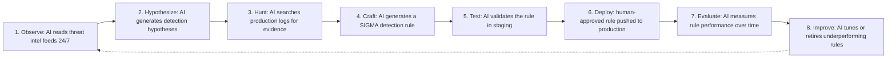

The closing part of the AI SOC Playbooks series: the trajectory from augmentation to autonomy, near-term and medium-term technical advances, the long-term autonomous SOC vision, the adversarial AI arms race and responsible-AI governance principles, and concrete recommendations for what to build today.

## The Trajectory: From Augmentation to Autonomy

The AI SOC has moved through, and is projected to keep moving through, five stages defined by how much of the decision load sits with humans versus AI. **2020-2022, rule-based automation**: SOAR playbooks, scripted enrichment, static ML models — humans made roughly 95% of decisions, AI handled pattern matching and IOC lookups. **2023-2024, LLM augmentation**: ChatGPT/Claude/Copilot integrated into SOC tools for alert summaries, MITRE mapping, and natural-language queries — humans at roughly 70%. **2025-2026, agentic SOC (current)**: multi-agent systems with autonomous L1 triage and HITL/HOTL for incident response, AI handling triage, investigation, evidence collection, and reporting — humans at roughly 30%, reserved for high-severity and novel threats. **2027-2028, collaborative AI SOC**: AI-human teams with specialized AI "colleagues" running end-to-end IR for known threat classes and proactive threat hunting — humans at roughly 15%, reserved for novel, strategic, and legally complex decisions. **2029-2030, autonomous SOC**: self-improving AI with autonomous detection engineering, AI fully autonomous for over 80% of security operations — humans at roughly 5%, reserved for board-level and genuinely unprecedented incidents.

## Near-Term Trends (2026-2027)

**Multimodal AI** extends analysis beyond text into visual, audio, and document understanding: screenshot analysis that recognizes a phishing page exactly mimicking the company's login portal; network-diagram comprehension that flags a topology exposing the payment zone to the internet; dashboard anomaly recognition reading a Grafana graph directly; malware UI analysis reading a ransomware payment-demand screen; vishing-attack audio analysis for deepfake CEO-voice detection; security-camera analysis for physical-security incidents; and document analysis going beyond flat PDF text extraction into complex table extraction from compliance reports and diagram comprehension in architecture review documents. A working 2026-ready implementation sends a phishing-page screenshot directly to a multimodal model alongside the alert context (user, visited URL), asking it to identify the impersonated brand, visual phishing indicators (fake logos, spelling errors, pressure tactics), urgency/fear-tactic language, an overall phishing-confidence score, and a recommended user action.

**Real-time streaming analysis** moves from batch-processing discrete alerts to AI monitoring the raw log stream continuously — a streaming model classifies each log entry as IGNORE (normal activity), ALERT with a severity and reason (a suspicious pattern), or INCIDENT with a severity and reason (a confirmed threat), watching specifically for credential theft, lateral movement, data exfiltration, and C2 traffic, with no pre-aggregation step required before the AI ever sees the data.

**Graph-native reasoning** has AI models reason directly over knowledge graphs rather than only text. A graph-native analyst pattern runs a Neo4j traversal from a compromised host — following `CONNECTS_TO`, `HAS_CREDENTIAL`, and `TRUSTS` relationships up to 5 hops out to any reachable host, data store, or credential — and then has the AI interpret that raw graph-traversal output in business terms: overall impact, priority containment order, and estimated breach scope, rather than requiring a human to manually trace the graph and translate it themselves.

## Medium-Term Advances (2027-2028)

**Self-improving detection engineering** closes the loop from threat intelligence to deployed detection without waiting for a human detection engineer to notice a gap:

*Autonomous detection engineering cycle (2027 vision): the loop runs continuously, with a human approval gate preserved specifically at the production-deployment step, not removed as autonomy elsewhere increases.*

An autonomous detection-engineering agent runs this as a continuous 24/7 loop — gathering new TTPs and coverage gaps, generating a detection hypothesis per TTP, hunting for supporting evidence in production, generating and staging-testing a SIGMA rule, and only submitting rules clearing a false-positive threshold (commonly under 5%) to a human approval queue, prioritized by the underlying TTP's severity — repeating hourly. The human approval gate at deployment is deliberately preserved even as every earlier step becomes autonomous, since it's the one step where a bad rule reaches production traffic.

**Predictive threat intelligence** aims to forecast attacks before they happen, drawing on historical attack patterns specific to the organization and sector, known threat-actor campaign timing patterns, geopolitical event correlation, dark-web chatter monitoring, and vulnerability-to-exploitation timing data — producing forecasts like "high probability (73%) of credential stuffing targeting Azure AD within 48 hours" backed by specific corroborating signals (a BreachForums post referencing the domain, a recent VPN vendor patch, an observed campaign against similarly-sized companies), with recommended preemptive actions like increasing Azure AD sign-in monitoring sensitivity and pre-staging the credential-stuffing IR playbook.

**Autonomous red teaming** continuously probes the SOC's own defenses: an AI generates adversarial attack scenarios across the MITRE ATT&CK catalog tailored to the specific environment, runs each in an isolated simulation environment, checks whether the SOC's detection stack actually caught it within a time window, and — for any gap found — feeds the scenario and its artifacts directly into the detection-engineering agent as a new detection requirement, closing the loop between offense and defense without a human red-teamer manually filing a ticket.

## Long-Term Vision (2028-2030)

The 2030 autonomous SOC architecture separates into three layers. The **strategic layer** stays human: the CISO and board set risk appetite, policy, budget, and regulatory stance, review AI performance and major incidents monthly, and retain decision authority over novel threats, legal/regulatory matters, and ethics. The **AI strategic layer** handles long-horizon planning: a SOC strategy agent, a predictive threat-landscape modeler, a FinOps budget optimizer, and a capability planner identifying skill and tooling gaps — translating human-set policy and goals into operational direction. The **AI operational layer** runs eight specialist agents in production: detection engineering, investigation, response orchestration, threat intelligence and hunting, red team, compliance monitoring, knowledge engineering, and supply-chain security — with human escalation reserved specifically for novel threats, legal/ethical decisions, and major business-impacting incidents (significant service disruption), not dissolved away as the operational layer becomes more capable.

Frontier AI capability trends projected across this timeline: context window grows from 200K tokens (2026) through 1M+ tokens (2027) toward effectively unlimited streaming context (2029+); reasoning moves from chain-of-thought through long-horizon planning toward multi-day continuous reasoning; memory moves from session-plus-RAG through cross-session episodic memory toward persistent institutional memory; response speed moves from 2-10 seconds through sub-second toward real-time streaming; modality moves from text-plus-images through text-plus-video-plus-audio toward full sensory input; self-improvement moves from prompt tuning through online learning toward autonomous fine-tuning; tool access moves from 20-50 tools through 100+ tools toward the full API ecosystem; and cost moves from $0.001-0.05/request through roughly 10x cheaper toward near-zero, commodity pricing.

The analyst role itself evolves rather than disappears. In 2026, a typical analyst spends 60% of time reviewing AI decisions and approving actions, 20% on novel threats the AI can't handle, 15% on AI-assisted detection engineering, and 5% on strategy and training. By 2028, that shifts to 30% AI orchestration (tuning agents, managing playbooks), 30% novel threat research, 25% detection engineering leadership, and 15% red/purple team exercises. By 2030, the role becomes a "Security AI Engineer": 40% AI system design and improvement, 30% novel threat strategy and countermeasures, 20% regulatory and ethics oversight of the AI itself, and only 10% direct human-judgment incident involvement.

## Risks and Governance on the Frontier

AI cuts both ways in the adversarial relationship. Attackers gain hyper-personalized phishing at scale, AI-generated malware variants that evade ML detection, automated vulnerability discovery at speed, deepfake voice/video social engineering, and AI-powered evasion of detection itself. Defenders gain a speed advantage on known threats (seconds versus the historical 18-minute average), a scale advantage (handling thousands of alerts instead of dozens), a consistency advantage (no bad days), and a coverage advantage (monitoring 100% of telemetry rather than a sampled subset). The current balance, as of 2026, is a slight defender advantage specifically for known threat patterns — the real risk is AI-generated genuinely novel attacks temporarily tipping that balance, mitigated by security-specialized foundation models, behavioral (TTP-based, not signature-based) detection that's structurally harder to evade, Zero Trust architecture removing much of the value an attacker gets from an initial foothold, and continuous red-teaming specifically targeting the AI detection stack's own gaps.

Seven principles should govern autonomous security AI as capability grows toward the 2030 horizon. **Least privilege at scale**: even at the highest autonomy level, controls over nuclear or critical infrastructure systems remain human, full stop. **Explainability always**: the AI must state why it blocked something, not merely that it did. **Reversibility by default**: prefer reversible actions (alert) over irreversible ones (delete), and irreversible actions always route through a human approval circuit regardless of confidence. **Drift detection is existential**: an autonomous SOC AI drifting undetected is a catastrophic failure mode, not a minor one, requiring continuous behavioral monitoring of the AI itself. **Adversarial testing never stops**: as the AI becomes more capable, it becomes a more valuable target, requiring monthly red-teaming against the AI's own capabilities specifically. **Human authority zones are permanent**: decisions affecting human safety, novel threats with no training precedent, legal and regulatory judgments, and ethics/values-based decisions stay human regardless of how capable the AI becomes. **Transparency to affected parties**: when AI action affects a specific person — isolating their laptop, disabling their account — they must be told why.

## Preparing for the Future SOC Today

Concrete actions organized by horizon. **Immediate (2026)**: build AI literacy across the entire SOC team, not as an optional track; establish an AI governance framework and ethics policy; deploy the first AI agents under strong human oversight; start systematically collecting analyst feedback data, since it's the actual training gold for future improvement; invest in Detection-as-Code/GitOps infrastructure now, since every later phase depends on it. **Short-term (2027)**: move L1 analysts into AI-oversight roles deliberately rather than letting the transition happen unplanned; build an autonomous red-team capability; develop AI SOC metrics suitable for board reporting; assess predictive threat-intel vendors as the category matures; consider multimodal analysis specifically for phishing and deepfake threats. **Medium-term (2028+)**: plan for "Security AI Engineer" as the SOC's primary role rather than a niche specialty; evaluate autonomous detection-engineering tooling; contribute to AI security standards work (NIST, MITRE ATLAS); develop agent-to-agent authentication protocols; prepare specifically for adversarial AI from sophisticated threat actors, not just commodity attackers. **Long-term (2030+)**: operate toward Level 5 autonomous SOC coverage for known threat classes specifically, while deliberately maintaining human authority zones as AI capability grows rather than letting them erode by default; participate in AI security industry governance; build institutional AI security knowledge management that survives individual team turnover.

## Summary: The AI SOC Journey

Across this fourteen-part series, the throughline from the foundational operating model (Part 01) to this future vision is that the journey from today's human-centered SOC to a 2030 AI-native SOC is not about replacing security analysts — it's about enabling them to defend against threats at a scale and speed that was previously impossible. Five takeaways carry across every part: **start with governance** — AI without guardrails is a liability, not an asset; **build trust incrementally** — HITL to HOTL to HOOL as track record actually accumulates, never skipped ahead of the evidence; **measure everything** — accuracy, cost, drift, and analyst satisfaction, not just the metrics that make a good dashboard slide; **security-first AI** — an AI system that can be jailbroken or prompt-injected is itself a new attack surface, not just a defensive tool; and **human authority zones are permanent** — some decisions must always remain human, regardless of how far autonomy elsewhere advances. The organizations that win the security battle in 2030 will be the ones that built the AI SOC foundation in 2026.

## Related

- [AI SOC Playbooks Part 01: SOC Operating Model & Maturity](01-part-01-soc-operating-model.md)
- [AI SOC Playbooks Part 03: Agentic SOC Architecture](03-part-03-agentic-soc.md)
- [AI SOC Playbooks Part 11: Implementation Roadmap](11-part-11-implementation-roadmap.md)
- [AI SOC Playbooks Part 13: AI SOC Vendor Landscape](12-part-13-vendor-landscape.md)
