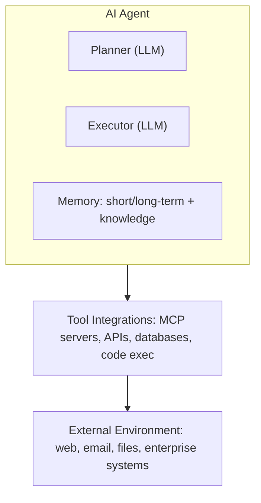
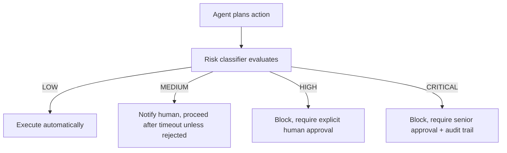

Agentic AI introduces autonomous behavior, tool invocation, multi-agent coordination, and persistent memory — each requiring security controls beyond what traditional or standard AI security provides.

## What Makes Agentic Security Different

Traditional security assumes a human in the loop: a person initiates requests, reviews outputs, and takes actions, within a session lasting minutes, bounded by a UI, with a clearly identified accountable human. Agentic systems break every one of these assumptions — the agent initiates actions autonomously, a downstream agent or automated system reviews outputs, sessions run for hours or indefinitely, the subject is bounded only by tool access (potentially very broad), accountability traces to an often-opaque agent identity, and blast radius can be enterprise-wide if the agent holds broad permissions. This shift requires security primitives that don't exist in traditional frameworks.

## Agent Architecture

Each agent comprises a planner and executor (both LLM-driven), short/long-term memory plus a knowledge store, a tool-integration layer (MCP servers, APIs, databases, code execution), and the external environment it acts on (web, email, files, enterprise systems) — every layer is a distinct attack surface requiring its own controls.

*Each agent layer — planning, memory, tool access, and environment interaction — is an independent attack surface.*

Enterprise agents rarely operate alone. A typical multi-agent architecture has an orchestrator directing a Research Agent (web/document retrieval), an Analysis Agent (data processing, reasoning), an Execution Agent (system actions, API calls), and a Verification Agent (output validation, compliance check). The security challenge: compromise of any one agent can propagate through the whole chain — trust must be established between agents explicitly, never assumed because they share a platform. Leading 2026 agent platforms include AWS Bedrock Agents (IAM role-based identity, VPC isolation, Guardrails), Azure AI Foundry Agents (Entra Agent ID, managed identity), Google Vertex AI Agents (workload identity federation, VPC Service Controls), and the Anthropic Claude Agent SDK (harness-based controls, tool permission scoping) — with LangGraph, AutoGen, and CrewAI requiring custom security controls layered on top.

## Agent Identity

Agent identity is hard for five reasons: agents are software, not humans, so they can't use human auth flows (MFA, biometrics); they may be ephemeral, created and destroyed per task; an enterprise may run thousands of instances simultaneously; agents delegate to sub-agents, requiring delegation chains; and they operate across multi-cloud environments, requiring cross-domain identity. Emerging 2026 standards: IETF AIMS (draft RFC for AI system identity claims), SPIFFE/SPIRE (stable, X.509 SVID workload identity, directly applicable to agents), Entra Agent ID (GA, Microsoft's agent identity), AWS AgentCore Identity (GA, IAM role binding), and OAuth 2.0 for Agents (draft extension for non-human principals).

Three authentication patterns dominate: managed identity, where a cloud-native agent workload calls the instance metadata service and the cloud IAM issues a short-lived token with no stored secret; SPIFFE SVID, where a SPIRE server attests the workload (via k8s annotations or hardware attestation) and issues a short-lived X.509 certificate presented over mTLS to MCP servers, APIs, and databases; and OAuth client credentials, where the agent is registered as an OAuth client with a vaulted secret and requests scoped access tokens. Recommended: managed identity for cloud-native deployments, SPIFFE for multi-cloud/on-prem, OAuth client credentials only as fallback.

Agent authorization must be more restrictive than for humans: task-specific per-session scoping rather than broad roles, per-task tokens lasting minutes rather than session-lifetime tokens, explicit audited delegation chains rather than manager-to-employee delegation, and a mandatory human-approval gate for irreversible actions. When a human delegates a task to an agent, the agent must carry the human's authorization context at reduced scope — the OAuth On-Behalf-Of flow exchanges a user token for an agent token during delegation, so the resulting token carries the user's identity context but limited scope, letting downstream services verify "this is agent X acting on behalf of user Y for task Z." Entra Agent ID supports OBO delegation with explicit scope limitation: agents cannot acquire more permissions than the delegating user holds.

## Agent Communication

MCP is the primary tool-integration protocol: the agent (MCP client) authenticates to an MCP server (tool provider) via OAuth 2.1+PKCE or mTLS, and the server — never the agent — holds the backend resource's credentials, acting as an authorized proxy. This credential-isolation property is the critical security guarantee. MCP controls: server authentication before any tool invocation, per-tool ACLs (not all tools available to all agents), input validation on tool parameters, output sanitization before returning to the agent, full audit logging (agent ID, tool, parameters, result, timestamp), and per-agent per-tool rate limiting.

A2A (Agent-to-Agent Protocol) is the emerging inter-agent communication standard: Agent A sends a message signed with its private key through an A2A protocol layer that routes and attests it, and Agent B verifies the sender's identity before processing. Controls: message signing per inter-agent message, attestation of sender identity before processing, scope enforcement limiting triggered actions to the receiver's defined capability, and a full audit trail. AG-UI (Agent-User Interface Protocol) governs what agentic actions humans can see and control: approval dialogs before irreversible actions, real-time progress visibility, interruption controls to pause or cancel a task, and a visual audit of actions taken.

## Agent Runtime Security

Agents that execute code, browse the web, or access files need isolation to prevent escape and cross-contamination. MicroVM (Firecracker) gives near-VM isolation with millisecond boot at low overhead; gVisor intercepts kernel syscalls at low-medium overhead; a standard Docker container gives namespace isolation only at very low overhead; a full VM gives full isolation at high overhead; Kata Containers gives VM-level isolation within a container runtime at medium overhead. Recommendation: MicroVM or Kata Containers for agents executing untrusted code — standard containers are insufficient once an agent can run arbitrary code.

Sandboxing constrains what an agent can do within its environment: network egress allowlisting with deny-all default, read-only filesystem access except a designated scratch space, seccomp syscall filtering blocking exec/ptrace/socket, CPU/memory/time resource limits, and no direct credential access (secrets via managed identity or per-request injection only).

Governance controls operate at the policy level: an agent registry (a CMDB entry per agent with owner, capability, approval) and capability approval (each new capability reviewed by an ARB or AI governance committee) establish what's permitted; human-in-the-loop gates (workflow integration before high-impact actions), kill switches (immediate halt of all agent operations via centralized feature flag or circuit breaker), and circuit breakers (automatic halt on rate-limit breach, error-rate spike, or cost threshold) constrain runtime behavior; policy-as-code (OPA, Cedar, or a custom engine evaluated before every action) and centralized immutable audit logging close the loop.

## Human Oversight Models

Not every agent action warrants the same oversight. A four-tier model: Tier 0, Autonomous, for low-risk reversible frequently-repeated actions, where the agent acts without human input; Tier 1, Human-in-the-Loop, for moderate-risk or first-time actions, where the agent pauses for approval before continuing; Tier 2, Human-on-the-Loop, for actions already in progress that a human monitors and can interrupt; Tier 3, Human-over-the-Loop, for high-risk irreversible strategic decisions, where the human decides and the agent only executes.

*A risk-tiered execution gate: only low-risk actions proceed without a human checkpoint.*

## Kill Switches and Circuit Breakers

A kill switch is an emergency control halting all agent operations immediately, structured hierarchically: a global switch stops all agents org-wide, a platform switch stops all agents on a given platform, an agent-class switch stops all agents of a specific type, and an individual switch stops one instance. Requirements: reachable even if agent infrastructure is compromised, every trigger logged with reason/actor/timestamp, graceful completion of in-flight safe operations before halting, and quarterly testing.

Circuit breakers trip automatically on predefined thresholds: cost overrun (over $1,000/hour halts and alerts, requiring manual re-enable), error rate (over 20% tool failures in 10 minutes halts for root-cause investigation), anomalous output (a content classifier flagging more than 5 outputs/hour halts for human review), rate-limit breach (over 1,000 calls/minute throttles and alerts), unexpected network egress (traffic to a non-allowlisted endpoint blocks, alerts, and captures forensics), and excessive memory writes (over 10,000 facts written in an hour halts for an integrity check).

## Autonomous Risk

The governing question for agentic AI: what is the maximum autonomous risk the organization accepts? This is a board-level decision that should be documented as a risk appetite statement — for example, accepting autonomous actions up to a defined dollar value or scope without approval, requiring a specific approval tier above that threshold, and designating certain domain categories as never autonomous regardless of value. Frame the decision around five factors: impact magnitude (the blast radius of an undetected mistake), reversibility (can the action be undone), domain sensitivity (does it touch regulated data, financial transactions, or legal commitments), novelty (a new action type versus one performed many times), and external exposure (does it affect parties outside the organization). Combine these into a risk score and map score ranges to the four oversight tiers above.

## Related

- [Cybersecurity Architect Part 4: AI Security](04-ai-security.md)
- [Cybersecurity Architect Part 6: Identity Architecture](06-identity-architecture.md)
- [Cybersecurity Architect Part 13: Security Patterns](13-security-patterns.md)
