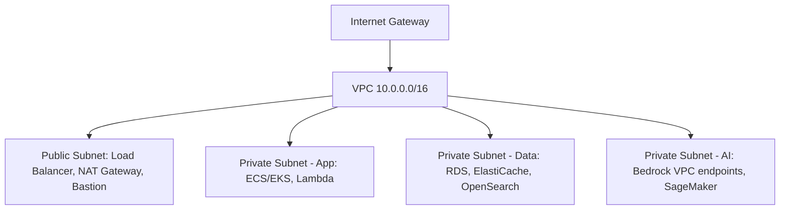
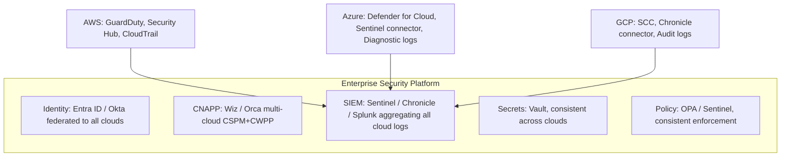
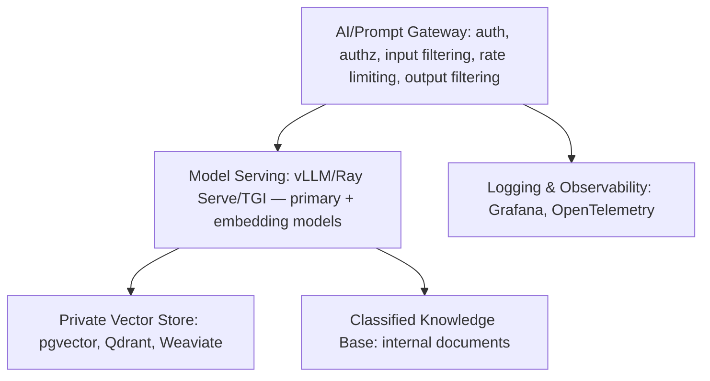

Cloud security architecture must account for multi-cloud deployments, AI inference workloads, GPU security, and private/hybrid AI patterns in addition to foundational cloud security controls.

## Shared Responsibility Model, Updated for AI

The classic model shifts across IaaS/PaaS/SaaS/Managed AI: physical security and the hypervisor are always the cloud provider's. For IaaS you own OS through application code; for PaaS the cloud takes OS and runtime but you still own middleware and application code; for SaaS the cloud owns everything through application code. Managed AI (Bedrock, Azure OpenAI) shifts model weights to the provider too (unless bring-your-own-model) — but training data, prompt content, output usage, AI governance, IAM, and data classification remain yours regardless of service model. The key insight: with managed AI, the provider secures the model, but you own the data, prompts, outputs, IAM, and governance — data sent to a managed AI API deserves the same care as data sent to any third-party SaaS.

## AWS Security Architecture

IAM is the core identity service (least privilege, roles not users, no root access); IAM Identity Center federates human SSO from the corporate IdP; STS issues temporary credentials via AssumeRole for cross-account and automation access; IAM Roles Anywhere extends AWS trust to on-prem X.509 certificates without keys; resource-based policies combine with IAM policies for defense-in-depth.

*A representative AWS VPC layout isolating application, data, and AI workloads into dedicated private subnets.*

Key network controls: Security Groups (stateful L4 allow-lists), Network ACLs (stateless subnet controls), VPC Endpoints/Private Link (keeping traffic off the public internet), AWS Network Firewall (stateful L7/IDS), and WAF (L7 protection for ALB, CloudFront, API Gateway).

Bedrock AI security: a VPC Endpoint disables public access and routes via Private Link; a Bedrock resource policy restricts per-model access by principal ARN; Bedrock Guardrails handle content filtering, PII detection, grounding, and topic denial; region selection controls data residency; customer-managed KMS keys encrypt data at rest; CloudTrail plus CloudWatch log every invocation and alert on anomalies; Bedrock Prompt Management version-controls and access-controls prompt templates. AWS AgentCore (GA 2026) gives agents IAM-role identity rather than API keys, runs them in a VPC-isolated runtime with egress controls, integrates with Bedrock Guardrails for output filtering, and logs agent actions to CloudTrail in detail.

AWS's broader security service map: Security Hub (CSPM), GuardDuty (UEBA plus network threat detection), Inspector (CWPP/vulnerability scanning), Detective (investigation and analytics), Shield Advanced (L3/L4/L7 DDoS), WAF (L7 firewall), Secrets Manager (secrets plus rotation), KMS (HSM-backed keys), ACM (certificate lifecycle), Config (drift detection), and IAM Access Analyzer (CIEM/over-permission detection).

## Azure Security Architecture

Entra ID is the enterprise identity platform (Conditional Access, FIDO2, PIM for privileged roles); Entra PIM adds JIT elevation with approval workflows and access reviews; Entra ID Governance automates access reviews and entitlement management; Entra Workload ID gives machines and agents federated credentials with no client secrets; Entra Agent ID adds OBO delegation, per-task scoping, and an audit trail specifically for AI agents.

A typical Azure network groups an AzureFirewall subnet, an Application Gateway subnet running WAF v2, an App Service subnet with private endpoints, an AI Services subnet carrying private endpoints for Azure OpenAI and AI Foundry, and a Data subnet with private-endpoint SQL/Cosmos/Storage — fronted by Azure Firewall Premium (L7 IDPS) and DDoS Protection Standard.

Azure OpenAI / AI Foundry security: a Private Endpoint restricts access to the VNet; managed identity lets apps and agents reach OpenAI without stored credentials; Azure AI Content Safety handles output moderation with custom categories and, via Prompt Shields (GA 2025), prompt-injection detection; VNet integration removes any public path to the model endpoint; customer-managed keys encrypt storage at rest; Azure Monitor and diagnostic logs capture every invocation; AI Foundry Evaluation checks groundedness to catch hallucination versus grounded response.

Azure's service map: Defender for Cloud (CNAPP — CSPM+CWPP+CIEM), Sentinel plus Defender XDR (SIEM/XDR), Defender for Endpoint (EDR/XDR), Entra ID Protection (identity UEBA), DDoS Protection Standard (L3/L4), Azure WAF on Application Gateway (L7), Key Vault (secrets/keys/certificates), Defender for Servers (vulnerability assessment), and Azure Policy (policy-as-code).

## Google Cloud Security Architecture

Cloud IAM enforces least privilege via pre-defined roles; Workload Identity Federation removes service-account keys in favor of OIDC-based trust; each workload gets its own keyless service account; Identity-Aware Proxy replaces VPN with context-aware Zero Trust access; BeyondCorp Enterprise layers device posture, identity, and context enforcement on top.

Vertex AI / Gemini security: Private Service Connect restricts Vertex AI to the VPC; Workload Identity Federation removes service-account keys for Vertex access; Cloud Audit Data Access Logs record every invocation; Vertex AI Safety Attributes provide built-in, threshold-configurable content classifiers; VPC Service Controls prevent data exfiltration from Vertex AI projects; the Model Registry version-controls model artifacts with access control; Vertex AI Agent Builder gives IAM-controlled, VPC-isolated agent deployment.

GCP's service map: Security Command Center (CSPM plus threat detection), Cloud Armor plus Cloud Firewall (WAF plus L3/L4), Google Chronicle (cloud-native SIEM plus threat intel), Secret Manager (secrets plus rotation), Cloud DLP (discovery, classification, masking), Mandiant Attack Surface Management (continuous threat exposure), and GKE Security Posture (Kubernetes-native CWPP).

## Multi-Cloud Security Architecture

Most enterprises run workloads across multiple clouds, requiring a consistent control layer above each provider's native tools.

*A central identity, CNAPP, SIEM, secrets, and policy layer sits above each cloud's native controls, aggregating logs into one SIEM.*

Five multi-cloud AI deployment patterns trade off control against complexity: single-cloud AI (simplest, highest integration, vendor lock-in); best-of-breed AI (different models from different cloud AI services, optimized capability, complex security controls); private AI (models deployed in your own cloud account rather than a managed service, for data sovereignty and regulated industries); hybrid AI (sensitive inference on-prem, general inference in cloud, for air-gap or latency requirements); and air-gapped AI (no cloud connectivity at all, for defense, government-classified, or ultra-high-security use).

## GPU Security

GPU security is an emerging domain as AI inference and training workloads concentrate on GPU clusters. Attack vectors: GPU memory snooping (a co-tenant reading another workload's GPU memory, controlled via confidential VMs with GPU TEE such as NVIDIA H100 CC mode); model weight theft (exfiltrating weights from GPU memory, controlled via encrypted model loading and memory isolation); side-channel attacks (inferring model architecture or inputs from GPU cache timing, controlled via confidential computing and noise injection); hypervisor compromise (hypervisor-level access to GPU memory, controlled via hardware TEE and attestation); and driver vulnerabilities (privilege escalation via the GPU driver, controlled via regular patching and driver allowlisting).

NVIDIA H100/H200 Confidential Computing mode extends a Trusted Execution Environment from CPU to GPU, encrypts GPU HBM memory so the host cannot read it, and provides GPU firmware attestation proving the model runs in CC mode — integrated with Azure Confidential VMs, AWS Nitro, and GCP Confidential VMs. Use cases: private AI inference for regulated data, confidential model training, and multi-party computation.

## Private AI Architecture

For organizations where data cannot leave their perimeter, deployment models trade data control against cost and capability: a managed AI API gives limited data control at low cost but the highest capability; private cloud AI (your VPC, provider-managed model) gives full data control at medium cost with equally high capability; self-hosted cloud (your VPC, you manage the model) gives full control at high cost with medium capability; on-premises gives complete control at very high cost with medium-to-high capability; air-gapped gives absolute control at the highest cost with medium capability.

*A private AI reference architecture: every component runs inside the enterprise network, with no data path to a public model API.*

Security properties of this architecture: no data leaves the private network, model weights sit in encrypted private object storage, all access authenticates via corporate identity, every query and response is logged for audit, and PII is filtered before reaching the model and masked in output.

## Related

- [Cybersecurity Architect Part 3: Security Domains](03-security-domains.md)
- [Cybersecurity Architect Part 6: Identity Architecture](06-identity-architecture.md)
- [Cybersecurity Architect Part 9: Security Operations](09-security-operations.md)
