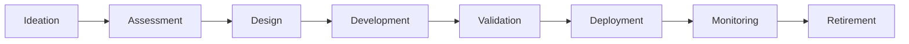
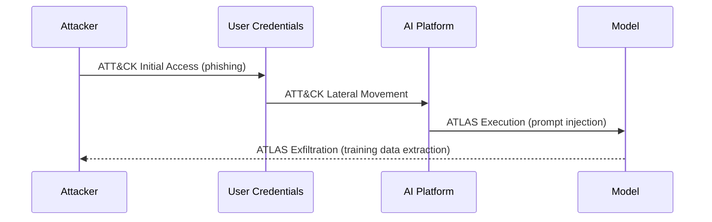

AI governance frameworks are maturing rapidly: EU AI Act enforcement of GPAI and Article 50 transparency obligations began August 2, 2026, and ISO 42001 certifications exceed 500 organizations globally. This part maps every major framework and how they interact.

## Responsible AI Principles

Every governance framework encodes the same underlying ethics: fairness (equitable treatment, no discriminatory outcomes — via bias testing, diverse training data, demographic parity metrics); transparency (explainable, auditable decisions — via SHAP/LIME, model cards, logging); accountability (clear ownership of outcomes — via a named model owner, product owner, and governance committee); privacy (respect for data rights and consent — via DSPM, consent management, privacy impact assessments); safety (no physical, psychological, or societal harm — via red teaming, safety classifiers, human oversight); reliability (consistent, expected performance — via evaluation frameworks, regression testing, monitoring); security (resistance to manipulation and misuse — the controls covered across this whole series); and human oversight (humans can understand, correct, and override AI decisions — via HITL/HOTL/HOOL tiers, audit trails, kill switches).

## AI Governance Structure

Governance spans defined roles: an AI Ethics Board sets principles and adjudicates contested decisions; a Chief AI Officer owns AI strategy and the governance program; the CISO owns AI security controls, the AI red team, and model-risk integration; a Model Risk Officer quantifies and validates model risk; an AI Product Owner is accountable for each deployed system's compliance; a Data Steward governs training data, consent, and classification; an AI Red Team runs adversarial testing and safety evaluation; and an Architecture Review Board reviews and approves new AI capabilities before deployment.

*The AI governance lifecycle: a risk-class assessment, privacy impact assessment, threat-model security review, data governance review, red-team safety testing, ARB approval, and continuous compliance monitoring gate the Assessment through Monitoring stages respectively.*

## NIST AI Risk Management Framework (AI RMF 1.0)

The US government's voluntary framework runs four functions. GOVERN establishes organizational practice: documented AI policies, leadership-approved risk tolerance, assigned roles, and workforce training. MAP identifies risk in context: categorizing the system by domain and risk level, identifying stakeholders, enumerating potential harms, and documenting a threat model. MEASURE quantifies risk: bias/fairness metrics, performance thresholds, uncertainty calibration, tracked red-team findings, and post-deployment drift monitoring. MANAGE treats and monitors risk: documented treatment decisions (accept/mitigate/transfer/avoid), an AI incident-response plan, escalation procedures, and defined decommissioning criteria. NIST AI 100-1 (the RMF itself) is supplemented by AI 100-2 (red-teaming guidance for generative AI), AI 100-4 (reducing synthetic-content risks), and CAISI (agentic AI security standards, February 2026).

## ISO/IEC 42001:2023

The first certifiable AI management system standard, analogous to ISO 27001 for information security. Its AI Management System (AIMS) scope covers AI policy and objectives, system lifecycle management, AI risk management, data management, human oversight and accountability, and supplier/third-party AI governance. Annex A control groups: AI system design (document intended purpose, assess impact, design for transparency), data for AI (classify, validate quality, document provenance), testing and evaluation (define criteria, red team, validate against requirements), human oversight (document mechanisms and escalation paths), supplier AI (assess third-party risk, contractual obligations, audit rights), and incident management (detect, respond, review, learn). As of mid-2026, over 500 organizations are certified, predominantly in financial services, healthcare, and technology. ISO 42001 is designed to integrate with ISO 27001 — both use the ISO High-Level Structure, AI risks extend the existing ISO 27001 risk register rather than requiring a parallel one, and organizations already ISO 27001-certified can reach ISO 42001 with incremental effort.

ISO/IEC 27001:2022, the foundation information-security standard, added AI-relevant updates: A.5.23 (information security for cloud services, directly applicable to managed AI APIs), A.8.8 (technical vulnerability management extended to AI model vulnerabilities), A.5.7 (threat intelligence, now including AI threat intel as explicit input), and new supplier-relationship controls covering AI third-party risk.

## OWASP LLM Top 10 (2025 Edition)

LLM01 Prompt Injection (attacker-injected instructions via input — input validation, privilege separation); LLM02 Sensitive Information Disclosure (model reveals training data or system prompt — output filtering, differential privacy); LLM03 Supply Chain (compromised model/data/dependencies — AIBOM, provenance verification, signing); LLM04 Data and Model Poisoning (training-data manipulation — lineage, validation, integrity checks); LLM05 Improper Output Handling (downstream systems trust LLM output naively — output validation, treat as untrusted); LLM06 Excessive Agency (agent takes high-impact actions without oversight — scope limitation, HITL, kill switches); LLM07 System Prompt Leakage (explicit non-disclosure instructions, gateway filtering); LLM08 Vector and Embedding Weaknesses (RAG poisoning, embedding inversion — RAG access control, chunk validation); LLM09 Misinformation (grounding, RAG, output verification); LLM10 Unbounded Consumption (resource abuse/DoS via excessive generation — rate limiting, cost controls, timeouts).

## MITRE ATLAS

The authoritative adversarial ML threat framework, structured as tactics: Reconnaissance (gathering AI system information, e.g. AML.T0000), Resource Development (preparing attack resources, AML.T0002), Initial Access (e.g. valid accounts, AML.T0012), Execution (e.g. prompt injection, AML.T0051), Persistence (e.g. backdoor ML model, AML.T0018), Defense Evasion (e.g. evade ML model, AML.T0015), Exfiltration (e.g. exfiltrate via inference API, AML.T0024), and Impact (e.g. denial of ML service, AML.T0031). ATLAS extends MITRE ATT&CK with ML-specific tactics — a real attack on an AI-powered application typically traverses both frameworks.

*A composite attack chain: conventional ATT&CK tactics gain a foothold, then ATLAS-specific tactics exploit the AI system itself.*

## EU AI Act

The world's first comprehensive AI regulation. Enforcement timeline: prohibited practices banned since Feb 2, 2025 (Article 5); GPAI model governance obligations in effect since Aug 2, 2025; Article 50 transparency obligations and notified-body requirements in effect since **Aug 2, 2026**; high-risk AI system obligations (Annex III) from Dec 2, 2027; full Article 6 obligations for embedded high-risk AI from 2030. Risk tiers: Unacceptable Risk (social scoring, real-time biometric — banned entirely); High Risk (critical infrastructure, education, employment, law enforcement — full conformity assessment, registration, HRIA); Limited Risk (chatbots, deepfakes, AI-generated content — transparency/disclosure obligations); Minimal Risk (spam filters, AI in video games — voluntary codes of practice).

LLMs like Claude, GPT, and Gemini are classified as GPAI models, obligated (since Aug 2025) to produce technical documentation (training-data summary, evaluation results), maintain copyright/data-provenance compliance, and provide transparency information to downstream deployers. Systemic-risk GPAI (models trained above 10^25 FLOP, i.e. frontier models) carries additional obligations: model evaluation and red teaming, adversarial testing, incident reporting to the EU AI Office, and cybersecurity risk assessment.

## Additional Frameworks

DORA (Digital Operational Resilience Act) scopes EU financial entities: AI systems in critical/important functions require ICT risk assessment, systemic third-party AI providers face oversight, ICT incident reporting extends to AI-related failures, and resilience testing must cover AI systems. NIS2 scopes operators of essential and important services: cybersecurity risk management must cover in-scope AI systems, incident reporting extends to AI-related continuity incidents, and supply-chain security obligations apply to AI model providers as third parties.

GDPR intersects AI at five points: legal basis (consent or legitimate interest before using personal data in training), data minimization (only necessary data in training sets, no PII in prompts), right to explanation (Article 22 automated-decision-making requires explanation for high-stakes decisions), data subject rights (access/rectification/erasure must be implementable for AI-processed data), and privacy by design (embedded in system design, not retrofitted). PCI DSS v4.0 brings AI inference endpoints processing card data into scope, applying Requirement 6 (secure development), Requirement 12 (policies), and Requirement 8 (identity) to AI deployments touching cardholder data. HIPAA requires PHI never be submitted to public AI APIs without a BAA, requires fine-tuning on PHI to carry the same safeguards as any PHI system, and covers AI-generated clinical notes that contain PHI.

## AI Governance Maturity Model

Level 0 Unaware (no governance, ad hoc use, no risk visibility); Level 1 Reactive (incident-triggered governance, informal policies); Level 2 Defined (a policy exists, roles assigned, basic AI system inventory); Level 3 Managed (risk assessments performed, compliance tracked, training programs run); Level 4 Optimizing (governance integrated into business process, metrics-driven, board-level reporting); Level 5 Adaptive (continuous improvement, AI-assisted governance, predictive risk management). As of 2026, most enterprises sit at Level 1-2, financial services and other regulated industries lead at Level 3, and Level 4+ is the three-year target for mature organizations.

## AI Governance KPIs

Mature-state targets: 100% of AI systems inventoried (annual audit); 100% of high-risk systems carrying a risk assessment (per new deployment); 100% of systems with a documented owner (CMDB integration); 100% red-team coverage of customer-facing AI (quarterly cadence); 100% training-data PII review before use (automated scanner); over 95% of model incidents resolved within SLA; over 80% of ISO 42001 controls implemented (gap assessment); 100% human-oversight coverage for high-risk agent actions (audit log review); and 100% regulatory-obligation tracking (compliance register).

## Related

- [Cybersecurity Architect Part 4: AI Security](04-ai-security.md)
- [Cybersecurity Architect Part 10: Technology Investment](10-technology-investment.md)
- [Cybersecurity Architect Part 15: Emerging Trends](15-emerging-trends.md)
